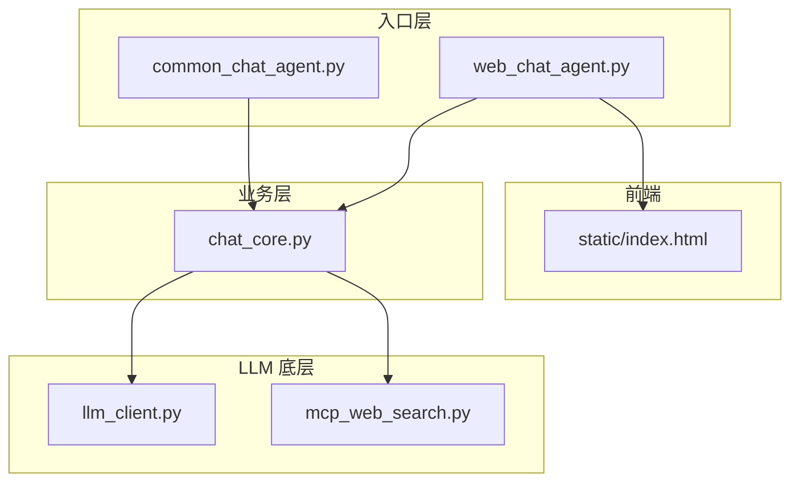
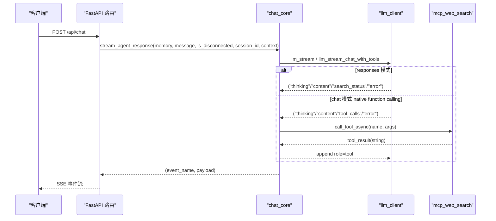
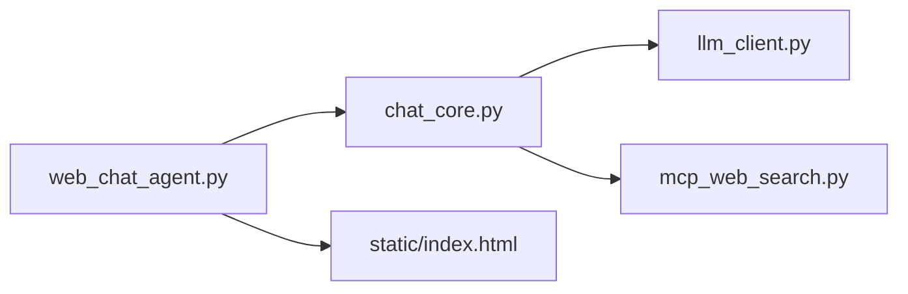

# API 参考

<cite>
**本文引用的文件**
- [README.md](file://README.md)
- [requirements.txt](file://requirements.txt)
- [demo/web_chat_agent.py](file://demo/web_chat_agent.py)
- [demo/chat_core.py](file://demo/chat_core.py)
- [demo/llm_client.py](file://demo/llm_client.py)
- [demo/mcp_web_search.py](file://demo/mcp_web_search.py)
- [demo/static/index.html](file://demo/static/index.html)
- [CLAUDE.md](file://CLAUDE.md)
- [docs/OpenAI兼容-Chat 接口文档.md](file://docs/OpenAI兼容-Chat 接口文档.md)
- [docs/兼容 OpenAI 格式的 Responses API-获取响应.md](file://docs/兼容 OpenAI 格式的 Responses API-获取响应.md)
- [docs/联网搜索-mcp-接口文档.md](file://docs/联网搜索-mcp-接口文档.md)
</cite>

## 目录
1. [简介](#简介)
2. [项目结构](#项目结构)
3. [核心组件](#核心组件)
4. [架构总览](#架构总览)
5. [详细组件分析](#详细组件分析)
6. [依赖关系分析](#依赖关系分析)
7. [性能考量](#性能考量)
8. [故障排除指南](#故障排除指南)
9. [结论](#结论)
10. [附录](#附录)

## 简介
本项目是一个教学型 ReAct（思考-行动-观察）Agent 的最小实现，后端通过 OpenAI 兼容接口对接通义千问（DashScope OpenAI-Compat 网关），提供 CLI 与 Web 两种入口，共享同一 ReAct 内核。Web 入口基于 FastAPI + SSE，提供健康检查、聊天、会话管理、历史记录等完整 HTTP 接口，以及丰富的 SSE 事件规范，覆盖思考摘要、工具调用、HITL（人机协同）中断与恢复、静态生成 UI 卡片渲染等场景。

## 项目结构
- demo/
  - web_chat_agent.py：FastAPI + SSE HTTP 路由层
  - chat_core.py：业务逻辑层（Memory、ReAct、会话持久化、HITL）
  - llm_client.py：底层 LLM 客户端（Responses API 与 Chat Completions + native function calling）
  - mcp_web_search.py：MCP 联网搜索客户端（WebSearch）
  - static/index.html：单页前端（SSE 消费、HITL、思考面板、归档预览等）
- docs/：OpenAI 兼容文档与联网搜索 MCP 文档
- requirements.txt：依赖声明
- README.md：安装与运行说明

图表来源
- [demo/web_chat_agent.py:1-233](file://demo/web_chat_agent.py#L1-L233)
- [demo/chat_core.py:1-1069](file://demo/chat_core.py#L1-L1069)
- [demo/llm_client.py:1-924](file://demo/llm_client.py#L1-L924)
- [demo/mcp_web_search.py:1-172](file://demo/mcp_web_search.py#L1-L172)
- [demo/static/index.html:1-1976](file://demo/static/index.html#L1-L1976)

章节来源
- [README.md:1-62](file://README.md#L1-L62)
- [requirements.txt:1-5](file://requirements.txt#L1-L5)

## 核心组件
- HTTP 接口层（FastAPI + SSE）
  - 负责路由、参数校验、异常翻译、SSE 序列化
  - 提供健康检查、聊天、会话管理、历史记录等端点
- 业务逻辑层（chat_core）
  - Memory（对话记忆与持久化）
  - ReAct 循环（文本协议与 native function calling 两套）
  - 会话管理（归档、重置、删除、列表、读取）
  - HITL（人机协同）基础设施（LOCAL_TOOLS、_PENDING、resume）
- LLM 底层（llm_client）
  - Responses API（client.responses.create）与 Chat Completions（client.chat.completions.create）
  - native function calling + MCP WebSearch（chat 模式）
  - 流式事件协议（thinking/content/search_status/tool_calls/error）
- MCP 客户端（mcp_web_search）
  - WebSearch MCP 服务器封装（discover_tool_spec、call_tool_async）

章节来源
- [demo/web_chat_agent.py:1-233](file://demo/web_chat_agent.py#L1-L233)
- [demo/chat_core.py:1-1069](file://demo/chat_core.py#L1-L1069)
- [demo/llm_client.py:1-924](file://demo/llm_client.py#L1-L924)
- [demo/mcp_web_search.py:1-172](file://demo/mcp_web_search.py#L1-L172)

## 架构总览
HTTP 层接收请求，调用 chat_core 的业务函数，后者通过 llm_client 与 MCP 客户端与模型/工具交互，最终将抽象的 (event_name, payload) 元组序列化为 SSE 事件流返回给前端。

图表来源
- [demo/web_chat_agent.py:127-141](file://demo/web_chat_agent.py#L127-L141)
- [demo/chat_core.py:632-800](file://demo/chat_core.py#L632-L800)
- [demo/llm_client.py:633-800](file://demo/llm_client.py#L633-L800)
- [demo/mcp_web_search.py:127-164](file://demo/mcp_web_search.py#L127-L164)

## 详细组件分析

### HTTP 接口规范

- 健康检查
  - 方法：GET
  - 路径：/api/health
  - 请求参数：无
  - 响应：包含 ok、model、sessions 字段的 JSON 对象
  - 状态码：200
  - 示例请求：curl http://127.0.0.1:8000/api/health
  - 示例响应：{"ok": true, "model": "qwen3.7-max", "sessions": 0}

- 聊天接口（SSE）
  - 方法：POST
  - 路径：/api/chat
  - 请求体：ChatRequest
    - session_id: string（UUID 格式校验）
    - message: string
    - context: object | null（可选）
      - viewport_width: number
      - selected_text: string
      - session_message_count: number
  - 响应：text/event-stream（SSE）
  - 状态码：200
  - 异常：
    - 400：无效的 session_id（InvalidSessionId）
  - 示例请求：curl -N -H "Content-Type: application/json" -d '{"session_id":"<uuid>","message":"你好","context":{"viewport_width":1200,"selected_text":"","session_message_count":1}}' http://127.0.0.1:8000/api/chat
  - 示例响应：SSE 事件流（详见“SSE 事件规范”）

- HITL 恢复接口（SSE）
  - 方法：POST
  - 路径：/api/resume
  - 请求体：ResumeRequest
    - session_id: string
    - tool_call_id: string
    - decision: "answer" | "approve" | "reject"
    - answer: string | null（当 decision="answer" 时有效）
  - 响应：text/event-stream（SSE）
  - 状态码：200
  - 异常：
    - 400：无效的 session_id（InvalidSessionId）
    - 404：该会话无待处理的 HITL（PendingNotFound）
    - 409：tool_call_id 不匹配（PendingMismatch）
  - 示例请求：curl -N -H "Content-Type: application/json" -d '{"session_id":"<uuid>","tool_call_id":"<tool_call_id>","decision":"answer","answer":"是的"}' http://127.0.0.1:8000/api/resume

- 重置会话
  - 方法：POST
  - 路径：/api/reset
  - 请求体：ResetRequest
    - session_id: string
  - 响应：{"ok": true}
  - 状态码：200
  - 异常：400（无效的 session_id）

- 归档会话
  - 方法：POST
  - 路径：/api/archive
  - 请求体：ArchiveRequest
    - session_id: string
  - 响应：{"ok": true, "skipped": true} 或 {"ok": true, "path": string}
  - 状态码：200
  - 异常：400（无效的 session_id）

- 读取历史
  - 方法：GET
  - 路径：/api/history
  - 查询参数：session_id（string）
  - 响应：{"session_id": string, "messages": array}
  - 状态码：200
  - 异常：
    - 400：无效的 session_id（InvalidSessionId）
    - 404：历史不存在（HistoryNotFound）

- 会话列表
  - 方法：GET
  - 路径：/api/sessions
  - 响应：会话列表（按 updated_at 倒序）
  - 状态码：200

- 删除会话
  - 方法：DELETE
  - 路径：/api/sessions/{session_id}
  - 响应：{"ok": true}
  - 状态码：200
  - 异常：400（无效的 session_id）

- 会话原始归档
  - 方法：GET
  - 路径：/api/sessions/{session_id}/raw
  - 响应：text/markdown（文件）
  - 状态码：200
  - 异常：
    - 400：无效的 session_id（InvalidSessionId）
    - 404：归档不存在（HistoryNotFound）

章节来源
- [demo/web_chat_agent.py:122-227](file://demo/web_chat_agent.py#L122-L227)
- [demo/chat_core.py:255-349](file://demo/chat_core.py#L255-L349)

### SSE 事件规范
所有事件负载均为 JSON。事件类型与含义如下：

- status
  - 负载：{"phase": "thinking" | "answering", "round": number}
  - 含义：轮次边界；“answering”首次出现时用于折叠思考面板
- thinking
  - 负载：{"text": string}
  - 含义：增量思考摘要（仅 responses 模式）
- chunk
  - 负载：{"text": string}
  - 含义：增量回答文本
- search_status
  - 负载：{"phase": "in_progress" | "searching" | "completed"}
  - 含义：内置 web_search 生命周期事件（仅 responses 模式）
- tool_call
  - 负载：{"name": string, "args": object}
  - 含义：即将调用的工具（chat 模式 native function calling 路径上，每次 tool_calls 触发都会发）
- tool_result
  - 负载：{"name": string, "result": string}
  - 含义：工具返回（UI 预览截断至 500 字符；完整文本见服务端日志）
- await_user
  - 负载：{"tool_call_id": string, "name": string, "args": object, "kind": "input" | "approval"}
  - 含义：HITL 中断（仅 chat 模式 + LOCAL_TOOLS 触发）；紧随其后必定是 done 关流
- ui_hint
  - 负载：{"mode": "focus" | "compact" | "chat"}
  - 含义：上下文感知 UI 模式提示（仅 mode != "chat" 时发送）
- done
  - 负载：{}
  - 含义：流正常结束（HITL 中断也会发）
- error
  - 负载：{"message": string}
  - 含义：终端错误（LLM、工具、解析等）
- component_loading
  - 负载：{"component_type": string, "tool_call_id": string, "placeholder_text": string}
  - 含义：工具开始执行，前端占位渲染 loading（仅 chat 模式 + 已注册的工具）
- render_component
  - 负载：{"component_type": string, "tool_call_id": string, "props": object}
  - 含义：工具成功，前端按 component_type 渲染卡片
- component_error
  - 负载：{"component_type": string, "tool_call_id": string, "error_message": string}
  - 含义：工具失败或 props 构建失败，卡片渲染错误态

章节来源
- [CLAUDE.md:176-195](file://CLAUDE.md#L176-L195)
- [demo/chat_core.py:520-559](file://demo/chat_core.py#L520-L559)

### 业务逻辑层（chat_core）
- Memory
  - 支持 add、get_all、to_markdown、from_markdown
  - 持久化为 data/chat_archive/{session_id}.md，头部包含 session_id、updated_at、turns、preview
- 会话管理
  - get_or_load：内存命中优先，否则从磁盘 lazy-load
  - archive_session：覆盖式归档（空 Memory 跳过）
  - reset_session：清空内存 + 删除归档
  - delete_session：删除归档 + 移除内存
  - list_sessions：列出归档会话（按 updated_at 倒序）
  - read_history：读取历史（内存优先，再磁盘）
  - get_archive_path_if_exists：返回归档路径（不存在抛 HistoryNotFound）
  - session_count：当前内存会话数
- ReAct 循环
  - 文本协议路径（responses 模式 + 自定义 TOOLS）：build_prompt + match_tool_action + parse_action_input + execute_tool
  - native function calling 路径（chat 模式）：_stream_react_rounds + _stream_chat_native + _build_native_tools/_build_native_tools_async
- HITL
  - LOCAL_TOOLS：ask_user（输入）、execute_shell_command（审批）
  - _PENDING：模块级挂起点，包含 user_input、messages、tools、round_num、remaining_tool_calls、awaiting
  - resume_chat_response：校验 session_id、pending、tool_call_id，构造 tool result，继续 ReAct 循环

章节来源
- [demo/chat_core.py:138-193](file://demo/chat_core.py#L138-L193)
- [demo/chat_core.py:255-349](file://demo/chat_core.py#L255-L349)
- [demo/chat_core.py:632-800](file://demo/chat_core.py#L632-L800)

### LLM 客户端（llm_client）
- 模式切换
  - API_MODE：responses（默认）或 chat（大小写不敏感）
  - responses：client.responses.create（支持内置 web_search lifecycle）
  - chat：client.chat.completions.create + native function calling + MCP WebSearch
- 流式事件
  - responses：("thinking", "content", "search_status", "error")
  - chat：("thinking", "content", "tool_calls", "error")
- 错误处理
  - 嵌入式错误块检测（HTTP 200 但 body 是错误）
  - usage 信息（responses 通过 response.completed，chat 通过 choices==[] 的尾帧）

章节来源
- [demo/llm_client.py:34-51](file://demo/llm_client.py#L34-L51)
- [demo/llm_client.py:357-496](file://demo/llm_client.py#L357-L496)
- [demo/llm_client.py:798-847](file://demo/llm_client.py#L798-L847)

### MCP 联网搜索（mcp_web_search）
- discover_tool_spec_async：一次性列出 MCP 工具并缓存为 OpenAI tools 格式
- call_tool_async：短连接调用工具，失败返回错误字符串（不抛异常）
- ERROR_PREFIX："工具调用失败"

章节来源
- [demo/mcp_web_search.py:89-164](file://demo/mcp_web_search.py#L89-L164)

### 前端（static/index.html）
- 功能要点
  - 侧栏：会话列表、新建/切换/删除
  - 主区：思考面板（details）、消息流、输入栏
  - 右侧锚点：用户消息 TOC
  - 归档预览：渲染/源码双标签页
  - HITL：input（textarea）或 approval（同意/拒绝）气泡
  - SSE 消费：consumeStream / consumeResumeStream
- XSS 防护
  - LLM 产物：DOMPurify.sanitize(marked.parse(...))
  - 用户输入：textContent

章节来源
- [demo/static/index.html:1-1976](file://demo/static/index.html#L1-L1976)

## 依赖关系分析

图表来源
- [demo/web_chat_agent.py:29-46](file://demo/web_chat_agent.py#L29-L46)
- [demo/chat_core.py:24-34](file://demo/chat_core.py#L24-L34)
- [demo/llm_client.py:25](file://demo/llm_client.py#L25)
- [demo/mcp_web_search.py:16](file://demo/mcp_web_search.py#L16)

章节来源
- [demo/web_chat_agent.py:1-233](file://demo/web_chat_agent.py#L1-L233)
- [demo/chat_core.py:1-1069](file://demo/chat_core.py#L1-L1069)
- [demo/llm_client.py:1-924](file://demo/llm_client.py#L1-L924)
- [demo/mcp_web_search.py:1-172](file://demo/mcp_web_search.py#L1-L172)

## 性能考量
- SSE 与流式处理
  - 使用 StreamingResponse 返回 text/event-stream，避免缓冲，前端即时消费
  - llm_client 在 responses 与 chat 两套实现中均采用流式事件，减少延迟
- 会话持久化
  - 归档采用原子写（.tmp + replace），避免崩溃产生半文件
  - 会话列表仅读取文件头元信息，避免解析整个归档
- 工具调用
  - MCP 工具调用为短连接，避免长连接开销
  - 工具结果 UI 预览截断（500 字符），避免前端渲染压力

[本节为通用指导，不直接分析具体文件]

## 故障排除指南
- 常见错误码与含义
  - 400：无效的 session_id（InvalidSessionId）
  - 404：历史不存在（HistoryNotFound）或会话无待处理的 HITL（PendingNotFound）
  - 409：tool_call_id 与 pending awaiting 不匹配（PendingMismatch）
- 常见问题定位
  - API_KEY 未配置：启动时会打印友好错误并退出
  - API_MODE 非法：模块加载时抛错
  - responses 模式无 search_status：属于预期行为（仅 responses 模式发）
  - chat 模式无内置 web_search：改用 native function calling + MCP WebSearch
- 日志与调试
  - llm_client 与 chat_core 均有详细日志，包含首次出现的 chunk 类型、usage、错误信息等
  - 工具调用失败返回 ERROR_PREFIX 前缀字符串，便于前端识别

章节来源
- [demo/web_chat_agent.py:133-162](file://demo/web_chat_agent.py#L133-L162)
- [demo/llm_client.py:46-51](file://demo/llm_client.py#L46-L51)
- [demo/mcp_web_search.py:28-29](file://demo/mcp_web_search.py#L28-L29)

## 结论
本项目以最小代码实现了 ReAct Agent 的核心能力，提供清晰的三层架构与稳定的 SSE 事件契约。HTTP 接口覆盖健康检查、聊天（SSE）、会话管理、历史记录等完整场景；SSE 事件规范详尽，涵盖思考摘要、工具调用、HITL 中断与恢复、静态生成 UI 卡片渲染等。通过 responses 与 chat 两套 LLM 调用路径，既保留了教学意义的文本协议 ReAct，又展示了 native function calling 的现代范式。

[本节为总结，不直接分析具体文件]

## 附录

### OpenAI 兼容与 Responses API 参考
- Responses API 获取响应：GET /responses/{response_id}
- Chat 接口文档：包含联网搜索、流式输出、工具调用示例
- 联网搜索 MCP 接口文档：Streamable HTTP Endpoint 与鉴权方式

章节来源
- [docs/兼容 OpenAI 格式的 Responses API-获取响应.md:1-48](file://docs/兼容 OpenAI 格式的 Responses API-获取响应.md#L1-L48)
- [docs/OpenAI兼容-Chat 接口文档.md:1-100](file://docs/OpenAI兼容-Chat 接口文档.md#L1-L100)
- [docs/联网搜索-mcp-接口文档.md:1-28](file://docs/联网搜索-mcp-接口文档.md#L1-L28)