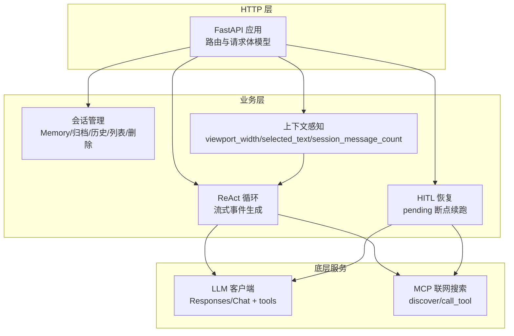
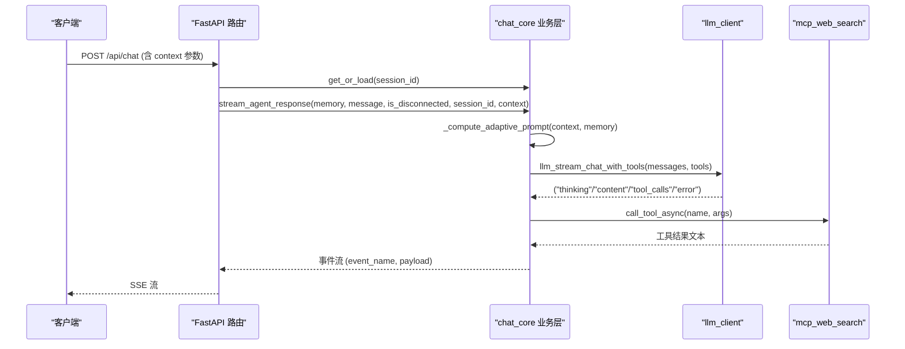
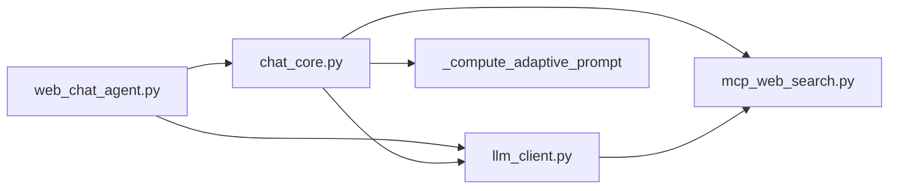

# HTTP API

<cite>
**本文引用的文件**
- [README.md](file://README.md)
- [requirements.txt](file://requirements.txt)
- [demo/web_chat_agent.py](file://demo/web_chat_agent.py)
- [demo/chat_core.py](file://demo/chat_core.py)
- [demo/llm_client.py](file://demo/llm_client.py)
- [demo/mcp_web_search.py](file://demo/mcp_web_search.py)
- [docs/兼容 OpenAI 格式的 Responses API-获取响应.md](file://docs/兼容%20OpenAI%20格式的%20Responses%20API-获取响应.md)
- [docs/OpenAI兼容-Chat 接口文档.md](file://docs/OpenAI兼容-Chat%20接口文档.md)
- [docs/联网搜索-mcp-接口文档.md](file://docs/联网搜索-mcp-接口文档.md)
- [CLAUDE.md](file://CLAUDE.md)
</cite>

## 更新摘要
**变更内容**
- 更新了 ChatRequest 模型，增加了新的 context 参数字段
- 新增了上下文感知功能的详细说明
- 更新了聊天接口的请求体模型描述
- 增强了上下文参数的使用场景说明

## 目录
1. [简介](#简介)
2. [项目结构](#项目结构)
3. [核心组件](#核心组件)
4. [架构总览](#架构总览)
5. [详细接口规范](#详细接口规范)
6. [上下文感知功能](#上下文感知功能)
7. [依赖关系分析](#依赖关系分析)
8. [性能与可用性](#性能与可用性)
9. [故障排查指南](#故障排查指南)
10. [结论](#结论)
11. [附录](#附录)

## 简介
本项目提供一套最小可用的 ReAct 聊天 Agent 的 Web API，基于 FastAPI + SSE，支持健康检查、聊天流式对话、HITL（人机协同）恢复、会话管理（重置、归档、历史、会话列表、删除、原始归档下载）等 RESTful 接口。接口遵循 OpenAI 兼容风格，结合 DashScope 的 Responses API 与 Chat Completions + native function calling，支持联网搜索与 MCP 工具链。

**更新**：HTTP API 现在接受新的 context 参数，包括 viewport_width、selected_text 和 session_message_count 字段，用于增强上下文感知能力。

## 项目结构
- demo/web_chat_agent.py：FastAPI 路由与请求体模型定义，SSE 序列化，对外暴露 RESTful API。
- demo/chat_core.py：业务核心（会话管理、Memory、ReAct 循环、HITL 恢复、归档/历史读写等）。
- demo/llm_client.py：底层 LLM 客户端，封装 Responses API 与 Chat Completions + tools 的流式协议。
- demo/mcp_web_search.py：MCP 联网搜索客户端，提供 discover_tool_spec 与 call_tool_async。
- docs/*：OpenAI 兼容文档与联网搜索 MCP 文档，用于理解底层协议与工具调用。
- requirements.txt：依赖声明（FastAPI、OpenAI SDK、Uvicorn、MCP）。

**图表来源**
- [demo/web_chat_agent.py:117-227](file://demo/web_chat_agent.py#L117-L227)
- [demo/chat_core.py:255-349](file://demo/chat_core.py#L255-L349)
- [demo/llm_client.py:618-800](file://demo/llm_client.py#L618-L800)
- [demo/mcp_web_search.py:89-164](file://demo/mcp_web_search.py#L89-L164)

**章节来源**
- [README.md:1-62](file://README.md#L1-L62)
- [requirements.txt:1-5](file://requirements.txt#L1-L5)

## 核心组件
- FastAPI 应用与路由：定义所有 RESTful 端点，参数校验，SSE 流式响应。
- 请求体模型：ChatRequest、ResetRequest、ArchiveRequest、ResumeRequest。
- 业务核心：会话内存、归档/历史读写、ReAct 流式循环、HITL 断点与恢复。
- LLM 客户端：统一的流式事件协议（thinking/content/tool_calls/error），支持 Responses API 与 Chat Completions + tools。
- MCP 工具链：discover_tool_spec 与 call_tool_async，用于 Chat 模式下的联网搜索与工具调用。
- 上下文感知：基于 viewport_width、selected_text、session_message_count 的智能 UI 提示。

**章节来源**
- [demo/web_chat_agent.py:69-95](file://demo/web_chat_agent.py#L69-L95)
- [demo/chat_core.py:138-193](file://demo/chat_core.py#L138-L193)
- [demo/llm_client.py:618-800](file://demo/llm_client.py#L618-L800)
- [demo/mcp_web_search.py:89-164](file://demo/mcp_web_search.py#L89-L164)

## 架构总览
HTTP 层接收请求，调用业务层函数，业务层通过 LLM 客户端与 MCP 工具链产生事件流，HTTP 层将事件序列化为 SSE，前端持续消费。

**图表来源**
- [demo/web_chat_agent.py:127-141](file://demo/web_chat_agent.py#L127-L141)
- [demo/chat_core.py:632-800](file://demo/chat_core.py#L632-L800)
- [demo/llm_client.py:633-646](file://demo/llm_client.py#L633-L646)
- [demo/mcp_web_search.py:127-164](file://demo/mcp_web_search.py#L127-L164)

## 详细接口规范

### 健康检查
- 方法与路径：GET /api/health
- 功能：返回服务状态、当前模型名与会话数量
- 响应体
  - ok: 布尔，始终为 true
  - model: 字符串，当前模型名
  - sessions: 整数，会话内存缓存数量
- 状态码
  - 200 成功
- 示例
  - 请求：GET /api/health
  - 响应：{"ok": true, "model": "qwen-plus", "sessions": 0}

**章节来源**
- [demo/web_chat_agent.py:122-125](file://demo/web_chat_agent.py#L122-L125)

### 聊天接口
- 方法与路径：POST /api/chat
- 功能：基于会话 ID 与最新消息，启动 ReAct 流式对话，支持联网搜索与工具调用
- 请求体模型：ChatRequest
  - session_id: 字符串，会话标识，需满足 UUID 格式校验
  - message: 字符串，用户最新输入
  - context: 可选对象，上下文信息（如选中文本、消息数量等）
    - viewport_width: 数字，浏览器视口宽度（像素）
    - selected_text: 字符串，用户选中的文本内容（最多 500 字符）
    - session_message_count: 数字，当前会话的消息总数
- 响应：SSE 流，事件类型与负载
  - event: "thinking"，payload: {"text": 字符串}
  - event: "content"，payload: {"text": 字符串}
  - event: "tool_call"，payload: {"name": 字符串, "args": 对象}
  - event: "tool_result"，payload: {"name": 字符串, "result": 字符串}
  - event: "component_loading"，payload: {"component_type": 字符串, "tool_call_id": 字符串, "placeholder_text": 字符串}
  - event: "render_component"，payload: {"component_type": 字符串, "tool_call_id": 字符串, "props": 对象}
  - event: "component_error"，payload: {"component_type": 字符串, "tool_call_id": 字符串, "error_message": 字符串}
  - event: "status"，payload: {"phase": "thinking"|"answering", "round": 整数}
  - event: "error"，payload: {"message": 字符串}
  - event: "done"，payload: {}
  - event: "await_user"，payload: {"tool_call_id": 字符串, "name": 字符串, "args": 对象, "kind": "input"|"approval"}
  - event: "ui_hint"，payload: {"mode": "focus"|"compact"|"chat"}
- 状态码
  - 200 成功（SSE 流）
  - 400 invalid session_id
- 示例
  - 请求：POST /api/chat，Body: {"session_id": "xxxxxxxx-xxxx-xxxx-xxxx-xxxxxxxxxxxx", "message": "你好", "context": {"viewport_width": 1920, "selected_text": "Python 编程", "session_message_count": 5}}
  - 响应：SSE 流，包含若干事件，最后为 done

**更新**：新增了 context 参数字段，支持 viewport_width、selected_text 和 session_message_count，用于增强上下文感知能力。

**章节来源**
- [demo/web_chat_agent.py:70-74](file://demo/web_chat_agent.py#L70-L74)
- [demo/web_chat_agent.py:127-141](file://demo/web_chat_agent.py#L127-L141)
- [demo/chat_core.py:632-800](file://demo/chat_core.py#L632-L800)
- [demo/llm_client.py:633-646](file://demo/llm_client.py#L633-L646)

### HITL 恢复接口
- 方法与路径：POST /api/resume
- 功能：在发生 await_user 后，前端提交用户决策，业务层从断点续跑 ReAct
- 请求体模型：ResumeRequest
  - session_id: 字符串，会话标识
  - tool_call_id: 字符串，await_user 中的 tool_call_id
  - decision: 字符串，"answer"|"approve"|"reject"
  - answer: 可选字符串，当 decision="answer" 时提供用户答复
- 响应：SSE 流，事件类型与 /api/chat 完全一致
- 状态码
  - 200 成功（SSE 流）
  - 400 invalid session_id
  - 404 no pending HITL for session
  - 409 tool_call_id mismatch
- 示例
  - 请求：POST /api/resume，Body: {"session_id": "...", "tool_call_id": "...", "decision": "approve"}
  - 响应：SSE 流，直至 done

**章节来源**
- [demo/web_chat_agent.py:84-95](file://demo/web_chat_agent.py#L84-L95)
- [demo/web_chat_agent.py:143-167](file://demo/web_chat_agent.py#L143-L167)
- [demo/chat_core.py:738-764](file://demo/chat_core.py#L738-L764)

### 重置会话接口
- 方法与路径：POST /api/reset
- 功能：原地重置会话，清空内存并删除磁盘归档
- 请求体模型：ResetRequest
  - session_id: 字符串，会话标识
- 响应体：{"ok": true}
- 状态码
  - 200 成功
  - 400 invalid session_id
- 示例
  - 请求：POST /api/reset，Body: {"session_id": "..."}
  - 响应：{"ok": true}

**章节来源**
- [demo/web_chat_agent.py:76-78](file://demo/web_chat_agent.py#L76-L78)
- [demo/web_chat_agent.py:170-177](file://demo/web_chat_agent.py#L170-L177)
- [demo/chat_core.py:287-292](file://demo/chat_core.py#L287-L292)

### 归档会话接口
- 方法与路径：POST /api/archive
- 功能：覆盖式归档当前会话的 Memory 到 markdown
- 请求体模型：ArchiveRequest
  - session_id: 字符串，会话标识
- 响应体
  - {"ok": true, "skipped": true}：空 Memory 跳过归档
  - {"ok": true, "path": 字符串}：归档成功
- 状态码
  - 200 成功
  - 400 invalid session_id
- 示例
  - 请求：POST /api/archive，Body: {"session_id": "..."}
  - 响应：{"ok": true, "path": "/.../data/chat_archive/...md"}

**章节来源**
- [demo/web_chat_agent.py:80-82](file://demo/web_chat_agent.py#L80-L82)
- [demo/web_chat_agent.py:180-187](file://demo/web_chat_agent.py#L180-L187)
- [demo/chat_core.py:272-284](file://demo/chat_core.py#L272-L284)

### 获取历史接口
- 方法与路径：GET /api/history?session_id=...
- 功能：返回会话的历史消息，优先内存，再磁盘懒加载
- 响应体：{"session_id": 字符串, "messages": 数组}
- 状态码
  - 200 成功
  - 400 invalid session_id
  - 404 history not found
- 示例
  - 请求：GET /api/history?session_id=...
  - 响应：{"session_id": "...", "messages": [{"role": "用户"|"AI", "msg": 字符串}]}

**章节来源**
- [demo/web_chat_agent.py:189-198](file://demo/web_chat_agent.py#L189-L198)
- [demo/chat_core.py:327-336](file://demo/chat_core.py#L327-L336)

### 列出会话接口
- 方法与路径：GET /api/sessions
- 功能：列出所有归档过的会话，按 updated_at 倒序
- 响应体：数组，每个元素包含 session_id、preview、updated_at、turns
- 状态码：200 成功
- 示例
  - 请求：GET /api/sessions
  - 响应：[{"session_id": "...", "preview": "...", "updated_at": "...", "turns": 1}, ...]

**章节来源**
- [demo/web_chat_agent.py:201-204](file://demo/web_chat_agent.py#L201-L204)
- [demo/chat_core.py:301-324](file://demo/chat_core.py#L301-L324)

### 删除会话接口
- 方法与路径：DELETE /api/sessions/{session_id}
- 功能：删除会话（磁盘归档 + 内存同步移除）
- 响应体：{"ok": true}
- 状态码
  - 200 成功
  - 400 invalid session_id
- 示例
  - 请求：DELETE /api/sessions/xxxxxxxx-xxxx-xxxx-xxxx-xxxxxxxxxxxx
  - 响应：{"ok": true}

**章节来源**
- [demo/web_chat_agent.py:207-214](file://demo/web_chat_agent.py#L207-L214)
- [demo/chat_core.py:294-298](file://demo/chat_core.py#L294-L298)

### 获取原始归档接口
- 方法与路径：GET /api/sessions/{session_id}/raw
- 功能：返回会话的归档 markdown 原始文本
- 响应：text/markdown; charset=utf-8 的文件流
- 状态码
  - 200 成功
  - 400 invalid session_id
  - 404 archive not found
- 示例
  - 请求：GET /api/sessions/.../raw
  - 响应：文件流，内容为归档 markdown

**章节来源**
- [demo/web_chat_agent.py:217-226](file://demo/web_chat_agent.py#L217-L226)
- [demo/chat_core.py:339-344](file://demo/chat_core.py#L339-L344)

## 上下文感知功能

### 功能概述
HTTP API 现在接受新的 context 参数，用于增强上下文感知能力。前端每次发送 /api/chat 请求时，会附带 viewport_width、selected_text 和 session_message_count 三个字段，业务层通过 _compute_adaptive_prompt 函数计算适应性提示片段和 UI 模式。

### 上下文参数说明
- viewport_width: 数字，表示浏览器视口宽度（像素），用于判断设备类型和屏幕尺寸
- selected_text: 字符串，表示用户当前选中的文本内容，最多 500 字符
- session_message_count: 数字，表示当前会话的消息总数

### 智能 UI 提示
基于上下文参数，系统会生成三种 UI 模式：
- focus：当检测到用户选中文本时，优先围绕选中内容回答，并在界面顶部显示聚焦提示
- compact：当会话消息数量较多时，建议保持简洁，避免重复已说过的内容
- chat：默认模式，适用于正常的聊天场景

### 实现机制
1. 前端通过 collectContext() 函数收集上下文信息
2. HTTP 层将 context 参数传递给业务层
3. 业务层调用 _compute_adaptive_prompt() 计算适应性提示片段和 UI 模式
4. 业务层在流开头发送 ui_hint 事件，通知前端切换 UI 模式
5. 适应性提示片段被注入到 system prompt 中，影响模型行为

**章节来源**
- [demo/chat_core.py:403-419](file://demo/chat_core.py#L403-L419)
- [demo/chat_core.py:958-998](file://demo/chat_core.py#L958-L998)
- [demo/web_chat_agent.py:127-141](file://demo/web_chat_agent.py#L127-L141)

## 依赖关系分析

**图表来源**
- [demo/web_chat_agent.py:29-46](file://demo/web_chat_agent.py#L29-L46)
- [demo/chat_core.py:26-34](file://demo/chat_core.py#L26-L34)
- [demo/llm_client.py:25-34](file://demo/llm_client.py#L25-L34)
- [demo/mcp_web_search.py:16-17](file://demo/mcp_web_search.py#L16-L17)

**章节来源**
- [demo/web_chat_agent.py:29-46](file://demo/web_chat_agent.py#L29-L46)
- [demo/chat_core.py:26-34](file://demo/chat_core.py#L26-L34)
- [demo/llm_client.py:25-34](file://demo/llm_client.py#L25-L34)
- [demo/mcp_web_search.py:16-17](file://demo/mcp_web_search.py#L16-L17)

## 性能与可用性
- SSE 流式输出：使用 StreamingResponse，媒体类型为 text/event-stream，适配浏览器与前端框架。
- 连接断开检测：通过 request.is_disconnected 回调，及时终止流式循环，避免资源浪费。
- 会话缓存：内存 sessions 字典缓存最近访问的会话，减少磁盘 IO。
- 工具调用：MCP 工具每次调用建立短连接，避免长连接带来的复杂性。
- 错误处理：HTTP 层将业务异常转换为明确的 HTTP 状态码与错误信息，便于前端处理。
- 上下文感知：智能 UI 提示减少不必要的信息展示，提升用户体验。

## 故障排查指南
- 400 invalid session_id
  - 原因：session_id 非法（不符合 UUID 格式）。
  - 处理：确保 session_id 为合法 UUID。
- 404 history not found / archive not found
  - 原因：指定会话无历史或归档文件。
  - 处理：先调用 /api/history 或 /api/archive 确认会话存在。
- 404 no pending HITL for session
  - 原因：当前会话无 await_user 断点。
  - 处理：确认上一轮 ReAct 是否触发了 ask_user 或 execute_shell_command。
- 409 tool_call_id mismatch
  - 原因：resume 提交的 tool_call_id 与 pending 不匹配。
  - 处理：前端应使用 await_user 中的 tool_call_id，避免过期断点。
- 上下文感知异常
  - 现象：ui_hint 事件缺失或 UI 模式不正确。
  - 处理：检查 context 参数格式，确认 viewport_width、selected_text、session_message_count 字段完整性。
- LLM 错误
  - 现象：SSE 流中出现 "error" 事件。
  - 处理：检查 DASHSCOPE_API_KEY、模型名、网络连通性。
- MCP 工具失败
  - 现象：SSE 流中出现 "component_error" 或 "tool_result" 以 ERROR_PREFIX 开头。
  - 处理：检查 DASHSCOPE_API_KEY、工具参数、网络与 MCP 服务可用性。

**章节来源**
- [demo/web_chat_agent.py:133-134](file://demo/web_chat_agent.py#L133-L134)
- [demo/web_chat_agent.py:159-162](file://demo/web_chat_agent.py#L159-L162)
- [demo/chat_core.py:211-225](file://demo/chat_core.py#L211-L225)
- [demo/mcp_web_search.py:146-157](file://demo/mcp_web_search.py#L146-L157)

## 结论
本项目通过清晰的分层设计与 OpenAI 兼容协议，提供了完整的 Web 聊天 Agent API。HTTP 层专注路由与 SSE 序列化，业务层负责会话与 ReAct 循环，底层 LLM 与 MCP 工具链提供强大的推理与联网能力。接口覆盖健康检查、聊天流式对话、HITL 恢复、会话管理等核心场景，适合快速集成与二次开发。

**更新**：新增的上下文感知功能进一步增强了用户体验，通过 viewport_width、selected_text 和 session_message_count 参数，系统能够智能调整 UI 模式和模型行为，提供更加个性化的聊天体验。

## 附录

### 请求体模型定义
- ChatRequest
  - session_id: 字符串
  - message: 字符串
  - context: 可选对象，包含以下字段：
    - viewport_width: 数字，浏览器视口宽度（像素）
    - selected_text: 字符串，用户选中的文本内容（最多 500 字符）
    - session_message_count: 数字，当前会话的消息总数
- ResetRequest
  - session_id: 字符串
- ArchiveRequest
  - session_id: 字符串
- ResumeRequest
  - session_id: 字符串
  - tool_call_id: 字符串
  - decision: "answer"|"approve"|"reject"
  - answer: 可选字符串

**章节来源**
- [demo/web_chat_agent.py:70-95](file://demo/web_chat_agent.py#L70-L95)

### SSE 事件契约（与 /api/chat 一致）
- thinking：思考摘要增量
- content：最终回复增量
- tool_call：工具调用元信息
- tool_result：工具结果文本（截断预览）
- component_loading/render_component/component_error：工具结果卡片化事件
- status：phase（thinking/answering）与轮次
- error：错误信息
- done：对话结束
- await_user：HITL 中断点，等待前端决策
- ui_hint：上下文感知推荐的 UI 模式（focus/compact/chat）

**章节来源**
- [demo/chat_core.py:632-800](file://demo/chat_core.py#L632-L800)
- [demo/llm_client.py:633-646](file://demo/llm_client.py#L633-L646)

### 底层协议参考
- Responses API：参考文档了解响应结构与检索接口。
- Chat Completions + tools：参考文档了解工具调用与流式事件。
- MCP 联网搜索：参考文档了解 endpoint 与鉴权方式。

**章节来源**
- [docs/兼容%20OpenAI%20格式的%20Responses%20API-获取响应.md:1-48](file://docs/兼容%20OpenAI%20格式的%20Responses%20API-获取响应.md#L1-L48)
- [docs/OpenAI兼容-Chat%20接口文档.md:1-100](file://docs/OpenAI兼容-Chat%20接口文档.md#L1-L100)
- [docs/联网搜索-mcp-接口文档.md:1-28](file://docs/联网搜索-mcp-接口文档.md#L1-L28)

### 上下文感知实现细节
- _compute_adaptive_prompt()：基于上下文参数计算适应性提示片段和 UI 模式
- ui_hint 事件：在流开头发送，通知前端切换 UI 模式
- 适应性提示：注入到 system prompt 中，影响模型行为
- UI 模式：focus（聚焦）、compact（紧凑）、chat（普通）

**章节来源**
- [demo/chat_core.py:403-419](file://demo/chat_core.py#L403-L419)
- [demo/chat_core.py:958-998](file://demo/chat_core.py#L958-L998)