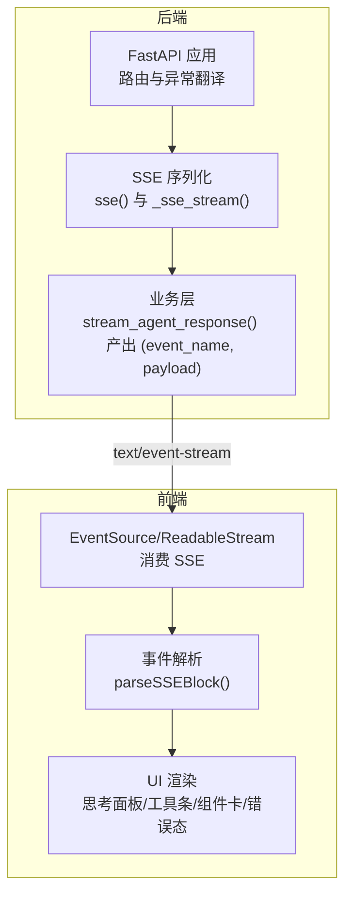
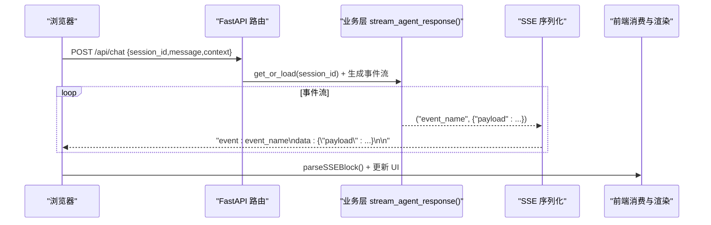
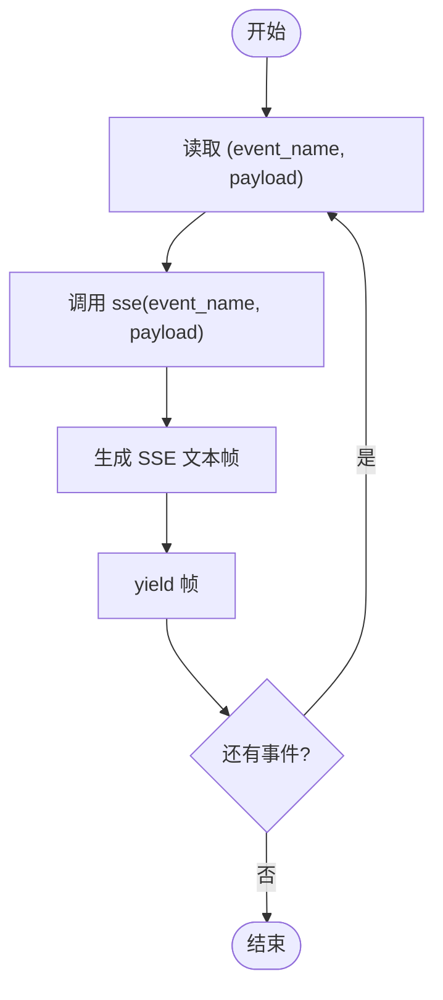
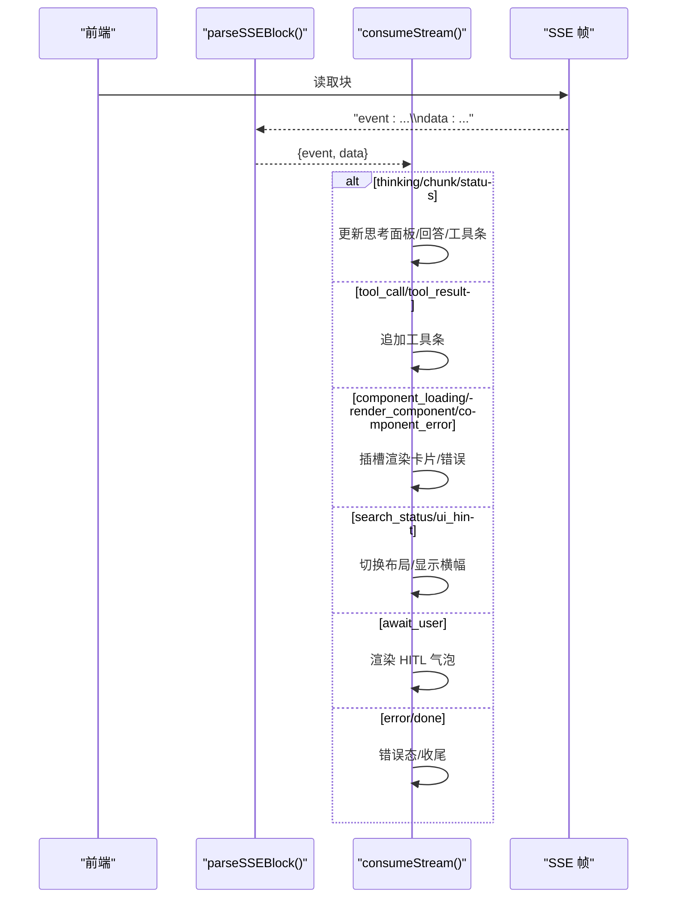
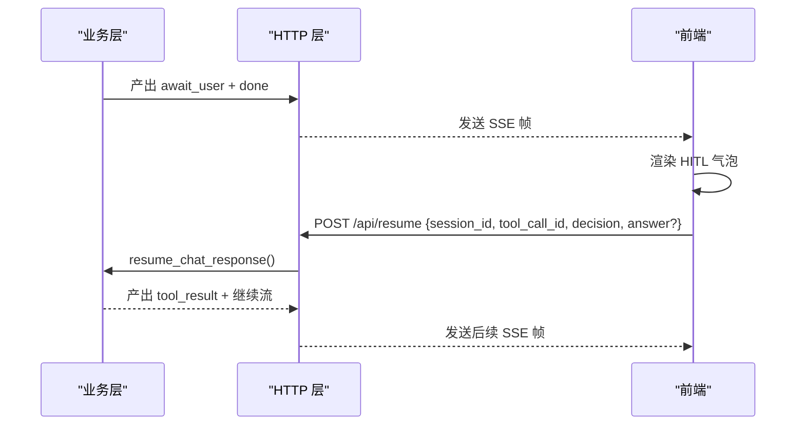
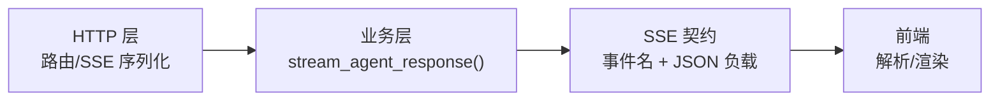

# SSE 事件

<cite>
**本文引用的文件**
- [README.md](file://README.md)
- [CLAUDE.md](file://CLAUDE.md)
- [demo/web_chat_agent.py](file://demo/web_chat_agent.py)
- [demo/chat_core.py](file://demo/chat_core.py)
- [demo/static/index.html](file://demo/static/index.html)
</cite>

## 目录
1. [简介](#简介)
2. [项目结构](#项目结构)
3. [核心组件](#核心组件)
4. [架构总览](#架构总览)
5. [详细组件分析](#详细组件分析)
6. [依赖分析](#依赖分析)
7. [性能考虑](#性能考虑)
8. [故障排查指南](#故障排查指南)
9. [结论](#结论)
10. [附录](#附录)

## 简介
本文件聚焦于本项目的 Server-Sent Events（SSE）事件契约与实现，系统性说明：
- SSE 事件类型与数据结构
- sse() 序列化机制
- 事件名称与负载字段的含义
- 前端 JavaScript 如何建立连接、解析事件并更新 UI
- 错误处理、断线重连策略与性能优化建议

本项目通过 FastAPI 将业务层产生的抽象事件元组（event_name, payload）序列化为标准 SSE 文本帧，前端通过 EventSource 或 fetch + ReadableStream 读取并渲染。

## 项目结构
- 后端三层分层（入口/业务/LLM底层），HTTP 层负责路由、参数校验、SSE 序列化与异常翻译。
- 前端单页应用，负责建立 SSE 连接、解析事件、渲染思考面板、工具调用、组件卡片、HITL（人机交互）气泡与归档预览等。

图表来源
- [demo/web_chat_agent.py:101-140](file://demo/web_chat_agent.py#L101-L140)
- [demo/chat_core.py:958-979](file://demo/chat_core.py#L958-L979)
- [demo/static/index.html:1411-1527](file://demo/static/index.html#L1411-L1527)

章节来源
- [README.md:1-62](file://README.md#L1-L62)
- [CLAUDE.md:28-52](file://CLAUDE.md#L28-L52)

## 核心组件
- SSE 序列化器：将 (event_name, payload) 元组转换为标准 SSE 文本帧。
- 事件生成器：业务层 stream_agent_response() 产出多种事件，覆盖思考、回答、工具调用、HITL、组件渲染、上下文提示、完成与错误。
- 前端事件消费者：解析 SSE 块，按事件类型更新 UI，并在特定事件触发交互（如 HITL）。

章节来源
- [demo/web_chat_agent.py:101-140](file://demo/web_chat_agent.py#L101-L140)
- [demo/chat_core.py:958-979](file://demo/chat_core.py#L958-L979)
- [demo/static/index.html:1411-1527](file://demo/static/index.html#L1411-L1527)

## 架构总览
SSE 事件在两条 ReAct 路径上汇聚到同一契约，前端零分支：
- responses 模式：通过 llm_client.llm_stream() 产出 (kind, payload)，其中 kind ∈ {"thinking","content","search_status","error"}，经 stream_agent_response() 转换为 SSE 事件。
- chat 模式：通过 llm_client.llm_stream_chat_with_tools() 产出 (kind, payload)，kind ∈ {"thinking","tool_calls","content","error"}，经 stream_agent_response() 转换为 SSE 事件。

图表来源
- [demo/web_chat_agent.py:127-140](file://demo/web_chat_agent.py#L127-L140)
- [demo/chat_core.py:958-979](file://demo/chat_core.py#L958-L979)
- [demo/static/index.html:1411-1527](file://demo/static/index.html#L1411-L1527)

## 详细组件分析

### SSE 序列化器：sse() 与 _sse_stream()
- sse(event: str, data: dict) -> str：将事件名与 JSON 负载拼装为标准 SSE 文本帧。
- _sse_stream(events: AsyncGenerator[tuple[str, dict], None]) -> AsyncGenerator[str, None]：遍历业务层事件元组，逐个套上 SSE 文本帧。

图表来源
- [demo/web_chat_agent.py:101-111](file://demo/web_chat_agent.py#L101-L111)

章节来源
- [demo/web_chat_agent.py:101-111](file://demo/web_chat_agent.py#L101-L111)

### 事件契约与数据结构
所有事件的 payload 均为 JSON 对象。以下为完整事件清单与字段说明（节选）：

- status
  - 字段：phase ∈ {"thinking","answering"}, round:int
  - 含义：轮次边界；首次 content 增量到达时触发 answering，用于折叠思考面板。
- thinking
  - 字段：text:string
  - 含义：推理摘要增量。
- chunk
  - 字段：text:string
  - 含义：回答增量。
- search_status（仅 responses 模式）
  - 字段：phase ∈ {"in_progress","searching","completed"}
  - 含义：内置 web_search 生命周期事件；同一轮内可能多次触发；completed 后 1.5s 自动淡出。
- tool_call
  - 字段：name:string, args:object
  - 含义：即将调用工具；chat 模式下每次 tool_calls 触发均发。
- tool_result
  - 字段：name:string, result:string
  - 含义：工具返回；result 为 UI 截断（默认 500 字）；完整文本记录在服务端日志。
- await_user
  - 字段：tool_call_id:string, name:string, args:object, kind ∈ {"input","approval"}
  - 含义：HITL 中断；仅 chat 模式 + LOCAL_TOOLS（ask_user / execute_shell_command）触发；紧随其后必发 done 关流；前端渲染气泡等待用户操作，随后 POST /api/resume 启新流继续。
- ui_hint
  - 字段：mode ∈ {"focus","compact","chat"}
  - 含义：上下文感知 UI 提示；仅在 mode ≠ "chat" 时发；首帧触发。
- done
  - 字段：{}
  - 含义：流正常结束；HITL 中断也会发。
- error
  - 字段：message:string
  - 含义：终止流的错误。
- component_loading
  - 字段：component_type:string, tool_call_id:string, placeholder_text:string
  - 含义：工具开始执行，前端占位渲染 loading 态；仅 chat 模式 + TOOL_COMPONENT_MAP 注册工具触发。
- render_component
  - 字段：component_type:string, tool_call_id:string, props:object
  - 含义：工具成功，前端按 component_type 查 COMPONENT_RENDERERS 渲染卡片，替换同 tool_call_id 的 loading 占位；tool_result 仍并行发供调试。
- component_error
  - 字段：component_type:string, tool_call_id:string, error_message:string
  - 含义：工具失败或 props 构建失败，卡片错误态替换 loading 占位。

章节来源
- [CLAUDE.md:176-194](file://CLAUDE.md#L176-L194)
- [demo/chat_core.py:958-979](file://demo/chat_core.py#L958-L979)

### 事件生成器：stream_agent_response()
- 产出事件与 SSE 契约一一对应，覆盖 responses 与 chat 两条路径。
- 在 responses 模式下，search_status 事件由 llm_client.llm_stream() 产出；在 chat 模式下，tool_call/tool_result 事件由 llm_stream_chat_with_tools() 产出。
- 在 chat 模式下，遇到 LOCAL_TOOLS（HITL 工具）时，业务层写入 _PENDING 并发出 await_user + done，前端等待用户 POST /api/resume 启新流继续。

章节来源
- [demo/chat_core.py:958-979](file://demo/chat_core.py#L958-L979)
- [CLAUDE.md:69-69](file://CLAUDE.md#L69-L69)

### 前端事件消费与 UI 更新
- 建立连接：POST /api/chat 返回 text/event-stream，前端通过 fetch + getReader() 读取。
- 解析：parseSSEBlock() 将原始块拆分为 event 与 data（JSON 解析失败时回退为原始字符串）。
- 渲染：
  - thinking：更新思考面板内容与滚动。
  - chunk：切换到 answering 并追加回答。
  - status：首次 content 到达时切换面板状态。
  - tool_call/tool_result：更新工具条。
  - component_loading/render_component/component_error：按 tool_call_id 插槽渲染卡片或错误态。
  - search_status：显示/隐藏/淡出搜索状态横幅。
  - ui_hint：切换紧凑/聚焦布局。
  - await_user：渲染 HITL 气泡（input/approval 两类），流结束后等待 /api/resume。
  - error/done：错误态渲染与收尾处理。

图表来源
- [demo/static/index.html:1411-1527](file://demo/static/index.html#L1411-L1527)
- [demo/static/index.html:1145-1155](file://demo/static/index.html#L1145-L1155)

章节来源
- [demo/static/index.html:1411-1527](file://demo/static/index.html#L1411-L1527)
- [demo/static/index.html:1145-1155](file://demo/static/index.html#L1145-L1155)

### HITL（人机交互）流程
- 触发：chat 模式下，业务层在派发 LOCAL_TOOLS（ask_user / execute_shell_command）时写入 _PENDING，并发出 await_user + done 关流。
- 前端：渲染气泡（input/approval），等待用户提交。
- 恢复：用户提交后 POST /api/resume，后端弹出 _PENDING，按 decision 构造 tool result，append role=tool，再委派至 _stream_react_rounds 继续。

图表来源
- [demo/chat_core.py:866-914](file://demo/chat_core.py#L866-L914)
- [demo/web_chat_agent.py:143-167](file://demo/web_chat_agent.py#L143-L167)
- [demo/static/index.html:1587-1744](file://demo/static/index.html#L1587-L1744)

章节来源
- [demo/chat_core.py:866-914](file://demo/chat_core.py#L866-L914)
- [demo/web_chat_agent.py:143-167](file://demo/web_chat_agent.py#L143-L167)
- [demo/static/index.html:1587-1744](file://demo/static/index.html#L1587-L1744)

## 依赖分析
- HTTP 层依赖业务层的事件生成器，二者通过 (event_name, payload) 元组解耦。
- 业务层在 responses 与 chat 两条路径上产出事件，最终统一到 SSE 契约。
- 前端依赖 SSE 契约的稳定性，确保两条路径对前端透明。

图表来源
- [demo/web_chat_agent.py:101-140](file://demo/web_chat_agent.py#L101-L140)
- [demo/chat_core.py:958-979](file://demo/chat_core.py#L958-L979)
- [demo/static/index.html:1411-1527](file://demo/static/index.html#L1411-L1527)

章节来源
- [CLAUDE.md:47-52](file://CLAUDE.md#L47-L52)

## 性能考虑
- 流式增量渲染：前端按 thinking/chunk 逐步更新，避免一次性渲染大量内容。
- 截断策略：tool_result 的 result 默认截断（默认 500 字），完整文本记录在服务端日志，减少前端传输与渲染压力。
- 组件卡片：仅在 chat 模式 + TOOL_COMPONENT_MAP 注册工具时触发，避免不必要的 UI 渲染。
- 事件聚合：tool_call/tool_result 在 chat 模式下成对出现，前端工具条与卡片并行渲染，提升感知速度。
- 连接管理：前端在发送/恢复流时禁用输入，避免并发写入导致的 UI 抖动。

[本节为通用指导，不直接分析具体文件]

## 故障排查指南
- 常见错误事件：error（message:string）表示终端错误，前端将其渲染为错误态并停止接收后续事件。
- 断线重连：前端在 send() 中捕获网络错误，渲染错误提示；建议在 UI 层提供“重试”按钮，重新发起 /api/chat。
- HITL 恢复失败：/api/resume 返回 404（无 pending HITL）或 409（tool_call_id 不匹配），前端应提示用户刷新页面或重试。
- 流提前结束：done 事件表示流正常结束；若为 await_user 后的 done，则表示等待用户操作。
- 日志定位：tool_result 的完整文本记录在服务端日志，便于调试。

章节来源
- [demo/static/index.html:1486-1524](file://demo/static/index.html#L1486-L1524)
- [demo/web_chat_agent.py:143-167](file://demo/web_chat_agent.py#L143-L167)

## 结论
本项目通过清晰的 SSE 事件契约与严格的三层分层，实现了响应式、可扩展的实时流式通信。SSE 序列化器将业务层抽象事件稳定地映射到前端，前端以统一的事件解析与渲染逻辑处理思考、回答、工具、组件与 HITT 等场景。通过合理的截断、组件化渲染与错误处理，系统在教学演示与实际使用之间取得了良好平衡。

[本节为总结性内容，不直接分析具体文件]

## 附录

### 前端 JavaScript 使用指南（步骤与要点）
- 建立 SSE 连接
  - 发起 POST /api/chat，携带 {session_id, message, context?}。
  - 获取响应体的 ReadableStream，使用 getReader() 逐块读取。
- 解析与分发
  - 使用 parseSSEBlock() 将块拆分为 event 与 data。
  - 根据 event 名称分发到对应的 UI 更新逻辑。
- 更新 UI
  - thinking：更新思考面板内容与滚动。
  - chunk：切换到 answering 并追加回答。
  - tool_call/tool_result：更新工具条。
  - component_loading/render_component/component_error：按 tool_call_id 插槽渲染卡片或错误态。
  - search_status：显示/隐藏/淡出搜索状态横幅。
  - ui_hint：切换紧凑/聚焦布局。
  - await_user：渲染 HITL 气泡，等待用户提交。
  - error/done：错误态渲染与收尾。
- 错误处理与重连
  - 捕获网络错误，渲染错误提示；提供“重试”按钮重新发起请求。
  - /api/resume 失败时，解析 HTTP 状态与 detail，提示用户刷新或重试。
- 性能优化
  - 按增量渲染，避免一次性渲染大量内容。
  - 截断 tool_result 的 result，减少传输与渲染压力。
  - 仅在 chat 模式 + TOOL_COMPONENT_MAP 注册工具时渲染卡片。

章节来源
- [demo/static/index.html:1411-1527](file://demo/static/index.html#L1411-L1527)
- [demo/static/index.html:1145-1155](file://demo/static/index.html#L1145-L1155)
- [demo/web_chat_agent.py:127-140](file://demo/web_chat_agent.py#L127-L140)