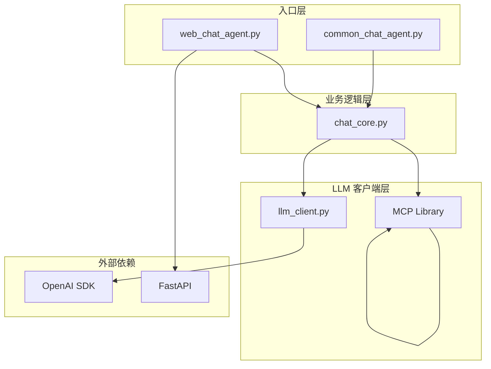
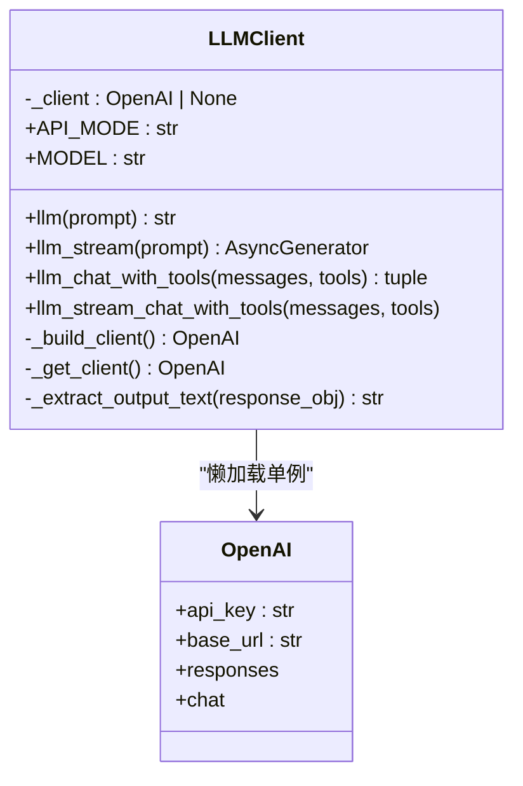
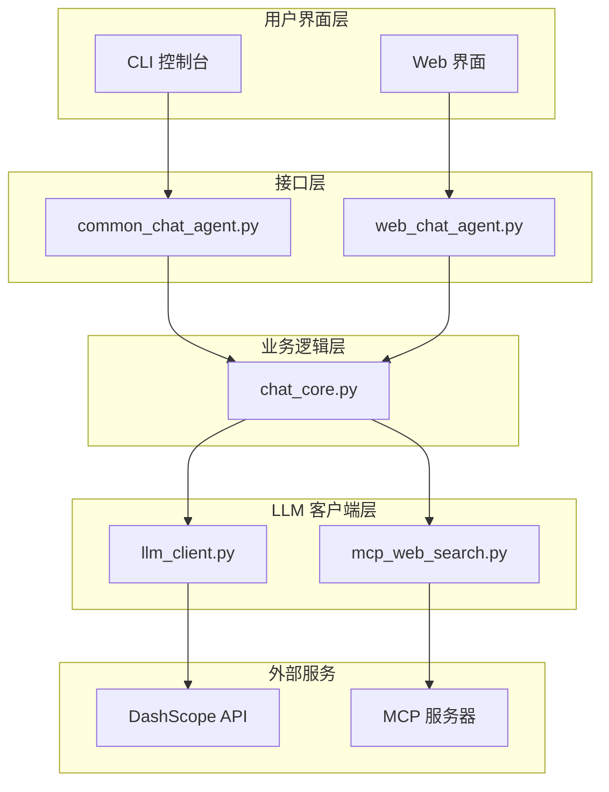
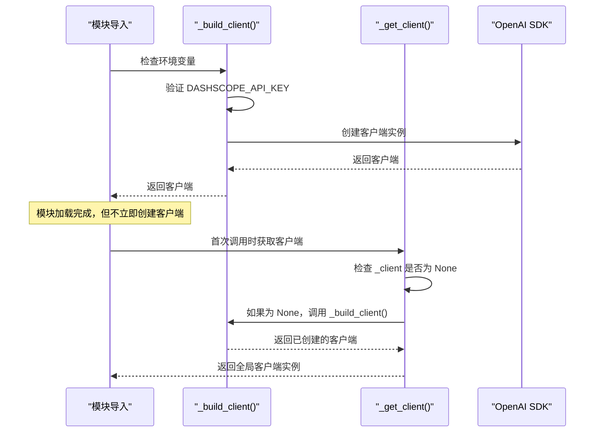
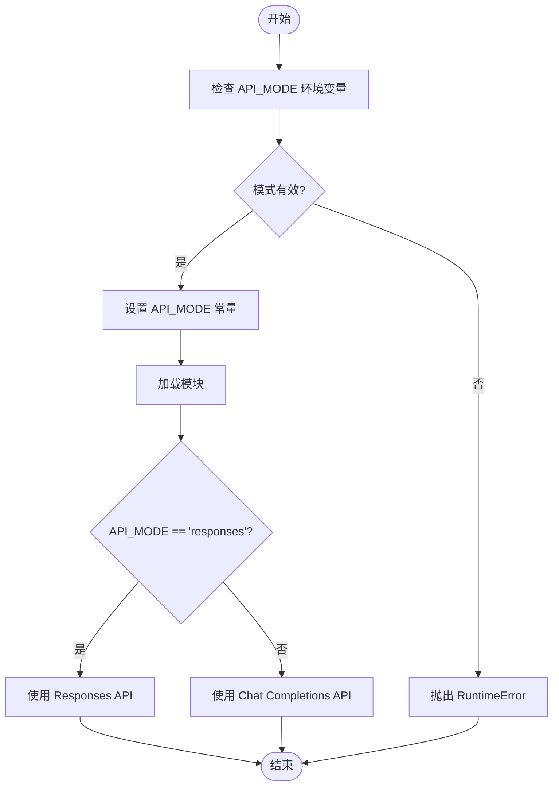
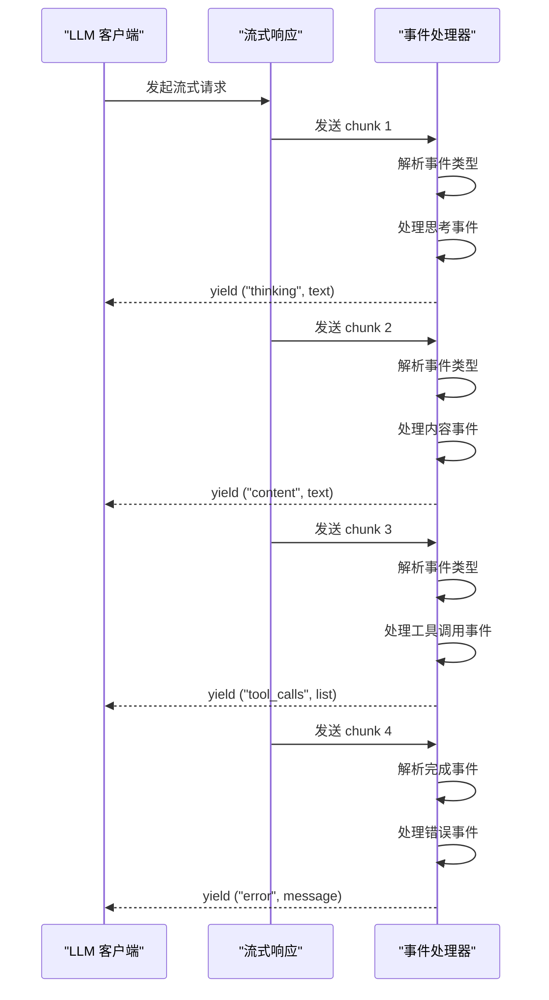
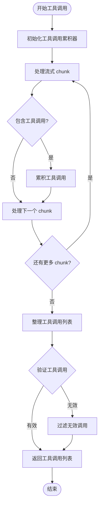
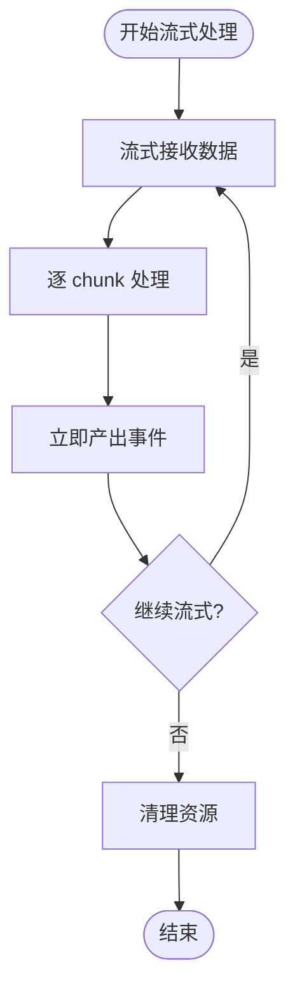

# LLM 客户端设计

<cite>
**本文档引用的文件**
- [llm_client.py](file://demo/llm_client.py)
- [chat_core.py](file://demo/chat_core.py)
- [common_chat_agent.py](file://demo/common_chat_agent.py)
- [web_chat_agent.py](file://demo/web_chat_agent.py)
- [mcp_web_search.py](file://demo/mcp_web_search.py)
- [OpenAI兼容-Chat 接口文档.md](file://docs/OpenAI兼容-Chat 接口文档.md)
- [README.md](file://README.md)
- [requirements.txt](file://requirements.txt)
</cite>

## 目录
1. [简介](#简介)
2. [项目结构](#项目结构)
3. [核心组件](#核心组件)
4. [架构概览](#架构概览)
5. [详细组件分析](#详细组件分析)
6. [依赖关系分析](#依赖关系分析)
7. [性能考虑](#性能考虑)
8. [故障排除指南](#故障排除指南)
9. [结论](#结论)

## 简介

这是一个基于 OpenAI Python SDK 的 LLM 客户端设计实现，采用模块级懒加载单例模式。该系统提供了两种 API 模式：Responses API 和 Chat Completions API，支持同步和异步流式调用，以及原生工具调用功能。客户端设计的核心目标是在不强依赖环境变量的情况下提供友好的用户体验，同时确保资源的有效利用和错误处理的健壮性。

## 项目结构

该项目采用清晰的分层架构，将不同职责分离到独立的模块中：



**图表来源**
- [llm_client.py:1-50](file://demo/llm_client.py#L1-L50)
- [chat_core.py:1-50](file://demo/chat_core.py#L1-L50)
- [web_chat_agent.py:1-50](file://demo/web_chat_agent.py#L1-L50)

**章节来源**
- [README.md:44-58](file://README.md#L44-L58)
- [requirements.txt:1-5](file://requirements.txt#L1-L5)

## 核心组件

### 模块级懒加载单例模式

LLM 客户端实现了高效的模块级懒加载单例模式，避免了不必要的资源消耗：



**图表来源**
- [llm_client.py:58-83](file://demo/llm_client.py#L58-L83)
- [llm_client.py:61-71](file://demo/llm_client.py#L61-L71)

### 环境变量验证机制

系统在模块加载时进行严格的环境变量验证：

| 环境变量 | 必需性 | 默认值 | 描述 |
|---------|--------|--------|------|
| DASHSCOPE_API_KEY | 必需 | 无 | DashScope API 密钥，首次调用时验证 |
| QWEN_MODEL | 可选 | qwen3.7-max | 模型名称，默认 qwen3.7-max |
| API_MODE | 可选 | responses | API 模式，支持 chat 和 responses |

**章节来源**
- [llm_client.py:13-17](file://demo/llm_client.py#L13-L17)
- [llm_client.py:34-51](file://demo/llm_client.py#L34-L51)

## 架构概览

系统采用分层架构设计，确保各层职责清晰分离：



**图表来源**
- [chat_core.py:24-34](file://demo/chat_core.py#L24-L34)
- [web_chat_agent.py:29-46](file://demo/web_chat_agent.py#L29-L46)

## 详细组件分析

### LLM 客户端初始化流程

LLM 客户端的初始化过程体现了懒加载设计的优势：



**图表来源**
- [llm_client.py:61-83](file://demo/llm_client.py#L61-L83)
- [llm_client.py:113-122](file://demo/llm_client.py#L113-L122)

### API 模式切换机制

系统支持两种 API 模式，通过环境变量进行切换：



**图表来源**
- [llm_client.py:44-51](file://demo/llm_client.py#L44-L51)
- [llm_client.py:118-121](file://demo/llm_client.py#L118-L121)

### 流式响应处理

系统实现了复杂的流式响应处理机制，支持多种事件类型：



**图表来源**
- [llm_client.py:357-496](file://demo/llm_client.py#L357-L496)
- [llm_client.py:798-924](file://demo/llm_client.py#L798-L924)

**章节来源**
- [llm_client.py:113-234](file://demo/llm_client.py#L113-L234)
- [llm_client.py:340-496](file://demo/llm_client.py#L340-L496)
- [llm_client.py:618-795](file://demo/llm_client.py#L618-L795)

### 工具调用处理

系统支持原生工具调用功能，实现了复杂的工具调用累积和处理机制：



**图表来源**
- [llm_client.py:649-684](file://demo/llm_client.py#L649-L684)
- [llm_client.py:798-859](file://demo/llm_client.py#L798-L859)

**章节来源**
- [llm_client.py:649-684](file://demo/llm_client.py#L649-L684)
- [llm_client.py:798-859](file://demo/llm_client.py#L798-L859)

## 依赖关系分析

### 外部依赖管理

系统依赖关系清晰明确，遵循最小依赖原则：

```mermaid
graph TB
subgraph "核心依赖"
OPENAI[openai~=2.38]
FASTAPI[fastapi~=0.136]
UVICORN[uvicorn[standard]~=0.47]
MCP[mcp>=1.10]
end
subgraph "内部模块"
LLM_CLIENT[llm_client.py]
CHAT_CORE[chat_core.py]
WEB_AGENT[web_chat_agent.py]
COMMON_AGENT[common_chat_agent.py]
MCP_CLIENT[mcp_web_search.py]
end
LLM_CLIENT --> OPENAI
CHAT_CORE --> LLM_CLIENT
WEB_AGENT --> FASTAPI
WEB_AGENT --> CHAT_CORE
COMMON_AGENT --> CHAT_CORE
CHAT_CORE --> MCP_CLIENT
MCP_CLIENT --> MCP
```

**图表来源**
- [requirements.txt:1-5](file://requirements.txt#L1-L5)
- [chat_core.py:24-34](file://demo/chat_core.py#L24-L34)

### 内部模块耦合分析

模块间的依赖关系经过精心设计，确保低耦合高内聚：

| 模块 | 依赖模块 | 依赖类型 | 用途 |
|------|----------|----------|------|
| llm_client.py | openai | 直接依赖 | LLM API 调用 |
| chat_core.py | llm_client.py | 导入依赖 | 业务逻辑封装 |
| web_chat_agent.py | chat_core.py | 导入依赖 | Web 接口封装 |
| common_chat_agent.py | chat_core.py | 导入依赖 | CLI 接口封装 |
| mcp_web_search.py | mcp | 直接依赖 | MCP 工具调用 |

**章节来源**
- [requirements.txt:1-5](file://requirements.txt#L1-L5)
- [chat_core.py:24-34](file://demo/chat_core.py#L24-L34)

## 性能考虑

### 懒加载优化策略

系统通过懒加载策略显著减少了资源消耗：

1. **延迟初始化**：客户端实例仅在首次调用时创建
2. **环境变量延迟验证**：模块加载时不强制要求环境变量
3. **连接池管理**：OpenAI SDK 内部管理 HTTP 连接池
4. **内存优化**：流式处理避免大对象驻留内存

### 流式处理优化



**图表来源**
- [llm_client.py:382-429](file://demo/llm_client.py#L382-L429)

### 错误处理优化

系统实现了多层次的错误处理机制：

1. **环境变量错误**：在模块加载时立即发现配置问题
2. **运行时错误**：流式处理中的嵌入式错误检测
3. **超时处理**：异步调用中的超时控制
4. **资源清理**：异常情况下的资源释放

## 故障排除指南

### 常见问题诊断

#### 环境变量配置问题

**症状**：模块导入时报错，提示未配置 API 密钥

**解决方案**：
1. 检查 `DASHSCOPE_API_KEY` 环境变量是否正确设置
2. 验证 API 密钥格式是否正确
3. 确认网络连接正常

**章节来源**
- [llm_client.py:62-67](file://demo/llm_client.py#L62-L67)
- [web_chat_agent.py:53-58](file://demo/web_chat_agent.py#L53-L58)

#### API 模式配置错误

**症状**：启动时报错，提示非法的 API_MODE 值

**解决方案**：
1. 检查 `API_MODE` 环境变量值
2. 确保值为 `chat` 或 `responses`（大小写不敏感）
3. 重新设置环境变量后重启应用

**章节来源**
- [llm_client.py:46-50](file://demo/llm_client.py#L46-L50)

#### 流式响应异常

**症状**：流式响应中断或出现错误事件

**解决方案**：
1. 检查网络连接稳定性
2. 查看服务器日志获取详细错误信息
3. 验证模型参数配置
4. 检查是否有 API 限制

**章节来源**
- [llm_client.py:168-175](file://demo/llm_client.py#L168-L175)
- [llm_client.py:440-449](file://demo/llm_client.py#L440-L449)

### 性能问题诊断

#### 内存使用过高

**可能原因**：
1. 大量并发流式请求
2. 长时间保持连接
3. 缺少适当的超时设置

**优化建议**：
1. 实施连接池大小限制
2. 添加请求超时机制
3. 优化流式处理逻辑
4. 定期清理未使用的连接

#### 响应时间过长

**可能原因**：
1. 网络延迟
2. 模型负载过高
3. 流式处理阻塞

**优化建议**：
1. 实施异步处理
2. 添加缓存机制
3. 优化请求批量化
4. 监控系统性能指标

## 结论

该 LLM 客户端设计展现了优秀的软件工程实践，通过模块级懒加载单例模式、清晰的分层架构和完善的错误处理机制，实现了高效、可靠且易于维护的 LLM 调用接口。

### 主要优势

1. **资源效率**：懒加载设计避免了不必要的资源消耗
2. **用户体验**：友好的错误提示和配置验证
3. **扩展性**：清晰的模块边界便于功能扩展
4. **可靠性**：多层次的错误处理和监控机制
5. **性能**：流式处理和异步调用优化了响应时间

### 设计亮点

- **模块级懒加载单例**：在不强依赖环境变量的情况下提供友好的用户体验
- **双 API 模式支持**：灵活适配不同的业务需求
- **原生工具调用**：支持复杂的多轮对话和工具集成
- **流式处理优化**：高效的异步流式响应处理
- **全面的错误处理**：从环境配置到运行时错误的全方位防护

该设计为构建复杂的 AI 应用程序提供了坚实的基础，既适合教学演示，也为实际生产环境提供了可靠的参考实现。