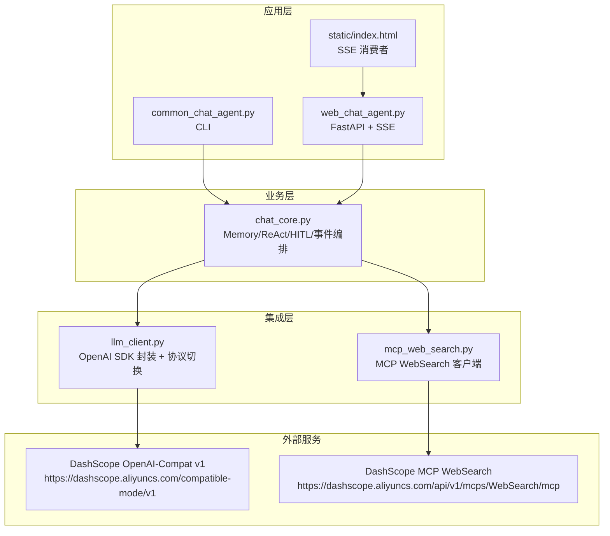
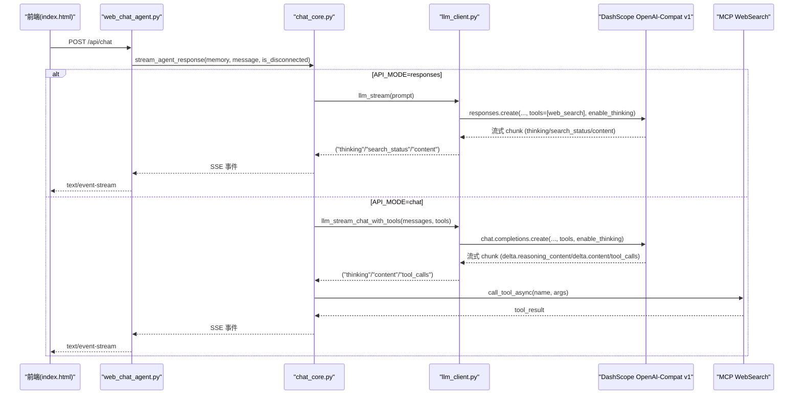
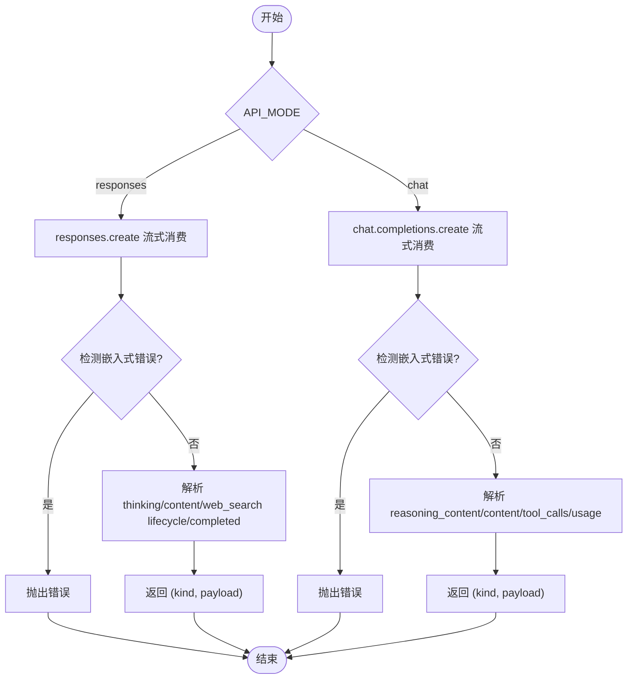
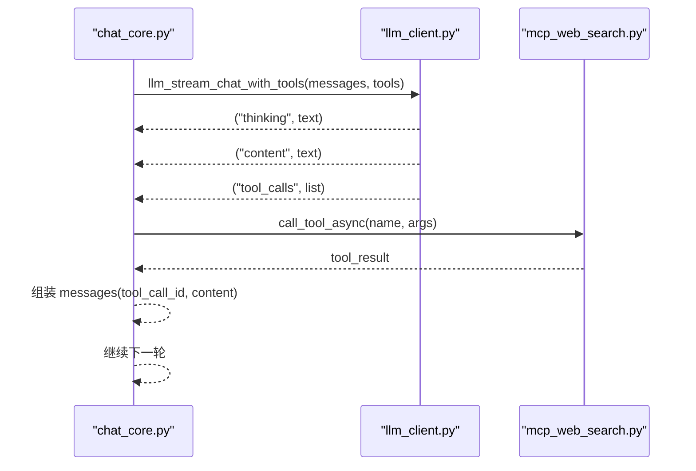
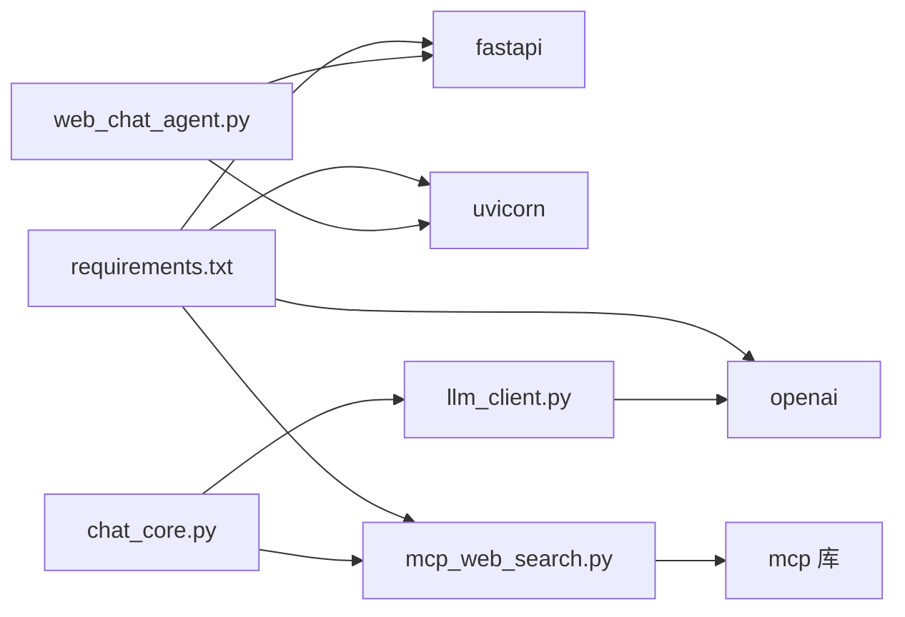

# LLM 集成层

<cite>
**本文引用的文件**
- [demo/llm_client.py](file://demo/llm_client.py)
- [demo/chat_core.py](file://demo/chat_core.py)
- [demo/web_chat_agent.py](file://demo/web_chat_agent.py)
- [demo/mcp_web_search.py](file://demo/mcp_web_search.py)
- [demo/common_chat_agent.py](file://demo/common_chat_agent.py)
- [demo/static/index.html](file://demo/static/index.html)
- [scripts/debug_responses.py](file://scripts/debug_responses.py)
- [docs/兼容 OpenAI 格式的 Responses API-获取响应.md](file://docs/兼容%20OpenAI%20格式的%20Responses%20API-%E8%8E%B7%E5%8F%96%E5%93%8D%E5%BA%94.md)
- [docs/OpenAI兼容-Chat 接口文档.md](file://docs/OpenAI%E5%85%BC%E5%AE%B9-Chat%20%E6%8E%A5%E5%8F%A3%E6%96%87%E6%A1%A3.md)
- [requirements.txt](file://requirements.txt)
</cite>

## 目录
1. [简介](#简介)
2. [项目结构](#项目结构)
3. [核心组件](#核心组件)
4. [架构总览](#架构总览)
5. [详细组件分析](#详细组件分析)
6. [依赖关系分析](#依赖关系分析)
7. [性能考量](#性能考量)
8. [故障排除指南](#故障排除指南)
9. [结论](#结论)
10. [附录](#附录)

## 简介
本文件面向 LLM 集成层的技术文档，聚焦于对 OpenAI SDK 的封装与 DashScope OpenAI-Compat 网关的对接，系统阐述：
- 客户端初始化与连接管理（懒加载、单例、基础 URL 与认证）
- 错误处理机制（嵌入式错误检测、HTTP 4xx 捕获、兜底策略）
- Responses API 与 Chat API 的实现差异、协议切换与兼容性
- 流式处理原理（事件类型、数据格式、前端消费）
- API 调用示例、性能优化策略与故障排除
- 与 DashScope OpenAI-Compat 网关及 MCP WebSearch 的集成细节与最佳实践

## 项目结构
本项目采用“分层”组织方式：
- demo/llm_client.py：底层 LLM 客户端封装，负责 OpenAI SDK 的封装、协议切换、流式解析与错误处理
- demo/chat_core.py：业务层（Memory、ReAct、会话管理、HITL、事件流编排）
- demo/web_chat_agent.py：HTTP + SSE 入口，路由与 SSE 序列化
- demo/mcp_web_search.py：MCP WebSearch 客户端，封装 DashScope MCP 网关
- demo/common_chat_agent.py：CLI 入口
- demo/static/index.html：前端页面，消费 SSE 事件
- scripts/debug_responses.py：调试脚本，打印 Responses API 流的 chunk 类型
- docs/*：文档与示例
- requirements.txt：依赖声明

图表来源
- [demo/web_chat_agent.py:117-140](file://demo/web_chat_agent.py#L117-L140)
- [demo/chat_core.py:958-1069](file://demo/chat_core.py#L958-L1069)
- [demo/llm_client.py:61-84](file://demo/llm_client.py#L61-L84)
- [demo/mcp_web_search.py:26-29](file://demo/mcp_web_search.py#L26-L29)

章节来源
- [demo/llm_client.py:1-51](file://demo/llm_client.py#L1-L51)
- [demo/chat_core.py:1-51](file://demo/chat_core.py#L1-L51)
- [demo/web_chat_agent.py:1-63](file://demo/web_chat_agent.py#L1-L63)
- [demo/mcp_web_search.py:1-35](file://demo/mcp_web_search.py#L1-L35)

## 核心组件
- LLM 客户端封装（llm_client.py）
  - 懒加载 OpenAI 客户端，模块级单例
  - 协议切换：responses（Responses API + 内置 web_search 生命周期）与 chat（Chat Completions + native function calling）
  - 同步/异步流式接口：llm()/llm_stream() 与 llm_chat_with_tools()/llm_stream_chat_with_tools()
  - 错误处理：嵌入式错误检测、HTTP 4xx 捕获、兜底文本抽取
- 业务层（chat_core.py）
  - Memory：多轮记忆与持久化
  - ReAct：两套实现（CLI 同步与 Web 异步流式）
  - HITL：人类在环中断与恢复
  - 事件编排：统一 (event_name, payload) 元组，适配 SSE
- HTTP + SSE（web_chat_agent.py）
  - FastAPI 路由与 SSE 序列化
  - 会话管理与历史读取
- MCP WebSearch（mcp_web_search.py）
  - MCP 工具发现与调用
  - 与 Chat native tools 的桥接

章节来源
- [demo/llm_client.py:58-84](file://demo/llm_client.py#L58-L84)
- [demo/llm_client.py:113-122](file://demo/llm_client.py#L113-L122)
- [demo/llm_client.py:340-355](file://demo/llm_client.py#L340-L355)
- [demo/llm_client.py:618-646](file://demo/llm_client.py#L618-L646)
- [demo/chat_core.py:138-192](file://demo/chat_core.py#L138-L192)
- [demo/chat_core.py:958-1069](file://demo/chat_core.py#L958-L1069)
- [demo/web_chat_agent.py:105-111](file://demo/web_chat_agent.py#L105-L111)
- [demo/mcp_web_search.py:89-117](file://demo/mcp_web_search.py#L89-L117)

## 架构总览
本系统通过“协议切换 + 事件编排”的方式，统一对外提供一致的流式体验：
- responses 模式：使用 Responses API，内置 web_search 生命周期事件，适合“单 prompt 拼接 + ReAct”范式
- chat 模式：使用 Chat Completions + native function calling，联网搜索通过 MCP WebSearch，事件通过 tool_call/tool_result 承载
- 业务层将两类模式的差异屏蔽，统一产出 (event_name, payload) 元组，前端通过 SSE 消费

图表来源
- [demo/web_chat_agent.py:127-140](file://demo/web_chat_agent.py#L127-L140)
- [demo/chat_core.py:958-1069](file://demo/chat_core.py#L958-L1069)
- [demo/llm_client.py:340-355](file://demo/llm_client.py#L340-L355)
- [demo/llm_client.py:798-846](file://demo/llm_client.py#L798-L846)
- [demo/mcp_web_search.py:127-164](file://demo/mcp_web_search.py#L127-L164)

## 详细组件分析

### LLM 客户端封装（llm_client.py）
- 客户端初始化与连接管理
  - 懒加载：首次调用时构建 OpenAI 客户端并缓存，避免 import 时强依赖环境变量
  - 单例：模块级全局变量缓存，后续调用复用
  - 基础 URL 与认证：固定 base_url 指向 DashScope OpenAI-Compat v1，从环境变量读取 API Key
- 协议切换与兼容性
  - API_MODE 支持 responses 与 chat，大小写不敏感，非法值在模块加载时报错
  - responses 模式：使用 client.responses.create，支持内置 web_search 生命周期事件
  - chat 模式：使用 client.chat.completions.create，结合 native function calling 与 MCP
- 流式处理与事件类型
  - responses 模式：事件类型包括 response.output_text.delta、response.reasoning_summary_text.delta、web_search lifecycle、response.completed
  - chat 模式：事件类型包括 choices[].delta.reasoning_content、choices[].delta.content、choices==[] 的 usage 帧
  - 统一抽象：llm_stream()/llm_stream_chat_with_tools() 产出 (kind, payload) 元组
- 错误处理
  - 嵌入式错误检测：对 chunk 中的 code/message/error 字段进行识别与抛错
  - HTTP 4xx：Chat Completions 路径通常直接抛异常，保留兜底
  - 兜底策略：当无 delta 文本时，从 response.output 抽取 message 文本
- 工具调用（Chat 模式）
  - native function calling：累积 tool_calls，流结束后一次性返回
  - 事件：tool_calls 事件在流式中按增量累积，最终汇总

图表来源
- [demo/llm_client.py:124-234](file://demo/llm_client.py#L124-L234)
- [demo/llm_client.py:237-333](file://demo/llm_client.py#L237-L333)
- [demo/llm_client.py:357-496](file://demo/llm_client.py#L357-L496)
- [demo/llm_client.py:498-610](file://demo/llm_client.py#L498-L610)
- [demo/llm_client.py:687-795](file://demo/llm_client.py#L687-L795)

章节来源
- [demo/llm_client.py:61-84](file://demo/llm_client.py#L61-L84)
- [demo/llm_client.py:37-51](file://demo/llm_client.py#L37-L51)
- [demo/llm_client.py:124-234](file://demo/llm_client.py#L124-L234)
- [demo/llm_client.py:357-496](file://demo/llm_client.py#L357-L496)
- [demo/llm_client.py:687-795](file://demo/llm_client.py#L687-L795)

### 业务层（chat_core.py）
- Memory：多轮记忆、序列化/反序列化、归档与读取
- ReAct 循环
  - CLI 同步：react()，受 MAX_ROUNDS 限制
  - Web 异步：stream_agent_response()，统一产出 (event_name, payload)，前端通过 SSE 消费
- HITL（人类在环）
  - 中断点写入 _PENDING，前端渲染 await_user，等待 /api/resume 恢复
  - 恢复流程：resume_chat_response() 校验 + _resume_inner() 构造 tool_result，继续流式循环
- 事件契约
  - responses 模式：status/thinking/chunk/search_status/tool_call/tool_result/await_user/ui_hint/done/error
  - chat 模式：status/thinking/chunk/tool_call/tool_result/await_user/ui_hint/done/error，且无 search_status

图表来源
- [demo/chat_core.py:632-800](file://demo/chat_core.py#L632-L800)
- [demo/llm_client.py:798-846](file://demo/llm_client.py#L798-L846)
- [demo/mcp_web_search.py:127-164](file://demo/mcp_web_search.py#L127-L164)

章节来源
- [demo/chat_core.py:138-192](file://demo/chat_core.py#L138-L192)
- [demo/chat_core.py:919-951](file://demo/chat_core.py#L919-L951)
- [demo/chat_core.py:958-1069](file://demo/chat_core.py#L958-L1069)
- [demo/chat_core.py:836-914](file://demo/chat_core.py#L836-L914)

### HTTP + SSE（web_chat_agent.py）
- 路由与参数校验：ChatRequest/ResetRequest/ArchiveRequest/ResumeRequest
- SSE 序列化：将 (event_name, payload) 元组序列化为 SSE 文本帧
- 会话管理：归档、读取、删除、列表
- 健康检查：/api/health 返回模型与会话数量

章节来源
- [demo/web_chat_agent.py:70-95](file://demo/web_chat_agent.py#L70-L95)
- [demo/web_chat_agent.py:105-111](file://demo/web_chat_agent.py#L105-L111)
- [demo/web_chat_agent.py:127-167](file://demo/web_chat_agent.py#L127-L167)
- [demo/web_chat_agent.py:180-226](file://demo/web_chat_agent.py#L180-L226)

### MCP WebSearch（mcp_web_search.py）
- 工具发现：discover_tool_spec_async()，缓存 OpenAI 格式工具规范
- 工具调用：call_tool_async()，失败返回统一前缀字符串，便于模型恢复
- 与 Chat native tools 的桥接：将 MCP 工具转换为 OpenAI tools 规范

章节来源
- [demo/mcp_web_search.py:89-117](file://demo/mcp_web_search.py#L89-L117)
- [demo/mcp_web_search.py:127-164](file://demo/mcp_web_search.py#L127-L164)
- [demo/mcp_web_search.py:52-65](file://demo/mcp_web_search.py#L52-L65)

### CLI 入口（common_chat_agent.py）
- 读取环境变量 DASHSCOPE_API_KEY
- 通过 chat_core.react() 进行 CLI ReAct 循环

章节来源
- [demo/common_chat_agent.py:17-52](file://demo/common_chat_agent.py#L17-L52)

## 依赖关系分析
- 依赖声明
  - openai：OpenAI SDK
  - fastapi/uvicorn：HTTP + SSE
  - mcp：MCP 客户端
- 运行时依赖
  - DASHSCOPE_API_KEY：DashScope API Key
  - API_MODE：responses 或 chat
  - QWEN_MODEL：模型名（默认 qwen3.7-max）

图表来源
- [requirements.txt:1-5](file://requirements.txt#L1-L5)
- [demo/llm_client.py:25](file://demo/llm_client.py#L25)
- [demo/web_chat_agent.py:19-21](file://demo/web_chat_agent.py#L19-L21)
- [demo/mcp_web_search.py:16-17](file://demo/mcp_web_search.py#L16-L17)

章节来源
- [requirements.txt:1-5](file://requirements.txt#L1-L5)

## 性能考量
- 懒加载与单例
  - 首次调用构建 OpenAI 客户端，避免 import 时阻塞与不必要的连接
- 流式消费
  - 使用 run_in_executor 将阻塞式迭代包装为异步，减少主线程阻塞
- 兜底策略
  - 当无 delta 文本时，从 response.output 抽取 message 文本，提升稳定性
- 事件聚合
  - Chat native tools 的 tool_calls 采用增量累积 + 流尾汇总，避免重复调用现象
- 前端渲染
  - SSE 事件按需渲染，避免一次性渲染大量 DOM

章节来源
- [demo/llm_client.py:74-84](file://demo/llm_client.py#L74-L84)
- [demo/llm_client.py:383-387](file://demo/llm_client.py#L383-L387)
- [demo/llm_client.py:404-429](file://demo/llm_client.py#L404-L429)
- [demo/llm_client.py:649-684](file://demo/llm_client.py#L649-L684)

## 故障排除指南
- 常见错误与定位
  - 未配置 DASHSCOPE_API_KEY：模块加载或运行时均会抛错，检查环境变量
  - 非法 API_MODE：模块加载时报错，确认大小写与取值
  - 嵌入式错误：Responses API 流中出现 code/message，需检查请求参数与权限
  - HTTP 4xx：Chat Completions 路径直接抛异常，检查模型名与参数
  - 流式无 delta：使用调试脚本打印 chunk 类型，确认是否走兜底
- 调试工具
  - scripts/debug_responses.py：直接打印 responses.create 流的每个 chunk 类型，快速定位空响应根因
  - docs/兼容 OpenAI 格式的 Responses API-获取响应.md：说明 Responses API 的 response.retrieve 使用与字段含义
- 前端排查
  - static/index.html：SSE 解析与事件消费逻辑，确认事件名与 payload 结构一致

章节来源
- [demo/llm_client.py:62-67](file://demo/llm_client.py#L62-L67)
- [demo/llm_client.py:47-50](file://demo/llm_client.py#L47-L50)
- [demo/llm_client.py:169-175](file://demo/llm_client.py#L169-L175)
- [demo/llm_client.py:288-295](file://demo/llm_client.py#L288-L295)
- [scripts/debug_responses.py:1-43](file://scripts/debug_responses.py#L1-L43)
- [docs/兼容 OpenAI 格式的 Responses API-获取响应.md:1-48](file://docs/兼容%20OpenAI%20格式的%20Responses%20API-%E8%8E%B7%E5%8F%96%E5%93%8D%E5%BA%94.md#L1-L48)
- [demo/static/index.html:1145-1155](file://demo/static/index.html#L1145-L1155)

## 结论
本集成层通过“协议切换 + 事件编排”的设计，实现了对 OpenAI SDK 的稳健封装，并与 DashScope OpenAI-Compat 网关及 MCP WebSearch 紧密集成。其优势在于：
- 统一的事件契约，简化前端开发
- 完善的错误处理与兜底策略，提升鲁棒性
- 支持两种主流模式（Responses 与 Chat），满足不同场景需求
- 通过懒加载与单例优化连接管理，兼顾性能与资源占用

## 附录

### API 调用示例（Responses API）
- 基础调用
  - 使用 client.responses.create，开启 enable_thinking 与内置 web_search
  - 流式消费：response.output_text.delta、response.reasoning_summary_text.delta、web_search lifecycle、response.completed
- 参考文档
  - docs/兼容 OpenAI 格式的 Responses API-获取响应.md

章节来源
- [docs/兼容 OpenAI 格式的 Responses API-获取响应.md:1-48](file://docs/兼容%20OpenAI%20格式的%20Responses%20API-%E8%8E%B7%E5%8F%96%E5%93%8D%E5%BA%94.md#L1-L48)

### API 调用示例（Chat Completions + native function calling）
- 基础调用
  - 使用 client.chat.completions.create，传入 messages 与 tools
  - 流式消费：choices[].delta.reasoning_content、choices[].delta.content、choices==[] 的 usage 帧
- 参考文档
  - docs/OpenAI兼容-Chat 接口文档.md

章节来源
- [docs/OpenAI兼容-Chat 接口文档.md:1-100](file://docs/OpenAI%E5%85%BC%E5%AE%B9-Chat%20%E6%8E%A5%E5%8F%A3%E6%96%87%E6%A1%A3.md#L1-L100)

### 前端事件消费要点
- SSE 事件名与 payload
  - responses 模式：status/thinking/chunk/search_status/tool_call/tool_result/await_user/ui_hint/done/error
  - chat 模式：status/thinking/chunk/tool_call/tool_result/await_user/ui_hint/done/error
- 解析与渲染
  - index.html 中 parseSSEBlock 与 consumeStream 的实现，确保事件名与 payload 结构一致

章节来源
- [demo/static/index.html:1145-1155](file://demo/static/index.html#L1145-L1155)
- [demo/static/index.html:1411-1442](file://demo/static/index.html#L1411-L1442)