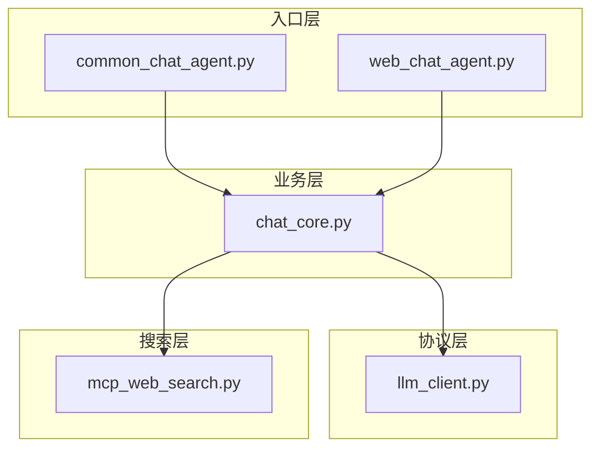
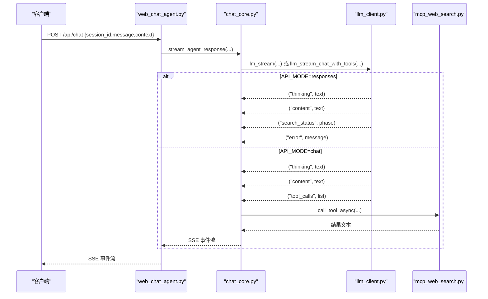
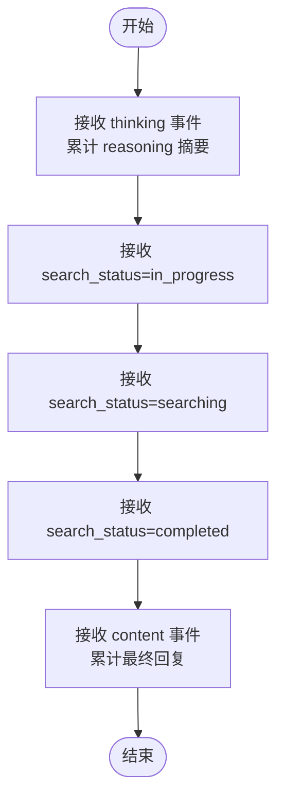
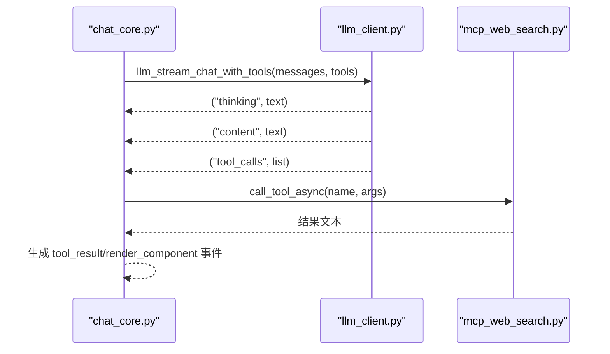
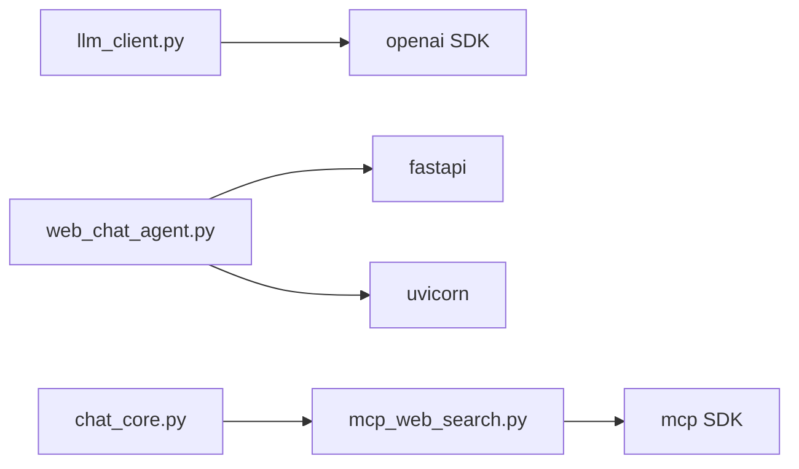

# 协议支持

<cite>
**本文引用的文件**
- [README.md](file://README.md)
- [requirements.txt](file://requirements.txt)
- [demo/chat_core.py](file://demo/chat_core.py)
- [demo/common_chat_agent.py](file://demo/common_chat_agent.py)
- [demo/web_chat_agent.py](file://demo/web_chat_agent.py)
- [demo/llm_client.py](file://demo/llm_client.py)
- [demo/mcp_web_search.py](file://demo/mcp_web_search.py)
- [docs/兼容 OpenAI 格式的 Responses API-获取响应.md](file://docs/兼容%20OpenAI%20格式的%20Responses%20API-获取响应.md)
- [docs/OpenAI兼容-Chat 接口文档.md](file://docs/OpenAI兼容-Chat%20接口文档.md)
- [docs/联网搜索-mcp-接口文档.md](file://docs/联网搜索-mcp-接口文档.md)
- [scripts/debug_responses.py](file://scripts/debug_responses.py)
</cite>

## 目录
1. [简介](#简介)
2. [项目结构](#项目结构)
3. [核心组件](#核心组件)
4. [架构总览](#架构总览)
5. [详细组件分析](#详细组件分析)
6. [依赖分析](#依赖分析)
7. [性能考量](#性能考量)
8. [故障排查指南](#故障排查指南)
9. [结论](#结论)
10. [附录](#附录)

## 简介
本文件聚焦“协议支持”主题，系统解析 Responses API 与 Chat Completions API 的实现差异、协议切换机制与兼容性考虑，详解 API_MODE 环境变量的配置与验证流程，对比两种模式下的请求参数差异，并深入说明 Responses API 中内置 web_search 生命周期事件（thinking、search_status、completion）的状态转换。最后提供协议切换的实际使用示例、性能对比分析与最佳实践建议。

## 项目结构
该项目采用“分层架构 + 协议切换”的设计：
- 入口层：CLI 与 Web（FastAPI + SSE）共享同一业务内核
- 业务层：ReAct 循环、记忆管理、会话持久化、工具发现与组件渲染
- 协议层：底层 LLM 客户端，支持两种模式（Responses API 与 Chat Completions）
- 搜索层：MCP WebSearch 客户端，用于 Chat 模式下的工具调用

图表来源
- [demo/common_chat_agent.py:1-53](file://demo/common_chat_agent.py#L1-L53)
- [demo/web_chat_agent.py:1-233](file://demo/web_chat_agent.py#L1-L233)
- [demo/chat_core.py:1-1068](file://demo/chat_core.py#L1-L1068)
- [demo/llm_client.py:1-924](file://demo/llm_client.py#L1-L924)
- [demo/mcp_web_search.py:1-172](file://demo/mcp_web_search.py#L1-L172)

章节来源
- [README.md:1-62](file://README.md#L1-L62)
- [requirements.txt:1-5](file://requirements.txt#L1-L5)

## 核心组件
- 协议切换与验证：API_MODE 环境变量在模块加载时完成大小写不敏感校验，非法值直接抛错
- Responses API：内置 web_search 生命周期事件（in_progress/searching/completed），支持 thinking 摘要
- Chat Completions API：原生 function calling + native tools，联网搜索通过 MCP WebSearch 执行
- 业务内核：ReAct 循环、记忆与会话管理、SSE 事件序列化、HITL（人机交互）恢复点
- 搜索客户端：MCP WebSearch 的工具发现与调用封装

章节来源
- [demo/llm_client.py:1-924](file://demo/llm_client.py#L1-L924)
- [demo/chat_core.py:1-1068](file://demo/chat_core.py#L1-L1068)
- [demo/mcp_web_search.py:1-172](file://demo/mcp_web_search.py#L1-L172)

## 架构总览
协议切换的关键在于底层 LLM 客户端对 API_MODE 的分支处理，业务层通过统一的流式事件协议（thinking/content/search_status/tool_calls/error）向上层暴露能力，Web 层将其序列化为 SSE 事件。

图表来源
- [demo/web_chat_agent.py:127-141](file://demo/web_chat_agent.py#L127-L141)
- [demo/chat_core.py:632-800](file://demo/chat_core.py#L632-L800)
- [demo/llm_client.py:340-800](file://demo/llm_client.py#L340-L800)
- [demo/mcp_web_search.py:127-172](file://demo/mcp_web_search.py#L127-L172)

## 详细组件分析

### 协议切换与 API_MODE 配置
- 配置来源：环境变量 API_MODE（默认 responses），大小写不敏感
- 验证时机：模块加载时进行合法性检查，非法值直接抛错
- 模式影响：
  - responses：使用 responses.create，内置 web_search 生命周期事件与 thinking 摘要
  - chat：使用 chat.completions.create + tools，联网搜索通过 MCP WebSearch 执行，不产生 search_status 事件

章节来源
- [demo/llm_client.py:44-51](file://demo/llm_client.py#L44-L51)
- [demo/llm_client.py:113-122](file://demo/llm_client.py#L113-L122)
- [demo/llm_client.py:349-355](file://demo/llm_client.py#L349-L355)

### Responses API 实现差异
- 请求参数
  - 模型：QWEN_MODEL（默认 qwen3.7-max）
  - 工具：tools=[{"type":"web_search"}]
  - extra_body：enable_thinking=True
  - store：False
  - stream：True
- 生命周期事件
  - thinking：response.reasoning_summary_text.delta
  - content：response.output_text.delta
  - search_status：response.web_search_call.in_progress / searching / completed
  - error：嵌入式错误（code/message/request_id）
- 兜底策略：若无 delta，从 response.completed 的 output[].content[].text 抽取文本

章节来源
- [demo/llm_client.py:124-234](file://demo/llm_client.py#L124-L234)
- [demo/llm_client.py:357-496](file://demo/llm_client.py#L357-L496)
- [docs/兼容 OpenAI 格式的 Responses API-获取响应.md:1-48](file://docs/兼容%20OpenAI%20格式的%20Responses%20API-获取响应.md#L1-L48)

### Chat Completions API 实现差异
- 请求参数
  - messages：结构化数组（system/user/assistant/tool）
  - tools：显式传入（OpenAI function calling）
  - extra_body：enable_thinking=True（不传 enable_search）
  - stream：True
  - stream_options：include_usage=True
- 生命周期事件
  - thinking：choices[0].delta.reasoning_content
  - content：choices[0].delta.content
  - tool_calls：choices[0].delta.tool_calls（流尾汇总）
  - error：嵌入式错误或 HTTP 4xx
- 兼容性
  - responses 模式：前端可显示 search_status banner
  - chat 模式：前端不显示 search_status banner，工具调用通过 tool_result 事件承载

章节来源
- [demo/llm_client.py:498-611](file://demo/llm_client.py#L498-L611)
- [demo/llm_client.py:618-795](file://demo/llm_client.py#L618-L795)
- [docs/OpenAI兼容-Chat 接口文档.md:1-100](file://docs/OpenAI兼容-Chat%20接口文档.md#L1-L100)

### Responses API 中的 web_search 生命周期事件处理
- thinking：累计 reasoning_summary_text.delta，用于前端“思考摘要”展示
- search_status：依次产出 in_progress → searching → completed，前端据此显示搜索进度条
- completion：response.completed，携带 usage 与状态（completed/failed/incomplete）

图表来源
- [demo/llm_client.py:472-480](file://demo/llm_client.py#L472-L480)
- [demo/llm_client.py:194-198](file://demo/llm_client.py#L194-L198)

章节来源
- [demo/llm_client.py:357-496](file://demo/llm_client.py#L357-L496)
- [demo/llm_client.py:124-234](file://demo/llm_client.py#L124-L234)

### Chat 模式下的工具调用与 MCP 集成
- 工具发现：首次调用 discover_tool_spec_async，缓存 OpenAI 格式 spec 列表
- 工具调用：call_tool_async，失败返回统一前缀字符串，由业务层以 role=tool 回喂模型
- 事件承载：tool_result 事件承载工具执行结果，必要时触发 render_component 事件

图表来源
- [demo/chat_core.py:724-799](file://demo/chat_core.py#L724-L799)
- [demo/llm_client.py:798-800](file://demo/llm_client.py#L798-L800)
- [demo/mcp_web_search.py:127-172](file://demo/mcp_web_search.py#L127-L172)

章节来源
- [demo/chat_core.py:511-517](file://demo/chat_core.py#L511-L517)
- [demo/chat_core.py:541-558](file://demo/chat_core.py#L541-L558)
- [demo/mcp_web_search.py:89-125](file://demo/mcp_web_search.py#L89-L125)

### API_MODE 配置与验证流程
- 加载时校验：读取 API_MODE，标准化为小写，限定集合为 {"chat","responses"}
- 非法值处理：直接抛出错误，提示合法取值
- 运行时路由：根据 API_MODE 路由到不同实现（responses 或 chat）

章节来源
- [demo/llm_client.py:44-51](file://demo/llm_client.py#L44-L51)
- [demo/llm_client.py:113-122](file://demo/llm_client.py#L113-L122)

### 请求参数差异对比
- Responses API
  - prompt 字符串
  - tools=[{"type":"web_search"}]
  - extra_body={"enable_thinking": True}
  - store=False
- Chat Completions
  - messages 结构化数组
  - tools 显式传入（OpenAI function calling）
  - extra_body={"enable_thinking": True}
  - stream_options={"include_usage": True}

章节来源
- [demo/llm_client.py:134-140](file://demo/llm_client.py#L134-L140)
- [demo/llm_client.py:510-516](file://demo/llm_client.py#L510-L516)
- [demo/llm_client.py:700-707](file://demo/llm_client.py#L700-L707)

### Web 层事件序列化与 SSE
- Web 层将业务层产生的 (event_name, payload) 元组序列化为 SSE 文本帧
- /api/chat 与 /api/resume 的事件类型与负载一致，确保前端一致性体验

章节来源
- [demo/web_chat_agent.py:101-111](file://demo/web_chat_agent.py#L101-L111)
- [demo/web_chat_agent.py:127-167](file://demo/web_chat_agent.py#L127-L167)

## 依赖分析
- OpenAI SDK：用于调用 DashScope 兼容模式下的 Responses API 与 Chat Completions
- FastAPI/Uvicorn：Web 服务与 SSE
- mcp：MCP 客户端，封装 streamableHttp 调用

图表来源
- [demo/llm_client.py:25-26](file://demo/llm_client.py#L25-L26)
- [demo/web_chat_agent.py:19-21](file://demo/web_chat_agent.py#L19-L21)
- [demo/mcp_web_search.py:16-17](file://demo/mcp_web_search.py#L16-L17)
- [requirements.txt:1-5](file://requirements.txt#L1-L5)

章节来源
- [requirements.txt:1-5](file://requirements.txt#L1-L5)

## 性能考量
- 模型选择：QWEN_MODEL 默认 qwen3.7-max，适合 Responses API + 内置 web_search
- 流式处理：两种模式均采用流式消费，减少首字节延迟
- 兜底策略：Responses API 在无 delta 时从 response.completed 抽取文本，避免空响应
- MCP 调用：每次调用建立短连接，成本仅一次 TCP/TLS + initialize，适合低频工具调用

章节来源
- [demo/llm_client.py:35-36](file://demo/llm_client.py#L35-L36)
- [demo/llm_client.py:218-227](file://demo/llm_client.py#L218-L227)
- [demo/mcp_web_search.py:133-133](file://demo/mcp_web_search.py#L133-L133)

## 故障排查指南
- API_MODE 非法：模块加载即抛错，检查环境变量大小写与取值
- API_KEY 未配置：底层客户端构建时抛错，检查 DASHSCOPE_API_KEY
- Responses API 空响应：使用 scripts/debug_responses.py 打印每个 chunk type，定位问题根因
- MCP 调用失败：返回统一前缀字符串，由业务层以 role=tool 回喂模型

章节来源
- [demo/llm_client.py:62-67](file://demo/llm_client.py#L62-L67)
- [scripts/debug_responses.py:1-43](file://scripts/debug_responses.py#L1-L43)
- [demo/mcp_web_search.py:146-148](file://demo/mcp_web_search.py#L146-L148)

## 结论
本项目通过 API_MODE 实现 Responses API 与 Chat Completions API 的无缝切换，前者强调内置 web_search 生命周期与 thinking 摘要，后者强调原生 function calling 与 MCP 工具链。业务层以统一的事件协议屏蔽底层差异，Web 层通过 SSE 提供一致的前端体验。合理选择模式与参数，结合兜底策略与 MCP 错误处理，可获得稳定且高性能的交互体验。

## 附录

### 协议切换实际使用示例
- 设置 API_MODE=responses：使用 responses.create，内置 web_search 生命周期事件可用
- 设置 API_MODE=chat：使用 chat.completions.create + tools，通过 MCP 执行联网搜索

章节来源
- [demo/llm_client.py:44-51](file://demo/llm_client.py#L44-L51)
- [demo/llm_client.py:113-122](file://demo/llm_client.py#L113-L122)

### 性能对比与最佳实践
- Responses API：适合需要内置 web_search 生命周期与 thinking 摘要的场景，前端可显示搜索进度
- Chat 模式：适合需要原生 function calling 与 MCP 工具链的复杂工具集成，前端不显示 search_status banner
- 最佳实践：
  - 明确业务需求选择模式
  - 使用统一的事件协议与 SSE 序列化
  - 为 MCP 调用准备兜底错误处理
  - 通过调试脚本定位 Responses API 空响应问题

章节来源
- [demo/llm_client.py:357-496](file://demo/llm_client.py#L357-L496)
- [demo/llm_client.py:498-611](file://demo/llm_client.py#L498-L611)
- [scripts/debug_responses.py:1-43](file://scripts/debug_responses.py#L1-L43)