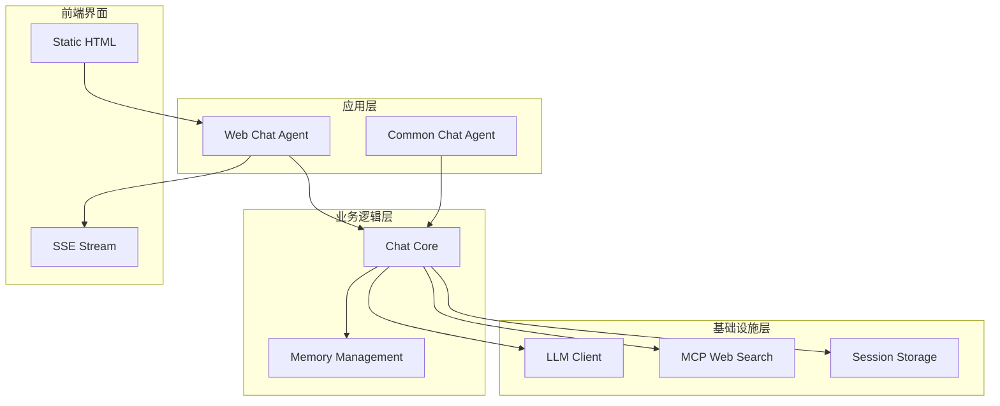
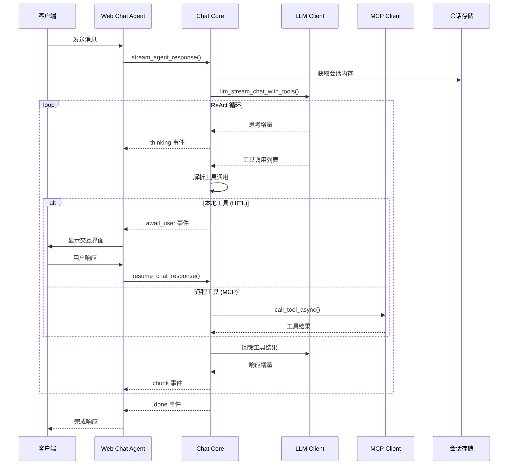
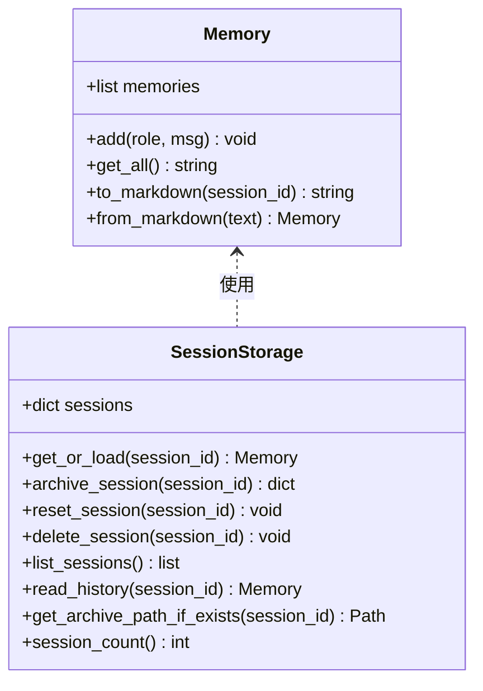
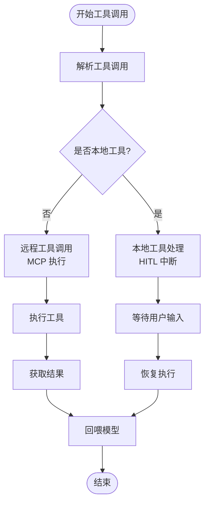
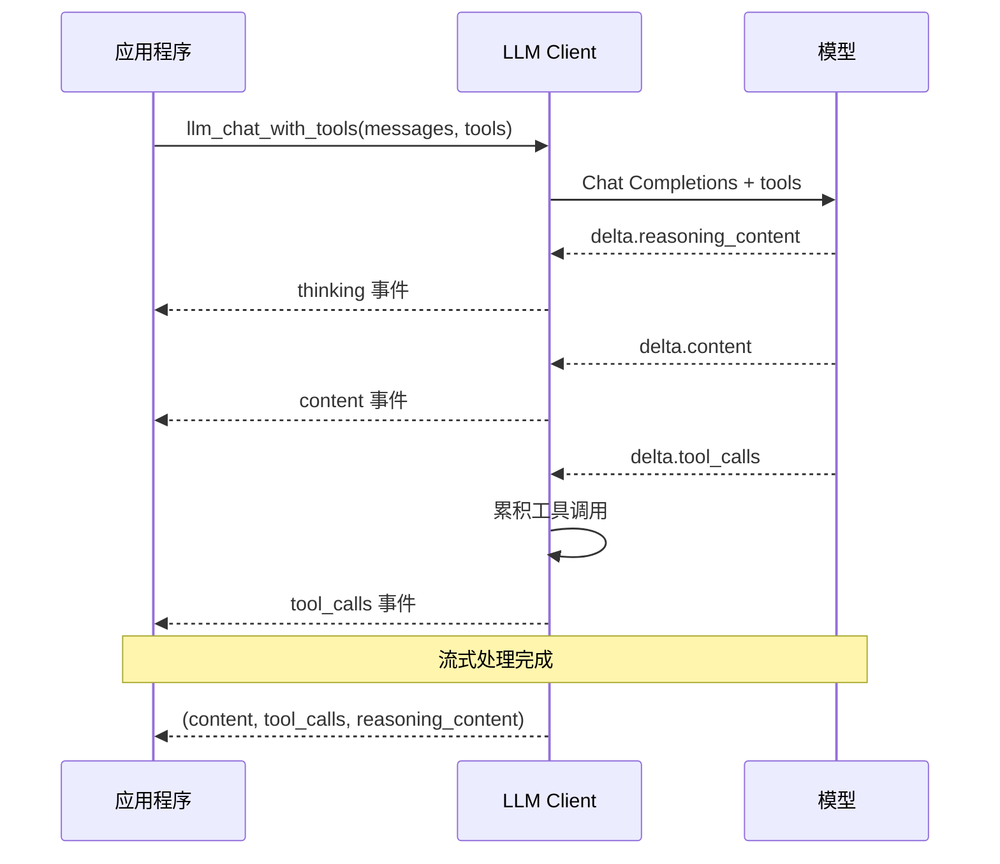
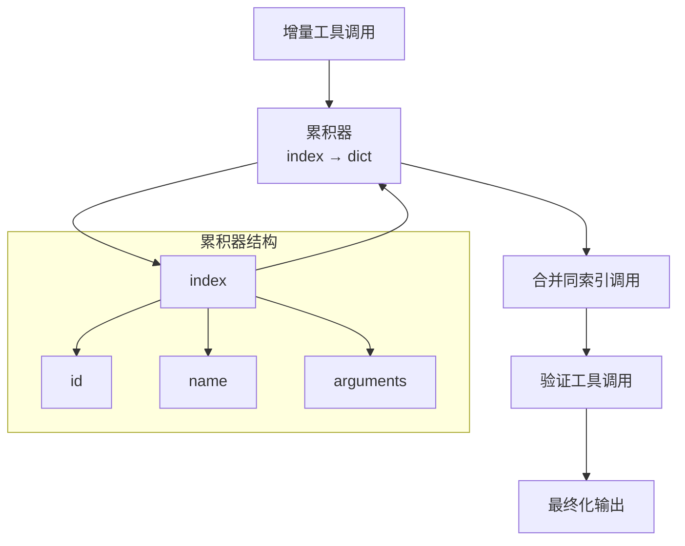
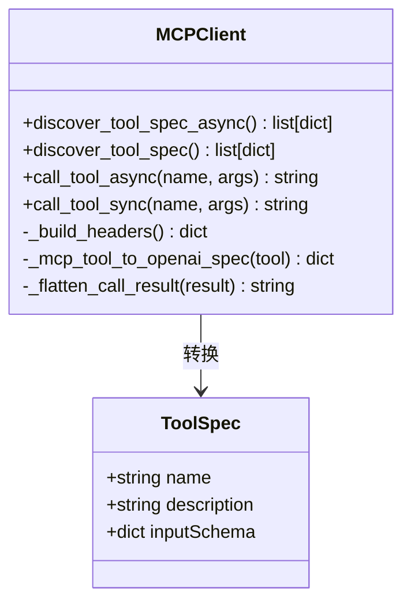
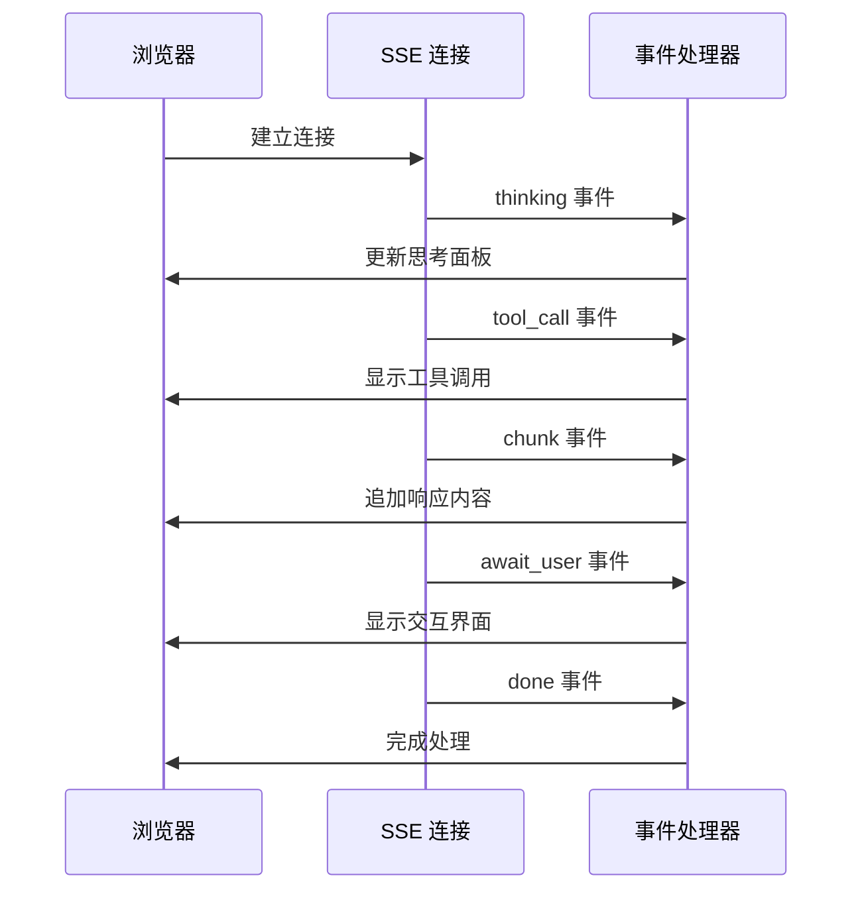
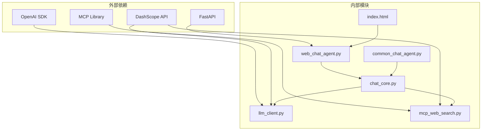

# 工具调用集成

<cite>
**本文档引用的文件**
- [README.md](file://README.md)
- [chat_core.py](file://demo/chat_core.py)
- [llm_client.py](file://demo/llm_client.py)
- [mcp_web_search.py](file://demo/mcp_web_search.py)
- [web_chat_agent.py](file://demo/web_chat_agent.py)
- [common_chat_agent.py](file://demo/common_chat_agent.py)
- [index.html](file://demo/static/index.html)
- [OpenAI兼容-Chat 接口文档.md](file://docs/OpenAI兼容-Chat 接口文档.md)
- [兼容 OpenAI 格式的 Responses API-获取响应.md](file://docs/兼容 OpenAI 格式的 Responses API-获取响应.md)
</cite>

## 目录
1. [简介](#简介)
2. [项目结构](#项目结构)
3. [核心组件](#核心组件)
4. [架构概览](#架构概览)
5. [详细组件分析](#详细组件分析)
6. [依赖关系分析](#依赖关系分析)
7. [性能考虑](#性能考虑)
8. [故障排除指南](#故障排除指南)
9. [结论](#结论)

## 简介

这是一个基于 OpenAI 兼容接口的工具调用集成系统，实现了 Chat Completions + Tools 的完整工作流程。该系统支持两种模式：传统的 Responses API 模式和现代的 Chat Completions + Native Function Calling 模式。

系统的核心特性包括：
- **ReAct 循环**：思考-行动-观察的迭代对话模式
- **工具调用协议**：支持本地工具和远程 MCP 工具
- **流式处理**：实时的思考过程和响应流
- **人类在环（HITL）**：支持用户交互的工具调用
- **多轮对话记忆**：持久化的会话状态管理

## 项目结构



**图表来源**
- [web_chat_agent.py:1-233](file://demo/web_chat_agent.py#L1-L233)
- [common_chat_agent.py:1-53](file://demo/common_chat_agent.py#L1-L53)
- [chat_core.py:1-1068](file://demo/chat_core.py#L1-L1068)

**章节来源**
- [README.md:1-62](file://README.md#L1-L62)
- [web_chat_agent.py:1-233](file://demo/web_chat_agent.py#L1-L233)

## 核心组件

### 1. Chat Core 核心引擎

Chat Core 是整个系统的业务逻辑中心，负责：
- ReAct 循环的执行和管理
- 工具调用的解析和执行
- 会话状态的持久化
- 错误处理和恢复机制

### 2. LLM 客户端

LLM 客户端提供了统一的接口来访问不同的 API 模式：
- **Responses API**：传统模式，支持内置搜索和思考模式
- **Chat Completions + Tools**：现代原生函数调用模式
- **流式处理**：支持实时的增量响应

### 3. MCP Web 搜索

MCP（Model Context Protocol）客户端提供了与 DashScope WebSearch MCP 服务器的集成：
- 动态发现可用的工具规范
- 异步工具调用执行
- 错误处理和重试机制

### 4. 会话存储系统

实现了完整的会话生命周期管理：
- 内存缓存和磁盘持久化
- UUID 校验和安全防护
- 历史记录的序列化和反序列化

**章节来源**
- [chat_core.py:138-350](file://demo/chat_core.py#L138-L350)
- [llm_client.py:1-800](file://demo/llm_client.py#L1-L800)
- [mcp_web_search.py:1-172](file://demo/mcp_web_search.py#L1-L172)

## 架构概览



**图表来源**
- [chat_core.py:632-800](file://demo/chat_core.py#L632-L800)
- [llm_client.py:633-800](file://demo/llm_client.py#L633-L800)
- [web_chat_agent.py:127-167](file://demo/web_chat_agent.py#L127-L167)

## 详细组件分析

### Chat Core 组件

#### Memory 类
Memory 类负责多轮对话的记忆管理：



**图表来源**
- [chat_core.py:138-350](file://demo/chat_core.py#L138-L350)

#### ReAct 协议解析器
系统实现了两种 ReAct 协议：

1. **传统字符串协议**：用于 Responses API 模式
2. **原生函数调用协议**：用于 Chat Completions + Tools 模式

#### 工具调用处理
工具调用处理机制包括：



**图表来源**
- [chat_core.py:561-630](file://demo/chat_core.py#L561-L630)
- [chat_core.py:724-799](file://demo/chat_core.py#L724-L799)

**章节来源**
- [chat_core.py:358-466](file://demo/chat_core.py#L358-L466)
- [chat_core.py:561-630](file://demo/chat_core.py#L561-L630)

### LLM 客户端组件

#### 原生函数调用实现
LLM 客户端提供了完整的原生函数调用支持：



**图表来源**
- [llm_client.py:687-795](file://demo/llm_client.py#L687-L795)
- [llm_client.py:798-924](file://demo/llm_client.py#L798-L924)

#### 工具调用累积机制
工具调用的累积和拼接过程：



**图表来源**
- [llm_client.py:649-684](file://demo/llm_client.py#L649-L684)

**章节来源**
- [llm_client.py:618-795](file://demo/llm_client.py#L618-L795)

### MCP Web 搜索组件

#### 工具规范发现
MCP 客户端实现了动态工具规范发现机制：



**图表来源**
- [mcp_web_search.py:89-172](file://demo/mcp_web_search.py#L89-L172)

**章节来源**
- [mcp_web_search.py:89-172](file://demo/mcp_web_search.py#L89-L172)

### Web 前端组件

#### SSE 事件流处理
前端实现了完整的 SSE 事件流处理机制：



**图表来源**
- [index.html:1412-1527](file://demo/static/index.html#L1412-L1527)

**章节来源**
- [index.html:1412-1527](file://demo/static/index.html#L1412-L1527)

## 依赖关系分析



**图表来源**
- [llm_client.py:25-26](file://demo/llm_client.py#L25-L26)
- [web_chat_agent.py:19-46](file://demo/web_chat_agent.py#L19-L46)
- [mcp_web_search.py:16-17](file://demo/mcp_web_search.py#L16-L17)

**章节来源**
- [llm_client.py:1-800](file://demo/llm_client.py#L1-L800)
- [web_chat_agent.py:1-233](file://demo/web_chat_agent.py#L1-L233)

## 性能考虑

### 1. 流式处理优化
- **增量响应**：支持实时的思考过程和响应流
- **背压控制**：前端自动滚动到最新内容
- **内存管理**：及时清理未完成的组件槽位

### 2. 工具调用优化
- **并行执行**：支持多个工具的并行调用
- **缓存机制**：MCP 工具规范的模块级缓存
- **错误隔离**：单个工具失败不影响整体流程

### 3. 会话管理优化
- **懒加载**：按需从磁盘加载历史记录
- **原子写入**：使用临时文件确保数据一致性
- **内存缓存**：热点会话驻留在内存中

## 故障排除指南

### 常见问题及解决方案

#### 1. API 密钥配置错误
**症状**：启动时报错，提示未配置 API 密钥
**解决方法**：
```bash
export DASHSCOPE_API_KEY=sk-xxxxxxxx
python demo/web_chat_agent.py
```

#### 2. 工具调用失败
**症状**：工具调用返回错误信息
**解决方法**：
- 检查工具参数格式
- 验证网络连接
- 查看服务器日志获取详细错误信息

#### 3. 会话状态异常
**症状**：会话历史丢失或显示异常
**解决方法**：
- 检查磁盘权限
- 验证 session_id 格式
- 重新启动应用

#### 4. 流式连接中断
**症状**：响应流意外中断
**解决方法**：
- 检查网络稳定性
- 增加重试机制
- 监控服务器状态

**章节来源**
- [web_chat_agent.py:53-58](file://demo/web_chat_agent.py#L53-L58)
- [mcp_web_search.py:43-48](file://demo/mcp_web_search.py#L43-L48)

## 结论

该工具调用集成系统提供了完整的 Chat Completions + Tools 解决方案，具有以下优势：

1. **灵活性**：支持多种 API 模式和工具类型
2. **可扩展性**：模块化设计便于添加新的工具和功能
3. **可靠性**：完善的错误处理和恢复机制
4. **用户体验**：实时的流式响应和丰富的交互界面

系统的核心价值在于：
- **统一的工具调用协议**：无论是本地工具还是远程 MCP 工具，都遵循相同的调用模式
- **强大的 ReAct 循环**：支持复杂的多步骤推理和执行
- **完整的开发体验**：从 CLI 到 Web 的完整支持
- **生产就绪的设计**：考虑了性能、可靠性和可维护性

通过合理利用这些特性，开发者可以快速构建功能强大且可靠的 AI 助手应用。