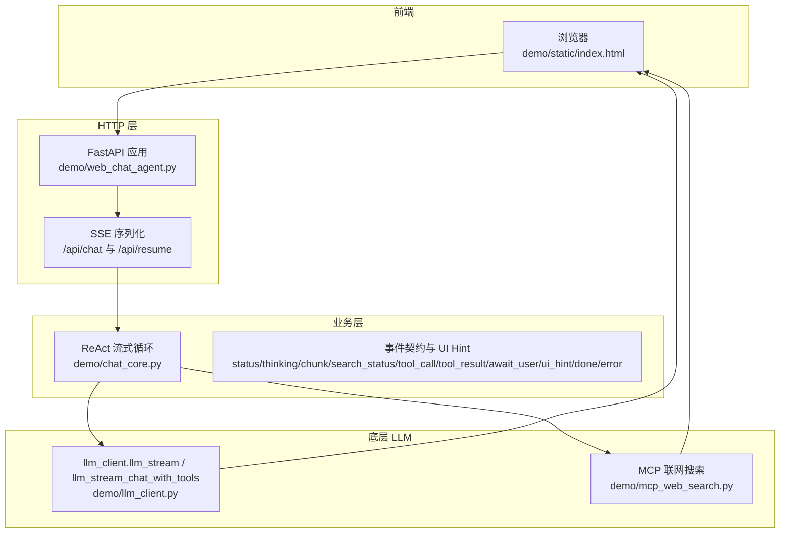
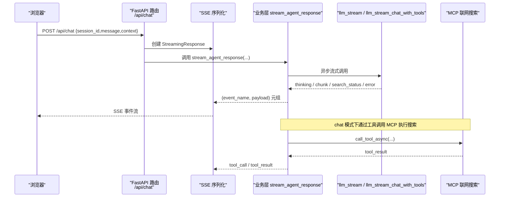
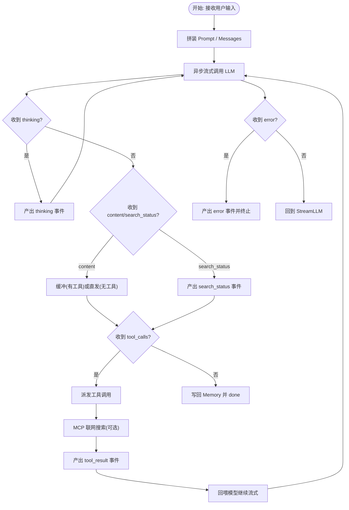
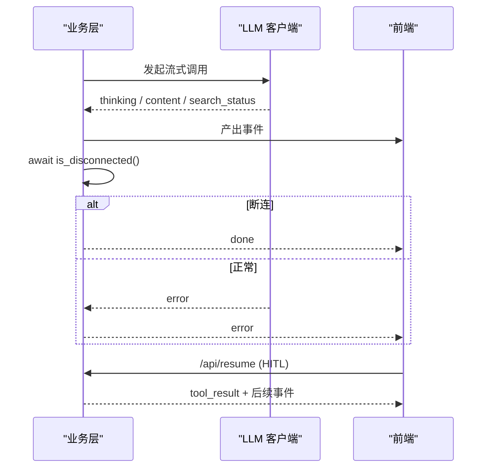
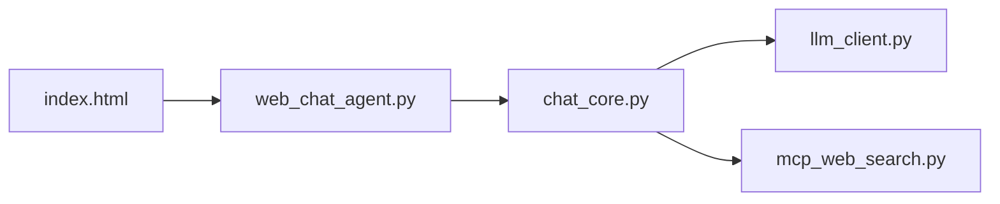

# 流式处理

<cite>
**本文引用的文件**
- [demo/chat_core.py](file://demo/chat_core.py)
- [demo/web_chat_agent.py](file://demo/web_chat_agent.py)
- [demo/llm_client.py](file://demo/llm_client.py)
- [demo/mcp_web_search.py](file://demo/mcp_web_search.py)
- [demo/static/index.html](file://demo/static/index.html)
</cite>

## 目录
1. [简介](#简介)
2. [项目结构](#项目结构)
3. [核心组件](#核心组件)
4. [架构总览](#架构总览)
5. [详细组件分析](#详细组件分析)
6. [依赖关系分析](#依赖关系分析)
7. [性能考量](#性能考量)
8. [故障排查指南](#故障排查指南)
9. [结论](#结论)
10. [附录](#附录)

## 简介
本文件系统性阐述本项目的流式处理实现，重点覆盖：
- 异步流式响应的事件类型与数据格式约定
- CLI 与 Web 模式的流式差异（同步流式 llm 与异步流式 llm_stream）
- 流式 ReAct 循环在业务层的组织方式与事件产出
- 错误处理与异常恢复（嵌入式错误检测、HITL 人机协作、断连探测）
- 前端事件处理指南与性能优化策略

## 项目结构
本项目采用“底层 LLM 客户端 → 业务层 ReAct 流式循环 → HTTP/SSE 接口层”的分层设计，确保流式协议与传输层解耦。

图表来源
- [demo/web_chat_agent.py:117-167](file://demo/web_chat_agent.py#L117-L167)
- [demo/chat_core.py:958-1068](file://demo/chat_core.py#L958-L1068)
- [demo/llm_client.py:336-511](file://demo/llm_client.py#L336-L511)
- [demo/mcp_web_search.py:89-164](file://demo/mcp_web_search.py#L89-L164)

章节来源
- [demo/web_chat_agent.py:117-167](file://demo/web_chat_agent.py#L117-L167)
- [demo/chat_core.py:958-1068](file://demo/chat_core.py#L958-L1068)
- [demo/llm_client.py:336-511](file://demo/llm_client.py#L336-L511)
- [demo/mcp_web_search.py:89-164](file://demo/mcp_web_search.py#L89-L164)

## 核心组件
- 事件类型与数据格式
  - status: {"phase": "thinking"|"answering", "round": int}
  - thinking: {"text": str}
  - chunk: {"text": str}
  - search_status: {"phase": str}（仅 responses 模式）
  - tool_call: {"name": str, "args": dict}
  - tool_result: {"name": str, "result": str}
  - await_user: {"tool_call_id": ..., "name": ..., "args": ..., "kind": "input"|"approval"}
  - ui_hint: {"mode": "focus"|"compact"|"chat"}
  - done: {}
  - error: {"message": str}

- 事件来源与职责
  - llm_stream / llm_stream_chat_with_tools：产生 thinking、chunk、search_status、error
  - 业务层 stream_agent_response/_stream_chat_native：组织 ReAct 循环，产出 status、tool_call、tool_result、await_user、done、error
  - 前端 index.html：消费事件，驱动 UI 更新与交互

章节来源
- [demo/chat_core.py:958-1068](file://demo/chat_core.py#L958-L1068)
- [demo/llm_client.py:336-511](file://demo/llm_client.py#L336-L511)
- [demo/llm_client.py:633-646](file://demo/llm_client.py#L633-L646)

## 架构总览
Web 模式下的端到端流式处理链路如下：

图表来源
- [demo/web_chat_agent.py:127-140](file://demo/web_chat_agent.py#L127-L140)
- [demo/chat_core.py:958-1068](file://demo/chat_core.py#L958-L1068)
- [demo/llm_client.py:336-511](file://demo/llm_client.py#L336-L511)
- [demo/mcp_web_search.py:127-164](file://demo/mcp_web_search.py#L127-L164)

## 详细组件分析

### 事件类型与数据格式
- status
  - 用途：指示当前阶段（思考/回答）与轮次
  - payload：{"phase": "thinking"|"answering", "round": int}
- thinking
  - 用途：模型思考摘要增量
  - payload：{"text": str}
- chunk
  - 用途：最终回复增量（无工具时直接转发；有工具时缓冲至非工具回合再转发）
  - payload：{"text": str}
- search_status
  - 用途：responses 模式下的内置搜索生命周期
  - payload：{"phase": "in_progress"|"searching"|"completed"}
- tool_call
  - 用途：模型请求调用的工具名与参数
  - payload：{"name": str, "args": dict}
- tool_result
  - 用途：工具执行结果（已截断）
  - payload：{"name": str, "result": str}
- await_user
  - 用途：HITL（人机协作）触发，等待前端提交决策
  - payload：{"tool_call_id": ..., "name": ..., "args": ..., "kind": "input"|"approval"}
- ui_hint
  - 用途：上下文感知 UI 模式建议
  - payload：{"mode": "focus"|"compact"|"chat"}
- done
  - 用途：正常结束（含 HITL 中断软关流）
  - payload：{}
- error
  - 用途：终止流的错误
  - payload：{"message": str}

章节来源
- [demo/chat_core.py:958-1068](file://demo/chat_core.py#L958-L1068)
- [demo/llm_client.py:336-511](file://demo/llm_client.py#L336-L511)

### CLI 与 Web 模式的流式差异
- CLI（同步流式）
  - 入口：llm() / react()
  - 特点：仅累积最终文本，丢弃中间事件（思考、搜索生命周期等）
  - 适用：命令行交互、脚本自动化
- Web（异步流式）
  - 入口：llm_stream() / llm_stream_chat_with_tools / stream_agent_response()
  - 特点：边生成边产出事件，前端实时渲染；支持 responses 模式 search_status 与 chat 模式 native function calling
  - 适用：网页聊天界面、实时 UI 呈现

章节来源
- [demo/llm_client.py:113-122](file://demo/llm_client.py#L113-L122)
- [demo/llm_client.py:340-355](file://demo/llm_client.py#L340-L355)
- [demo/llm_client.py:618-646](file://demo/llm_client.py#L618-L646)
- [demo/chat_core.py:920-951](file://demo/chat_core.py#L920-L951)
- [demo/chat_core.py:958-1068](file://demo/chat_core.py#L958-L1068)

### 流式 ReAct 循环（业务层）
- responses 模式
  - 通过 llm_stream() 逐帧产出 thinking、chunk、search_status、error
  - 当检测到工具调用意图时，产出 tool_call，执行工具后产出 tool_result，并将结果回喂模型继续
- chat 模式（native function calling）
  - 通过 llm_stream_chat_with_tools() 产出 thinking、content、tool_calls（流尾一次性）、error
  - 业务层 _stream_react_rounds() 负责工具派发、HITL 中断、组件渲染事件（component_loading/render_component/component_error）

图表来源
- [demo/chat_core.py:958-1068](file://demo/chat_core.py#L958-L1068)
- [demo/llm_client.py:336-511](file://demo/llm_client.py#L336-L511)
- [demo/llm_client.py:633-646](file://demo/llm_client.py#L633-L646)

章节来源
- [demo/chat_core.py:958-1068](file://demo/chat_core.py#L958-L1068)
- [demo/llm_client.py:336-511](file://demo/llm_client.py#L336-L511)
- [demo/llm_client.py:633-646](file://demo/llm_client.py#L633-L646)

### 错误处理与异常恢复
- 嵌入式错误检测
  - responses 模式：在流式过程中检测“错误字段”并立即产出 error 事件
  - chat 模式：在流式过程中检测“错误字段”并产出 error 事件；同时保留 HTTP 层捕获
- 断连探测
  - 业务层在每个事件之间 await is_disconnected()，断连时提前终止
- HITL 异常恢复
  - await_user 触发后，前端提交 /api/resume，后端构造 tool_result 并回喂，继续后续流式

图表来源
- [demo/chat_core.py:958-1068](file://demo/chat_core.py#L958-L1068)
- [demo/llm_client.py:336-511](file://demo/llm_client.py#L336-L511)

章节来源
- [demo/chat_core.py:958-1068](file://demo/chat_core.py#L958-L1068)
- [demo/llm_client.py:336-511](file://demo/llm_client.py#L336-L511)

### 前端事件处理指南
- SSE 解析
  - 将 event/data 行解析为事件对象，data 为 JSON 字符串时解析为对象
- 事件分发
  - thinking：追加到思考面板
  - chunk：拼接到回答正文
  - status：切换“思考/回答”态
  - search_status：显示/淡出搜索状态条
  - tool_call/tool_result：更新工具状态条
  - component_loading/render_component/component_error：渲染工具卡片或错误提示
  - await_user：渲染 HITL 气泡，等待用户提交
  - error：展示错误文案并清理未完成组件
  - done：结束流，渲染 Mermaid（如有）
- 交互要点
  - 输入框 Enter 发送，Shift+Enter 换行
  - HITL 气泡支持快捷选项、输入框与同意/拒绝操作
  - /api/resume 时，构造 {tool_call_id, decision, answer} 提交

章节来源
- [demo/static/index.html:1412-1527](file://demo/static/index.html#L1412-L1527)
- [demo/static/index.html:1586-1744](file://demo/static/index.html#L1586-L1744)

## 依赖关系分析
- 模块耦合
  - chat_core.py 依赖 llm_client.py 与 mcp_web_search.py，向上暴露抽象事件元组
  - web_chat_agent.py 仅负责路由与 SSE 序列化，不包含业务逻辑
  - 前端 index.html 仅消费事件，不关心业务细节
- 关键依赖链
  - /api/chat → stream_agent_response → llm_stream / llm_stream_chat_with_tools → LLM Provider
  - /api/resume → resume_chat_response → _resume_inner → _stream_react_rounds

图表来源
- [demo/web_chat_agent.py:127-140](file://demo/web_chat_agent.py#L127-L140)
- [demo/chat_core.py:958-1068](file://demo/chat_core.py#L958-L1068)
- [demo/llm_client.py:336-511](file://demo/llm_client.py#L336-L511)
- [demo/mcp_web_search.py:89-164](file://demo/mcp_web_search.py#L89-L164)

章节来源
- [demo/web_chat_agent.py:127-140](file://demo/web_chat_agent.py#L127-L140)
- [demo/chat_core.py:958-1068](file://demo/chat_core.py#L958-L1068)
- [demo/llm_client.py:336-511](file://demo/llm_client.py#L336-L511)
- [demo/mcp_web_search.py:89-164](file://demo/mcp_web_search.py#L89-L164)

## 性能考量
- 流式消费
  - 前端按事件增量渲染，避免一次性拼接大量 DOM
  - 响应回退：当 LLM 未逐字输出时，客户端兜底抽取完整文本
- 组件渲染
  - 工具卡片采用惰性渲染（Mermaid 等），失败重试与降级提示
- 事件聚合
  - tool_calls 在 chat 模式下流尾一次性产出，避免碎片化事件带来的解析成本
- 断连早停
  - 每帧 await is_disconnected()，及时释放资源

章节来源
- [demo/llm_client.py:357-496](file://demo/llm_client.py#L357-L496)
- [demo/llm_client.py:800-924](file://demo/llm_client.py#L800-L924)
- [demo/static/index.html:955-1013](file://demo/static/index.html#L955-L1013)

## 故障排查指南
- 常见错误与定位
  - API_MODE 非法：模块加载即抛错，检查环境变量
  - API_KEY 未配置：首次调用 LLM 即抛错，检查环境变量
  - 响应状态失败：responses 模式在 completed 事件中检查 status/error，抛出 RuntimeError
  - 嵌入式错误：流中出现错误字段时立即产出 error 事件
  - 断连：业务层 await is_disconnected() 返回真时提前结束
  - HITL 异常
    - 无效 session_id：HTTP 400
    - 无 pending：HTTP 404
    - tool_call_id 不匹配：HTTP 409
- 建议排查步骤
  - 查看后端日志（请求参数、首次出现的 chunk 类型、结束摘要）
  - 检查前端控制台网络与 SSE 连接
  - 确认 API_MODE 与工具可用性（MCP schema 缓存）

章节来源
- [demo/llm_client.py:44-51](file://demo/llm_client.py#L44-L51)
- [demo/llm_client.py:61-83](file://demo/llm_client.py#L61-L83)
- [demo/llm_client.py:124-234](file://demo/llm_client.py#L124-L234)
- [demo/web_chat_agent.py:143-167](file://demo/web_chat_agent.py#L143-L167)
- [demo/chat_core.py:835-863](file://demo/chat_core.py#L835-L863)

## 结论
本项目通过清晰的分层与事件契约，实现了高内聚、低耦合的流式处理体系。业务层以抽象事件元组屏蔽传输细节，前端按事件增量渲染，具备良好的扩展性与可维护性。responses 与 chat 两种模式分别满足不同场景需求，配合嵌入式错误检测与 HITL 机制，整体鲁棒性较强。

## 附录
- 示例与最佳实践
  - Web 模式：使用 /api/chat 获取流式事件，按事件类型更新 UI
  - HITL：收到 await_user 后，构造 {tool_call_id, decision, answer} 调用 /api/resume
  - 错误处理：统一消费 error 事件并在 UI 中提示
  - 性能优化：避免一次性渲染超大文本；合理使用组件懒加载与降级提示