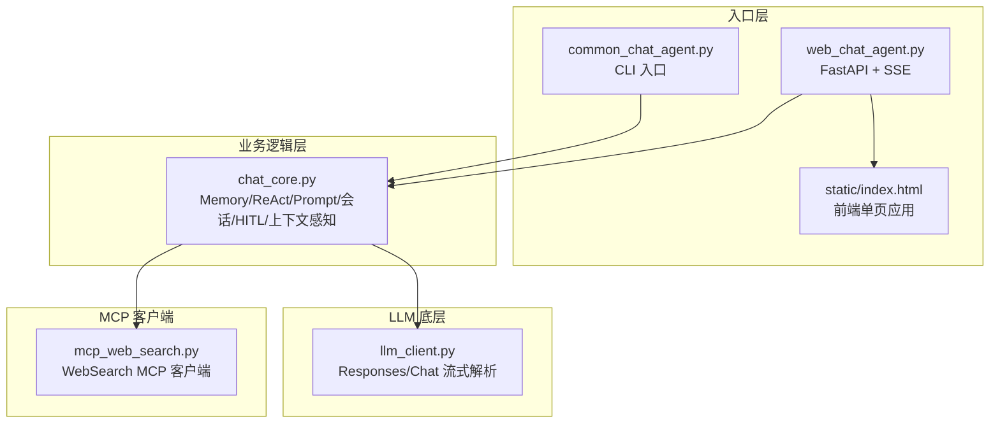
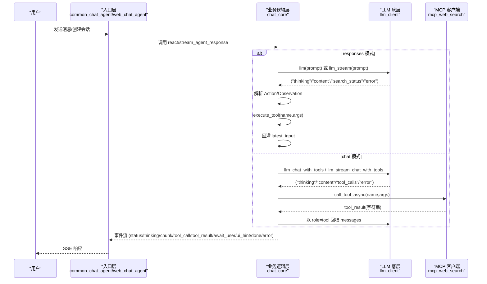
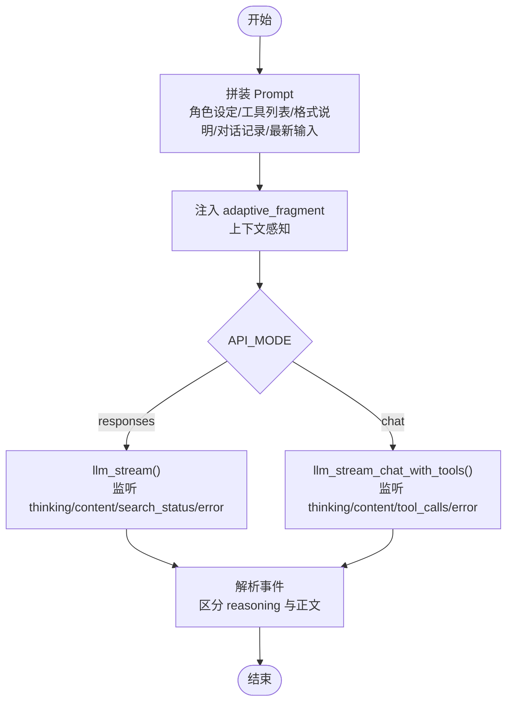
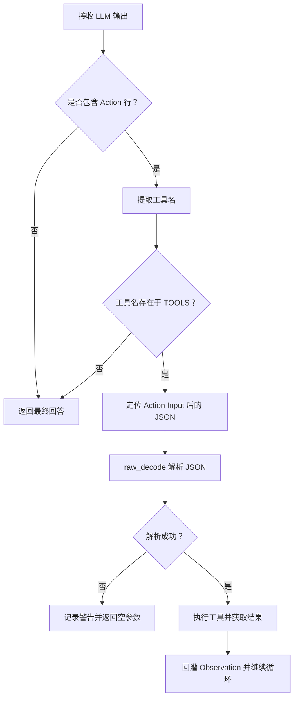
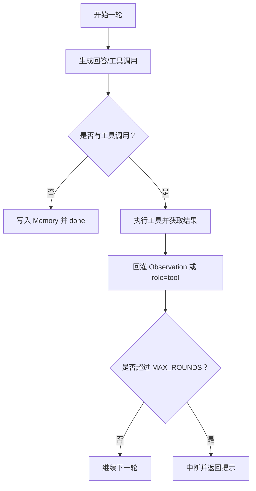
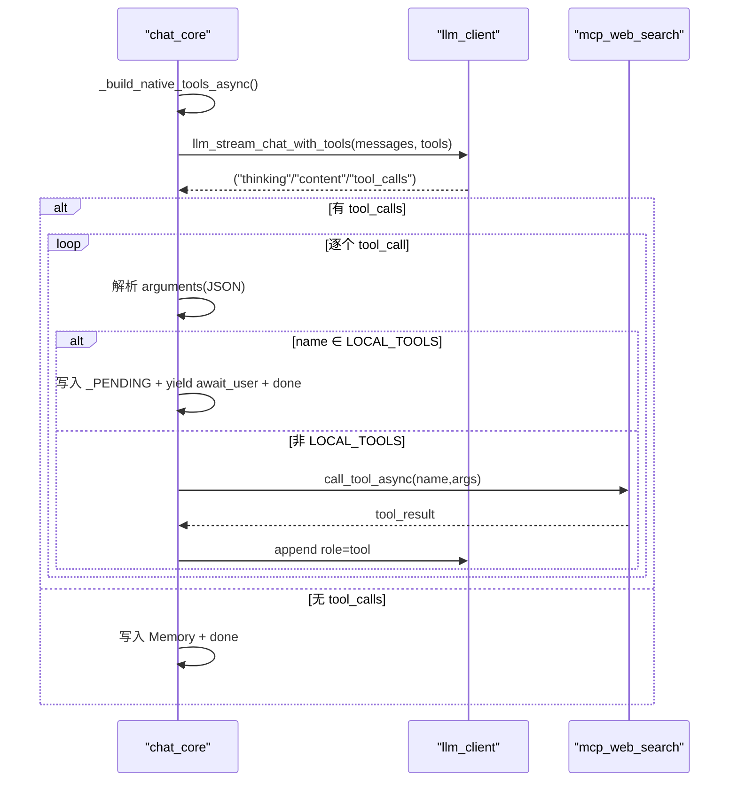
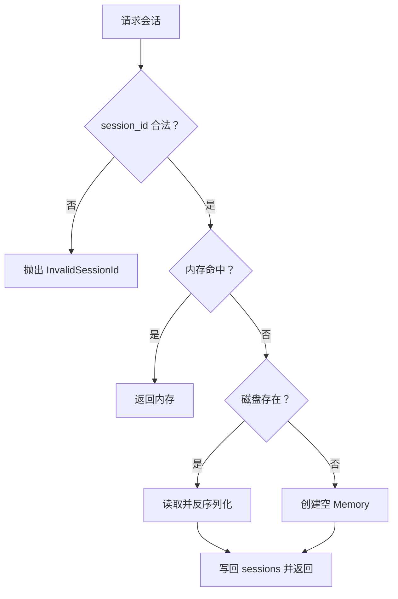
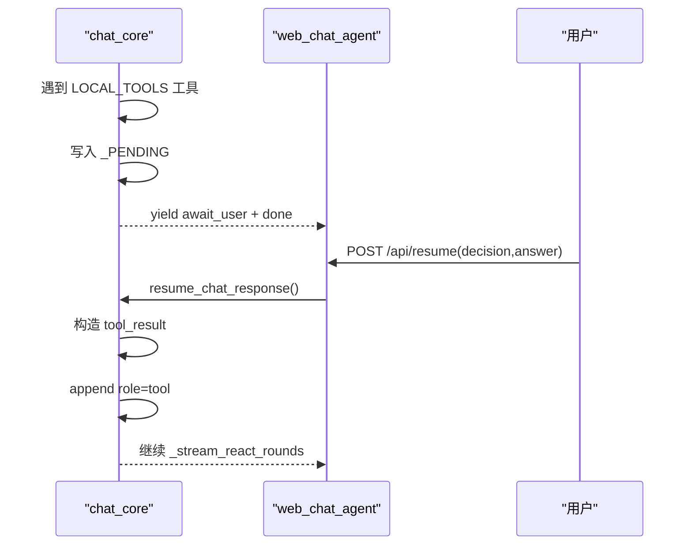
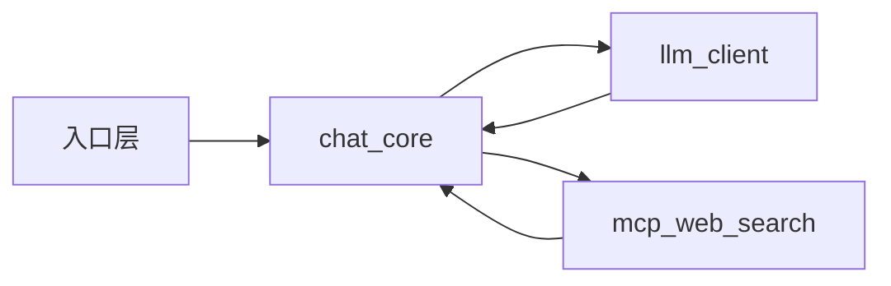

# ReAct 循环详解

<cite>
**本文引用的文件**
- [README.md](file://README.md)
- [CLAUDE.md](file://CLAUDE.md)
- [requirements.txt](file://requirements.txt)
- [demo/chat_core.py](file://demo/chat_core.py)
- [demo/common_chat_agent.py](file://demo/common_chat_agent.py)
- [demo/web_chat_agent.py](file://demo/web_chat_agent.py)
- [demo/llm_client.py](file://demo/llm_client.py)
- [demo/mcp_web_search.py](file://demo/mcp_web_search.py)
- [demo/static/index.html](file://demo/static/index.html)
</cite>

## 目录
1. [简介](#简介)
2. [项目结构](#项目结构)
3. [核心组件](#核心组件)
4. [架构总览](#架构总览)
5. [详细组件分析](#详细组件分析)
6. [依赖关系分析](#依赖关系分析)
7. [性能考量](#性能考量)
8. [故障排查指南](#故障排查指南)
9. [结论](#结论)
10. [附录](#附录)

## 简介
本项目是一个“最小代码”的 ReAct（思维-行动-观察）聊天 Agent 教学 Demo，展示了如何用最少的代码实现复杂的代理推理过程。ReAct 循环包含三个阶段：
- 思维阶段：模型生成思考摘要（reasoning summary），用于指导下一步行动。
- 行动阶段：模型输出 Action 行与 Action Input JSON，指示要调用的工具及参数。
- 观察阶段：执行工具并将结果（Observation）回灌给模型，形成闭环。

本项目同时支持两种工具调用范式：
- 文本协议范式（responses 模式）：通过字符串 prompt 模板与 Action/Observation 文本协议，由底层 LLM 输出中解析 Action 行与 Action Input JSON。
- 原生函数调用范式（chat 模式）：通过 OpenAI 兼容的 Chat Completions + tools，模型显式返回 tool_calls，业务层执行后以 role=tool 的消息回喂模型。

此外，项目提供了 CLI 与 Web 两种入口，共享同一 ReAct 内核，并内置最大轮次保护、HITL（人机协同）中断与恢复、工具结果卡片化等能力。

## 项目结构
项目采用三层分层架构，严格向下导入，职责清晰：
- 入口层（HTTP/CLI）：负责路由、参数校验、SSE 序列化、领域异常翻译。
- 业务逻辑层（chat_core）：负责 Memory、Prompt 模板、ReAct 循环、会话持久化、HITL、上下文感知、chat 模式原生函数调用 ReAct。
- LLM 底层（llm_client）：负责模型调用、流式事件解析、错误检测、不同 API 模式（responses/chat）的实现。
- MCP 客户端（mcp_web_search）：封装 DashScope WebSearch MCP 服务器，提供工具发现与调用。

图表来源
- [demo/web_chat_agent.py:1-233](file://demo/web_chat_agent.py#L1-L233)
- [demo/common_chat_agent.py:1-53](file://demo/common_chat_agent.py#L1-L53)
- [demo/chat_core.py:1-1069](file://demo/chat_core.py#L1-L1069)
- [demo/llm_client.py:1-924](file://demo/llm_client.py#L1-L924)
- [demo/mcp_web_search.py:1-172](file://demo/mcp_web_search.py#L1-L172)
- [demo/static/index.html:1-1976](file://demo/static/index.html#L1-L1976)

章节来源
- [README.md:44-57](file://README.md#L44-L57)
- [CLAUDE.md:30-52](file://CLAUDE.md#L30-L52)

## 核心组件
- Memory：多轮对话记忆，支持序列化/反序列化为 Markdown，用于会话持久化。
- Prompt 模板：包含角色设定、工具列表、ReAct 格式说明、注意事项、对话记录与最新输入。
- ReAct 解析器：匹配 Action 行、解析 Action Input JSON、执行工具。
- 会话存储：基于 UUID 的会话 ID 校验、归档、读取、列表、删除、计数。
- HITL 基础设施：LOCAL_TOOLS（ask_user、execute_shell_command）、_PENDING 恢复点、/api/resume。
- 上下文感知：根据前端上报的上下文动态调整 system prompt 片段与 UI 模式。
- chat 模式原生函数调用 ReAct：messages 数组 + tools + tool_calls + reasoning_content 跨轮保留。

章节来源
- [demo/chat_core.py:138-193](file://demo/chat_core.py#L138-L193)
- [demo/chat_core.py:425-466](file://demo/chat_core.py#L425-L466)
- [demo/chat_core.py:355-396](file://demo/chat_core.py#L355-L396)
- [demo/chat_core.py:255-348](file://demo/chat_core.py#L255-L348)
- [demo/chat_core.py:403-419](file://demo/chat_core.py#L403-L419)
- [demo/chat_core.py:561-630](file://demo/chat_core.py#L561-L630)
- [demo/chat_core.py:632-800](file://demo/chat_core.py#L632-L800)

## 架构总览
ReAct 循环在两条路径上并行存在：
- 文本协议路径（responses 模式 + 自定义 TOOLS 文本协议）：通过 build_prompt 拼装 prompt，llm()/llm_stream() 返回文本，chat_core 解析 Action/Observation，执行工具并将结果回灌。
- 原生函数调用路径（chat 模式 + native tools）：通过 _memory_to_messages 构建 messages，llm_chat_with_tools()/llm_stream_chat_with_tools() 返回 content + tool_calls + reasoning_content，业务层按 name 分发执行，失败返回字符串让模型自行恢复。

两条路径共享同一 SSE 事件契约，前端零分支。

图表来源
- [demo/chat_core.py:920-952](file://demo/chat_core.py#L920-L952)
- [demo/chat_core.py:958-1069](file://demo/chat_core.py#L958-L1069)
- [demo/llm_client.py:618-795](file://demo/llm_client.py#L618-L795)
- [demo/llm_client.py:798-924](file://demo/llm_client.py#L798-L924)
- [demo/mcp_web_search.py:127-172](file://demo/mcp_web_search.py#L127-L172)

章节来源
- [CLAUDE.md:85-126](file://CLAUDE.md#L85-L126)
- [demo/chat_core.py:958-1069](file://demo/chat_core.py#L958-L1069)
- [demo/llm_client.py:618-924](file://demo/llm_client.py#L618-L924)

## 详细组件分析

### 思维阶段：Prompt 模板与 token 区分机制
- Prompt 模板设计
  - 角色设定与能力声明：内置联网搜索、澄清提问、危险操作审批、工具调用、直接回答。
  - 工具列表与格式说明：当 TOOLS 非空时，拼装工具列表与 ReAct 格式说明（Thought/Action/Observation）。
  - 对话记录与最新输入：将 Memory 的历史与最新用户输入拼接。
  - 上下文感知：根据前端 context 动态注入 adaptive_fragment，影响模型行为。
- token 区分机制
  - responses 模式：通过 enable_thinking 获取 reasoning_summary_text.delta，与 output_text.delta 区分，前者计入 thinking_chars，后者计入 content_chars。
  - chat 模式：通过 delta.reasoning_content 与 delta.content 区分，前者增量发送 "thinking" 事件，后者增量发送 "content" 事件。
  - chat 模式 native function calling：reasoning_content 跨轮保留，append 到 assistant 消息中，确保 thinking + 多轮 tool_calls 场景下模型可正确推理。

图表来源
- [demo/chat_core.py:425-466](file://demo/chat_core.py#L425-L466)
- [demo/chat_core.py:403-419](file://demo/chat_core.py#L403-L419)
- [demo/llm_client.py:340-496](file://demo/llm_client.py#L340-L496)
- [demo/llm_client.py:798-924](file://demo/llm_client.py#L798-L924)

章节来源
- [demo/chat_core.py:425-466](file://demo/chat_core.py#L425-L466)
- [demo/chat_core.py:403-419](file://demo/chat_core.py#L403-L419)
- [demo/llm_client.py:124-234](file://demo/llm_client.py#L124-L234)
- [demo/llm_client.py:340-496](file://demo/llm_client.py#L340-L496)
- [demo/llm_client.py:618-795](file://demo/llm_client.py#L618-L795)
- [demo/llm_client.py:798-924](file://demo/llm_client.py#L798-L924)

### 行动阶段：Action 行解析与 Action Input JSON 解析
- Action 行匹配
  - 使用正则 ^Action:\s*(\S.*?)\s*$，要求 Action: 独占一行，工具名必须与 TOOLS 中某项精确相等。
- Action Input JSON 解析
  - 从 "Action Input:" 后的第一个 '{' 开始，使用 json.JSONDecoder().raw_decode 做大括号配平扫描，处理多行 JSON、字符串中含 '}'、JSON 后面跟有其它文本等情况。
- chat 模式原生函数调用
  - 通过 llm_stream_chat_with_tools 的 "tool_calls" 事件一次性返回完整列表，每项包含 id/name/arguments（JSON 字符串）。
  - 业务层按索引累积 arguments，最终得到结构化参数，再执行工具。

图表来源
- [demo/chat_core.py:355-396](file://demo/chat_core.py#L355-L396)
- [demo/chat_core.py:370-389](file://demo/chat_core.py#L370-L389)
- [demo/llm_client.py:649-684](file://demo/llm_client.py#L649-L684)
- [demo/llm_client.py:670-684](file://demo/llm_client.py#L670-L684)

章节来源
- [demo/chat_core.py:355-396](file://demo/chat_core.py#L355-L396)
- [demo/chat_core.py:370-389](file://demo/chat_core.py#L370-L389)
- [demo/llm_client.py:649-684](file://demo/llm_client.py#L649-L684)
- [demo/llm_client.py:670-684](file://demo/llm_client.py#L670-L684)

### 观察阶段：Observation 回灌与最大轮次保护
- Observation 回灌
  - 文本协议路径：将工具结果追加到 latest_input，格式为 "Observation: {tool_result}"，随后继续下一轮。
  - chat 模式：将工具结果以 role=tool 的消息追加到 messages，随后继续循环。
- 最大轮次保护
  - MAX_ROUNDS = 5，CLI 与 Web 共用同一上限，防止模型反复输出 Action 导致无限烧 token。
  - 超过上限时返回中断提示，终止流式输出。

图表来源
- [demo/chat_core.py:47-47](file://demo/chat_core.py#L47-L47)
- [demo/chat_core.py:920-952](file://demo/chat_core.py#L920-L952)
- [demo/chat_core.py:1004-1069](file://demo/chat_core.py#L1004-L1069)

章节来源
- [demo/chat_core.py:47-47](file://demo/chat_core.py#L47-L47)
- [demo/chat_core.py:920-952](file://demo/chat_core.py#L920-L952)
- [demo/chat_core.py:1004-1069](file://demo/chat_core.py#L1004-L1069)

### 原生函数调用 ReAct 循环（chat 模式）
- messages 数组构建：将 Memory.USER/AI 映射为 "user"/"assistant"，仅在当轮使用。
- 工具发现与合并：首次调用 mcp_web_search.discover_tool_spec_async()，并与 LOCAL_TOOLS 合并缓存。
- 循环主体：每轮先决条件为 pending_remaining 非空时跳过 LLM 调用，直接消费剩余 tool_calls；否则正常调用 llm_stream_chat_with_tools，无 tool_calls 则写 Memory 并 done。
- 工具派发：若 name ∈ LOCAL_TOOLS，则写入 _PENDING，yield await_user + done 关流；否则调用 mcp_web_search.call_tool_async，将结果以 role=tool 追加，继续循环。
- reasoning_content 跨轮保留：在 assistant 消息中携带 reasoning_content，确保 thinking + 多轮 tool_calls 场景下模型可正确推理。

图表来源
- [demo/chat_core.py:561-630](file://demo/chat_core.py#L561-L630)
- [demo/chat_core.py:632-800](file://demo/chat_core.py#L632-L800)
- [demo/llm_client.py:798-924](file://demo/llm_client.py#L798-L924)
- [demo/mcp_web_search.py:127-172](file://demo/mcp_web_search.py#L127-L172)

章节来源
- [demo/chat_core.py:561-630](file://demo/chat_core.py#L561-L630)
- [demo/chat_core.py:632-800](file://demo/chat_core.py#L632-L800)
- [demo/llm_client.py:798-924](file://demo/llm_client.py#L798-L924)
- [demo/mcp_web_search.py:127-172](file://demo/mcp_web_search.py#L127-L172)

### 会话存储与持久化
- 会话 ID 校验：使用正则 ^[0-9a-f-]{36}$，防止路径注入。
- 归档文件：data/chat_archive/{session_id}.md，头部包含 session_id、updated_at、turns、preview。
- 懒加载：get_or_load() 命中内存直接返回，否则尝试从磁盘读取，最后回退空 Memory。
- 列表与读取：list_sessions() 仅读取头部元信息；read_history() 支持从磁盘 lazy-load。
- 删除与重置：delete_session() 与 reset_session() 同步磁盘与内存。

图表来源
- [demo/chat_core.py:228-269](file://demo/chat_core.py#L228-L269)
- [demo/chat_core.py:301-324](file://demo/chat_core.py#L301-L324)
- [demo/chat_core.py:327-336](file://demo/chat_core.py#L327-L336)

章节来源
- [demo/chat_core.py:228-269](file://demo/chat_core.py#L228-L269)
- [demo/chat_core.py:301-324](file://demo/chat_core.py#L301-L324)
- [demo/chat_core.py:327-336](file://demo/chat_core.py#L327-L336)

### HITL（人机协同）与恢复
- LOCAL_TOOLS：ask_user（参数 question + 可选 options）、execute_shell_command（参数 command + reason）。
- _PENDING：模块级 pending 表，保存未消费的 remaining_tool_calls、awaiting 元信息、messages/tools/round_num 等。
- 中断：遇到 LOCAL_TOOLS 中的工具时，写入 _PENDING，yield await_user + done 关流。
- 恢复：/api/resume 接口弹出 _PENDING，按 decision 构造 tool_result，append role=tool，继续 _stream_react_rounds。
- CLI 短路：CLI 模式下遇到 LOCAL_TOOLS 直接喂回错误字符串，让模型自行恢复。

图表来源
- [demo/chat_core.py:836-914](file://demo/chat_core.py#L836-L914)
- [demo/web_chat_agent.py:143-167](file://demo/web_chat_agent.py#L143-L167)

章节来源
- [demo/chat_core.py:60-111](file://demo/chat_core.py#L60-L111)
- [demo/chat_core.py:836-914](file://demo/chat_core.py#L836-L914)
- [demo/web_chat_agent.py:143-167](file://demo/web_chat_agent.py#L143-L167)

## 依赖关系分析
- 依赖方向：入口层 → chat_core → llm_client/mcp_web_search
- 抽象边界：
  - llm_client.llm_stream() 产出 (kind, text) 元组，chat_core.stream_agent_response() 产出 (event_name, payload) 元组。
  - llm_client.llm_stream_chat_with_tools() 产出 (kind, payload) 元组，payload 为结构化对象（tool_calls）。
- 错误处理：
  - llm_client 对嵌入式错误 chunk 进行检测与抛出，chat_core 将其转换为 "error" 事件。
  - chat_core 对解析失败、工具执行失败、会话 ID 非法、HITL 不匹配等进行异常化处理并翻译为 HTTP 状态码。

图表来源
- [CLAUDE.md:40-52](file://CLAUDE.md#L40-L52)
- [demo/web_chat_agent.py:29-46](file://demo/web_chat_agent.py#L29-L46)
- [demo/chat_core.py:25-35](file://demo/chat_core.py#L25-L35)
- [demo/llm_client.py:19-52](file://demo/llm_client.py#L19-L52)

章节来源
- [CLAUDE.md:40-52](file://CLAUDE.md#L40-L52)
- [demo/web_chat_agent.py:29-46](file://demo/web_chat_agent.py#L29-L46)
- [demo/chat_core.py:25-35](file://demo/chat_core.py#L25-L35)
- [demo/llm_client.py:19-52](file://demo/llm_client.py#L19-L52)

## 性能考量
- 流式增量输出：responses 模式与 chat 模式均采用增量事件，前端可即时渲染，降低首屏延迟。
- reasoning_content 跨轮保留：避免重复推理，减少 token 消耗。
- 工具结果截断：TOOL_RESULT_PREVIEW_CHARS=500，前端预览截断，完整文本保留在 server log，兼顾 UI 与调试。
- 最大轮次保护：MAX_ROUNDS=5，防止无限循环导致 token 消耗过大。
- 懒加载与原子写：会话归档采用 .tmp + replace，避免崩溃留下半文件；get_or_load() 懒加载磁盘归档，减少 IO。

章节来源
- [demo/chat_core.py:47-51](file://demo/chat_core.py#L47-L51)
- [demo/chat_core.py:520-525](file://demo/chat_core.py#L520-L525)
- [demo/chat_core.py:234-239](file://demo/chat_core.py#L234-L239)
- [demo/chat_core.py:255-269](file://demo/chat_core.py#L255-L269)

## 故障排查指南
- API_KEY 未配置
  - 入口层在启动时检查 DASHSCOPE_API_KEY，缺失时直接退出并提示用法。
- API_MODE 非法
  - llm_client 在模块加载时解析 API_MODE，非法值抛出 RuntimeError。
- LLM 调用失败
  - llm_client 捕获嵌入式错误 chunk 与 HTTP 4xx，转换为 "error" 事件；chat_core 捕获异常并返回错误消息。
- 工具参数解析失败
  - parse_action_input 使用 raw_decode，失败时记录警告并返回空参数；chat 模式下 arguments JSON 解析失败时记录警告并用空对象兜底。
- 会话 ID 非法
  - chat_core 对 session_id 进行正则校验，非法抛出 InvalidSessionId；HTTP 层翻译为 400。
- HITL 不匹配
  - /api/resume 时 tool_call_id 与 pending awaiting 不匹配，抛出 PendingMismatch（409），并把 pending 还回去允许重试。

章节来源
- [demo/web_chat_agent.py:53-58](file://demo/web_chat_agent.py#L53-L58)
- [demo/llm_client.py:44-51](file://demo/llm_client.py#L44-L51)
- [demo/llm_client.py:168-176](file://demo/llm_client.py#L168-L176)
- [demo/llm_client.py:287-296](file://demo/llm_client.py#L287-L296)
- [demo/chat_core.py:370-389](file://demo/chat_core.py#L370-L389)
- [demo/chat_core.py:730-734](file://demo/chat_core.py#L730-L734)
- [demo/chat_core.py:228-231](file://demo/chat_core.py#L228-L231)
- [demo/web_chat_agent.py:159-162](file://demo/web_chat_agent.py#L159-L162)

## 结论
本项目通过三层分层与清晰的抽象边界，实现了最小代码的 ReAct 框架：
- 思维阶段：通过 enable_thinking/reasoning_content 区分推理与正文 token，支持 responses 与 chat 两种模式。
- 行动阶段：统一 Action 行与 Action Input JSON 解析，兼容文本协议与原生函数调用。
- 观察阶段：Observation 回灌与最大轮次保护，确保安全可控的推理循环。
- 扩展性：HITL、工具结果卡片化、上下文感知等特性，均可在不破坏核心契约的前提下扩展。

章节来源
- [README.md:5-11](file://README.md#L5-L11)
- [CLAUDE.md:196-224](file://CLAUDE.md#L196-L224)

## 附录
- 安装与运行
  - 安装依赖：pip install -r requirements.txt
  - 设置环境变量：DASHSCOPE_API_KEY、可选 QWEN_MODEL、可选 API_MODE
  - CLI：python demo/common_chat_agent.py
  - Web：python demo/web_chat_agent.py，浏览器打开 http://127.0.0.1:8000
- 事件契约
  - 所有事件均为 JSON，前端按事件名与 payload 字段渲染，两条路径共享同一契约。

章节来源
- [README.md:13-42](file://README.md#L13-L42)
- [CLAUDE.md:176-195](file://CLAUDE.md#L176-L195)