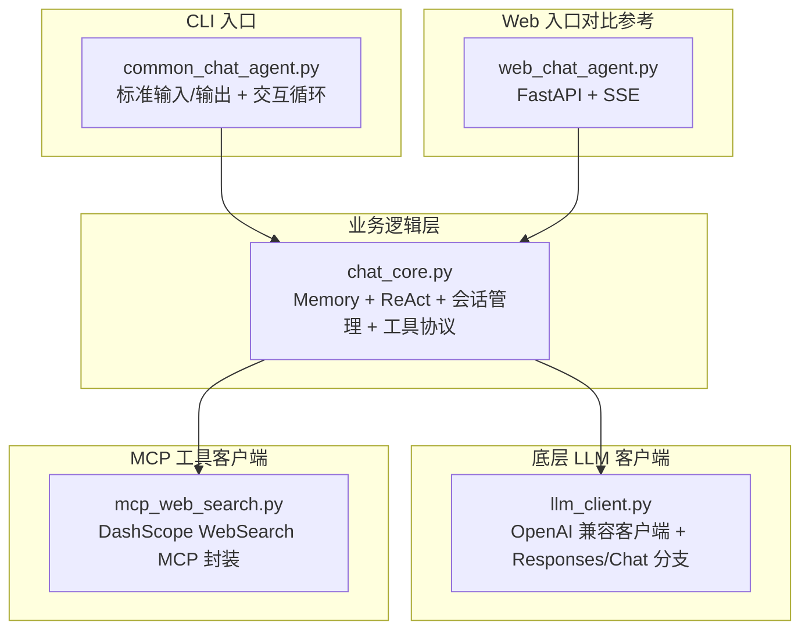
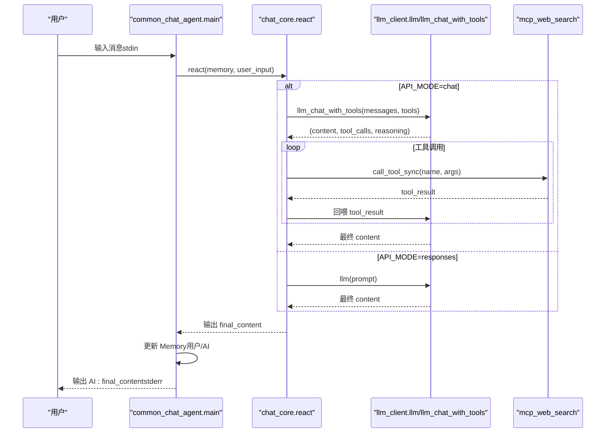
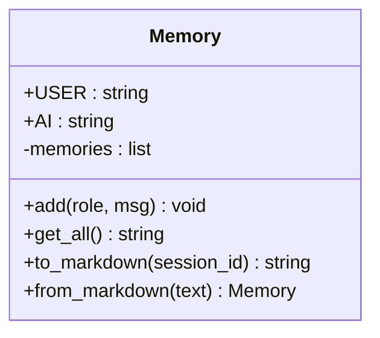
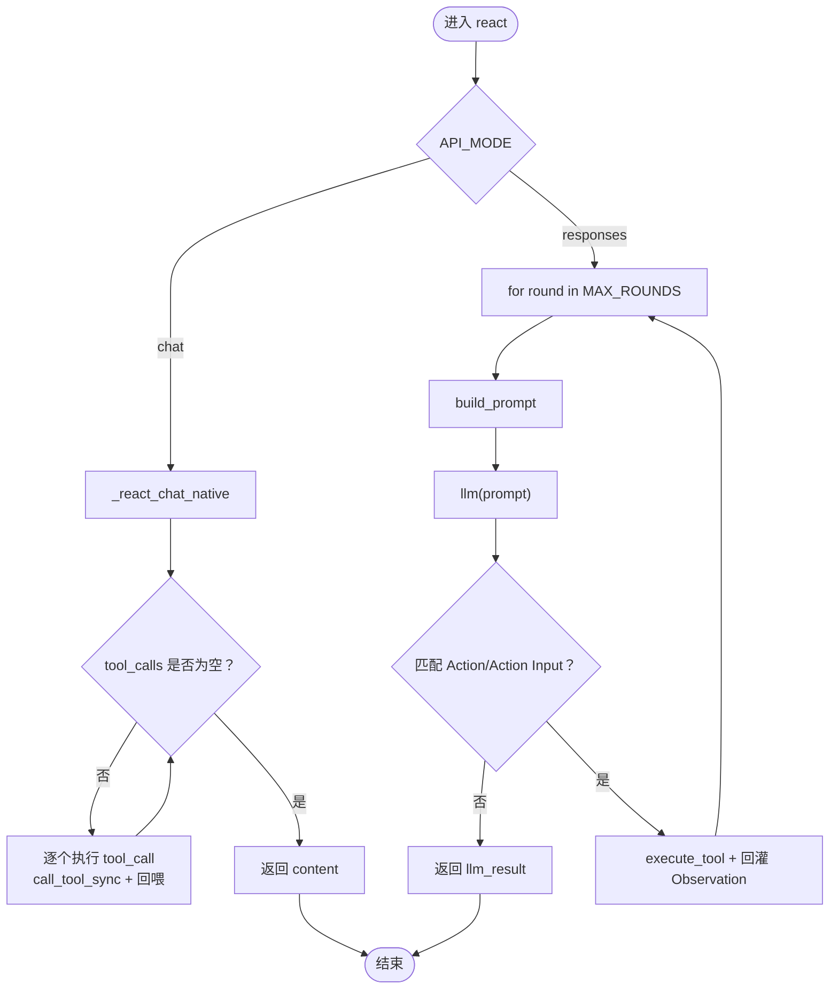
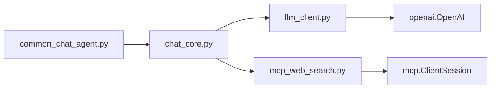

# CLI 入口

<cite>
**本文引用的文件**
- [README.md](file://README.md)
- [common_chat_agent.py](file://demo/common_chat_agent.py)
- [chat_core.py](file://demo/chat_core.py)
- [llm_client.py](file://demo/llm_client.py)
- [mcp_web_search.py](file://demo/mcp_web_search.py)
- [web_chat_agent.py](file://demo/web_chat_agent.py)
- [debug_responses.py](file://scripts/debug_responses.py)
</cite>

## 目录
1. [简介](#简介)
2. [项目结构](#项目结构)
3. [核心组件](#核心组件)
4. [架构总览](#架构总览)
5. [详细组件分析](#详细组件分析)
6. [依赖分析](#依赖分析)
7. [性能考虑](#性能考虑)
8. [故障排查指南](#故障排查指南)
9. [结论](#结论)
10. [附录](#附录)

## 简介
本文件聚焦 CLI 入口的设计与实现，系统性阐述以下主题：
- 标准输入输出处理机制（stdin/stdout）与交互循环
- 环境变量配置要求（DASHSCOPE_API_KEY、QWEN_MODEL、API_MODE）
- Memory 类的使用方式与多轮记忆持久化
- react 函数的调用流程与 ReAct 循环控制
- 用户输入处理与响应输出的完整过程
- 日志配置、错误处理与异常情况处理
- 性能优化建议与调试技巧

## 项目结构
本项目采用“入口模块 + 业务逻辑层 + 底层 LLM 客户端 + MCP 工具客户端”的分层设计，CLI 入口位于 demo/common_chat_agent.py，业务核心在 demo/chat_core.py，底层 LLM 客户端在 demo/llm_client.py，MCP 工具客户端在 demo/mcp_web_search.py。

图表来源
- [common_chat_agent.py:1-53](file://demo/common_chat_agent.py#L1-L53)
- [chat_core.py:1-1069](file://demo/chat_core.py#L1-L1069)
- [llm_client.py:1-924](file://demo/llm_client.py#L1-L924)
- [mcp_web_search.py:1-172](file://demo/mcp_web_search.py#L1-L172)
- [web_chat_agent.py:1-233](file://demo/web_chat_agent.py#L1-L233)

章节来源
- [README.md:44-57](file://README.md#L44-L57)
- [common_chat_agent.py:1-53](file://demo/common_chat_agent.py#L1-L53)

## 核心组件
- CLI 入口模块（common_chat_agent.py）
  - 负责环境变量校验、初始化日志、创建 Memory、读取用户输入、调用 react 并输出结果、维护 Memory
- 业务逻辑层（chat_core.py）
  - 提供 Memory、react、stream_agent_response、会话归档与读取、异常类型、工具协议等
- 底层 LLM 客户端（llm_client.py）
  - 提供 llm/llm_stream 与 llm_chat_with_tools/llm_stream_chat_with_tools，支持 responses 与 chat 两种模式
- MCP 工具客户端（mcp_web_search.py）
  - 提供 discover_tool_spec/call_tool_async/sync，封装 DashScope WebSearch MCP

章节来源
- [common_chat_agent.py:17-52](file://demo/common_chat_agent.py#L17-L52)
- [chat_core.py:138-193](file://demo/chat_core.py#L138-L193)
- [chat_core.py:920-951](file://demo/chat_core.py#L920-L951)
- [llm_client.py:113-122](file://demo/llm_client.py#L113-L122)
- [mcp_web_search.py:89-172](file://demo/mcp_web_search.py#L89-L172)

## 架构总览
CLI 入口通过标准输入读取用户消息，调用 chat_core.react 将 Memory 与最新输入送入 ReAct 循环，底层根据 API_MODE 路由到 responses 或 chat 路径。chat 模式下使用 native function calling + MCP 工具；responses 模式下使用内置 web_search 生命周期事件。

图表来源
- [common_chat_agent.py:34-48](file://demo/common_chat_agent.py#L34-L48)
- [chat_core.py:920-951](file://demo/chat_core.py#L920-L951)
- [llm_client.py:618-795](file://demo/llm_client.py#L618-L795)
- [mcp_web_search.py:167-172](file://demo/mcp_web_search.py#L167-L172)

## 详细组件分析

### CLI 入口：标准输入输出与交互循环
- 环境变量要求
  - DASHSCOPE_API_KEY：必填，用于构建底层 OpenAI 客户端
  - QWEN_MODEL：可选，默认模型名
  - API_MODE：可选，chat 或 responses（大小写不敏感），非法值在模块加载时报错
- 日志配置
  - 使用 logging.basicConfig 设置级别与格式
- 交互循环
  - 从 stdin 读取用户输入，遇到 EOF 或输入 exit 时退出
  - 调用 react(memory, user_input)，将 AI 输出写入 stderr
  - 将用户输入与 AI 输出分别追加到 Memory

章节来源
- [README.md:23-28](file://README.md#L23-L28)
- [README.md:30-35](file://README.md#L30-L35)
- [common_chat_agent.py:18-21](file://demo/common_chat_agent.py#L18-L21)
- [common_chat_agent.py:23-29](file://demo/common_chat_agent.py#L23-L29)
- [common_chat_agent.py:34-48](file://demo/common_chat_agent.py#L34-L48)

### Memory 类：多轮记忆与持久化
- 角色常量：USER/AI
- 方法
  - add(role, msg)：追加一条记忆
  - get_all()：拼接所有记忆为字符串
  - to_markdown(session_id)：序列化为 markdown，包含元信息与 turn 分隔
  - from_markdown(text)：从 markdown 反序列化，异常时返回空 Memory
- 用途
  - CLI 中每次交互后将用户输入与 AI 输出写入 Memory，供下一轮 prompt 拼装使用

图表来源
- [chat_core.py:138-193](file://demo/chat_core.py#L138-L193)

章节来源
- [chat_core.py:138-193](file://demo/chat_core.py#L138-L193)
- [common_chat_agent.py:31-48](file://demo/common_chat_agent.py#L31-L48)

### react 函数：ReAct 循环与工具调用
- API_MODE=chat
  - 使用 _react_chat_native：构建 messages，调用 llm_chat_with_tools 获取 content、tool_calls、reasoning_content
  - 顺序执行每个 tool_call，调用 mcp_web_search.call_tool_sync，将 tool_result 以 role=tool 回喂模型
  - 达到最大轮次或无 tool_calls 时返回最终 content
- API_MODE=responses
  - 使用 build_prompt 拼装 prompt，调用 llm(prompt) 获取最终文本
  - 通过 match_tool_action/parse_action_input/execute_tool 执行工具并回灌 Observation
  - 受 MAX_ROUNDS 保护

图表来源
- [chat_core.py:920-951](file://demo/chat_core.py#L920-L951)
- [chat_core.py:561-630](file://demo/chat_core.py#L561-L630)
- [llm_client.py:618-795](file://demo/llm_client.py#L618-L795)
- [mcp_web_search.py:167-172](file://demo/mcp_web_search.py#L167-L172)

章节来源
- [chat_core.py:920-951](file://demo/chat_core.py#L920-L951)
- [chat_core.py:561-630](file://demo/chat_core.py#L561-L630)
- [llm_client.py:618-795](file://demo/llm_client.py#L618-L795)
- [mcp_web_search.py:167-172](file://demo/mcp_web_search.py#L167-L172)

### LLM 客户端：Responses 与 Chat 路径
- 常量与环境变量
  - MODEL：默认 qwen3.7-max
  - API_MODE：responses（默认）或 chat，非法值在模块加载时报错
  - DASHSCOPE_API_KEY：必填
- 路由
  - llm(prompt)：根据 API_MODE 路由到 _llm_responses 或 _llm_chat
  - llm_chat_with_tools：同步 native function calling，返回 (content, tool_calls, reasoning_content)
- 错误处理
  - 嵌入式错误检测：上游 API 返回错误时抛 RuntimeError
  - 兜底策略：当无 delta 时从 response.output 抽取文本

章节来源
- [llm_client.py:34-51](file://demo/llm_client.py#L34-L51)
- [llm_client.py:113-122](file://demo/llm_client.py#L113-L122)
- [llm_client.py:618-795](file://demo/llm_client.py#L618-L795)

### MCP 工具客户端：WebSearch 工具发现与调用
- discover_tool_spec/call_tool_async/sync
  - discover_tool_spec_async：首次调用 list_tools，缓存 OpenAI 格式 spec
  - call_tool_async/sync：调用指定工具，失败返回 ERROR_PREFIX 前缀字符串
- 错误处理
  - 任何异常均转换为字符串返回，便于上层以 role=tool 回喂模型

章节来源
- [mcp_web_search.py:89-172](file://demo/mcp_web_search.py#L89-L172)

### Web 入口（对比参考）
- 用于理解 CLI 与 Web 的差异：Web 使用 SSE 流式事件，CLI 使用同步输出
- 有助于理解 chat 模式下的 native function calling 与工具事件

章节来源
- [web_chat_agent.py:1-233](file://demo/web_chat_agent.py#L1-L233)

## 依赖分析
- CLI 入口依赖
  - chat_core.Memory：用于多轮记忆
  - chat_core.react：ReAct 主循环
- 业务逻辑层依赖
  - llm_client：llm/llm_chat_with_tools
  - mcp_web_search：discover_tool_spec/call_tool_sync
- 底层 LLM 客户端依赖
  - openai.OpenAI：DashScope 兼容模式
- MCP 工具客户端依赖
  - mcp.ClientSession：DashScope WebSearch MCP

图表来源
- [common_chat_agent.py:13-14](file://demo/common_chat_agent.py#L13-L14)
- [chat_core.py:26-34](file://demo/chat_core.py#L26-L34)
- [llm_client.py:25](file://demo/llm_client.py#L25)
- [mcp_web_search.py:16](file://demo/mcp_web_search.py#L16)

章节来源
- [common_chat_agent.py:13-14](file://demo/common_chat_agent.py#L13-L14)
- [chat_core.py:26-34](file://demo/chat_core.py#L26-L34)
- [llm_client.py:25](file://demo/llm_client.py#L25)
- [mcp_web_search.py:16](file://demo/mcp_web_search.py#L16)

## 性能考虑
- 流式输出与日志
  - CLI 使用同步输出，stderr 用于提示信息，stdout 用于最终 AI 回复，避免干扰
- 模型与工具调用
  - chat 模式 native function calling 可减少字符串协议解析成本，适合 CLI 场景
  - 工具调用失败返回字符串，避免异常传播影响 CLI 交互
- 轮次限制
  - MAX_ROUNDS 限制 ReAct 轮次，防止无限 token 消耗
- 日志级别
  - INFO 级别记录关键事件，便于定位问题且不影响交互流畅性

[本节为通用性能建议，不直接分析具体文件]

## 故障排查指南
- 环境变量未配置
  - DASHSCOPE_API_KEY 未设置时，CLI 会在 stderr 输出提示并退出
- API_MODE 非法
  - 模块加载时校验，非法值抛出 RuntimeError
- LLM 响应异常
  - llm_client 在嵌入式错误或响应失败时抛出 RuntimeError
- MCP 工具调用失败
  - mcp_web_search 将异常转换为字符串返回，便于模型恢复
- 调试脚本
  - scripts/debug_responses.py 可直接观察 responses 流式事件类型，辅助定位空响应问题

章节来源
- [common_chat_agent.py:23-29](file://demo/common_chat_agent.py#L23-L29)
- [llm_client.py:46-51](file://demo/llm_client.py#L46-L51)
- [llm_client.py:168-205](file://demo/llm_client.py#L168-L205)
- [mcp_web_search.py:146-148](file://demo/mcp_web_search.py#L146-L148)
- [debug_responses.py:1-43](file://scripts/debug_responses.py#L1-L43)

## 结论
CLI 入口通过简洁的交互循环与稳定的日志配置，将 chat_core 的 ReAct 能力暴露为可直接使用的命令行工具。其设计遵循“入口薄、核心厚”的原则：入口仅负责 IO 与循环，业务逻辑集中在 chat_core，底层细节由 llm_client 与 mcp_web_search 抽象。配合环境变量与轮次保护，CLI 在易用性与稳定性之间取得良好平衡。

[本节为总结性内容，不直接分析具体文件]

## 附录

### 使用示例（环境变量、启动与交互）
- 设置环境变量
  - export DASHSCOPE_API_KEY=sk-xxx
  - export QWEN_MODEL=qwen-plus（可选）
- 启动 CLI
  - python demo/common_chat_agent.py
- 交互流程
  - 在 stdin 输入消息，AI 回复输出至 stderr
  - 输入 exit 或 Ctrl+D 退出

章节来源
- [README.md:23-35](file://README.md#L23-L35)
- [common_chat_agent.py:31-42](file://demo/common_chat_agent.py#L31-L42)

### 重要配置与常量
- 环境变量
  - DASHSCOPE_API_KEY：必填
  - QWEN_MODEL：可选，默认模型名
  - API_MODE：可选，chat 或 responses
- 常量
  - MAX_ROUNDS：ReAct 最大轮次
  - TOOL_RESULT_PREVIEW_CHARS：工具结果预览长度

章节来源
- [llm_client.py:34-51](file://demo/llm_client.py#L34-L51)
- [chat_core.py:46-50](file://demo/chat_core.py#L46-L50)