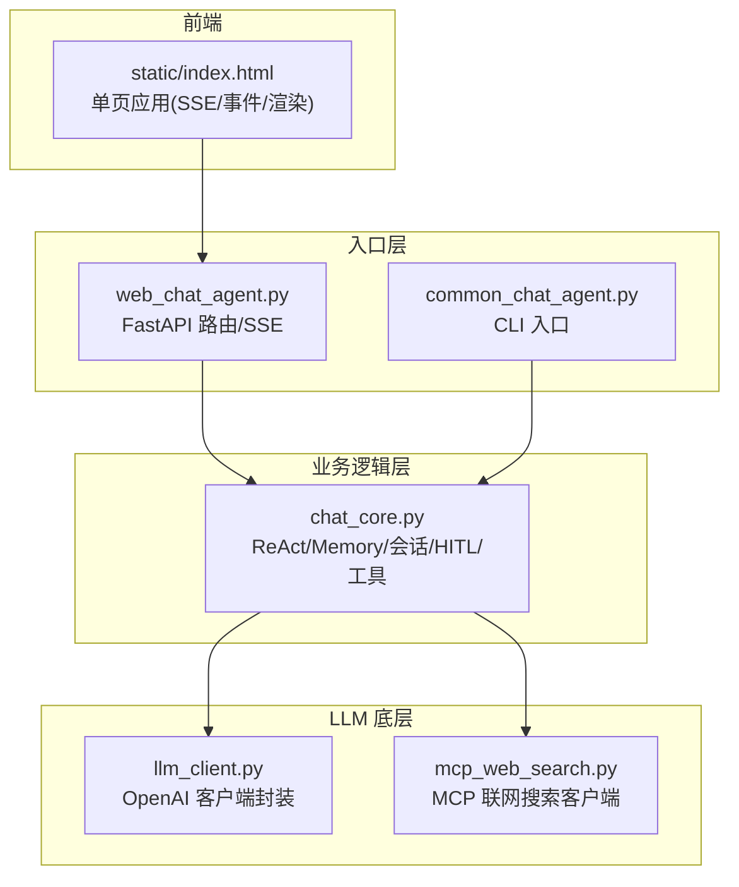
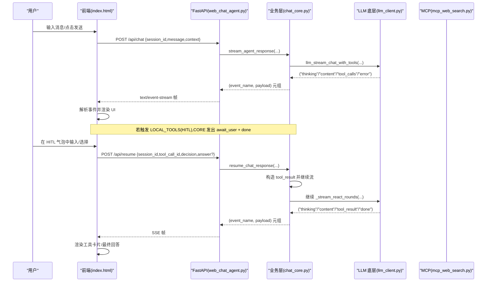
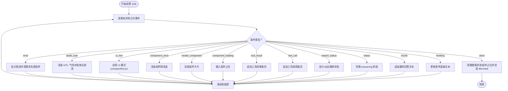
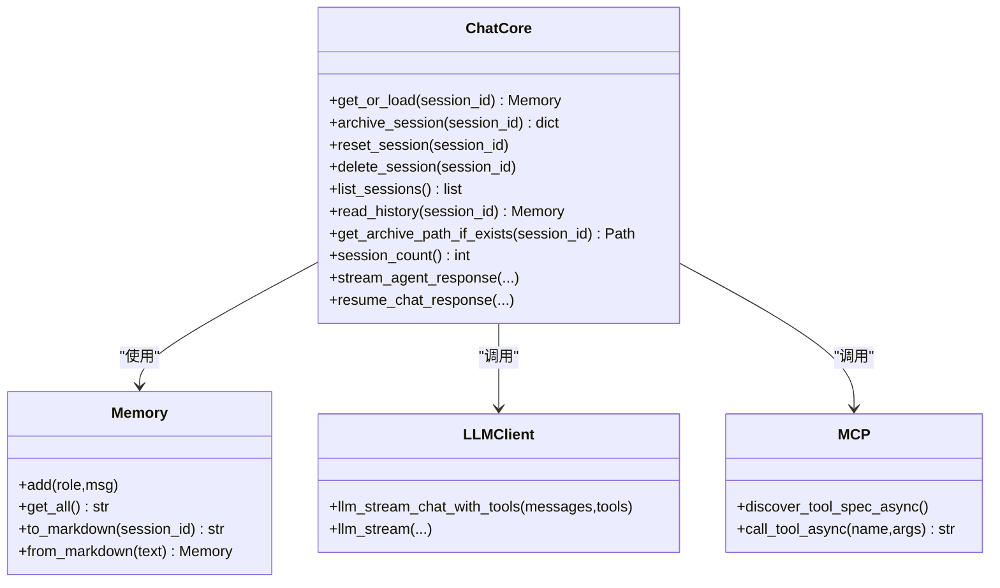
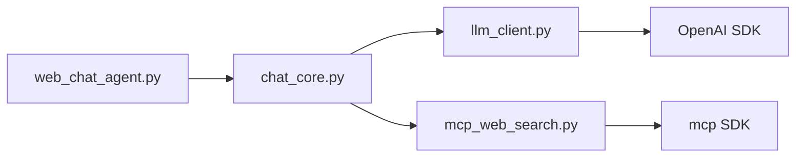

# Web 入口

<cite>
**本文引用的文件**
- [README.md](file://README.md)
- [CLAUDE.md](file://CLAUDE.md)
- [requirements.txt](file://requirements.txt)
- [demo/web_chat_agent.py](file://demo/web_chat_agent.py)
- [demo/chat_core.py](file://demo/chat_core.py)
- [demo/llm_client.py](file://demo/llm_client.py)
- [demo/mcp_web_search.py](file://demo/mcp_web_search.py)
- [demo/common_chat_agent.py](file://demo/common_chat_agent.py)
- [demo/static/index.html](file://demo/static/index.html)
</cite>

## 目录
1. [简介](#简介)
2. [项目结构](#项目结构)
3. [核心组件](#核心组件)
4. [架构总览](#架构总览)
5. [详细组件分析](#详细组件分析)
6. [依赖分析](#依赖分析)
7. [性能考量](#性能考量)
8. [故障排查指南](#故障排查指南)
9. [结论](#结论)
10. [附录](#附录)

## 简介
本文件面向 Web 入口，系统性阐述基于 FastAPI 的 Web 服务实现，涵盖路由设计、SSE（Server-Sent Events）流式响应机制、会话管理与实时通信处理。文档同时深入解释前端 HTML 页面的结构设计、JavaScript 事件处理逻辑、DOM 操作与用户交互实现，并说明 Web 聊天代理如何与后端 ReAct 核心进行数据交换，包括消息传递、状态管理与错误处理。最后提供完整的部署指南、配置选项与前端自定义方法，并给出安全考虑、性能优化与监控方案。

## 项目结构
该项目采用三层模块化分层：
- 入口层（HTTP/CLI）：FastAPI Web 入口与 CLI 入口，负责路由、参数校验、SSE 序列化与异常翻译。
- 业务逻辑层（ReAct + 会话 + 工具）：统一的 ReAct 循环、Memory 序列化、会话持久化、HITL（人机协作）与工具调度。
- LLM 底层：OpenAI 兼容客户端封装，支持 Responses API 与 Chat Completions + native function calling 两种模式。

图表来源
- [demo/web_chat_agent.py:1-233](file://demo/web_chat_agent.py#L1-L233)
- [demo/chat_core.py:1-1068](file://demo/chat_core.py#L1-L1068)
- [demo/llm_client.py:1-924](file://demo/llm_client.py#L1-L924)
- [demo/mcp_web_search.py:1-172](file://demo/mcp_web_search.py#L1-L172)
- [demo/static/index.html:1-1978](file://demo/static/index.html#L1-L1978)

章节来源
- [README.md:44-57](file://README.md#L44-L57)
- [CLAUDE.md:28-52](file://CLAUDE.md#L28-L52)

## 核心组件
- FastAPI Web 入口：提供静态页面、健康检查、聊天流、HITL 恢复、会话管理等 API。
- SSE 流式响应：将业务层抽象事件转换为标准 SSE 文本帧，前端按事件类型渲染 UI。
- 会话管理：基于 UUID 的会话标识、内存缓存与磁盘归档、列表查询、删除与重置。
- ReAct 核心：统一的 ReAct 循环、工具解析与执行、上下文感知、HITL 中断与恢复。
- LLM 客户端：Responses API 与 Chat Completions 两种模式，分别支持内置 web_search 与 native function calling。
- MCP 联网搜索：通过 DashScope WebSearch MCP server 提供联网搜索能力。
- 前端单页应用：SSE 事件消费、Thinking 面板、工具调用条、HITL 气泡、归档预览与锚点导航。

章节来源
- [demo/web_chat_agent.py:117-227](file://demo/web_chat_agent.py#L117-L227)
- [demo/chat_core.py:138-350](file://demo/chat_core.py#L138-L350)
- [demo/llm_client.py:113-800](file://demo/llm_client.py#L113-L800)
- [demo/mcp_web_search.py:89-172](file://demo/mcp_web_search.py#L89-L172)
- [demo/static/index.html:881-1978](file://demo/static/index.html#L881-L1978)

## 架构总览
Web 入口通过 FastAPI 路由接收请求，调用 chat_core 的流式 ReAct 生成器，将抽象事件序列化为 SSE 文本帧返回给浏览器。前端通过 EventSource 或 fetch + ReadableStream 读取事件，按事件类型更新 UI。HITL（人机协作）通过 await_user 事件触发前端气泡，用户操作后 POST /api/resume 启动新流继续 ReAct。

图表来源
- [demo/web_chat_agent.py:127-167](file://demo/web_chat_agent.py#L127-L167)
- [demo/chat_core.py:632-800](file://demo/chat_core.py#L632-L800)
- [demo/llm_client.py:633-800](file://demo/llm_client.py#L633-L800)
- [demo/mcp_web_search.py:127-172](file://demo/mcp_web_search.py#L127-L172)
- [demo/static/index.html:1557-1744](file://demo/static/index.html#L1557-L1744)

## 详细组件分析

### FastAPI 路由与 SSE 序列化
- 路由职责
  - GET /：返回静态 index.html。
  - GET /api/health：返回模型与会话计数。
  - POST /api/chat：启动 ReAct 流，返回 text/event-stream。
  - POST /api/resume：HITL 恢复，启动新流继续 ReAct。
  - POST /api/reset：重置当前会话（内存+归档）。
  - POST /api/archive：覆盖式归档当前会话。
  - GET /api/history：返回会话历史。
  - GET /api/sessions：列出归档会话。
  - DELETE /api/sessions/{session_id}：删除会话。
  - GET /api/sessions/{session_id}/raw：返回归档原始 markdown。
- 参数模型
  - ChatRequest：session_id、message、context（可选）。
  - ResetRequest/ArchiveRequest：session_id。
  - ResumeRequest：session_id、tool_call_id、decision（answer/approve/reject）、answer（可选）。
- SSE 序列化
  - 将 (event_name, payload) 元组序列化为 "event: {name}\ndata: {json}\n\n"。
  - 设置 Cache-Control: no-cache 与 X-Accel-Buffering: no，确保浏览器实时接收。

章节来源
- [demo/web_chat_agent.py:66-95](file://demo/web_chat_agent.py#L66-L95)
- [demo/web_chat_agent.py:101-111](file://demo/web_chat_agent.py#L101-L111)
- [demo/web_chat_agent.py:117-227](file://demo/web_chat_agent.py#L117-L227)

### SSE 事件契约与前端消费
- 事件类型与负载
  - status：{phase: "thinking"|"answering", round}
  - thinking：{text}
  - chunk：{text}
  - search_status：{phase: "in_progress"|"searching"|"completed"}（responses 模式）
  - tool_call：{name, args}
  - tool_result：{name, result}
  - await_user：{tool_call_id, name, args, kind: "input"|"approval"}
  - ui_hint：{mode: "focus"|"compact"|"chat"}
  - done：{}
  - error：{message}
  - component_loading/render_component/component_error：用于工具结果卡片化（chat 模式 + 注册工具）
- 前端消费流程
  - send() 发起 /api/chat，获取响应流并用 getReader() 读取。
  - consumeStream() 解析块，按事件类型更新 Thinking 面板、工具条、搜索状态、Mermaid 渲染、HITL 气泡与最终回答。
  - await_user 事件后，前端渲染 HITL 气泡，用户操作后调用 /api/resume 启动新流。
  - done 事件后清理未完成的组件占位，必要时显示“等待用户操作…”占位。

图表来源
- [demo/static/index.html:1412-1527](file://demo/static/index.html#L1412-L1527)
- [demo/web_chat_agent.py:101-111](file://demo/web_chat_agent.py#L101-L111)

章节来源
- [CLAUDE.md:176-195](file://CLAUDE.md#L176-L195)
- [demo/static/index.html:1412-1527](file://demo/static/index.html#L1412-L1527)

### ReAct 核心与会话管理
- ReAct 循环
  - chat 模式 native function calling：通过 llm_stream_chat_with_tools 获取增量 reasoning/content/tool_calls，按轮次执行工具调用，支持 reasoning_content 跨轮保留。
  - responses 模式文本协议：通过 llm_stream 获取 thinking/content/search_status，结合 Action:/Action Input: 解析与工具执行。
- Memory 与会话持久化
  - Memory：以 role/msg 列表存储，支持 to_markdown/from_markdown 序列化。
  - 会话存储：基于 data/chat_archive/{session_id}.md，原子写入，正则校验 session_id 防路径注入。
  - 会话操作：get_or_load、archive_session、reset_session、delete_session、list_sessions、read_history、get_archive_path_if_exists、session_count。
- HITL（人机协作）
  - LOCAL_TOOLS：ask_user（输入）、execute_shell_command（审批）。
  - _PENDING：模块级挂起表，保存恢复点；await_user 事件后立刻 done 关流，等待 /api/resume。
  - resume_chat_response：校验 session_id/PendingNotFound/PendingMismatch，构造 tool_result 并继续流。

图表来源
- [demo/chat_core.py:138-350](file://demo/chat_core.py#L138-L350)
- [demo/chat_core.py:632-800](file://demo/chat_core.py#L632-L800)
- [demo/llm_client.py:633-800](file://demo/llm_client.py#L633-L800)
- [demo/mcp_web_search.py:89-172](file://demo/mcp_web_search.py#L89-L172)

章节来源
- [demo/chat_core.py:138-350](file://demo/chat_core.py#L138-L350)
- [demo/chat_core.py:632-800](file://demo/chat_core.py#L632-L800)
- [demo/llm_client.py:633-800](file://demo/llm_client.py#L633-L800)
- [demo/mcp_web_search.py:89-172](file://demo/mcp_web_search.py#L89-L172)

### LLM 客户端与 MCP 联网搜索
- LLM 客户端
  - API_MODE：responses（Responses API + 内置 web_search lifecycle）或 chat（Chat Completions + native function calling + MCP）。
  - llm_stream_chat_with_tools：异步流式，产出 ("thinking", text)、("content", text)、("tool_calls", list)、("error", message)。
  - llm_stream：responses 模式下产出 ("thinking", text)、("content", text)、("search_status", phase)、("error", message)。
- MCP 联网搜索
  - discover_tool_spec_async：一次性发现工具规范并缓存。
  - call_tool_async：短连接调用工具，失败返回错误字符串，不抛异常。

章节来源
- [demo/llm_client.py:34-51](file://demo/llm_client.py#L34-L51)
- [demo/llm_client.py:633-800](file://demo/llm_client.py#L633-L800)
- [demo/mcp_web_search.py:89-172](file://demo/mcp_web_search.py#L89-L172)

### 前端 HTML 页面与 JavaScript 事件处理
- 页面结构
  - 三栏布局：左侧会话列表、中间主聊天区、右侧锚点导航；全屏归档预览模态。
  - 头部：当前 session_id 显示、复制、预览归档、归档/重置按钮。
  - 聊天区：Thinking 面板、工具条、搜索状态横幅、最终回答区域。
- DOM 操作与交互
  - 自适应高度文本域、滚动到底部、Mermaid 惰性加载与渲染。
  - 锚点面板：IntersectionObserver 高亮当前阅读位置，点击平滑滚动并闪动定位。
  - 归档预览：渲染/源码双标签页，复制与下载。
- 事件处理
  - Enter 发送、Shift+Enter 换行、Cmd/Ctrl+Enter 提交 HITL。
  - 收集 viewport_width、selected_text、session_message_count 作为上下文。
  - applyUiHint 根据 ui_hint 切换 compact/focus 模式。

章节来源
- [demo/static/index.html:800-1200](file://demo/static/index.html#L800-L1200)
- [demo/static/index.html:1200-1600](file://demo/static/index.html#L1200-L1600)
- [demo/static/index.html:1600-1978](file://demo/static/index.html#L1600-L1978)

## 依赖分析
- 外部依赖
  - FastAPI、Uvicorn：Web 服务器与 ASGI。
  - OpenAI SDK：调用 DashScope OpenAI 兼容网关。
  - mcp：DashScope WebSearch MCP 客户端。
- 内部模块耦合
  - web_chat_agent 仅导入 chat_core 的公开接口，不直接依赖 llm_client/mcp_web_search。
  - chat_core 仅依赖 llm_client 与 mcp_web_search 的抽象接口，不依赖 FastAPI。
  - llm_client 与 mcp_web_search 互不依赖，均不依赖上层框架。

图表来源
- [demo/web_chat_agent.py:29-46](file://demo/web_chat_agent.py#L29-L46)
- [demo/chat_core.py:26-34](file://demo/chat_core.py#L26-L34)
- [demo/llm_client.py:25](file://demo/llm_client.py#L25)
- [demo/mcp_web_search.py:16](file://demo/mcp_web_search.py#L16)

章节来源
- [requirements.txt:1-5](file://requirements.txt#L1-L5)
- [CLAUDE.md:40-46](file://CLAUDE.md#L40-L46)

## 性能考量
- 流式渲染
  - SSE 增量事件即时渲染，避免一次性拼接大量 DOM，提升首屏与滚动性能。
- 事件粒度
  - 将 reasoning/content/tool_calls/seach_status 等拆分为独立事件，前端可按需更新 UI，减少重绘。
- 组件惰性渲染
  - Mermaid 仅在需要时加载与渲染，避免阻塞主线程。
- 会话归档
  - 归档采用原子写入（.tmp + replace），避免崩溃产生半文件，降低 IO 抖动。
- 模型调用
  - responses 模式下内置 web_search lifecycle 事件，chat 模式下通过 tool_call/tool_result 事件承载，前端工具条显式渲染，避免 UI 隐式状态。

[本节为通用指导，无需特定文件引用]

## 故障排查指南
- 常见错误与处理
  - invalid session_id：HTTP 400，检查 session_id 格式与磁盘路径。
  - no pending HITL for session：HTTP 404，HITL 已过期或已被新聊天清理。
  - tool_call_id mismatch：HTTP 409，前端使用了过期的 await_user 气泡。
  - upstream API 错误：LLM 层检测嵌入式错误 chunk，返回 error 事件，前端显示错误并清理未完成组件。
- 日志与诊断
  - 后端 INFO 级日志记录 LLM 调用参数、事件类型计数、usage 等，便于定位问题。
  - 前端 showToast 输出网络/HTTP 错误与用户提示。
- 会话一致性
  - 切换会话时灰化未决 HITL 气泡，避免前端状态与后端 _PENDING 不一致。
  - reset/archive/delete 等操作后刷新会话列表与历史。

章节来源
- [demo/web_chat_agent.py:143-167](file://demo/web_chat_agent.py#L143-L167)
- [demo/llm_client.py:170-176](file://demo/llm_client.py#L170-L176)
- [demo/static/index.html:1015-1021](file://demo/static/index.html#L1015-L1021)

## 结论
本 Web 入口以清晰的三层分层与严格的抽象边界，实现了稳定的 ReAct 聊天体验。FastAPI 路由与 SSE 事件契约使前后端解耦，前端通过事件驱动渲染，具备良好的扩展性。会话管理与磁盘归档保障了数据持久化与一致性，HITL 机制在不引入真实风险的前提下演示了人机协作流程。通过合理配置与前端自定义，可进一步满足不同场景需求。

[本节为总结，无需特定文件引用]

## 附录

### 部署指南
- 环境准备
  - Python 虚拟环境与依赖安装：参考 requirements.txt。
  - 环境变量
    - DASHSCOPE_API_KEY：必填。
    - QWEN_MODEL：可选，默认 qwen3.7-max（Responses API + 内置 web_search 推荐）。
    - API_MODE：可选，responses（默认）或 chat（Chat Completions + native function calling + MCP）。
- 启动方式
  - Web：python demo/web_chat_agent.py，访问 http://127.0.0.1:8000。
  - CLI：python demo/common_chat_agent.py，在终端交互。
- 生产部署建议
  - 使用 Nginx/Uvicorn/Supervisor 等组合部署，启用 HTTPS 与限流。
  - 将 data/chat_archive 放置于持久化卷，确保原子写入与权限控制。
  - 前端静态资源可由 Nginx 提供，SSE 由后端直连。

章节来源
- [README.md:13-42](file://README.md#L13-L42)
- [CLAUDE.md:13-26](file://CLAUDE.md#L13-L26)

### 配置选项
- 环境变量
  - DASHSCOPE_API_KEY：LLM 访问密钥。
  - QWEN_MODEL：模型名称（默认 qwen3.7-max）。
  - API_MODE：responses 或 chat。
- SSE 事件
  - 前端按事件类型渲染 UI，支持 search_status（responses 模式）、tool_call/tool_result、component_loading/render_component/component_error、await_user、ui_hint、done、error。
- 会话与持久化
  - 会话 ID 校验正则 ^[0-9a-f-]{36}$，归档文件位于 data/chat_archive/{session_id}.md，原子写入。

章节来源
- [demo/web_chat_agent.py:53-58](file://demo/web_chat_agent.py#L53-L58)
- [demo/chat_core.py:228-231](file://demo/chat_core.py#L228-L231)
- [CLAUDE.md:161-175](file://CLAUDE.md#L161-L175)

### 前端自定义方法
- 添加自定义工具（chat 模式 native function calling）
  - 在 mcp_web_search.py 中扩展工具发现或在 _build_native_tools[_async] 合并本地工具，前端无需改动。
- 添加自定义工具（responses 模式文本协议）
  - 在 chat_core.py 的 TOOLS 中添加工具描述，实现 execute_tool 分支，前端自动识别 Action:/Action Input: 事件。
- 工具结果卡片化（Static GenUI）
  - 在 chat_core.TOOL_COMPONENT_MAP 注册工具名与组件类型。
  - 在 chat_core._build_component_props 构建 props。
  - 在前端 COMPONENT_RENDERERS 中实现渲染器。
- UI 模式与上下文感知
  - 通过 ui_hint 事件切换 compact/focus 模式，前端 applyUiHint 应用样式类。
- 安全与 XSS
  - LLM 产物经 DOMPurify + marked 渲染；用户输入仅 textContent，避免 Markdown 解析。

章节来源
- [CLAUDE.md:202-221](file://CLAUDE.md#L202-L221)
- [demo/static/index.html:931-953](file://demo/static/index.html#L931-L953)
- [demo/chat_core.py:531-559](file://demo/chat_core.py#L531-L559)