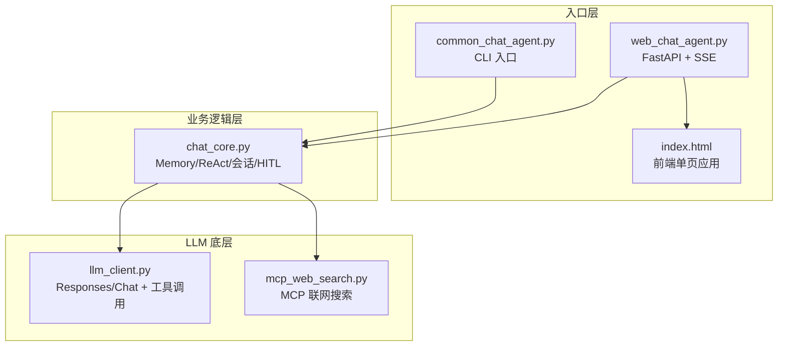
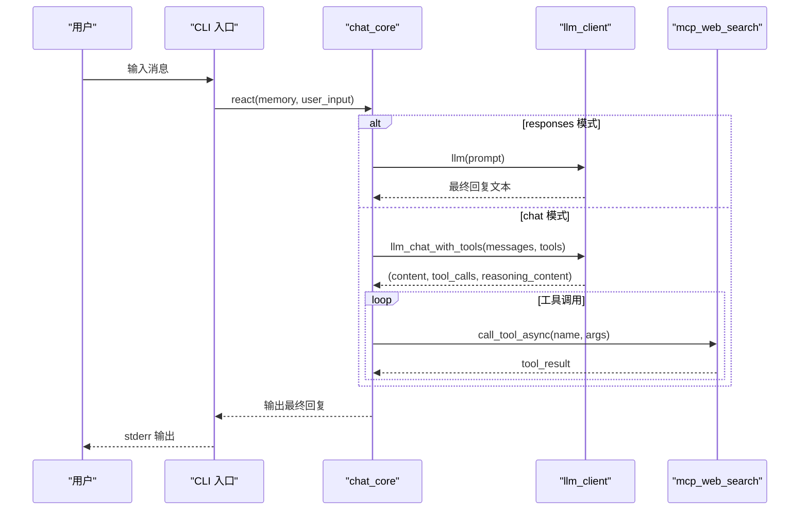
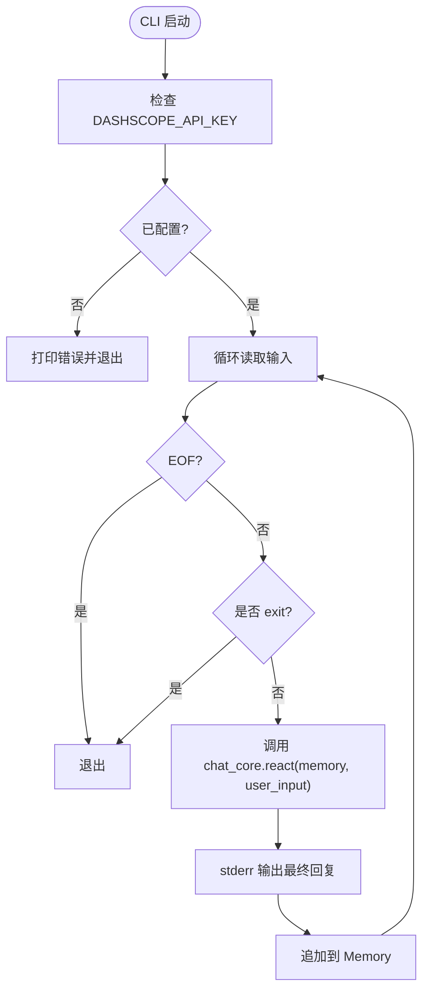
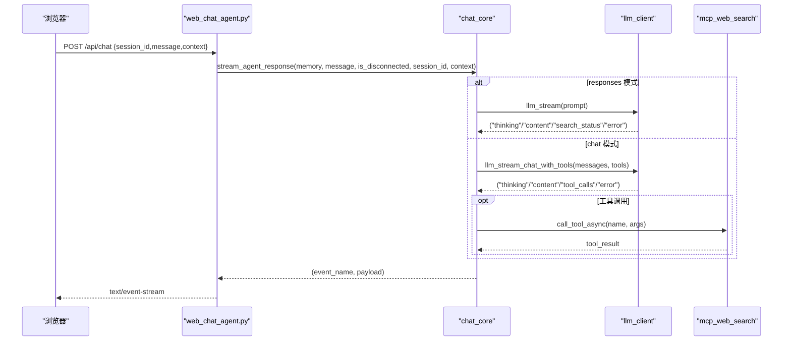
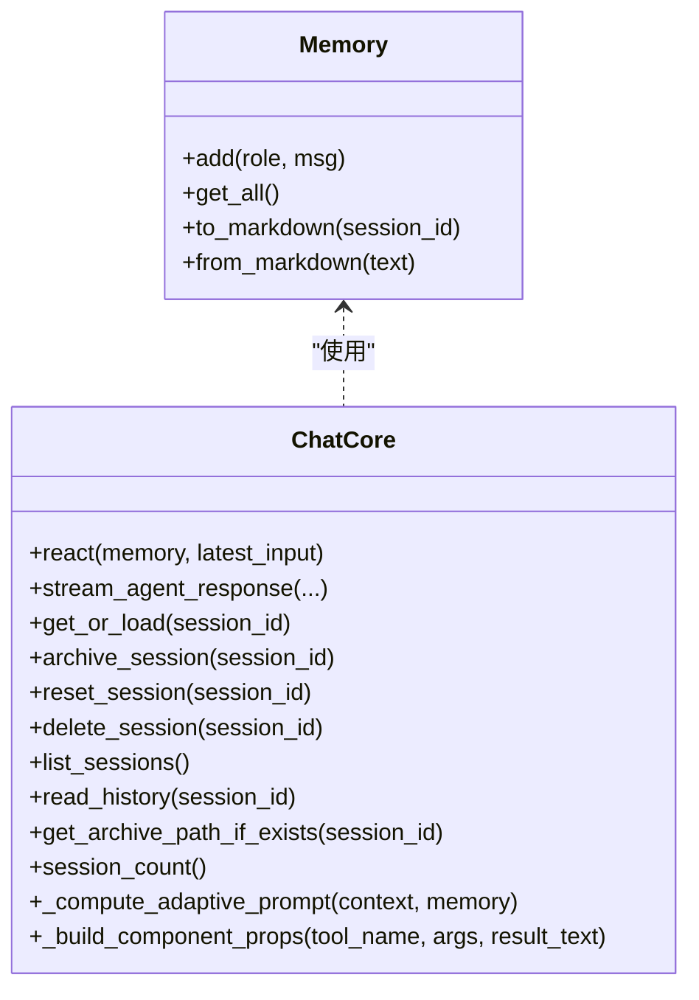
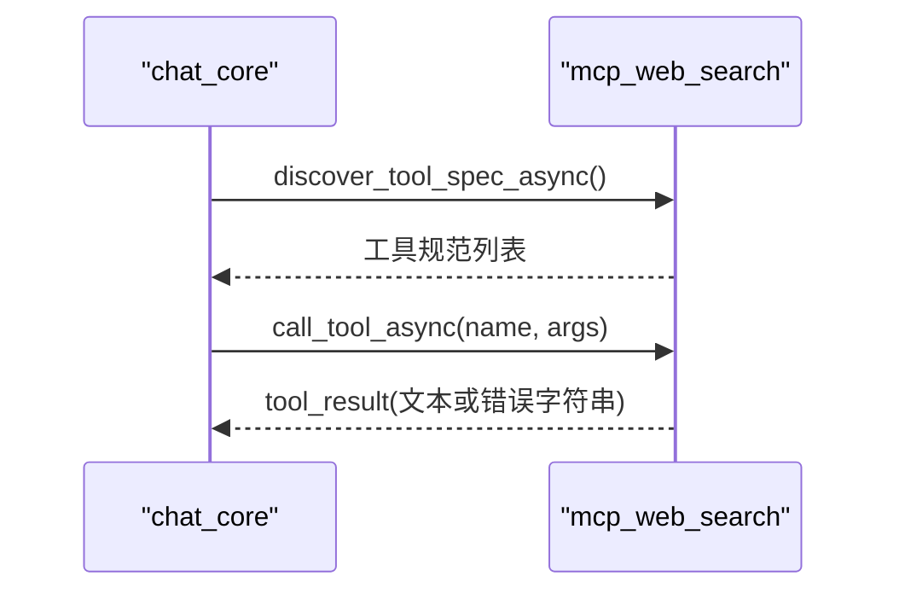
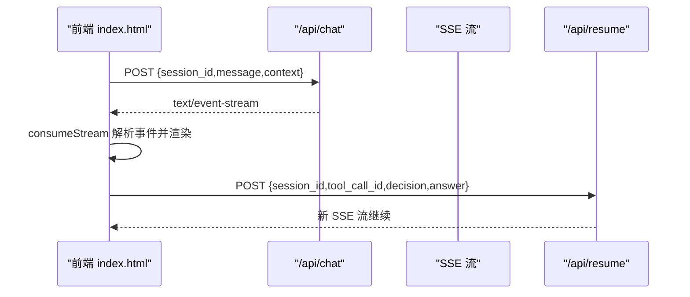
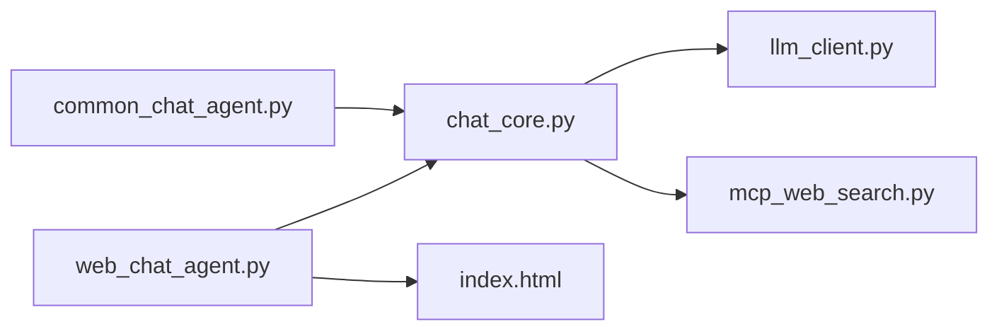

# 入口点实现

<cite>
**本文引用的文件**
- [README.md](file://README.md)
- [common_chat_agent.py](file://demo/common_chat_agent.py)
- [web_chat_agent.py](file://demo/web_chat_agent.py)
- [chat_core.py](file://demo/chat_core.py)
- [llm_client.py](file://demo/llm_client.py)
- [mcp_web_search.py](file://demo/mcp_web_search.py)
- [index.html](file://demo/static/index.html)
- [requirements.txt](file://requirements.txt)
- [CLAUDE.md](file://CLAUDE.md)
</cite>

## 目录
1. [简介](#简介)
2. [项目结构](#项目结构)
3. [核心组件](#核心组件)
4. [架构总览](#架构总览)
5. [详细组件分析](#详细组件分析)
6. [依赖关系分析](#依赖关系分析)
7. [性能考量](#性能考量)
8. [故障排除指南](#故障排除指南)
9. [结论](#结论)
10. [附录](#附录)

## 简介
本项目提供了一个 ReAct（Thought-Action-Observation）聊天 Agent 的教学演示，采用“最小代码”原则，清晰展示 ReAct 循环、Prompt 模板、工具调用解析与最大轮次保护。后端通过 OpenAI Python SDK 调通义千问（DashScope OpenAI-Compat 网关），同时提供 CLI 和 Web 两种入口，二者共享同一 ReAct 内核，确保行为一致性与教学连贯性。

- CLI 入口：从标准输入读取用户消息，调用 ReAct 内核，将最终回复输出到标准错误，支持退出指令。
- Web 入口：基于 FastAPI + SSE，提供流式响应、HITL（人机协作）中断与恢复、静态生成 UI（工具结果卡片化）、会话持久化与归档预览等完整前端体验。

## 项目结构
项目采用三层分层架构，严格向下导入，职责清晰：
- 入口层（HTTP/CLI）：负责参数校验、SSE 序列化、路由与异常翻译，不包含业务逻辑。
- 业务逻辑层（chat_core）：包含 Memory、ReAct 循环、会话存储、HITL 基础设施、上下文感知等核心业务。
- LLM 底层（llm_client + mcp_web_search）：负责模型调用、流式事件解析、工具发现与调用。



图表来源
- [common_chat_agent.py:1-53](file://demo/common_chat_agent.py#L1-L53)
- [web_chat_agent.py:1-233](file://demo/web_chat_agent.py#L1-L233)
- [chat_core.py:1-1069](file://demo/chat_core.py#L1-L1069)
- [llm_client.py:1-924](file://demo/llm_client.py#L1-L924)
- [mcp_web_search.py:1-172](file://demo/mcp_web_search.py#L1-L172)
- [index.html:1-1976](file://demo/static/index.html#L1-L1976)

章节来源
- [README.md:44-57](file://README.md#L44-L57)
- [CLAUDE.md:28-53](file://CLAUDE.md#L28-L53)

## 核心组件
- CLI 入口（common_chat_agent.py）
  - 从环境变量读取 API Key，校验后进入循环，读取一行用户输入，调用 chat_core.react(memory, user_input)，将最终回复输出到 stderr，并追加到 Memory。
  - 支持 exit 退出指令，输入 EOF 时优雅退出。
- Web 入口（web_chat_agent.py）
  - FastAPI 路由：/api/chat（SSE）、/api/resume（HITL 恢复）、/api/reset、/api/archive、/api/history、/api/sessions、/api/sessions/{id}/raw。
  - SSE 序列化：将 chat_core 返回的 (event_name, payload) 元组转换为标准 SSE 文本帧。
  - 参数模型：ChatRequest、ResetRequest、ArchiveRequest、ResumeRequest。
- 业务核心（chat_core.py）
  - Memory：对话记忆的增删改查与序列化/反序列化。
  - ReAct：文本协议（responses 模式）与 native function calling（chat 模式）双路径。
  - 会话存储：内存缓存 + 磁盘归档（markdown），支持列表、读取、删除、重置、统计。
  - HITL：LOCAL_TOOLS（ask_user、execute_shell_command）触发中断，写入 _PENDING，等待 /api/resume 恢复。
  - 上下文感知：根据前端上报的上下文（选中文本、消息数量、视口宽度）调整 system prompt 与 UI 模式。
- LLM 底层（llm_client.py）
  - API_MODE：responses（Responses API + 内置 web_search 生命周期事件）与 chat（Chat Completions + native function calling + MCP）。
  - 流式事件：("thinking", text)、("content", text)、("search_status", phase)、("tool_calls", list)、("error", message)。
  - 两类入口：llm()/llm_stream()（CLI/Responses）与 llm_chat_with_tools()/llm_stream_chat_with_tools()（Web/Chat + native tools）。
- MCP 客户端（mcp_web_search.py）
  - discover_tool_spec[_async]：一次性读取 MCP 工具规范并缓存。
  - call_tool_async/call_tool_sync：短连接调用工具，失败返回错误字符串，不抛异常。
- 前端（index.html）
  - 单页应用：左侧会话列表、中间聊天区、右侧锚点导航、归档预览模态。
  - SSE 流消费：consumeStream 解析事件，渲染思考面板、工具条、搜索状态、静态生成 UI 卡片。
  - HITL：await_user 事件触发气泡，用户提交后 POST /api/resume 启动新流继续。

章节来源
- [common_chat_agent.py:17-50](file://demo/common_chat_agent.py#L17-L50)
- [web_chat_agent.py:69-227](file://demo/web_chat_agent.py#L69-L227)
- [chat_core.py:138-350](file://demo/chat_core.py#L138-L350)
- [llm_client.py:30-52](file://demo/llm_client.py#L30-L52)
- [mcp_web_search.py:89-172](file://demo/mcp_web_search.py#L89-L172)
- [index.html:881-1976](file://demo/static/index.html#L881-L1976)

## 架构总览
两条 ReAct 路径共享同一事件契约，前端零分支：
- responses 模式：Responses API 流式返回 thinking/content/search_status，chat_core.stream_agent_response 聚合为 (event_name, payload)。
- chat 模式：Chat Completions + native function calling，llm_stream_chat_with_tools 返回 ("thinking", text)、("content", text)、("tool_calls", list)、("error", message)，chat_core._stream_react_rounds 负责工具派发与 HITL 中断。



图表来源
- [common_chat_agent.py:44](file://demo/common_chat_agent.py#L44)
- [chat_core.py:561-630](file://demo/chat_core.py#L561-L630)
- [llm_client.py:618-796](file://demo/llm_client.py#L618-L796)
- [mcp_web_search.py:127-164](file://demo/mcp_web_search.py#L127-L164)

章节来源
- [CLAUDE.md:85-126](file://CLAUDE.md#L85-L126)

## 详细组件分析

### CLI 入口分析
- 启动与环境校验
  - 读取 DASHSCOPE_API_KEY，未配置则打印错误并退出。
- 交互流程
  - 循环读取 stdin，支持 exit 与 EOF 退出。
  - 调用 chat_core.react(memory, user_input)，将最终回复输出到 stderr。
  - 将用户输入与 AI 回复追加到 Memory。
- 与业务核心的耦合
  - 仅依赖 chat_core.Memory 与 chat_core.react，不关心 SSE、会话存储、MCP 等上层概念。



图表来源
- [common_chat_agent.py:17-50](file://demo/common_chat_agent.py#L17-L50)
- [chat_core.py:138-153](file://demo/chat_core.py#L138-L153)

章节来源
- [common_chat_agent.py:1-53](file://demo/common_chat_agent.py#L1-L53)

### Web 入口分析
- FastAPI 路由与参数模型
  - ChatRequest：session_id、message、context（可选）。
  - ResetRequest、ArchiveRequest：session_id。
  - ResumeRequest：session_id、tool_call_id、decision（answer/approve/reject）、answer（可选）。
- SSE 序列化
  - sse(event, data)：将事件名与负载序列化为标准 SSE 文本帧。
  - _sse_stream(events)：将 chat_core 的 (event_name, payload) 元组转换为 SSE。
- 路由实现
  - GET /：返回静态 index.html。
  - GET /api/health：返回模型与会话计数。
  - POST /api/chat：调用 chat_core.stream_agent_response，返回 SSE。
  - POST /api/resume：HITL 恢复，返回新 SSE 流。
  - POST /api/reset、/api/archive、/api/history、/api/sessions、/api/sessions/{id}/raw：会话管理与归档。
- 异常翻译
  - InvalidSessionId → 400
  - HistoryNotFound → 404
  - PendingNotFound → 404
  - PendingMismatch → 409



图表来源
- [web_chat_agent.py:127-141](file://demo/web_chat_agent.py#L127-L141)
- [web_chat_agent.py:143-167](file://demo/web_chat_agent.py#L143-L167)
- [chat_core.py:632-800](file://demo/chat_core.py#L632-L800)
- [llm_client.py:633-646](file://demo/llm_client.py#L633-L646)
- [mcp_web_search.py:127-164](file://demo/mcp_web_search.py#L127-L164)

章节来源
- [web_chat_agent.py:1-233](file://demo/web_chat_agent.py#L1-L233)

### 业务核心（chat_core）分析
- Memory
  - add(role, msg)：追加一条记忆。
  - get_all()：拼接历史为字符串。
  - to_markdown(session_id) / from_markdown(text)：序列化/反序列化为 markdown，包含元信息与 turn 分隔。
- 会话存储
  - get_or_load(session_id)：内存命中优先，否则磁盘 lazy-load。
  - archive_session/reset_session/delete_session/list_sessions/read_history/get_archive_path_if_exists/session_count：完整的会话生命周期管理。
- ReAct 协议
  - 文本协议（responses 模式）：match_tool_action() 与 parse_action_input() 解析 Action/Action Input，execute_tool() 执行工具，Observation 回灌。
  - Native function calling（chat 模式）：_react_chat_native() 与 _stream_react_rounds()，支持 reasoning_content 跨轮保留、HITL 中断与恢复。
- 上下文感知
  - _compute_adaptive_prompt(context, memory)：根据选中文本、消息数量、视口宽度返回 system prompt 片段与 ui_hint mode。
- Static GenUI（工具结果卡片化）
  - TOOL_COMPONENT_MAP：工具名 → 组件类型映射。
  - _build_component_props()：根据工具名、参数与结果文本构建 props。
  - 事件：component_loading/render_component/component_error。



图表来源
- [chat_core.py:138-350](file://demo/chat_core.py#L138-L350)

章节来源
- [chat_core.py:1-1069](file://demo/chat_core.py#L1-L1069)

### LLM 底层（llm_client）分析
- API_MODE 切换
  - responses：client.responses.create，启用 enable_thinking，内置 web_search 生命周期事件（search_status）。
  - chat：client.chat.completions.create，启用 enable_thinking，工具调用通过 native function calling + MCP。
- 流式事件
  - responses：("thinking", text)、("content", text)、("search_status", phase)、("error", message)。
  - chat：("thinking", text)、("content", text)、("tool_calls", list)、("error", message)。
- 入口分发
  - llm()/llm_stream()：CLI/Responses。
  - llm_chat_with_tools()/llm_stream_chat_with_tools()：Web/Chat + native tools。
- 错误处理
  - 嵌入式错误 chunk 防御（HTTP 200 但 body 是错误），统一抛出 RuntimeError 或返回错误事件。

```mermaid
flowchart TD
A["API_MODE"] --> |responses| B["llm_stream/_llm_stream_responses"]
A --> |chat| C["llm_stream_chat_with_tools/_llm_stream_chat_with_tools"]
B --> D["("thinking"/"content"/"search_status"/"error")"]
C --> E["("thinking"/"content"/"tool_calls"/"error")"]
```

图表来源
- [llm_client.py:30-52](file://demo/llm_client.py#L30-L52)
- [llm_client.py:340-356](file://demo/llm_client.py#L340-L356)
- [llm_client.py:633-646](file://demo/llm_client.py#L633-L646)

章节来源
- [llm_client.py:1-924](file://demo/llm_client.py#L1-L924)

### MCP 客户端（mcp_web_search）分析
- discover_tool_spec[_async]：一次性读取 MCP 工具规范，缓存为 OpenAI tools 格式。
- call_tool_async/call_tool_sync：短连接调用工具，失败返回错误字符串，不抛异常。
- 错误处理：捕获异常与业务错误，统一前缀 ERROR_PREFIX，便于上层 ReAct 循环识别。



图表来源
- [mcp_web_search.py:89-117](file://demo/mcp_web_search.py#L89-L117)
- [mcp_web_search.py:127-164](file://demo/mcp_web_search.py#L127-L164)

章节来源
- [mcp_web_search.py:1-172](file://demo/mcp_web_search.py#L1-L172)

### 前端（index.html）分析
- 页面结构
  - 三栏布局：左侧会话列表、中间聊天区、右侧锚点导航；顶部归档预览模态。
- SSE 流消费
  - parseSSEBlock：解析事件与数据。
  - consumeStream：根据事件类型更新思考面板、工具条、搜索状态、静态生成 UI 卡片、错误提示与 done。
- 交互逻辑
  - send()：POST /api/chat，读取 SSE 流并渲染。
  - addHitlBubble()：await_user 事件触发，渲染输入/审批气泡，用户提交后 POST /api/resume。
  - loadSessions/loadHistory/switchTo/newSession/deleteSession/archiveCurrent：会话管理。
- 上下文感知
  - collectContext()：收集 viewport_width、selected_text、session_message_count，随请求发送至后端。
  - applyUiHint()：根据 ui_hint mode 切换布局（compact/focus）。



图表来源
- [index.html:1555-1582](file://demo/static/index.html#L1555-L1582)
- [index.html:1584-1742](file://demo/static/index.html#L1584-L1742)
- [index.html:1717-1742](file://demo/static/index.html#L1717-L1742)

章节来源
- [index.html:1-1976](file://demo/static/index.html#L1-L1976)

## 依赖关系分析
- 入口层依赖业务层，业务层依赖 LLM 底层与 MCP 客户端。
- 依赖方向严格向下，避免交叉导入。
- 事件契约统一：(event_name, payload) 元组，前端零分支。



图表来源
- [common_chat_agent.py:14](file://demo/common_chat_agent.py#L14)
- [web_chat_agent.py:29-46](file://demo/web_chat_agent.py#L29-L46)
- [chat_core.py:26-34](file://demo/chat_core.py#L26-L34)
- [llm_client.py:25](file://demo/llm_client.py#L25)
- [mcp_web_search.py:16](file://demo/mcp_web_search.py#L16)

章节来源
- [CLAUDE.md:40-53](file://CLAUDE.md#L40-L53)

## 性能考量
- 流式响应：CLI 与 Web 均采用流式调用，减少延迟，提升用户体验。
- 事件聚合：chat_core 将底层事件聚合为统一契约，前端按需渲染，避免重复解析。
- 工具调用：MCP 工具短连接调用，避免长连接开销；失败返回字符串，不阻塞主线程。
- 会话持久化：磁盘归档采用原子写入（.tmp + replace），避免崩溃产生半文件。
- 思考内容跨轮保留：reasoning_content 在 assistant 消息中透传，避免重复推理。

## 故障排除指南
- 环境变量未配置
  - DASHSCOPE_API_KEY 未设置：CLI 与 Web 入口均会打印错误并退出/拒绝启动。
  - QWEN_MODEL：可选，默认 qwen3.7-max；Responses API + 内置 web_search 需要该模型。
  - API_MODE：可选 responses 或 chat；非法值在模块加载时抛错。
- SSE 连接中断
  - 前端 consumeStream 会在 done 事件后清理未完成的 component-loading slot，避免永久转圈。
  - error 事件会渲染错误提示，必要时显示“流已结束，组件未完成渲染”。
- HITL 中断
  - await_user 事件触发后，前端渲染气泡；用户提交后 POST /api/resume 启动新流。
  - PendingNotFound（404）：当前会话无 pending HITL。
  - PendingMismatch（409）：tool_call_id 与 pending awaiting 不匹配。
- 会话 ID 校验
  - 所有磁盘操作前校验 session_id，非法 ID 抛 InvalidSessionId（HTTP 400）。
- 模型错误
  - 嵌入式错误 chunk 防御：Responses API 与 Chat API 均保留同形错误检测，统一返回错误事件或抛出异常。

章节来源
- [web_chat_agent.py:53-58](file://demo/web_chat_agent.py#L53-L58)
- [llm_client.py:46-50](file://demo/llm_client.py#L46-L50)
- [chat_core.py:228-231](file://demo/chat_core.py#L228-L231)
- [index.html:1486-1525](file://demo/static/index.html#L1486-L1525)

## 结论
本项目通过 CLI 与 Web 两种入口，展示了 ReAct Agent 的完整实现路径：从 Prompt 模板、工具调用解析，到流式响应与人机协作（HITL），再到会话持久化与前端集成。两条入口共享同一业务核心，确保行为一致性与教学连贯性。通过清晰的三层分层与统一事件契约，系统具备良好的可扩展性与可维护性。

## 附录
- 安装与运行
  - 安装依赖：pip install -r requirements.txt
  - CLI：export DASHSCOPE_API_KEY=sk-xxx && python demo/common_chat_agent.py
  - Web：export DASHSCOPE_API_KEY=sk-xxx && python demo/web_chat_agent.py，浏览器打开 http://127.0.0.1:8000
- 配置选项
  - DASHSCOPE_API_KEY：必填
  - QWEN_MODEL：可选，默认 qwen3.7-max
  - API_MODE：可选 responses 或 chat
- 使用指南
  - CLI：在 stdin 输入消息，输入 exit 退出
  - Web：点击新建会话，输入消息，查看思考面板与工具条，必要时处理 HITL 气泡，使用归档预览查看历史

章节来源
- [README.md:13-42](file://README.md#L13-L42)
- [requirements.txt:1-5](file://requirements.txt#L1-L5)