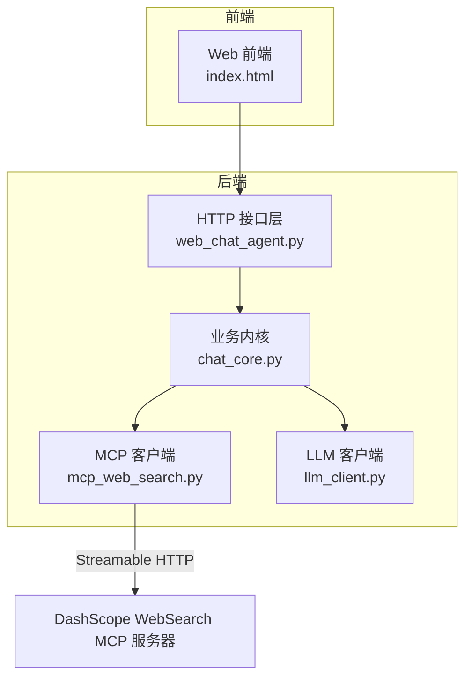
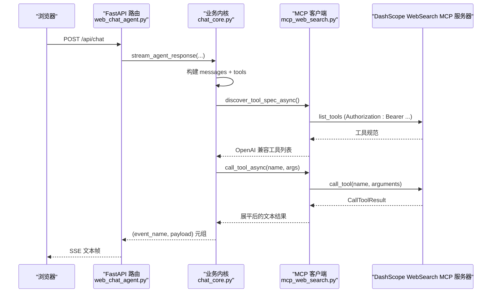
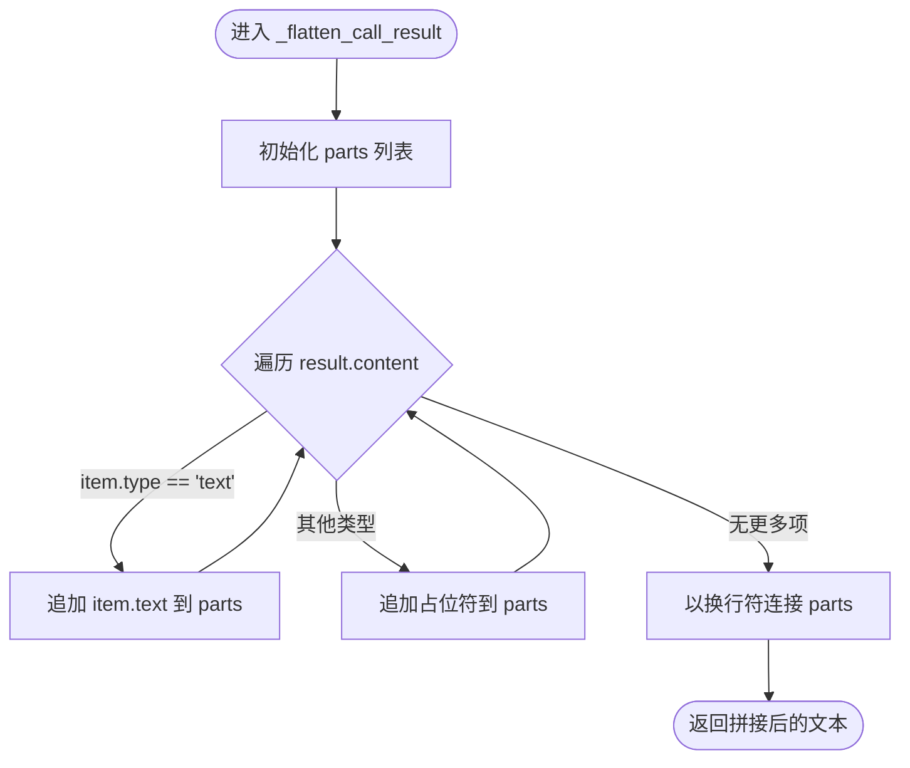
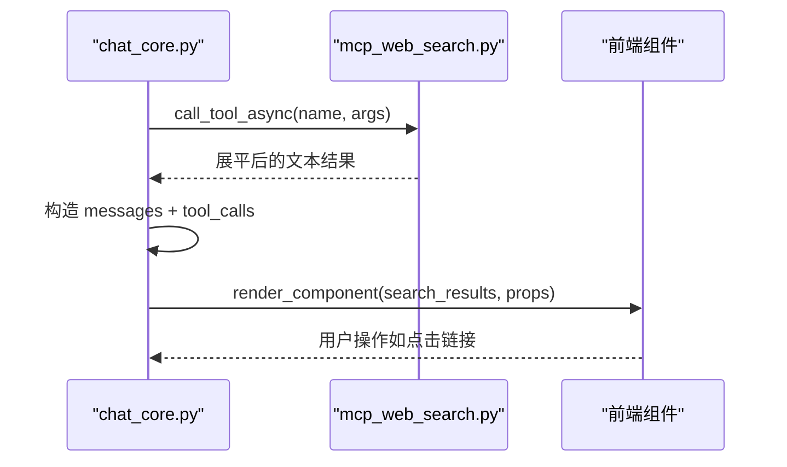
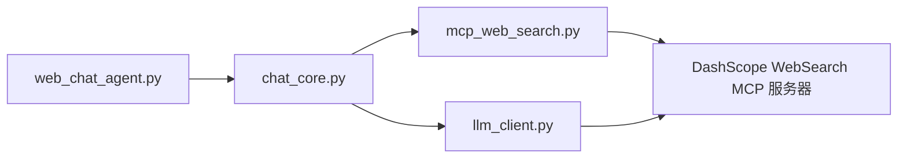

# DashScope 联网搜索集成

<cite>
**本文档引用的文件**
- [mcp_web_search.py](file://demo/mcp_web_search.py)
- [web_chat_agent.py](file://demo/web_chat_agent.py)
- [chat_core.py](file://demo/chat_core.py)
- [llm_client.py](file://demo/llm_client.py)
- [common_chat_agent.py](file://demo/common_chat_agent.py)
- [index.html](file://demo/static/index.html)
- [联网搜索-mcp-接口文档.md](file://docs/联网搜索-mcp-接口文档.md)
- [联网搜索说明文档.md](file://docs/联网搜索说明文档.md)
- [README.md](file://README.md)
- [requirements.txt](file://requirements.txt)
</cite>

## 目录
1. [简介](#简介)
2. [项目结构](#项目结构)
3. [核心组件](#核心组件)
4. [架构总览](#架构总览)
5. [详细组件分析](#详细组件分析)
6. [依赖关系分析](#依赖关系分析)
7. [性能考量](#性能考量)
8. [故障排查指南](#故障排查指南)
9. [结论](#结论)
10. [附录](#附录)

## 简介
本文件面向 DashScope 联网搜索的集成实现，聚焦 WebSearch MCP 服务的对接与使用，涵盖以下要点：
- DashScope API 端点配置与认证机制
- 请求头构建与安全策略
- 搜索参数处理、结果解析与内容展平机制
- _flatten_call_result 函数的实现逻辑与设计意图
- 搜索结果处理的最佳实践（内容过滤、错误处理、性能优化）
- 完整配置指南与使用示例

## 项目结构
该项目采用分层架构，核心围绕 ReAct 循环与工具调用展开，MCP WebSearch 作为外部工具被统一接入。关键模块与职责如下：
- demo/mcp_web_search.py：封装 DashScope WebSearch MCP 服务，负责工具发现与调用、请求头构建、结果展平等
- demo/chat_core.py：业务内核，管理 Memory、ReAct 循环、工具列表与事件流
- demo/web_chat_agent.py：FastAPI + SSE 的 HTTP 入口，将业务事件转换为 SSE 流
- demo/llm_client.py：底层 LLM 客户端，负责与 DashScope OpenAI 兼容网关通信
- demo/common_chat_agent.py：CLI 入口，复用 chat_core 的 ReAct 内核
- demo/static/index.html：Web 前端，展示思考过程、工具调用与搜索结果卡片
- docs/*：联网搜索相关文档，包含 MCP 接口规范与使用说明

图表来源
- [web_chat_agent.py:117-141](file://demo/web_chat_agent.py#L117-L141)
- [chat_core.py:498-518](file://demo/chat_core.py#L498-L518)
- [mcp_web_search.py:89-117](file://demo/mcp_web_search.py#L89-L117)
- [llm_client.py:61-84](file://demo/llm_client.py#L61-L84)

章节来源
- [README.md:1-62](file://README.md#L1-L62)
- [requirements.txt:1-5](file://requirements.txt#L1-L5)

## 核心组件
- DashScope WebSearch MCP 客户端
  - 端点与认证：通过环境变量 DASHSCOPE_API_KEY 构建 Authorization 请求头，访问 https://dashscope.aliyuncs.com/api/v1/mcps/WebSearch/mcp
  - 工具发现：list_tools 获取工具规范，转换为 OpenAI function calling 兼容格式
  - 工具调用：call_tool_async/call_tool_sync 执行搜索，返回文本结果
  - 结果展平：_flatten_call_result 将 CallToolResult.content 中的文本拼接，非文本内容以占位符替代
- 业务内核 chat_core
  - ReAct 循环：在 chat 模式下，通过 native function calling 触发 MCP 工具调用
  - 事件流：将工具调用、工具结果、思考内容、最终回答等事件通过 SSE 流式传输
  - 组件渲染：针对 web_search 工具，生成搜索结果卡片 props
- HTTP 接口层 web_chat_agent
  - FastAPI 路由：/api/chat、/api/resume、/api/reset、/api/history 等
  - SSE 序列化：将 (event_name, payload) 元组序列化为 SSE 文本帧
- LLM 客户端 llm_client
  - OpenAI 兼容网关：通过 base_url="https://dashscope.aliyuncs.com/compatible-mode/v1" 与 DashScope 交互
  - API 模式：responses（内置 web_search 生命周期事件）与 chat（native function calling + MCP）

章节来源
- [mcp_web_search.py:26-29](file://demo/mcp_web_search.py#L26-L29)
- [mcp_web_search.py:42-49](file://demo/mcp_web_search.py#L42-L49)
- [mcp_web_search.py:89-117](file://demo/mcp_web_search.py#L89-L117)
- [mcp_web_search.py:127-164](file://demo/mcp_web_search.py#L127-L164)
- [mcp_web_search.py:68-82](file://demo/mcp_web_search.py#L68-L82)
- [chat_core.py:498-518](file://demo/chat_core.py#L498-L518)
- [chat_core.py:632-800](file://demo/chat_core.py#L632-L800)
- [web_chat_agent.py:127-141](file://demo/web_chat_agent.py#L127-L141)
- [llm_client.py:61-84](file://demo/llm_client.py#L61-L84)

## 架构总览
下图展示了从 Web 前端到 DashScope MCP 的完整调用链路，以及 ReAct 循环中工具调用与结果处理的关键节点。

图表来源
- [web_chat_agent.py:127-141](file://demo/web_chat_agent.py#L127-L141)
- [chat_core.py:632-800](file://demo/chat_core.py#L632-L800)
- [mcp_web_search.py:89-117](file://demo/mcp_web_search.py#L89-L117)
- [mcp_web_search.py:127-164](file://demo/mcp_web_search.py#L127-L164)

## 详细组件分析

### WebSearch MCP 客户端（mcp_web_search.py）
- 端点与认证
  - 端点：https://dashscope.aliyuncs.com/api/v1/mcps/WebSearch/mcp
  - 认证：从环境变量 DASHSCOPE_API_KEY 读取密钥，构造 Authorization: Bearer ${key}
  - 失败处理：未配置密钥时抛出 RuntimeError，避免静默失败
- 工具发现与转换
  - list_tools 获取工具集合，转换为 OpenAI function calling 兼容的 function 元素
  - 规范缓存：首次发现后缓存，后续命中直接返回，减少网络开销
- 工具调用流程
  - 每次调用独立建立连接，调用 session.initialize() 后执行 call_tool
  - 失败时返回统一前缀的错误字符串，便于上层 ReAct 循环处理
  - 业务错误（result.isError 为真）同样返回错误字符串，包含展平后的文本
- 结果展平机制（_flatten_call_result）
  - 遍历 CallToolResult.content，仅拼接 type=text 的文本部分
  - 非文本内容（图片、音频、资源链接等）以占位符 "[非文本内容: type=...]" 替代
  - 设计目的：确保模型可继续推理，同时保留非文本信息的存在感

图表来源
- [mcp_web_search.py:68-82](file://demo/mcp_web_search.py#L68-L82)

章节来源
- [mcp_web_search.py:26-29](file://demo/mcp_web_search.py#L26-L29)
- [mcp_web_search.py:42-49](file://demo/mcp_web_search.py#L42-L49)
- [mcp_web_search.py:89-117](file://demo/mcp_web_search.py#L89-L117)
- [mcp_web_search.py:127-164](file://demo/mcp_web_search.py#L127-L164)
- [mcp_web_search.py:68-82](file://demo/mcp_web_search.py#L68-L82)

### 业务内核（chat_core.py）
- 工具列表与缓存
  - 通过 mcp_web_search.discover_tool_spec_async 获取 MCP 工具规范，并与本地工具合并
  - 首次调用后缓存，避免重复网络请求
- ReAct 流式循环
  - 支持 HITL（人类在环）中断与恢复，保存断点并在 /api/resume 接口续跑
  - 工具调用阶段：将 assistant 的 tool_calls 追加到 messages，调用 MCP 后以 role=tool 的消息回灌
  - 事件产出：tool_call、tool_result、thinking、chunk、component_loading、render_component、error、done
- 组件渲染
  - 针对 web_search 工具，构建搜索结果卡片 props（query、markdown），并发出 render_component 事件
  - 对失败结果不渲染组件，避免误导用户

图表来源
- [chat_core.py:632-800](file://demo/chat_core.py#L632-L800)
- [chat_core.py:541-559](file://demo/chat_core.py#L541-L559)
- [mcp_web_search.py:127-164](file://demo/mcp_web_search.py#L127-L164)

章节来源
- [chat_core.py:498-518](file://demo/chat_core.py#L498-L518)
- [chat_core.py:632-800](file://demo/chat_core.py#L632-L800)
- [chat_core.py:541-559](file://demo/chat_core.py#L541-L559)

### HTTP 接口层（web_chat_agent.py）
- 路由与参数校验
  - /api/chat：接收 session_id、message、context，调用 chat_core.stream_agent_response，返回 SSE
  - /api/resume：HITL 恢复入口，按断点续跑 ReAct
  - /api/reset、/api/archive、/api/history、/api/sessions 等管理接口
- SSE 序列化
  - 将 (event_name, payload) 元组序列化为标准 SSE 文本帧，设置必要的响应头

章节来源
- [web_chat_agent.py:127-141](file://demo/web_chat_agent.py#L127-L141)
- [web_chat_agent.py:101-111](file://demo/web_chat_agent.py#L101-L111)

### LLM 客户端（llm_client.py）
- OpenAI 兼容网关
  - base_url="https://dashscope.aliyuncs.com/compatible-mode/v1"
  - API_MODE 支持 responses 与 chat 两种模式
- responses 模式
  - 内置 web_search 生命周期事件（in_progress/searching/completed），适合 Responses API
- chat 模式
  - 通过 native function calling + MCP 实现联网搜索，不再依赖 extra_body.enable_search

章节来源
- [llm_client.py:61-84](file://demo/llm_client.py#L61-L84)
- [llm_client.py:340-355](file://demo/llm_client.py#L340-L355)
- [llm_client.py:618-647](file://demo/llm_client.py#L618-L647)

### 前端（index.html）
- 展示层
  - 思考面板、工具调用条、搜索结果卡片等 UI 组件
  - 支持搜索结果卡片渲染与交互
- 与后端事件契约
  - 接收 tool_call、tool_result、thinking、chunk、render_component、error、done 等事件
  - 根据事件动态更新界面状态

章节来源
- [index.html:759-794](file://demo/static/index.html#L759-L794)

## 依赖关系分析
- 组件耦合
  - chat_core 依赖 mcp_web_search 进行工具发现与调用
  - web_chat_agent 依赖 chat_core 提供的事件流
  - llm_client 与 DashScope 网关交互，为 chat 模式提供 native function calling 能力
- 外部依赖
  - mcp>=1.10：MCP 客户端库
  - fastapi、uvicorn：Web 服务框架
  - openai：OpenAI 兼容网关 SDK

图表来源
- [mcp_web_search.py:89-117](file://demo/mcp_web_search.py#L89-L117)
- [chat_core.py:632-800](file://demo/chat_core.py#L632-L800)
- [web_chat_agent.py:127-141](file://demo/web_chat_agent.py#L127-L141)
- [llm_client.py:61-84](file://demo/llm_client.py#L61-L84)

章节来源
- [requirements.txt:1-5](file://requirements.txt#L1-5)

## 性能考量
- 连接与初始化
  - 每次工具调用独立建立连接并执行 session.initialize，代价为一次 TCP/TLS 握手与初始化
  - 建议：在高频调用场景下，考虑批量调用或复用连接（需评估 MCP 服务器支持情况）
- 结果展平
  - 仅拼接文本内容，非文本内容以占位符替代，避免大体积二进制数据进入模型
  - 建议：对超长结果进行截断或摘要，减少模型输入负担
- 缓存策略
  - 工具规范缓存：首次发现后缓存，避免重复网络请求
  - 会话内存缓存：内存与磁盘懒加载结合，减少 IO 压力
- 日志与可观测性
  - 关键路径记录耗时、字符数、错误信息，便于定位性能瓶颈
  - 建议：在生产环境开启采样日志，避免过度日志影响性能

[本节为通用性能讨论，不直接分析具体文件]

## 故障排查指南
- 环境变量未配置
  - 现象：启动时报错或工具调用失败
  - 处理：确保 DASHSCOPE_API_KEY 已设置，且值有效
- MCP 工具调用失败
  - 现象：返回统一前缀的错误字符串
  - 处理：查看日志中的 elapsed、text_chars，确认参数与网络状态
- 业务错误（isError 为真）
  - 现象：工具返回错误文本
  - 处理：使用 _flatten_call_result 展平后的文本进行诊断，必要时重试或调整参数
- SSE 断连
  - 现象：前端无法接收事件
  - 处理：检查 /api/chat 路由与连接状态，确认 is_disconnected 回调逻辑

章节来源
- [mcp_web_search.py:146-158](file://demo/mcp_web_search.py#L146-L158)
- [web_chat_agent.py:127-141](file://demo/web_chat_agent.py#L127-L141)

## 结论
本集成方案通过 MCP WebSearch 将 DashScope 的联网搜索能力无缝接入 ReAct 循环，具备以下优势：
- 统一的工具发现与调用接口，简化集成复杂度
- 结果展平机制确保模型可继续推理，同时保留非文本信息的存在感
- SSE 事件流与前端组件化渲染，提供良好的用户体验
- 丰富的配置与文档，便于快速落地与扩展

建议在生产环境中结合缓存、日志采样与监控体系，持续优化性能与稳定性。

[本节为总结性内容，不直接分析具体文件]

## 附录

### 配置指南
- 环境变量
  - DASHSCODE_API_KEY：DashScope API 密钥
  - QWEN_MODEL：模型名称（可选，默认 qwen3.7-max）
  - API_MODE：API 模式，chat 或 responses（可选，默认 responses）
- 端点与认证
  - 端点：https://dashscope.aliyuncs.com/api/v1/mcps/WebSearch/mcp
  - 认证：Authorization: Bearer ${DASHSCOPE_API_KEY}

章节来源
- [mcp_web_search.py:26-29](file://demo/mcp_web_search.py#L26-L29)
- [mcp_web_search.py:42-49](file://demo/mcp_web_search.py#L42-L49)
- [llm_client.py:61-84](file://demo/llm_client.py#L61-L84)
- [README.md:23-28](file://README.md#L23-L28)

### 使用示例
- Web 模式
  - 启动：export DASHSCOPE_API_KEY=sk-xxx && python demo/web_chat_agent.py
  - 访问：浏览器打开 http://127.0.0.1:8000
- CLI 模式
  - 启动：export DASHSCOPE_API_KEY=sk-xxx && python demo/common_chat_agent.py
  - 输入：在终端输入消息，输入 exit 退出
- MCP 工具调用
  - 异步调用：discover_tool_spec_async()、call_tool_async(name, args)
  - 同步调用：discover_tool_spec()、call_tool_sync(name, args)

章节来源
- [README.md:30-42](file://README.md#L30-L42)
- [web_chat_agent.py:29-58](file://demo/web_chat_agent.py#L29-L58)
- [common_chat_agent.py:17-29](file://demo/common_chat_agent.py#L17-L29)
- [mcp_web_search.py:89-117](file://demo/mcp_web_search.py#L89-L117)
- [mcp_web_search.py:127-164](file://demo/mcp_web_search.py#L127-L164)

### 参考文档
- 联网搜索 MCP 接口文档：包含 JSON 配置与 Streamable HTTP Endpoint、Authorization 配置
- 联网搜索说明文档：支持的模型、搜索策略、使用方式与示例

章节来源
- [联网搜索-mcp-接口文档.md:1-28](file://docs/联网搜索-mcp-接口文档.md#L1-L28)
- [联网搜索说明文档.md:1-800](file://docs/联网搜索说明文档.md#L1-L800)