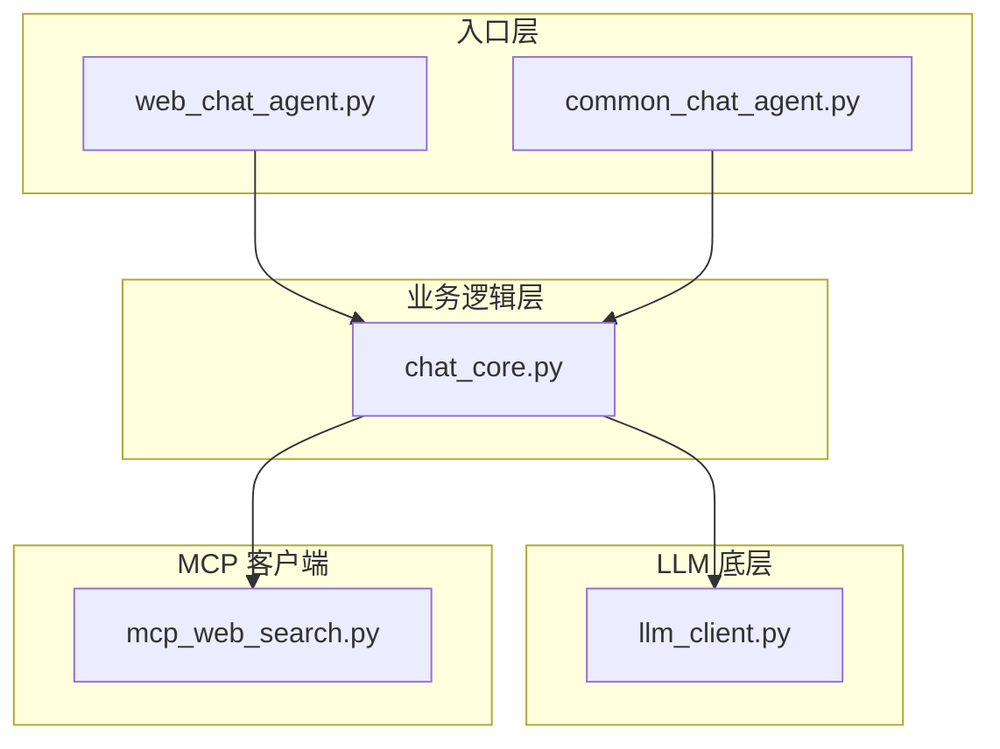
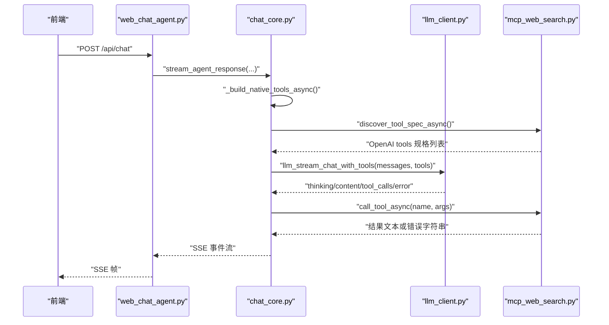
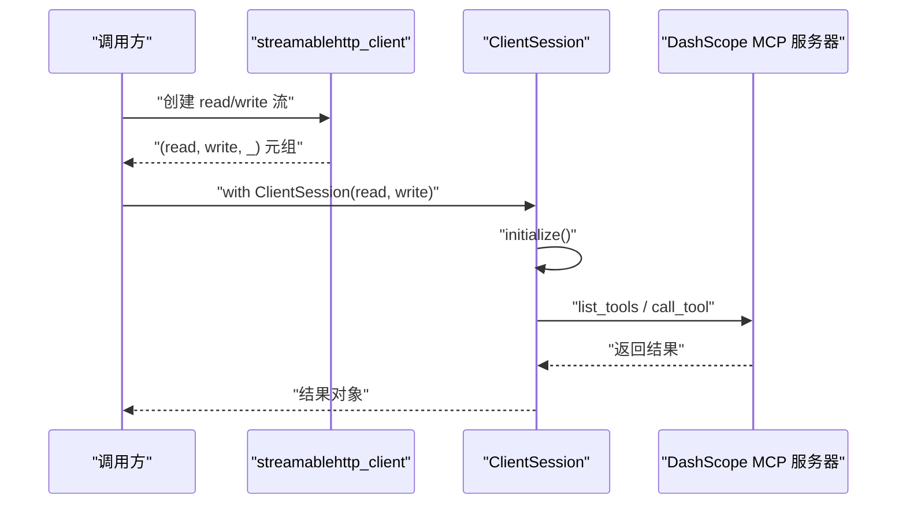
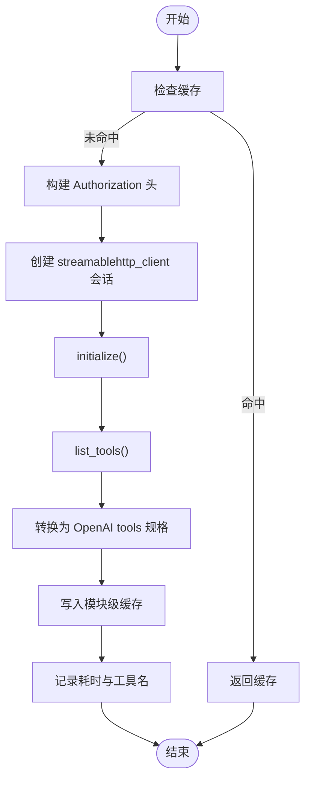
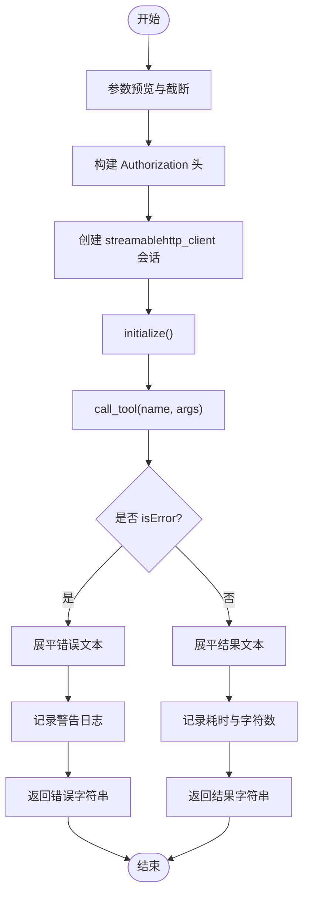
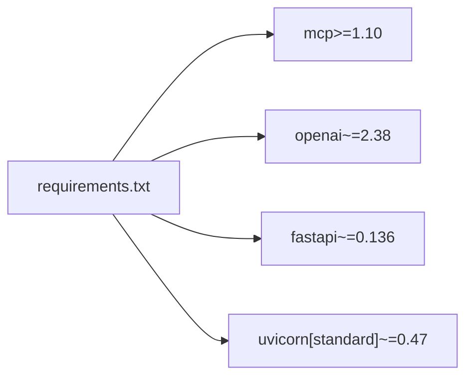

# MCP 客户端实现

<cite>
**本文引用的文件**
- [demo/mcp_web_search.py](file://demo/mcp_web_search.py)
- [demo/chat_core.py](file://demo/chat_core.py)
- [demo/llm_client.py](file://demo/llm_client.py)
- [demo/web_chat_agent.py](file://demo/web_chat_agent.py)
- [demo/common_chat_agent.py](file://demo/common_chat_agent.py)
- [README.md](file://README.md)
- [CLAUDE.md](file://CLAUDE.md)
- [requirements.txt](file://requirements.txt)
</cite>

## 目录
1. [简介](#简介)
2. [项目结构](#项目结构)
3. [核心组件](#核心组件)
4. [架构总览](#架构总览)
5. [详细组件分析](#详细组件分析)
6. [依赖分析](#依赖分析)
7. [性能考量](#性能考量)
8. [故障排查指南](#故障排查指南)
9. [结论](#结论)
10. [附录](#附录)

## 简介
本文件面向“MCP 客户端实现”的技术文档，聚焦于 Model Context Protocol（MCP）协议在本项目中的实现与集成。重点涵盖：
- streamable_http 客户端的封装机制与 ClientSession 的初始化流程
- 工具发现机制 discover_tool_spec_async 的实现，包括异步调用流程、Schema 缓存策略与错误处理
- 工具调用 call_tool_async 的完整实现，包括参数预览、连接建立、工具执行与结果展平过程
- 环境变量配置、头部构建与认证机制
- 使用示例与最佳实践

## 项目结构
该项目采用三层模块化分层：
- 入口层（HTTP/CLI）：负责路由、参数校验、SSE 序列化与用户交互
- 业务逻辑层（chat_core）：负责 Memory、ReAct 协议、会话持久化、HITL、工具列表与事件流
- LLM 底层（llm_client）：负责 OpenAI SDK 客户端构建、Responses/Chat 流式调用与工具调用拼装
- MCP 客户端（mcp_web_search）：负责 DashScope WebSearch MCP server 的 streamableHttp 封装与工具发现/调用

图表来源
- [demo/web_chat_agent.py:1-233](file://demo/web_chat_agent.py#L1-L233)
- [demo/common_chat_agent.py:1-53](file://demo/common_chat_agent.py#L1-L53)
- [demo/chat_core.py:1-1068](file://demo/chat_core.py#L1-L1068)
- [demo/llm_client.py:1-924](file://demo/llm_client.py#L1-L924)
- [demo/mcp_web_search.py:1-172](file://demo/mcp_web_search.py#L1-L172)

章节来源
- [README.md:1-62](file://README.md#L1-L62)
- [CLAUDE.md:28-52](file://CLAUDE.md#L28-L52)

## 核心组件
- streamable_http 客户端封装：通过 streamablehttp_client 创建 read/write 流，结合 ClientSession 实现 MCP 会话初始化与工具调用
- discover_tool_spec_async：一次性拉取 MCP 工具清单，转换为 OpenAI tools 格式并缓存
- call_tool_async：短连接发起一次工具调用，失败返回错误字符串，成功将结果展平为文本
- 环境变量与认证：DASHSCOPE_API_KEY 用于 Authorization 头构建
- Schema 缓存：模块级缓存首次发现结果，后续直接命中

章节来源
- [demo/mcp_web_search.py:89-172](file://demo/mcp_web_search.py#L89-L172)
- [demo/chat_core.py:475-517](file://demo/chat_core.py#L475-L517)

## 架构总览
MCP 客户端在 chat 模式下与 LLM 底层协同工作，通过 native function calling 协议驱动工具调用。ReAct 循环在业务层调度，MCP 工具通过 discover_tool_spec_async 获取工具清单，call_tool_async 执行单次工具调用并返回文本结果。

图表来源
- [demo/web_chat_agent.py:127-140](file://demo/web_chat_agent.py#L127-L140)
- [demo/chat_core.py:632-800](file://demo/chat_core.py#L632-L800)
- [demo/llm_client.py:633-646](file://demo/llm_client.py#L633-L646)
- [demo/mcp_web_search.py:89-172](file://demo/mcp_web_search.py#L89-L172)

## 详细组件分析

### streamable_http 客户端封装与 ClientSession 初始化
- streamablehttp_client(endpoint, headers)：创建基于 streamableHttp 的读写通道
- ClientSession(read, write)：封装 MCP 会话，支持 initialize/list_tools/call_tool 等方法
- 生命周期：每次调用均在异步 with 块内创建会话，确保连接及时释放

图表来源
- [demo/mcp_web_search.py:102-104](file://demo/mcp_web_search.py#L102-L104)
- [demo/mcp_web_search.py:142-144](file://demo/mcp_web_search.py#L142-L144)

章节来源
- [demo/mcp_web_search.py:102-104](file://demo/mcp_web_search.py#L102-L104)
- [demo/mcp_web_search.py:142-144](file://demo/mcp_web_search.py#L142-L144)

### discover_tool_spec_async：工具发现机制
- 功能：首次调用通过 MCP list_tools 获取工具清单，转换为 OpenAI tools 格式并缓存
- 缓存策略：模块级全局变量 _tool_spec_cache，命中即返回
- 错误处理：捕获异常并抛出 RuntimeError，供上层决定回退策略
- 日志：记录耗时与工具名列表

图表来源
- [demo/mcp_web_search.py:89-117](file://demo/mcp_web_search.py#L89-L117)

章节来源
- [demo/mcp_web_search.py:89-117](file://demo/mcp_web_search.py#L89-L117)

### call_tool_async：工具调用实现
- 参数预览：对 args 进行字符串化并截断，避免日志过大
- 连接建立：每次调用独立创建 streamablehttp_client 与 ClientSession，短连接
- 工具执行：调用 session.call_tool(name, arguments=args)
- 结果展平：将 CallToolResult.content 中的 TextContent 拼接为字符串，非文本内容以占位标记替代
- 错误处理：捕获异常返回统一前缀的错误字符串，业务错误同样返回错误字符串并记录警告日志

图表来源
- [demo/mcp_web_search.py:127-164](file://demo/mcp_web_search.py#L127-L164)
- [demo/mcp_web_search.py:68-82](file://demo/mcp_web_search.py#L68-L82)

章节来源
- [demo/mcp_web_search.py:127-164](file://demo/mcp_web_search.py#L127-L164)
- [demo/mcp_web_search.py:68-82](file://demo/mcp_web_search.py#L68-L82)

### 环境变量配置、头部构建与认证机制
- DASHSCOPE_API_KEY：必需环境变量，用于构建 Authorization: Bearer <key> 头
- API_MODE：可选环境变量，控制底层 LLM 调用协议（responses 或 chat）
- QWEN_MODEL：可选环境变量，控制模型名
- 认证：所有 MCP 调用均通过 Authorization 头传递密钥

章节来源
- [demo/mcp_web_search.py:42-49](file://demo/mcp_web_search.py#L42-L49)
- [demo/llm_client.py:61-71](file://demo/llm_client.py#L61-L71)
- [README.md:23-28](file://README.md#L23-L28)

### 与业务层的集成
- chat_core 在 API_MODE=chat 路径上通过 mcp_web_search.discover_tool_spec_async 获取工具清单，并在 ReAct 循环中调用 call_tool_async 执行工具
- 本地伪工具（ask_user、execute_shell_command）通过 _LOCAL_TOOL_KIND 控制前端交互类型，遇到这些工具时触发 HITL 中断
- 工具结果卡片化：通过 TOOL_COMPONENT_MAP 与 _build_component_props 将结果渲染为前端组件

章节来源
- [demo/chat_core.py:511-517](file://demo/chat_core.py#L511-L517)
- [demo/chat_core.py:767-798](file://demo/chat_core.py#L767-L798)
- [demo/chat_core.py:541-558](file://demo/chat_core.py#L541-L558)

## 依赖分析
- mcp>=1.10：提供 streamable_http 客户端与 ClientSession
- openai：提供 OpenAI SDK 客户端，用于 LLM 调用
- fastapi/uvicorn：提供 HTTP 服务与 SSE

图表来源
- [requirements.txt:1-5](file://requirements.txt#L1-L5)

章节来源
- [requirements.txt:1-5](file://requirements.txt#L1-L5)

## 性能考量
- 连接策略：每次工具调用均建立短连接，适合无状态的 DashScope MCP，避免长连接开销
- 缓存策略：工具清单仅在首次发现时拉取并缓存，后续直接命中，降低重复网络开销
- 日志与截断：参数预览与结果截断避免日志膨胀，提升可观测性
- 事件流：SSE 事件按需产出，前端可渐进式渲染，减少一次性传输压力

## 故障排查指南
- 环境变量缺失
  - 现象：启动时报错或调用失败
  - 处理：设置 DASHSCOPE_API_KEY；参考入口模块的环境变量检查逻辑
- MCP 调用失败
  - 现象：返回统一前缀的错误字符串
  - 处理：查看日志中的异常堆栈，定位网络/鉴权/参数/工具自身错误
- 工具清单缓存问题
  - 现象：工具列表不更新
  - 处理：重启进程以清空模块级缓存，或在开发阶段手动清空 _tool_spec_cache
- HITL 中断
  - 现象：业务层写入 _PENDING 并发送 await_user 事件
  - 处理：前端提交 /api/resume，后端恢复 ReAct 循环

章节来源
- [demo/mcp_web_search.py:106-108](file://demo/mcp_web_search.py#L106-L108)
- [demo/mcp_web_search.py:146-148](file://demo/mcp_web_search.py#L146-L148)
- [demo/chat_core.py:738-764](file://demo/chat_core.py#L738-L764)

## 结论
本实现以 streamable_http 客户端为核心，结合 ClientSession 完成 MCP 会话的初始化与工具调用。通过模块级缓存与短连接策略，在保证易用性的同时兼顾性能与可靠性。在 chat 模式下，MCP 工具与本地伪工具统一纳入 native function calling 协议，形成一致的事件流与前端渲染体验。

## 附录

### 使用示例与最佳实践
- 环境准备
  - 设置 DASHSCOPE_API_KEY
  - 可选设置 QWEN_MODEL、API_MODE
- CLI 使用
  - 运行 demo/common_chat_agent.py，按提示输入消息
- Web 使用
  - 运行 demo/web_chat_agent.py，访问 http://127.0.0.1:8000
- 最佳实践
  - 在 API_MODE=chat 路径下，优先使用 native function calling 与 MCP 工具
  - 对于本地伪工具（HITL），通过 _LOCAL_TOOL_KIND 控制前端交互类型
  - 工具结果卡片化需在 TOOL_COMPONENT_MAP 与 _build_component_props 中注册
  - 如需扩展新工具，优先在 MCP 服务器暴露工具，再通过 discover_tool_spec_async 自动发现

章节来源
- [README.md:23-42](file://README.md#L23-L42)
- [demo/web_chat_agent.py:53-58](file://demo/web_chat_agent.py#L53-L58)
- [demo/common_chat_agent.py:17-29](file://demo/common_chat_agent.py#L17-L29)
- [demo/chat_core.py:532-558](file://demo/chat_core.py#L532-L558)