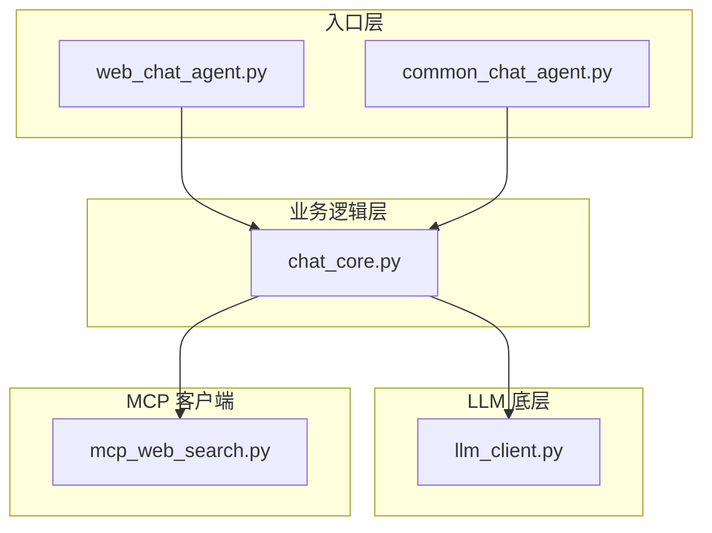
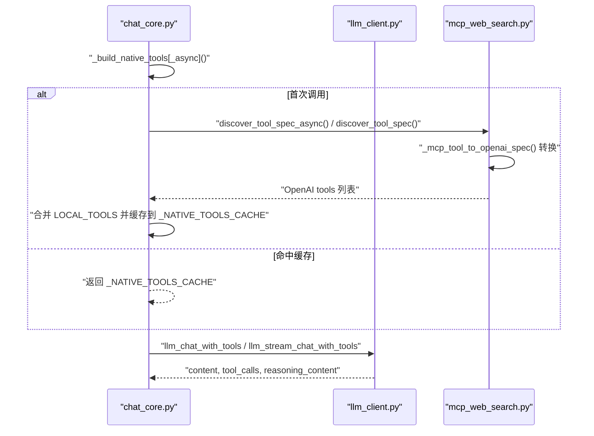
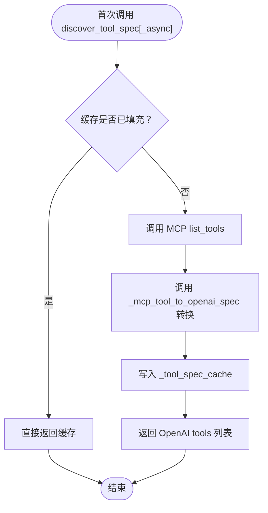
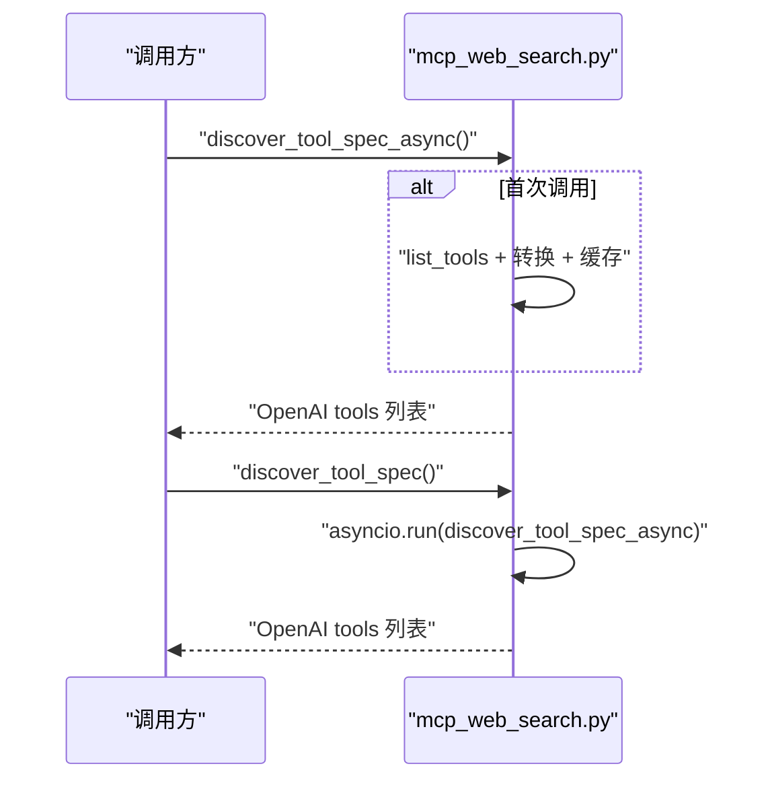
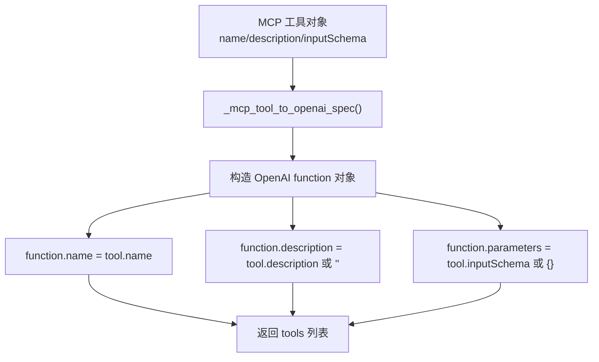
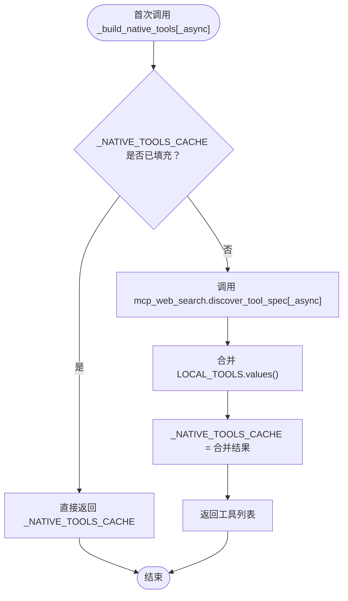
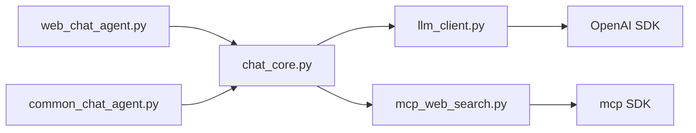

# 工具发现与缓存机制

<cite>
**本文引用的文件**
- [demo/chat_core.py](file://demo/chat_core.py)
- [demo/mcp_web_search.py](file://demo/mcp_web_search.py)
- [demo/llm_client.py](file://demo/llm_client.py)
- [demo/web_chat_agent.py](file://demo/web_chat_agent.py)
- [demo/common_chat_agent.py](file://demo/common_chat_agent.py)
- [README.md](file://README.md)
- [CLAUDE.md](file://CLAUDE.md)
</cite>

## 目录
1. [简介](#简介)
2. [项目结构](#项目结构)
3. [核心组件](#核心组件)
4. [架构总览](#架构总览)
5. [详细组件分析](#详细组件分析)
6. [依赖关系分析](#依赖关系分析)
7. [性能考量](#性能考量)
8. [故障排查指南](#故障排查指南)
9. [结论](#结论)
10. [附录](#附录)

## 简介
本文件聚焦“工具发现与缓存机制”，系统阐述以下主题：
- 全局缓存 _tool_spec_cache 的设计理念与实现机制（初始化、命中策略、失效处理）
- discover_tool_spec_async 与 discover_tool_spec 的差异及适用场景
- 工具规格转换机制 _mcp_tool_to_openai_spec 的实现与 JSON Schema 到 OpenAI function 格式的映射规则
- 缓存性能优化建议与内存管理策略
- 完整使用示例与调试技巧

## 项目结构
该项目采用三层模块化分层：
- 入口层（HTTP/CLI）：负责路由、参数校验、SSE 序列化与业务调用转发
- 业务逻辑层（chat_core）：负责 Memory、Prompt 拼装、ReAct 循环、HITL、会话持久化与工具缓存
- LLM 底层（llm_client）：负责 OpenAI SDK 客户端、不同 API 模式下的流式协议解析
- MCP 客户端（mcp_web_search）：负责与 DashScope WebSearch MCP 服务器交互，提供工具发现与调用

图表来源
- [demo/web_chat_agent.py:122-140](file://demo/web_chat_agent.py#L122-L140)
- [demo/common_chat_agent.py:14](file://demo/common_chat_agent.py#L14)
- [demo/chat_core.py:474-517](file://demo/chat_core.py#L474-L517)
- [demo/llm_client.py:44-51](file://demo/llm_client.py#L44-L51)
- [demo/mcp_web_search.py:26-35](file://demo/mcp_web_search.py#L26-L35)

章节来源
- [README.md:44-57](file://README.md#L44-L57)
- [CLAUDE.md:30-52](file://CLAUDE.md#L30-L52)

## 核心组件
- 全局缓存 _tool_spec_cache：位于 MCP 客户端模块，用于缓存从 MCP 服务器发现的工具规格（OpenAI function 格式）
- 工具发现接口 discover_tool_spec_async/discover_tool_spec：分别提供异步与同步的工具规格发现能力
- 规格转换器 _mcp_tool_to_openai_spec：将 MCP 工具规格（JSON Schema）转换为 OpenAI function calling 所需的 tools 元素
- 业务层缓存 _NATIVE_TOOLS_CACHE：位于业务逻辑层，聚合 MCP 工具与本地伪工具（HITL），并作为模型 native function calling 的工具集

章节来源
- [demo/mcp_web_search.py:34-35](file://demo/mcp_web_search.py#L34-L35)
- [demo/mcp_web_search.py:52-65](file://demo/mcp_web_search.py#L52-L65)
- [demo/mcp_web_search.py:88-124](file://demo/mcp_web_search.py#L88-L124)
- [demo/chat_core.py:474-517](file://demo/chat_core.py#L474-L517)

## 架构总览
工具发现与缓存贯穿“业务层 → LLM 底层 → MCP 客户端”的调用链路。业务层在 chat 模式下通过 _build_native_tools/_build_native_tools_async 获取工具集，内部委托 MCP 客户端的 discover_tool_spec_async/discover_tool_spec 获取并缓存工具规格，随后将 MCP 工具与本地伪工具合并，形成最终的 OpenAI tools 列表。

图表来源
- [demo/chat_core.py:498-517](file://demo/chat_core.py#L498-L517)
- [demo/mcp_web_search.py:88-124](file://demo/mcp_web_search.py#L88-L124)
- [demo/mcp_web_search.py:52-65](file://demo/mcp_web_search.py#L52-L65)
- [demo/llm_client.py:618-646](file://demo/llm_client.py#L618-L646)

## 详细组件分析

### 全局缓存 _tool_spec_cache（MCP 客户端）
- 设计理念
  - 一次性发现 + 持久缓存：首次调用 discover_tool_spec_async/discover_tool_spec 时访问 MCP 服务器，获取工具列表并转换为 OpenAI function 格式，随后缓存至模块级变量，后续调用直接命中
  - 简化调用链：业务层无需关心 MCP 服务器细节，只需调用 _build_native_tools/_build_native_tools_async
- 初始化与命中策略
  - 初始化：首次调用 discover_tool_spec_async/discover_tool_spec 时，若缓存为 None，则发起 MCP list_tools 请求，转换后写入缓存
  - 命中：若缓存非 None，直接返回缓存内容
- 失效处理
  - 当前实现未提供显式失效机制；若需刷新，可通过重启进程或在上层业务中替换缓存值（不建议）
- 性能特征
  - 首次调用有网络开销；后续调用 O(1) 命中，显著降低延迟
  - 适合工具规格相对稳定的场景

图表来源
- [demo/mcp_web_search.py:88-117](file://demo/mcp_web_search.py#L88-L117)
- [demo/mcp_web_search.py:52-65](file://demo/mcp_web_search.py#L52-L65)

章节来源
- [demo/mcp_web_search.py:34-35](file://demo/mcp_web_search.py#L34-L35)
- [demo/mcp_web_search.py:88-124](file://demo/mcp_web_search.py#L88-L124)

### discover_tool_spec_async 与 discover_tool_spec 的区别
- discover_tool_spec_async（异步）
  - 适用场景：Web 环境（FastAPI）中已有运行中的事件循环，避免在已运行的事件循环上下文中调用 asyncio.run 抛出异常
  - 行为：返回 OpenAI tools 列表；首次调用时访问 MCP 服务器并缓存
- discover_tool_spec（同步）
  - 适用场景：CLI/REPL 环境，或在外部事件循环之外的上下文
  - 行为：内部通过 asyncio.run 包装异步调用，其余逻辑与异步版本一致
- 选择建议
  - Web 路径优先使用 discover_tool_spec_async
  - CLI/REPL 路径使用 discover_tool_spec

图表来源
- [demo/mcp_web_search.py:88-124](file://demo/mcp_web_search.py#L88-L124)

章节来源
- [demo/mcp_web_search.py:120-124](file://demo/mcp_web_search.py#L120-L124)

### 工具规格转换机制 _mcp_tool_to_openai_spec
- 目标：将 MCP 工具对象（包含 name/description/inputSchema）转换为 OpenAI Chat Completions 的 tools 元素（function.name/function.description/function.parameters）
- 转换规则
  - name → function.name
  - description → function.description（缺省为空字符串）
  - inputSchema → function.parameters（MCP 的 JSON Schema 直接映射为 OpenAI 的 parameters）
- 复杂度与性能
  - 时间复杂度：O(n)，n 为工具数量
  - 空间复杂度：O(n)，用于构造 OpenAI tools 列表
- 注意事项
  - 若 inputSchema 为空，转换器会补全为 { "type": "object", "properties": {} }，确保参数结构合法

图表来源
- [demo/mcp_web_search.py:52-65](file://demo/mcp_web_search.py#L52-L65)

章节来源
- [demo/mcp_web_search.py:52-65](file://demo/mcp_web_search.py#L52-L65)

### 业务层缓存 _NATIVE_TOOLS_CACHE（聚合与暴露）
- 作用：在 chat 模式下，将 MCP 工具与本地伪工具（HITL）合并，形成最终的 OpenAI tools 列表，并缓存以供后续调用
- 初始化与命中
  - 首次调用 _build_native_tools/_build_native_tools_async 时，若缓存为 None，则通过 MCP 客户端发现工具并合并本地伪工具，写入缓存
  - 后续调用直接返回缓存
- 与全局缓存的关系
  - MCP 客户端的 _tool_spec_cache 缓存的是转换后的 OpenAI tools 列表
  - 业务层的 _NATIVE_TOOLS_CACHE 缓存的是最终的工具集合（MCP + 本地伪工具）

图表来源
- [demo/chat_core.py:498-517](file://demo/chat_core.py#L498-L517)
- [demo/chat_core.py:63-104](file://demo/chat_core.py#L63-L104)

章节来源
- [demo/chat_core.py:474-517](file://demo/chat_core.py#L474-L517)
- [demo/chat_core.py:63-104](file://demo/chat_core.py#L63-L104)

## 依赖关系分析
- chat_core 依赖 llm_client（模型调用）与 mcp_web_search（工具发现与调用）
- llm_client 依赖 OpenAI SDK，负责不同 API 模式下的流式协议解析
- mcp_web_search 依赖 mcp SDK，负责与 MCP 服务器交互

图表来源
- [demo/web_chat_agent.py:29-46](file://demo/web_chat_agent.py#L29-L46)
- [demo/common_chat_agent.py:13-14](file://demo/common_chat_agent.py#L13-L14)
- [demo/chat_core.py:26-34](file://demo/chat_core.py#L26-L34)
- [demo/llm_client.py:25](file://demo/llm_client.py#L25)
- [demo/mcp_web_search.py:16-17](file://demo/mcp_web_search.py#L16-L17)

章节来源
- [demo/web_chat_agent.py:29-46](file://demo/web_chat_agent.py#L29-L46)
- [demo/common_chat_agent.py:13-14](file://demo/common_chat_agent.py#L13-L14)
- [demo/chat_core.py:26-34](file://demo/chat_core.py#L26-L34)
- [demo/llm_client.py:25](file://demo/llm_client.py#L25)
- [demo/mcp_web_search.py:16-17](file://demo/mcp_web_search.py#L16-L17)

## 性能考量
- 缓存命中率
  - 业务层与 MCP 客户端均采用模块级懒加载缓存，首次调用后 O(1) 命中，显著降低网络与转换开销
- 网络与序列化
  - 工具发现仅在首次调用时发生网络请求；转换为 OpenAI function 格式为纯内存操作，成本低
- 并发与阻塞
  - 异步路径（discover_tool_spec_async）避免在已运行事件循环上下文中阻塞，适合 Web 场景
  - 同步路径（discover_tool_spec）通过 asyncio.run 包装，适合 CLI/REPL
- 内存管理
  - 缓存为模块级变量，生命周期与模块相同；建议在进程重启或需要刷新时通过替换缓存值实现“失效”
  - 若工具规格频繁变更，可考虑在上层业务中增加显式刷新逻辑（例如在特定事件后清空缓存并重新发现）

[本节为通用性能讨论，无需特定文件引用]

## 故障排查指南
- 环境变量缺失
  - 症状：MCP 客户端在构建请求头时抛出运行时错误
  - 处理：确保 DASHSCOPE_API_KEY 已正确设置
- MCP 服务器调用失败
  - 症状：discover_tool_spec_async/discover_tool_spec 抛出运行时错误
  - 处理：检查网络连通性、API 密钥有效性与 MCP 端点可达性
- 工具调用失败
  - 症状：call_tool_async 返回以“工具调用失败”为前缀的字符串
  - 处理：查看日志中的错误摘要，确认参数合法性与工具可用性
- 事件循环冲突
  - 症状：在 FastAPI handler 中直接调用 discover_tool_spec 抛出“不能从运行中的事件循环调用”异常
  - 处理：改为使用 discover_tool_spec_async 或在合适上下文中包装为同步调用

章节来源
- [demo/mcp_web_search.py:42-49](file://demo/mcp_web_search.py#L42-L49)
- [demo/mcp_web_search.py:106-108](file://demo/mcp_web_search.py#L106-L108)
- [demo/mcp_web_search.py:146-148](file://demo/mcp_web_search.py#L146-L148)
- [demo/mcp_web_search.py:120-124](file://demo/mcp_web_search.py#L120-L124)

## 结论
- 全局缓存 _tool_spec_cache 与业务层缓存 _NATIVE_TOOLS_CACHE 通过懒加载与模块级缓存实现了高效的工具发现与暴露
- discover_tool_spec_async 与 discover_tool_spec 分别适配 Web 与 CLI/REPL 场景，避免事件循环冲突
- _mcp_tool_to_openai_spec 将 MCP 的 JSON Schema 直接映射为 OpenAI function calling 所需格式，简化了集成流程
- 建议在工具规格稳定场景下长期使用缓存，在需要快速刷新时通过进程重启或上层刷新逻辑实现“失效”

[本节为总结性内容，无需特定文件引用]

## 附录

### 使用示例（步骤说明）
- Web 环境（FastAPI）
  - 步骤：在路由中调用 chat_core 的流式接口，内部会通过 _build_native_tools_async 获取工具集；若首次调用，将触发 discover_tool_spec_async 并缓存
  - 参考：[demo/web_chat_agent.py:127-140](file://demo/web_chat_agent.py#L127-L140)
- CLI 环境（REPL）
  - 步骤：在入口脚本中调用 chat_core 的同步接口，内部会通过 _build_native_tools 获取工具集；若首次调用，将触发 discover_tool_spec 并缓存
  - 参考：[demo/common_chat_agent.py:44](file://demo/common_chat_agent.py#L44)

### 调试技巧
- 日志定位
  - MCP 工具发现：关注“MCP discover_tool_spec 开始/完成”日志，查看耗时与工具名称列表
  - MCP 工具调用：关注“MCP call_tool 开始/完成/异常/业务错误”日志，查看耗时与错误摘要
  - 业务层缓存：观察首次调用与后续命中行为，确认缓存生效
- 环境变量
  - 确保 DASHSCOPE_API_KEY 设置正确，避免认证失败导致的工具发现异常
- 事件循环
  - Web 路径使用 discover_tool_spec_async，避免在 FastAPI handler 中直接调用 discover_tool_spec

章节来源
- [demo/mcp_web_search.py:98-117](file://demo/mcp_web_search.py#L98-L117)
- [demo/mcp_web_search.py:134-164](file://demo/mcp_web_search.py#L134-L164)
- [demo/chat_core.py:498-517](file://demo/chat_core.py#L498-L517)
- [demo/web_chat_agent.py:53-58](file://demo/web_chat_agent.py#L53-L58)