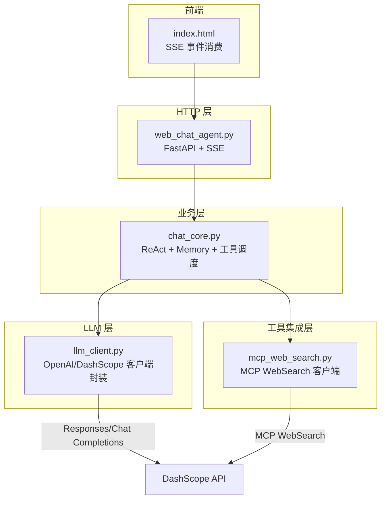
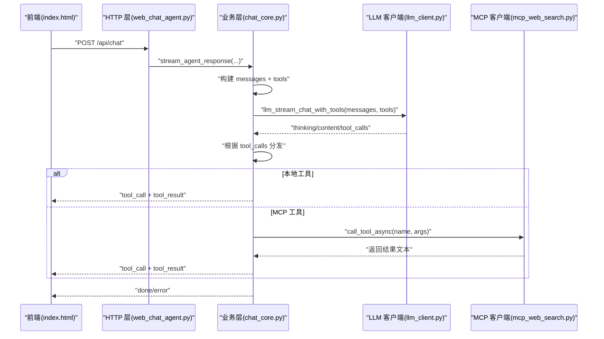
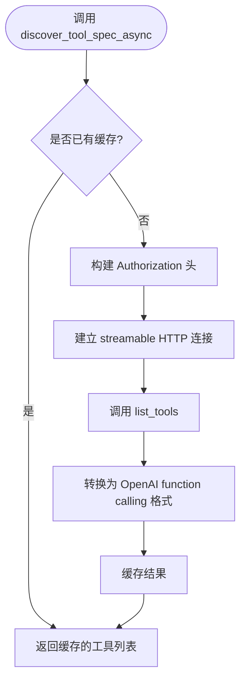
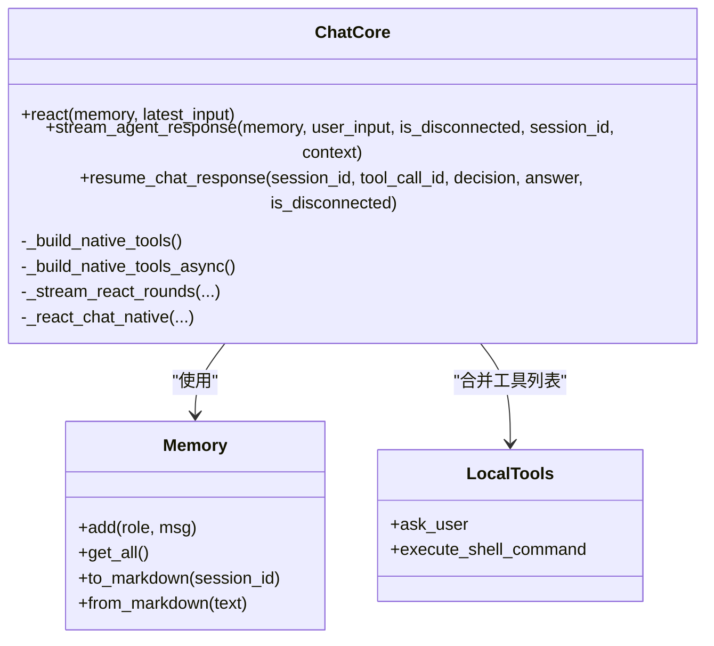
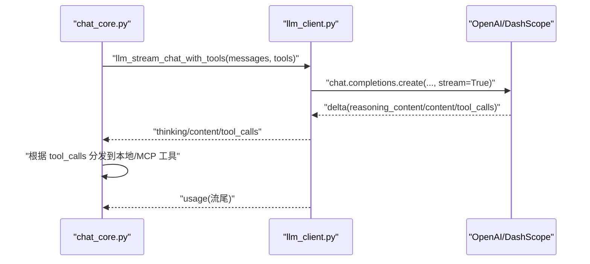
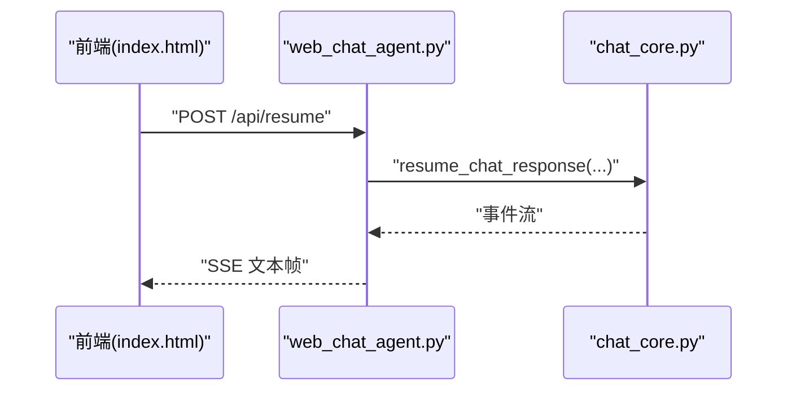
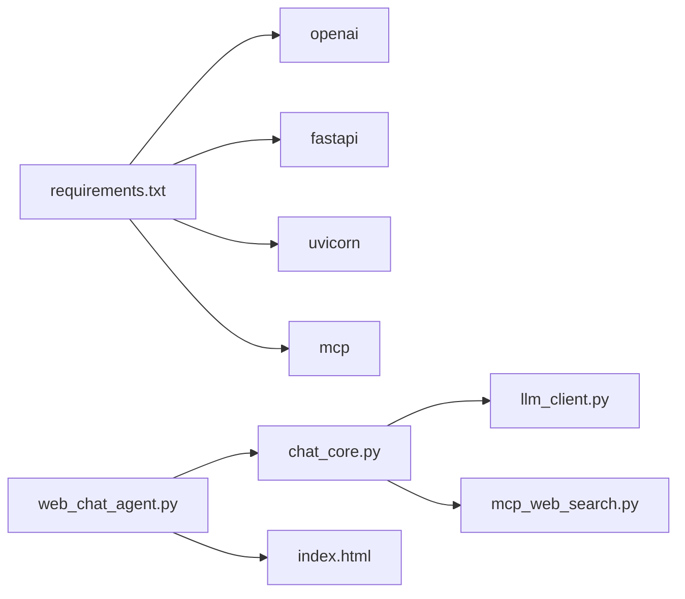

# 工具集成层

<cite>
**本文引用的文件**
- [mcp_web_search.py](file://demo/mcp_web_search.py)
- [chat_core.py](file://demo/chat_core.py)
- [llm_client.py](file://demo/llm_client.py)
- [web_chat_agent.py](file://demo/web_chat_agent.py)
- [common_chat_agent.py](file://demo/common_chat_agent.py)
- [index.html](file://demo/static/index.html)
- [联网搜索-mcp-接口文档.md](file://docs/联网搜索-mcp-接口文档.md)
- [联网搜索说明文档.md](file://docs/联网搜索说明文档.md)
- [requirements.txt](file://requirements.txt)
</cite>

## 目录
1. [简介](#简介)
2. [项目结构](#项目结构)
3. [核心组件](#核心组件)
4. [架构总览](#架构总览)
5. [详细组件分析](#详细组件分析)
6. [依赖关系分析](#依赖关系分析)
7. [性能考量](#性能考量)
8. [故障排查指南](#故障排查指南)
9. [结论](#结论)
10. [附录](#附录)

## 简介
本文件面向工具集成层，系统性阐述 MCP 协议在本项目中的实现与 DashScope WebSearch 的集成机制，覆盖工具发现、注册与调用流程，异步与同步工具调用的差异，Schema 自动发现机制与错误处理策略，以及本地工具与 HITL（人机交互）机制的设计细节。文档同时提供完整的工具添加指南、联网搜索实现原理、结果处理与安全注意事项，以及集成测试方法。

## 项目结构
该项目采用分层架构，工具集成层位于业务层与 LLM 层之间，负责：
- 通过 MCP 协议对接 DashScope WebSearch，实现联网搜索工具的动态发现与调用
- 在 Chat Completions 原生 function calling 模式下，将 MCP 工具与本地工具统一纳入工具列表
- 支持 CLI 与 Web 两种运行模式，分别采用同步与异步 ReAct 循环
- 提供 HITL（人机交互）机制，允许在敏感或需要确认的操作前暂停并等待人工决策

图表来源
- [web_chat_agent.py:117-140](file://demo/web_chat_agent.py#L117-L140)
- [chat_core.py:958-1069](file://demo/chat_core.py#L958-L1069)
- [llm_client.py:113-334](file://demo/llm_client.py#L113-L334)
- [mcp_web_search.py:89-172](file://demo/mcp_web_search.py#L89-L172)

章节来源
- [web_chat_agent.py:1-233](file://demo/web_chat_agent.py#L1-233)
- [chat_core.py:1-1069](file://demo/chat_core.py#L1-1069)
- [llm_client.py:1-924](file://demo/llm_client.py#L1-L924)
- [mcp_web_search.py:1-172](file://demo/mcp_web_search.py#L1-L172)

## 核心组件
- MCP WebSearch 客户端：封装 DashScope MCP WebSearch 的 list_tools/call_tool，提供异步与同步调用接口，支持错误前缀统一与结果展平
- 业务层（chat_core）：负责 Memory、ReAct 协议、工具列表构建与调度、HITL 状态管理、SSE 事件流生成
- LLM 客户端（llm_client）：封装 OpenAI/DashScope 客户端，提供 responses/chat 流式接口，支持原生 function calling
- HTTP/Web 层（web_chat_agent）：FastAPI 路由与 SSE 序列化，暴露 /api/chat、/api/resume 等端点
- 前端（index.html）：SSE 事件消费、消息渲染、HITL 气泡、搜索状态条等

章节来源
- [mcp_web_search.py:89-172](file://demo/mcp_web_search.py#L89-L172)
- [chat_core.py:43-104](file://demo/chat_core.py#L43-L104)
- [llm_client.py:30-52](file://demo/llm_client.py#L30-L52)
- [web_chat_agent.py:117-167](file://demo/web_chat_agent.py#L117-L167)
- [index.html:1-800](file://demo/static/index.html#L1-L800)

## 架构总览
本项目的工具集成层以“MCP WebSearch + 本地工具”为核心，统一在 Chat Completions 原生 function calling 模式下对外呈现。Schema 通过 MCP 动态发现，工具调用通过 mcp_web_search 提供的异步/同步接口完成。业务层在 ReAct 循环中根据模型返回的 tool_calls 分发到本地工具或 MCP 工具，支持 HITL 中断与恢复。

图表来源
- [web_chat_agent.py:127-140](file://demo/web_chat_agent.py#L127-L140)
- [chat_core.py:958-1069](file://demo/chat_core.py#L958-L1069)
- [llm_client.py:633-796](file://demo/llm_client.py#L633-L796)
- [mcp_web_search.py:127-164](file://demo/mcp_web_search.py#L127-L164)

## 详细组件分析

### MCP WebSearch 客户端
- 功能职责
  - 通过 streamable HTTP Endpoint 发现工具 Schema，并缓存为 OpenAI function calling 兼容格式
  - 提供异步/同步工具调用接口，统一错误返回格式（以固定前缀标识失败）
  - 将 MCP CallToolResult 的多类型内容展平为纯文本，便于模型继续推理
- 关键实现要点
  - 环境变量鉴权：从环境变量读取 DASHSCOPE_API_KEY，缺失时抛出明确错误
  - Schema 缓存：首次 discover_tool_spec 成功后缓存，后续命中直接返回
  - 结果展平：非文本内容以占位标记替代，确保模型可继续推理
  - 错误处理：网络/鉴权/参数/业务错误统一转换为字符串，不抛异常，交由上层 ReAct 循环恢复
- 异步与同步差异
  - 异步：适合 Web 场景，避免阻塞事件循环
  - 同步：仅用于 CLI/REPL，内部通过 asyncio.run 包装异步实现

图表来源
- [mcp_web_search.py:89-117](file://demo/mcp_web_search.py#L89-L117)
- [mcp_web_search.py:52-65](file://demo/mcp_web_search.py#L52-L65)

章节来源
- [mcp_web_search.py:1-172](file://demo/mcp_web_search.py#L1-L172)

### 业务层（chat_core）
- 功能职责
  - 维护 Memory、构建 Prompt、执行 ReAct 循环
  - 构建工具列表：合并 MCP 工具 Schema 与本地工具（如 ask_user、execute_shell_command）
  - 支持 CLI 与 Web 两套 ReAct 主循环，分别采用同步与异步
  - 实现 HITL（人机交互）：在敏感工具调用前中断，等待 /api/resume 恢复
  - 生成 SSE 事件流：status/thinking/chunk/tool_call/tool_result/await_user/done/error
- 关键实现要点
  - 工具列表缓存：首次构建后缓存，避免重复发现
  - 本地工具映射：LOCAL_TOOLS 定义 schema，_LOCAL_TOOL_KIND 定义交互类型
  - 组件映射：TOOL_COMPONENT_MAP 将特定工具映射为前端组件类型（如 web_search -> search_results）
  - 截断策略：tool_result 事件结果按阈值截断，避免前端过载
  - 错误处理：捕获 MCP Schema 发现失败、LLM 调用失败、HITL 状态不匹配等异常

图表来源
- [chat_core.py:138-193](file://demo/chat_core.py#L138-L193)
- [chat_core.py:43-104](file://demo/chat_core.py#L43-L104)
- [chat_core.py:511-517](file://demo/chat_core.py#L511-L517)
- [chat_core.py:803-829](file://demo/chat_core.py#L803-L829)

章节来源
- [chat_core.py:1-1069](file://demo/chat_core.py#L1-L1069)

### LLM 客户端（llm_client）
- 功能职责
  - 根据 API_MODE 切换 responses/chat 路径
  - responses 路径：内置 web_search 生命周期事件（in_progress/searching/completed）
  - chat 路径：原生 function calling，通过 tools 列表显式调用工具
  - 提供同步/异步流式接口，统一事件元组(kind, payload)
- 关键实现要点
  - 模型与 API_MODE 通过环境变量控制
  - 错误防御：嵌入式错误 chunk 与 HTTP 错误兜底
  - usage 信息：在流尾或响应末尾携带 token 使用统计
  - 工具调用：在 chat 路径下，tool_calls 通过流尾一次性汇总 yield

图表来源
- [llm_client.py:633-796](file://demo/llm_client.py#L633-L796)
- [llm_client.py:798-924](file://demo/llm_client.py#L798-L924)

章节来源
- [llm_client.py:1-924](file://demo/llm_client.py#L1-L924)

### HTTP/Web 层（web_chat_agent）
- 功能职责
  - FastAPI 路由：/api/chat、/api/resume、/api/reset、/api/archive、/api/history、/api/sessions*
  - SSE 序列化：将 (event_name, payload) 元组序列化为 SSE 文本帧
  - 参数校验与异常翻译：InvalidSessionId/HistroyNotFound/PendingNotFound/PendingMismatch 等
- 关键实现要点
  - 启动期检查 DASHSCOPE_API_KEY，缺失时直接退出
  - /api/resume：HITL 恢复入口，校验 tool_call_id 与 _PENDING 中的记录一致性

图表来源
- [web_chat_agent.py:143-167](file://demo/web_chat_agent.py#L143-L167)
- [chat_core.py:836-914](file://demo/chat_core.py#L836-L914)

章节来源
- [web_chat_agent.py:1-233](file://demo/web_chat_agent.py#L1-L233)

### 前端（index.html）
- 功能职责
  - 消费 SSE 事件，渲染消息、思考摘要、工具调用、搜索状态、HITL 气泡
  - 支持搜索结果卡片组件（search_results）渲染
  - 提供上下文感知 UI hint（聚焦/紧凑/聊天）
- 关键实现要点
  - 事件类型与业务层一一对应，便于前端按类型渲染
  - 支持 HITL 气泡的输入/同意/拒绝交互

章节来源
- [index.html:1-800](file://demo/static/index.html#L1-L800)

## 依赖关系分析
- 外部依赖
  - openai：OpenAI/DashScope 客户端封装
  - fastapi/uvicorn：HTTP 服务与 SSE
  - mcp：MCP 协议客户端（streamable HTTP）
- 内部依赖
  - chat_core 依赖 llm_client 与 mcp_web_search
  - web_chat_agent 依赖 chat_core
  - 前端依赖 HTTP 层提供的 SSE 事件

图表来源
- [requirements.txt:1-5](file://requirements.txt#L1-L5)
- [web_chat_agent.py:29-46](file://demo/web_chat_agent.py#L29-L46)
- [chat_core.py:26-34](file://demo/chat_core.py#L26-L34)
- [mcp_web_search.py:16-17](file://demo/mcp_web_search.py#L16-L17)

章节来源
- [requirements.txt:1-5](file://requirements.txt#L1-L5)

## 性能考量
- 连接与初始化
  - MCP 工具调用每次建立短连接并执行 initialize，代价为一次 TCP/TLS 握手与初始化
  - Schema 发现仅在首次构建工具列表时进行，后续命中缓存
- 流式处理
  - responses 路径：内置 web_search 生命周期事件，前端可感知搜索阶段
  - chat 路径：原生 function calling，tool_calls 一次性汇总，减少前端解析负担
- 截断与预览
  - tool_result 事件结果按阈值截断，避免前端过载
  - 日志中对参数与结果进行预览截断，兼顾可观测性与性能
- 会话与持久化
  - Memory 支持磁盘归档与懒加载，避免重复 IO

章节来源
- [mcp_web_search.py:127-164](file://demo/mcp_web_search.py#L127-L164)
- [chat_core.py:520-525](file://demo/chat_core.py#L520-L525)
- [chat_core.py:255-269](file://demo/chat_core.py#L255-L269)

## 故障排查指南
- 环境变量缺失
  - DASHSCOPE_API_KEY 未配置：MCP 客户端与 LLM 客户端均会在首次调用时抛出明确错误
  - API_MODE 非法：llm_client 模块加载时直接抛错
- MCP 工具调用失败
  - 统一返回以固定前缀开头的字符串，上层 ReAct 循环将其作为 role=tool 的输入回喂模型
  - 业务层记录警告日志，便于定位业务错误
- Schema 发现失败
  - 业务层捕获异常并返回错误消息，前端显示 error 事件
- HITL 状态不匹配
  - /api/resume 校验 tool_call_id 与 _PENDING 中记录一致，不一致时抛出 PendingMismatch
- SSE 断连
  - HTTP 层注入 is_disconnected 探测，业务层在关键节点 await，确保及时停止生成

章节来源
- [mcp_web_search.py:42-49](file://demo/mcp_web_search.py#L42-L49)
- [llm_client.py:46-51](file://demo/llm_client.py#L46-L51)
- [chat_core.py:836-863](file://demo/chat_core.py#L836-L863)
- [web_chat_agent.py:149-162](file://demo/web_chat_agent.py#L149-L162)

## 结论
本工具集成层通过 MCP 协议与 DashScope WebSearch 深度集成，实现了 Schema 自动发现与工具调用的统一抽象。在 Chat Completions 原生 function calling 模式下，MCP 工具与本地工具无缝融合，配合 ReAct 循环与 HITL 机制，提供了可控、可观测、可扩展的工具调用体系。通过合理的缓存、流式处理与错误策略，系统在性能与可用性之间取得良好平衡。

## 附录

### MCP 协议与 DashScope WebSearch 集成
- 集成方式
  - 使用 streamable HTTP Endpoint 与 Authorization 头进行鉴权
  - 通过 list_tools 获取工具 Schema，转换为 OpenAI function calling 兼容格式
  - 通过 call_tool 执行工具，返回文本结果
- 配置与文档
  - 参考联网搜索 MCP 接口文档与 DashScope 文档，确保 endpoint 与鉴权头正确

章节来源
- [联网搜索-mcp-接口文档.md:1-28](file://docs/联网搜索-mcp-接口文档.md#L1-L28)
- [联网搜索说明文档.md:1-800](file://docs/联网搜索说明文档.md#L1-L800)
- [mcp_web_search.py:26](file://demo/mcp_web_search.py#L26)
- [mcp_web_search.py:42-49](file://demo/mcp_web_search.py#L42-L49)

### 工具发现、注册与调用流程
- 工具发现
  - 业务层在首次构建工具列表时调用 mcp_web_search.discover_tool_spec 或 discover_tool_spec_async
  - 首次成功后缓存，后续直接命中
- 工具注册
  - 本地工具通过 LOCAL_TOOLS 定义 schema，_LOCAL_TOOL_KIND 定义交互类型
  - 合并 MCP 工具与本地工具形成最终工具列表
- 工具调用
  - 本地工具：直接在业务层执行，返回字符串结果
  - MCP 工具：通过 mcp_web_search.call_tool_async 或 call_tool_sync 执行
  - 结果统一展平为文本，通过 tool_result 事件返回前端

章节来源
- [chat_core.py:43-104](file://demo/chat_core.py#L43-L104)
- [chat_core.py:511-517](file://demo/chat_core.py#L511-L517)
- [chat_core.py:724-798](file://demo/chat_core.py#L724-L798)
- [mcp_web_search.py:89-117](file://demo/mcp_web_search.py#L89-L117)
- [mcp_web_search.py:127-164](file://demo/mcp_web_search.py#L127-L164)

### 异步与同步工具调用差异
- 异步（Web）
  - 适合事件驱动的 Web 场景，避免阻塞事件循环
  - 通过 asyncio.run_in_executor 将阻塞式调用包装为异步
- 同步（CLI/REPL）
  - 仅在 asyncio 未运行的上下文中使用
  - 内部通过 asyncio.run 包装异步实现

章节来源
- [mcp_web_search.py:127-172](file://demo/mcp_web_search.py#L127-L172)
- [llm_client.py:798-924](file://demo/llm_client.py#L798-L924)

### Schema 自动发现机制
- 触发时机：首次构建工具列表时
- 缓存策略：成功后缓存，后续直接返回
- 转换规则：将 MCP tool 的 inputSchema 直接映射为 OpenAI function.parameters

章节来源
- [chat_core.py:511-517](file://demo/chat_core.py#L511-L517)
- [mcp_web_search.py:52-65](file://demo/mcp_web_search.py#L52-L65)

### 错误处理策略
- MCP 工具调用
  - 失败统一返回固定前缀字符串，不抛异常
  - 业务层记录警告日志，便于定位
- Schema 发现失败
  - 业务层捕获异常并返回错误消息
- LLM 调用失败
  - 业务层捕获异常并返回错误消息
- HITL 状态不匹配
  - /api/resume 校验 tool_call_id，不匹配抛出 PendingMismatch

章节来源
- [mcp_web_search.py:146-157](file://demo/mcp_web_search.py#L146-L157)
- [chat_core.py:821-824](file://demo/chat_core.py#L821-L824)
- [web_chat_agent.py:149-162](file://demo/web_chat_agent.py#L149-L162)

### 工具添加指南
- 工具规范
  - 本地工具：在 LOCAL_TOOLS 中定义 OpenAI function calling 兼容 schema
  - MCP 工具：通过 DashScope MCP WebSearch 自动发现，无需手动注册
- 实现步骤
  - 本地工具：在 LOCAL_TOOLS 中添加条目，定义 name/description/parameters
  - 本地工具交互类型：在 _LOCAL_TOOL_KIND 中登记 input/approval
  - 组件映射：在 TOOL_COMPONENT_MAP 中登记工具名与前端组件类型
- 集成测试
  - CLI：通过 common_chat_agent.py 启动，输入 exit 退出
  - Web：通过 web_chat_agent.py 启动，访问 http://127.0.0.1:8000
  - 测试要点：确认工具出现在工具列表、调用后返回结果、HITL 气泡交互正常

章节来源
- [chat_core.py:63-104](file://demo/chat_core.py#L63-L104)
- [chat_core.py:532-534](file://demo/chat_core.py#L532-L534)
- [common_chat_agent.py:17-52](file://demo/common_chat_agent.py#L17-L52)
- [web_chat_agent.py:29-58](file://demo/web_chat_agent.py#L29-L58)

### 联网搜索实现原理、结果处理与安全考虑
- 实现原理
  - Chat 路径：通过原生 function calling 调用 MCP WebSearch 工具
  - Responses 路径：内置 web_search lifecycle 事件，前端可感知搜索阶段
- 结果处理
  - MCP 结果展平为文本，非文本内容以占位标记替代
  - 前端 search_results 卡片渲染，支持长文本截断
- 安全考虑
  - 本地工具（如执行 shell 命令）通过 HITL 机制强制人工确认
  - 业务层对敏感操作进行明确提示与拒绝处理
  - 会话 ID 校验与路径注入防护

章节来源
- [llm_client.py:124-234](file://demo/llm_client.py#L124-L234)
- [chat_core.py:541-558](file://demo/chat_core.py#L541-L558)
- [chat_core.py:738-764](file://demo/chat_core.py#L738-L764)