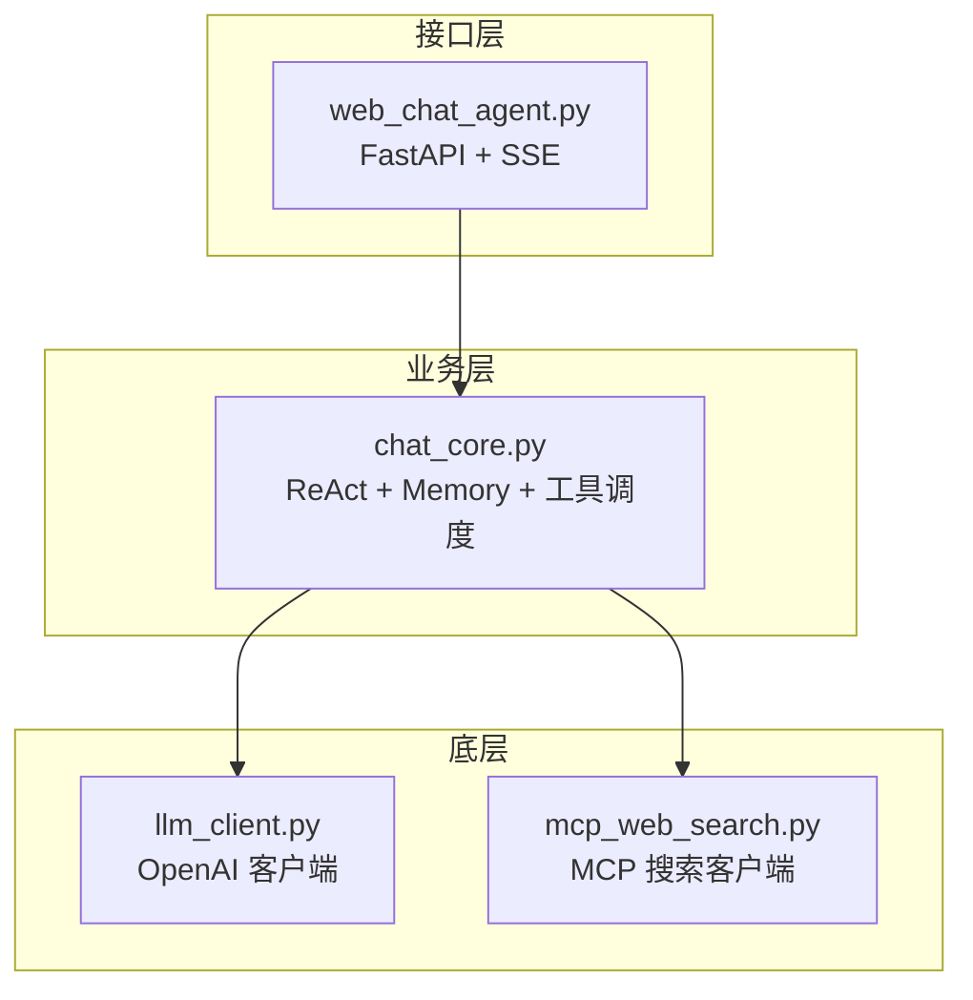
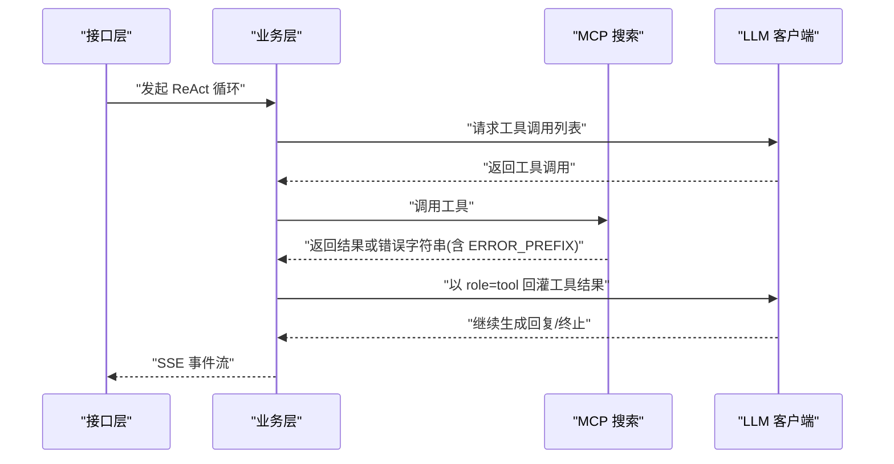
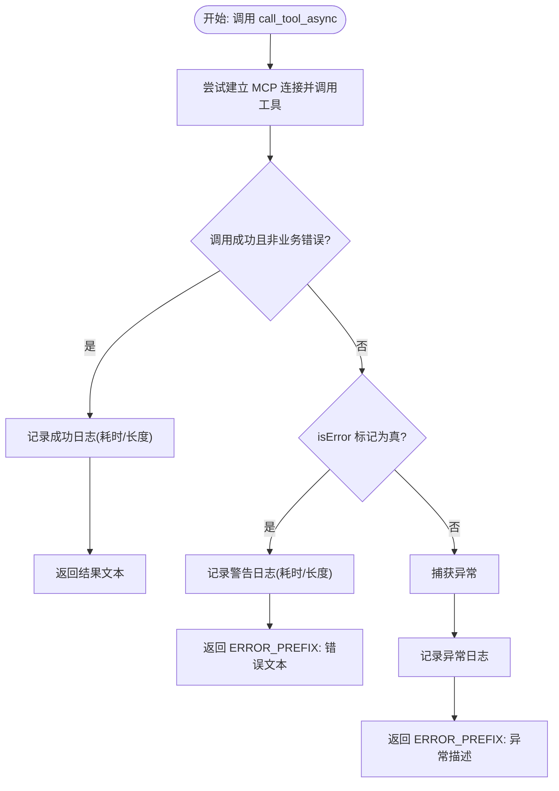
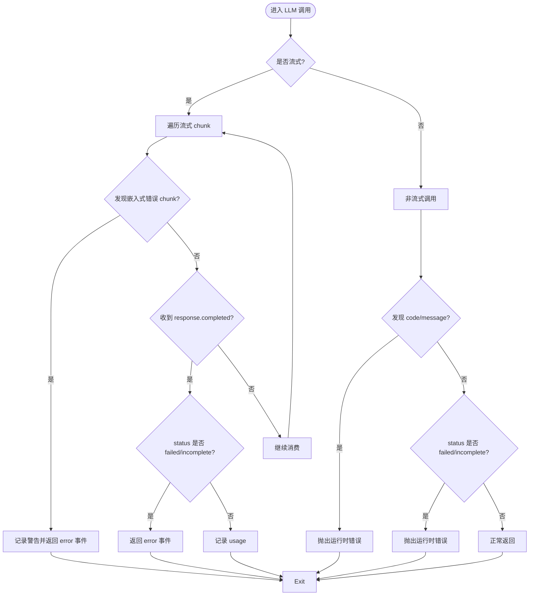
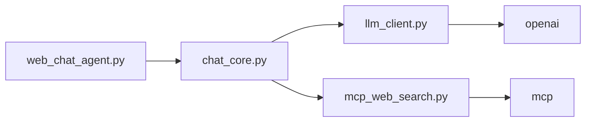

# 错误处理与回退策略

<cite>
**本文引用的文件**
- [README.md](file://README.md)
- [requirements.txt](file://requirements.txt)
- [demo/chat_core.py](file://demo/chat_core.py)
- [demo/common_chat_agent.py](file://demo/common_chat_agent.py)
- [demo/web_chat_agent.py](file://demo/web_chat_agent.py)
- [demo/llm_client.py](file://demo/llm_client.py)
- [demo/mcp_web_search.py](file://demo/mcp_web_search.py)
- [docs/兼容 OpenAI 格式的 Responses API-获取响应.md](file://docs/兼容 OpenAI 格式的 Responses API-获取响应.md)
</cite>

## 目录
1. [简介](#简介)
2. [项目结构](#项目结构)
3. [核心组件](#核心组件)
4. [架构总览](#架构总览)
5. [详细组件分析](#详细组件分析)
6. [依赖分析](#依赖分析)
7. [性能考量](#性能考量)
8. [故障排除指南](#故障排除指南)
9. [结论](#结论)
10. [附录](#附录)

## 简介
本文件聚焦“错误处理与回退策略”，系统阐述工具调用失败时的统一错误处理机制，包括 ERROR_PREFIX 前缀的作用与上层回退策略；区分网络错误、认证失败、参数错误与业务错误；详解 call_tool_async 的异常捕获与异常转换为错误字符串的策略；提供错误日志记录最佳实践（参数预览、时间统计、错误分类）；并给出完整的错误处理示例与故障排除指南。

## 项目结构
该项目采用分层设计：
- 接口层（FastAPI + SSE）：负责路由、参数校验与事件流序列化
- 业务层（ReAct + Memory + 工具调度）：负责记忆管理、ReAct 循环与工具调用编排
- 底层（LLM 客户端 + MCP 搜索）：负责与模型与外部工具的通信

图表来源
- [demo/web_chat_agent.py:127-140](file://demo/web_chat_agent.py#L127-L140)
- [demo/chat_core.py:958-998](file://demo/chat_core.py#L958-L998)
- [demo/llm_client.py:618-646](file://demo/llm_client.py#L618-L646)
- [demo/mcp_web_search.py:127-164](file://demo/mcp_web_search.py#L127-L164)

章节来源
- [README.md:44-57](file://README.md#L44-L57)
- [requirements.txt:1-5](file://requirements.txt#L1-L5)

## 核心组件
- 错误前缀与统一错误字符串：MCP 工具调用失败时返回以 ERROR_PREFIX 开头的字符串，便于上层识别与回退
- call_tool_async 异常捕获：在异常时转换为错误字符串，不抛出异常，交由上层模型消化
- LLM 客户端错误分类：区分网络错误、认证失败、参数错误与业务错误，并在流式与非流式路径中分别处理
- 业务层回退策略：在工具调用失败时将其作为“观察”回灌给模型，由模型自行恢复或引导用户干预

章节来源
- [demo/mcp_web_search.py:28-29](file://demo/mcp_web_search.py#L28-L29)
- [demo/mcp_web_search.py:127-164](file://demo/mcp_web_search.py#L127-L164)
- [demo/llm_client.py:168-175](file://demo/llm_client.py#L168-L175)
- [demo/llm_client.py:440-449](file://demo/llm_client.py#L440-L449)
- [demo/chat_core.py:544-545](file://demo/chat_core.py#L544-L545)
- [demo/chat_core.py:775-777](file://demo/chat_core.py#L775-L777)

## 架构总览
工具调用失败的错误处理链路如下：
- MCP 层：call_tool_async 捕获异常并返回 ERROR_PREFIX 前缀的错误字符串
- 业务层：将工具结果（含 ERROR_PREFIX）作为 role=tool 的消息回灌给模型
- 模型：根据错误内容决定回退策略（继续尝试、引导用户、终止）

图表来源
- [demo/chat_core.py:775-777](file://demo/chat_core.py#L775-L777)
- [demo/mcp_web_search.py:127-164](file://demo/mcp_web_search.py#L127-L164)
- [demo/llm_client.py:633-646](file://demo/llm_client.py#L633-L646)

## 详细组件分析

### 错误前缀与统一错误字符串（ERROR_PREFIX）
- 定义与作用：ERROR_PREFIX 作为工具调用失败时返回字符串的统一前缀，便于上层快速识别“工具执行失败”
- 使用场景：
  - MCP 工具调用异常或业务错误时，返回形如 “工具调用失败: …” 的字符串
  - 业务层在构建组件 props 时，若工具结果以 ERROR_PREFIX 开头，则不渲染组件，避免误导用户

章节来源
- [demo/mcp_web_search.py:28-29](file://demo/mcp_web_search.py#L28-L29)
- [demo/mcp_web_search.py:146-157](file://demo/mcp_web_search.py#L146-L157)
- [demo/chat_core.py:544-545](file://demo/chat_core.py#L544-L545)

### call_tool_async 的异常捕获与异常转换
- 异常捕获：在调用 MCP 工具时，任何异常都会被捕获并转换为错误字符串
- 异常转换策略：
  - 网络/鉴权/参数/工具自身错误均转换为 ERROR_PREFIX 前缀的字符串
  - 不抛出异常，确保上层 ReAct 循环可继续推进
- 日志记录：
  - 成功：记录耗时与结果长度
  - 业务错误：记录警告级别日志，包含耗时与错误文本长度
  - 异常：记录异常堆栈，随后返回错误字符串

图表来源
- [demo/mcp_web_search.py:127-164](file://demo/mcp_web_search.py#L127-L164)

章节来源
- [demo/mcp_web_search.py:127-164](file://demo/mcp_web_search.py#L127-L164)

### LLM 客户端错误分类与处理
- 错误类型与处理：
  - 网络错误：在流式路径中，遇到嵌入式错误 chunk（HTTP 200 但 body 错误）时，记录警告并返回错误事件
  - 认证失败：在非流式路径中，遇到“上游 API 错误”时抛出运行时错误
  - 参数错误：在非流式路径中，遇到“响应未成功”时抛出运行时错误
  - 业务错误：在流式路径中，遇到“响应未成功”时返回错误事件
- 日志记录：
  - 记录请求参数、首次出现的 chunk 类型、关键生命周期事件
  - 结束时汇总耗时、响应 ID、各类型 chunk 计数、内容/思考字符数、是否触发兜底

图表来源
- [demo/llm_client.py:168-175](file://demo/llm_client.py#L168-L175)
- [demo/llm_client.py:440-449](file://demo/llm_client.py#L440-L449)
- [demo/llm_client.py:200-205](file://demo/llm_client.py#L200-L205)

章节来源
- [demo/llm_client.py:168-175](file://demo/llm_client.py#L168-L175)
- [demo/llm_client.py:440-449](file://demo/llm_client.py#L440-L449)
- [demo/llm_client.py:200-205](file://demo/llm_client.py#L200-L205)
- [docs/兼容 OpenAI 格式的 Responses API-获取响应.md:36-47](file://docs/兼容 OpenAI 格式的 Responses API-获取响应.md#L36-L47)

### 业务层回退策略与工具结果处理
- 工具结果截断：tool_result 事件 payload 的 result 字段超过预设阈值时进行截断，并在日志中保留原文长度
- 组件渲染回退：当工具结果以 ERROR_PREFIX 开头时，不渲染组件，前端显示错误占位
- HITL（人机交互）回退：当触发本地工具（ask_user、execute_shell_command）时，业务层以错误字符串回灌，引导模型向用户求助或说明

章节来源
- [demo/chat_core.py:520-525](file://demo/chat_core.py#L520-L525)
- [demo/chat_core.py:544-545](file://demo/chat_core.py#L544-L545)
- [demo/chat_core.py:613-619](file://demo/chat_core.py#L613-L619)

## 依赖分析
- 外部依赖：
  - openai：与 DashScope 兼容的 OpenAI SDK
  - fastapi/uvicorn：Web 服务框架
  - mcp：MCP 工具调用客户端
- 内部模块依赖：
  - web_chat_agent.py 依赖 chat_core.py 的流式接口
  - chat_core.py 依赖 llm_client.py 与 mcp_web_search.py

图表来源
- [demo/web_chat_agent.py:29-46](file://demo/web_chat_agent.py#L29-L46)
- [demo/chat_core.py:26-34](file://demo/chat_core.py#L26-L34)
- [demo/llm_client.py:25-27](file://demo/llm_client.py#L25-L27)
- [demo/mcp_web_search.py:16-17](file://demo/mcp_web_search.py#L16-L17)
- [requirements.txt:1-5](file://requirements.txt#L1-L5)

章节来源
- [requirements.txt:1-5](file://requirements.txt#L1-L5)
- [demo/web_chat_agent.py:29-46](file://demo/web_chat_agent.py#L29-L46)
- [demo/chat_core.py:26-34](file://demo/chat_core.py#L26-L34)

## 性能考量
- 时间统计：各层均记录耗时（毫秒），便于定位慢调用
- 参数预览：对工具参数与部分日志内容进行截断预览，避免日志膨胀
- 兜底策略：在流式无增量时从完整响应中抽取文本，减少丢失风险
- 连接成本：MCP 工具每次调用建立短连接，避免长连接带来的状态复杂性

章节来源
- [demo/llm_client.py:228-233](file://demo/llm_client.py#L228-L233)
- [demo/llm_client.py:423-429](file://demo/llm_client.py#L423-L429)
- [demo/mcp_web_search.py:134-137](file://demo/mcp_web_search.py#L134-L137)
- [demo/mcp_web_search.py:159-163](file://demo/mcp_web_search.py#L159-L163)

## 故障排除指南
- 环境变量缺失
  - 现象：启动时报错或直接抛出运行时错误
  - 处理：确保设置 DASHSCOPE_API_KEY；参考启动说明
- API 模式非法
  - 现象：模块加载时抛出运行时错误
  - 处理：设置 API_MODE=chat 或 API_MODE=responses（大小写不敏感）
- LLM 调用失败
  - 现象：SSE 返回 error 事件；或流式路径中出现“上游 API 错误”
  - 处理：检查 API 密钥、网络连通性、模型可用性；查看日志中的耗时与错误摘要
- 工具调用失败
  - 现象：工具结果以 ERROR_PREFIX 开头；前端不渲染组件
  - 处理：检查工具参数、MCP 服务可用性；查看日志中的耗时与错误文本长度
- 认证失败
  - 现象：出现“InvalidParameter”等错误；或响应状态为 failed/incomplete
  - 处理：确认 API 密钥有效、工作空间绑定正确；查看响应中的错误对象
- 参数错误
  - 现象：流式路径中出现嵌入式错误 chunk
  - 处理：修正请求参数；查看日志中的首次出现 chunk 类型与错误详情

章节来源
- [demo/web_chat_agent.py:53-58](file://demo/web_chat_agent.py#L53-L58)
- [demo/llm_client.py:47-50](file://demo/llm_client.py#L47-L50)
- [demo/llm_client.py:168-175](file://demo/llm_client.py#L168-L175)
- [demo/llm_client.py:440-449](file://demo/llm_client.py#L440-L449)
- [demo/mcp_web_search.py:43-48](file://demo/mcp_web_search.py#L43-L48)
- [docs/兼容 OpenAI 格式的 Responses API-获取响应.md:36-47](file://docs/兼容 OpenAI 格式的 Responses API-获取响应.md#L36-L47)

## 结论
本项目通过统一的 ERROR_PREFIX 前缀与 call_tool_async 的异常转换策略，实现了工具调用失败时的标准化错误字符串输出；结合 LLM 客户端的多类型错误分类与日志统计，形成了从底层到上层的完整错误处理闭环。业务层将工具结果作为“观察”回灌给模型，使模型具备自恢复与引导用户的能力，从而在复杂场景下实现稳健的回退策略。

## 附录
- 示例：工具调用失败的回退流程
  - MCP 层：捕获异常并返回 ERROR_PREFIX 前缀的错误字符串
  - 业务层：将工具结果作为 role=tool 回灌给模型
  - 模型：根据错误内容决定继续尝试、引导用户或终止
- 最佳实践清单
  - 使用 ERROR_PREFIX 前缀统一错误字符串
  - 在异常捕获后记录异常日志，随后返回错误字符串
  - 对工具参数与日志内容进行预览截断，避免日志膨胀
  - 在流式路径中记录耗时与关键生命周期事件，便于诊断
  - 对业务错误与网络错误进行明确区分，采用不同的回退策略