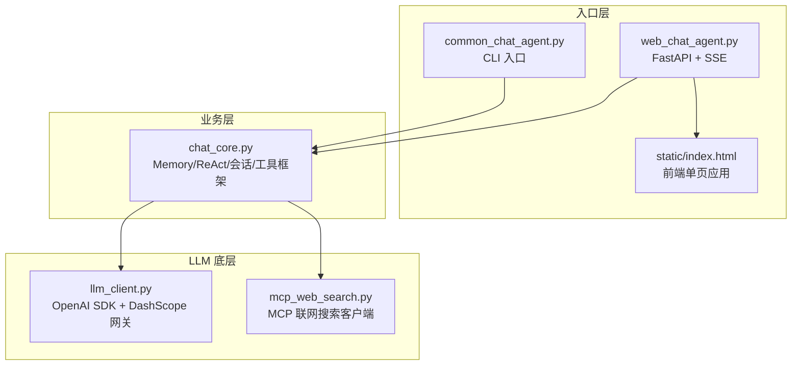
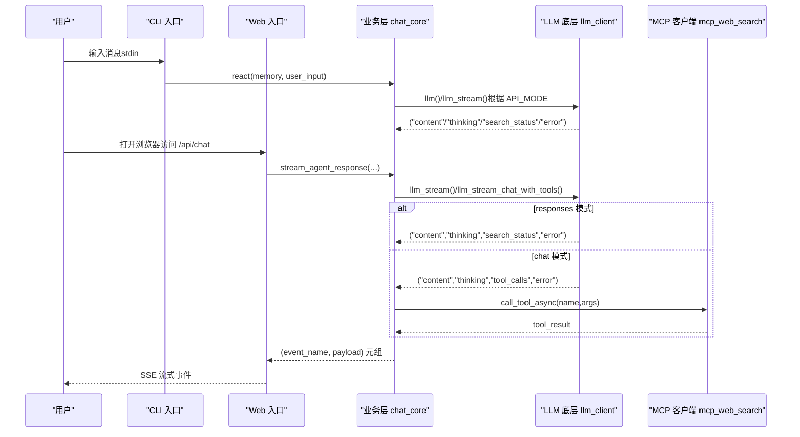
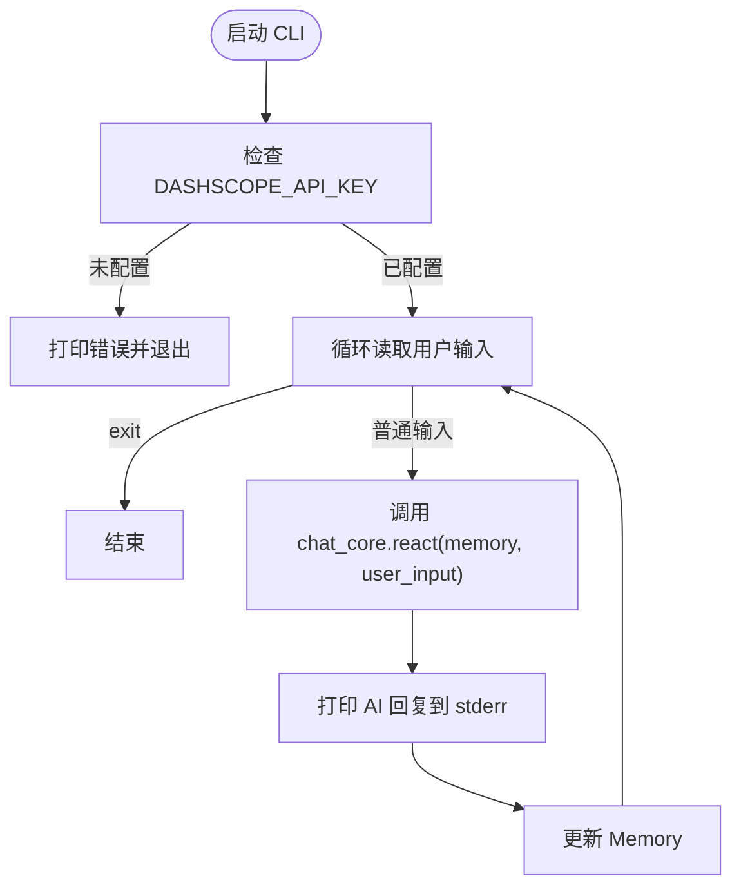
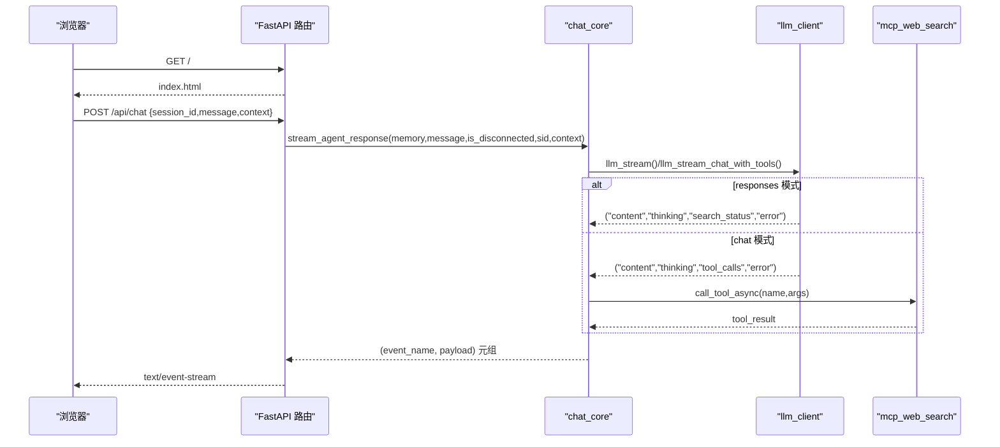
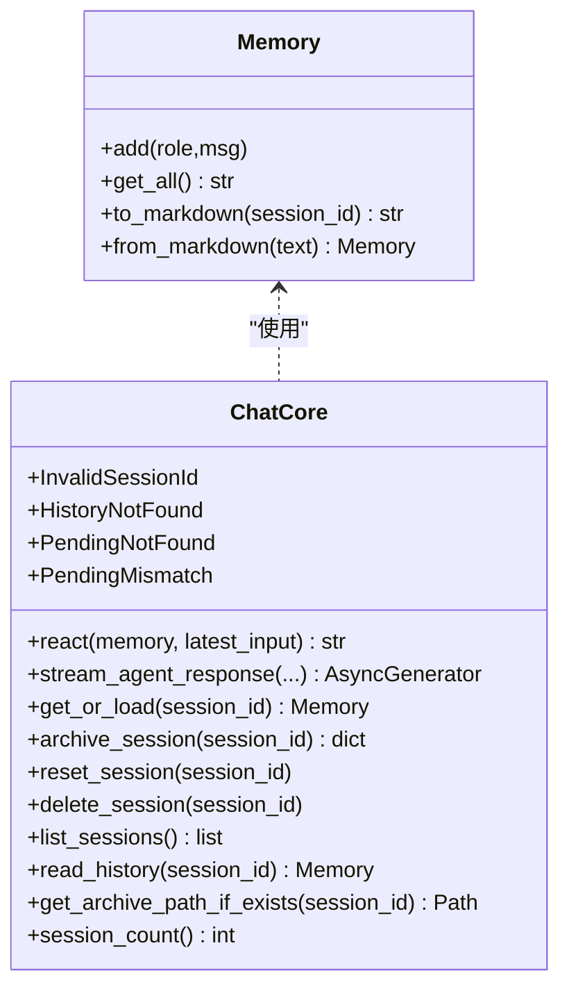
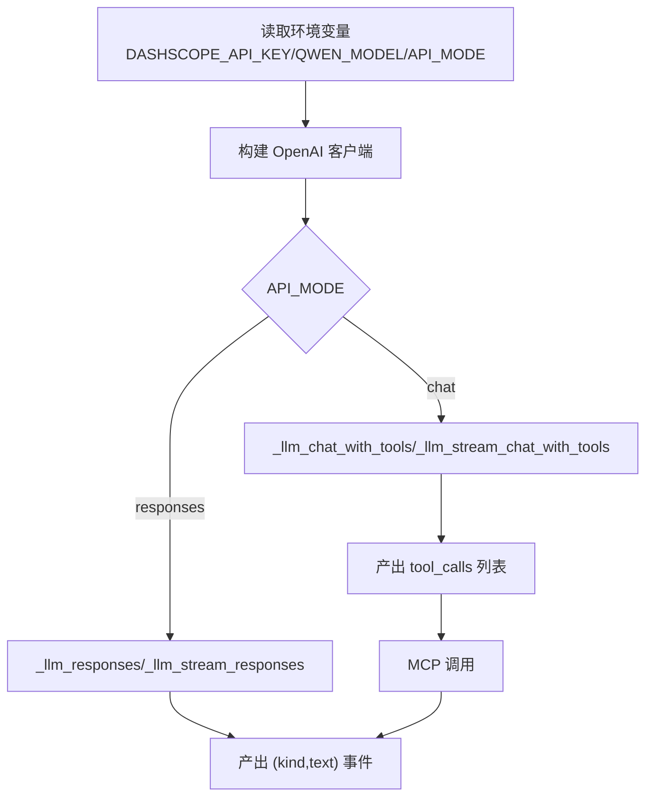
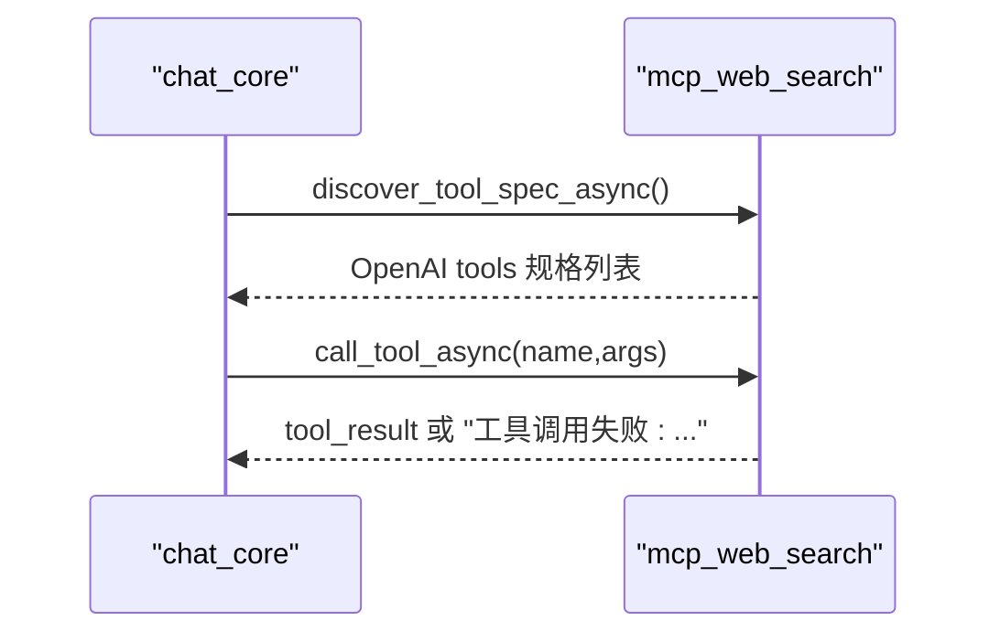
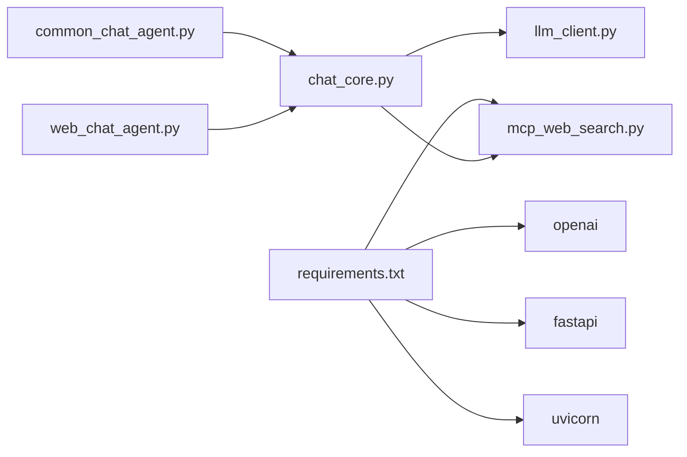

# 快速开始

<cite>
**本文引用的文件**
- [README.md](file://README.md)
- [requirements.txt](file://requirements.txt)
- [demo/common_chat_agent.py](file://demo/common_chat_agent.py)
- [demo/web_chat_agent.py](file://demo/web_chat_agent.py)
- [demo/chat_core.py](file://demo/chat_core.py)
- [demo/llm_client.py](file://demo/llm_client.py)
- [demo/mcp_web_search.py](file://demo/mcp_web_search.py)
- [demo/static/index.html](file://demo/static/index.html)
- [CLAUDE.md](file://CLAUDE.md)
- [scripts/debug_responses.py](file://scripts/debug_responses.py)
</cite>

## 目录
1. [简介](#简介)
2. [项目结构](#项目结构)
3. [核心组件](#核心组件)
4. [架构总览](#架构总览)
5. [详细组件分析](#详细组件分析)
6. [依赖关系分析](#依赖关系分析)
7. [性能注意事项](#性能注意事项)
8. [故障排查指南](#故障排查指南)
9. [结论](#结论)
10. [附录](#附录)

## 简介
本项目是一个用最少代码讲清楚 ReAct（思考-行动-观察）聊天 Agent 的教学 Demo。后端通过 OpenAI Python SDK 调通义千问（DashScope OpenAI-Compat 网关），提供 CLI 和 Web 两个入口，二者共享同一 ReAct 内核。Demo 强调“最小可用”，适合新手快速上手并理解 Agent 的核心流程。

## 项目结构
- demo/：三层架构（入口层、业务层、LLM 底层），包含 CLI 和 Web 两种入口，以及静态前端页面
- docs/：文档与说明
- scripts/：辅助调试脚本
- requirements.txt：Python 依赖清单
- README.md：项目说明与快速开始
- CLAUDE.md：面向 Claude Code 的架构说明与扩展指引

图表来源
- [demo/common_chat_agent.py:1-53](file://demo/common_chat_agent.py#L1-L53)
- [demo/web_chat_agent.py:1-233](file://demo/web_chat_agent.py#L1-L233)
- [demo/chat_core.py:1-1069](file://demo/chat_core.py#L1-L1069)
- [demo/llm_client.py:1-924](file://demo/llm_client.py#L1-L924)
- [demo/mcp_web_search.py:1-172](file://demo/mcp_web_search.py#L1-L172)
- [demo/static/index.html:1-1976](file://demo/static/index.html#L1-L1976)

章节来源
- [README.md:44-57](file://README.md#L44-L57)
- [CLAUDE.md:30-53](file://CLAUDE.md#L30-L53)

## 核心组件
- CLI 入口：从标准输入读取用户消息，调用业务层的 ReAct 循环，将结果打印到标准错误
- Web 入口：FastAPI + SSE，提供 /api/* 接口，前端通过 SSE 流式接收事件
- 业务层：Memory（多轮记忆）、Prompt 模板、ReAct 解析与执行、会话持久化、HITL（人工介入）基础设施
- LLM 底层：统一的 OpenAI SDK 客户端封装，支持 Responses API 与 Chat Completions 两种模式
- MCP 客户端：DashScope WebSearch MCP server 的异步客户端，用于 chat 模式下的联网搜索

章节来源
- [demo/common_chat_agent.py:1-53](file://demo/common_chat_agent.py#L1-L53)
- [demo/web_chat_agent.py:1-233](file://demo/web_chat_agent.py#L1-L233)
- [demo/chat_core.py:1-1069](file://demo/chat_core.py#L1-L1069)
- [demo/llm_client.py:1-924](file://demo/llm_client.py#L1-L924)
- [demo/mcp_web_search.py:1-172](file://demo/mcp_web_search.py#L1-L172)

## 架构总览
两条 LLM 调用路径在业务层汇聚为统一的 SSE 事件契约，前端零分支：
- Responses API 路径：内置 web_search 生命周期事件（仅 responses 模式）
- Chat Completions + Native Function Calling 路径：通过 MCP server 执行工具，事件由 tool_call/tool_result/await_user 等承载

图表来源
- [demo/common_chat_agent.py:1-53](file://demo/common_chat_agent.py#L1-L53)
- [demo/web_chat_agent.py:1-233](file://demo/web_chat_agent.py#L1-L233)
- [demo/chat_core.py:1-1069](file://demo/chat_core.py#L1-L1069)
- [demo/llm_client.py:1-924](file://demo/llm_client.py#L1-L924)
- [demo/mcp_web_search.py:1-172](file://demo/mcp_web_search.py#L1-L172)

## 详细组件分析

### CLI 入口（命令行）
- 启动方式：设置 DASHSCOPE_API_KEY 后运行 demo/common_chat_agent.py
- 行为：循环读取标准输入，调用业务层的 react(memory, user_input)，将 AI 输出打印到标准错误，并更新 Memory
- 退出：输入 exit 退出

图表来源
- [demo/common_chat_agent.py:1-53](file://demo/common_chat_agent.py#L1-L53)
- [demo/chat_core.py:1-1069](file://demo/chat_core.py#L1-L1069)

章节来源
- [README.md:30-35](file://README.md#L30-L35)
- [demo/common_chat_agent.py:1-53](file://demo/common_chat_agent.py#L1-L53)

### Web 入口（浏览器）
- 启动方式：设置 DASHSCOPE_API_KEY 后运行 demo/web_chat_agent.py，浏览器访问 http://127.0.0.1:8000
- 路由：/（静态首页）、/api/health、/api/chat、/api/resume、/api/reset、/api/archive、/api/history、/api/sessions、/api/sessions/{id}/raw
- SSE：将业务层的 (event_name, payload) 元组序列化为 SSE 帧
- 前端：单页应用，包含侧边栏会话列表、主聊天区、锚点面板、归档预览模态等

图表来源
- [demo/web_chat_agent.py:1-233](file://demo/web_chat_agent.py#L1-L233)
- [demo/chat_core.py:1-1069](file://demo/chat_core.py#L1-L1069)
- [demo/llm_client.py:1-924](file://demo/llm_client.py#L1-L924)
- [demo/mcp_web_search.py:1-172](file://demo/mcp_web_search.py#L1-L172)
- [demo/static/index.html:1-1976](file://demo/static/index.html#L1-L1976)

章节来源
- [README.md:37-42](file://README.md#L37-L42)
- [demo/web_chat_agent.py:1-233](file://demo/web_chat_agent.py#L1-L233)
- [demo/static/index.html:1-1976](file://demo/static/index.html#L1-L1976)

### 业务层（Memory + ReAct + 会话）
- Memory：多轮对话记忆，支持序列化为 markdown，反序列化读取
- Prompt 模板：角色设定、工具列表、ReAct 格式说明、对话记录、最新输入
- ReAct：解析 Action/Action Input/Observation，执行工具，回灌 Observation，限制最大轮次
- 会话存储：内存 + 磁盘归档，支持列表、读取、归档、重置、删除
- HITL：本地伪工具 ask_user / execute_shell_command，触发 await_user 事件，前端交互后 POST /api/resume 恢复

图表来源
- [demo/chat_core.py:1-1069](file://demo/chat_core.py#L1-L1069)

章节来源
- [demo/chat_core.py:1-1069](file://demo/chat_core.py#L1-L1069)

### LLM 底层（OpenAI SDK + DashScope）
- 模型与模式：MODEL 来自 QWEN_MODEL 环境变量，API_MODE 默认 responses，可选 chat
- Responses API：client.responses.create，支持内置 web_search 生命周期事件
- Chat Completions：client.chat.completions.create，支持 native function calling + MCP
- 错误处理：嵌入式错误块检测、usage 日志、兜底文本抽取
- 事件协议：("thinking","content","search_status","tool_calls","error") 元组

图表来源
- [demo/llm_client.py:1-924](file://demo/llm_client.py#L1-L924)

章节来源
- [demo/llm_client.py:1-924](file://demo/llm_client.py#L1-L924)

### MCP 客户端（DashScope WebSearch）
- discover_tool_spec[_async]：首次调用列出 MCP 工具并缓存为 OpenAI tools 格式
- call_tool_async：短连接调用工具，失败返回错误字符串
- 错误前缀：ERROR_PREFIX 用于上层识别工具调用失败

图表来源
- [demo/mcp_web_search.py:1-172](file://demo/mcp_web_search.py#L1-L172)

章节来源
- [demo/mcp_web_search.py:1-172](file://demo/mcp_web_search.py#L1-L172)

## 依赖关系分析
- 依赖清单：openai、fastapi、uvicorn、mcp
- 入口模块仅导入 chat_core，业务层再导入 llm_client 与 mcp_web_search
- 环境变量：
  - DASHSCOPE_API_KEY：必填
  - QWEN_MODEL：可选，默认 qwen3.7-max（Responses API + 内置 web_search 推荐）
  - API_MODE：可选，responses 或 chat（大小写不敏感）

图表来源
- [requirements.txt:1-5](file://requirements.txt#L1-L5)
- [demo/common_chat_agent.py:1-53](file://demo/common_chat_agent.py#L1-L53)
- [demo/web_chat_agent.py:1-233](file://demo/web_chat_agent.py#L1-L233)
- [demo/chat_core.py:1-1069](file://demo/chat_core.py#L1-L1069)
- [demo/llm_client.py:1-924](file://demo/llm_client.py#L1-L924)
- [demo/mcp_web_search.py:1-172](file://demo/mcp_web_search.py#L1-L172)

章节来源
- [requirements.txt:1-5](file://requirements.txt#L1-L5)
- [README.md:13-28](file://README.md#L13-L28)
- [CLAUDE.md:13-26](file://CLAUDE.md#L13-L26)

## 性能注意事项
- 流式处理：Responses API 与 Chat Completions 均采用流式，减少等待时间
- 事件聚合：tool_calls 采用增量拼接，最终一次性 yield，避免频繁事件
- 截断策略：tool_result 事件对长文本进行预览截断，完整内容记录在服务端日志
- 最大轮次：MAX_ROUNDS=5，防止模型反复输出 Action 无限消耗 token
- 会话归档：原子写入，避免崩溃产生半文件

## 故障排查指南
- 环境变量未配置
  - 症状：CLI/Web 启动时报错，提示未配置 DASHSCOPE_API_KEY
  - 处理：export DASHSCOPE_API_KEY=sk-xxx
- API 模式非法
  - 症状：模块加载时报错，提示非法 API_MODE
  - 处理：export API_MODE=chat 或 export API_MODE=responses
- Responses API 空响应
  - 处理：使用 scripts/debug_responses.py 打印每个 chunk 类型，定位问题
- MCP 工具调用失败
  - 症状：tool_result 以 ERROR_PREFIX 开头
  - 处理：检查 DASHSCOPE_API_KEY、工具参数、网络连通性
- 会话 ID 非法
  - 症状：HTTP 400
  - 处理：确保 session_id 符合 UUID 格式

章节来源
- [demo/llm_client.py:44-51](file://demo/llm_client.py#L44-L51)
- [demo/llm_client.py:61-71](file://demo/llm_client.py#L61-L71)
- [demo/web_chat_agent.py:53-58](file://demo/web_chat_agent.py#L53-L58)
- [demo/common_chat_agent.py:23-29](file://demo/common_chat_agent.py#L23-L29)
- [scripts/debug_responses.py:1-43](file://scripts/debug_responses.py#L1-L43)
- [demo/mcp_web_search.py:42-49](file://demo/mcp_web_search.py#L42-L49)

## 结论
本项目通过清晰的三层架构与最小化的实现，展示了 ReAct Agent 的核心机制。CLI 与 Web 两种入口共享同一业务内核，分别适用于命令行与图形界面场景。通过合理的事件契约与错误处理，用户可以快速验证安装并开始体验。

## 附录

### 快速开始步骤
- 创建并激活 Python 虚拟环境
  - 创建：python -m venv .venv
  - 激活：source .venv/bin/activate
- 安装依赖
  - pip install -r requirements.txt
- 配置 DashScope API 密钥
  - export DASHSCOPE_API_KEY=sk-xxx
  - 可选：export QWEN_MODEL=qwen-plus
- 启动 CLI
  - python demo/common_chat_agent.py
  - 在标准输入输入消息，输入 exit 退出
- 启动 Web
  - python demo/web_chat_agent.py
  - 浏览器打开 http://127.0.0.1:8000

章节来源
- [README.md:13-28](file://README.md#L13-L28)
- [README.md:30-42](file://README.md#L30-L42)