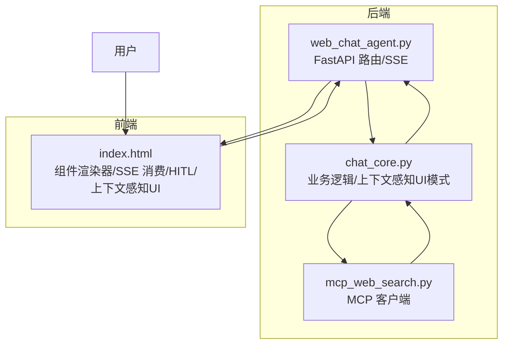
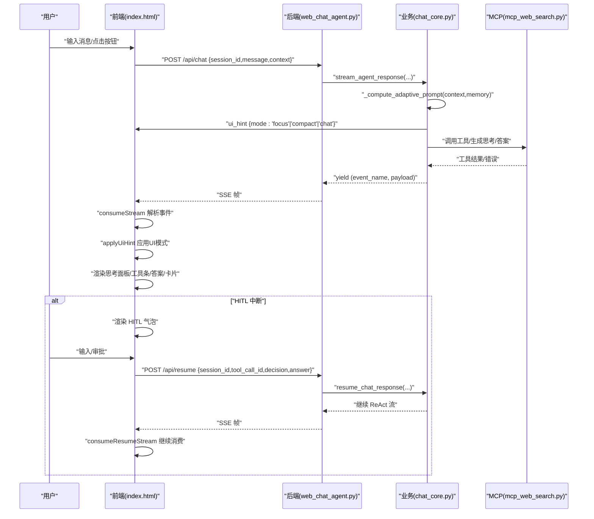
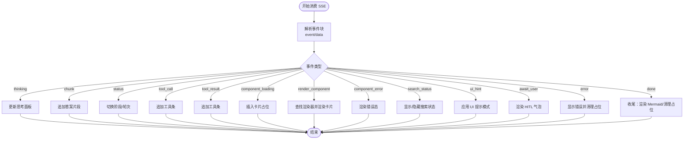
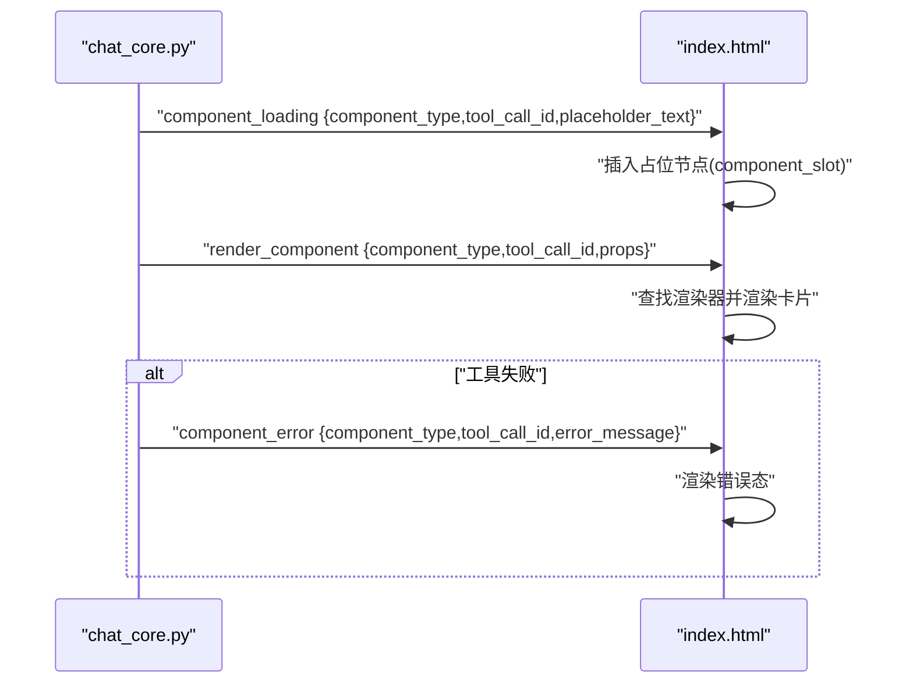
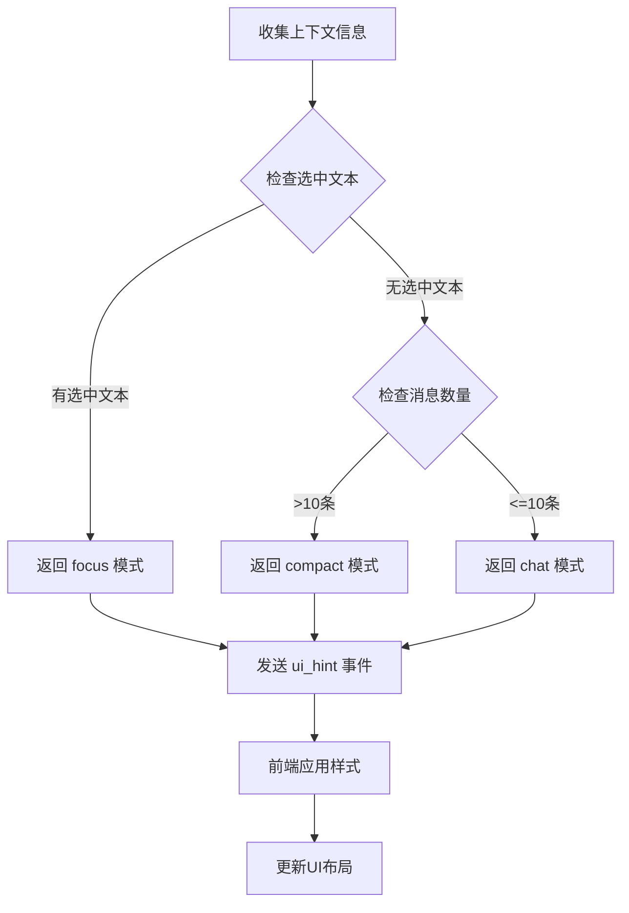
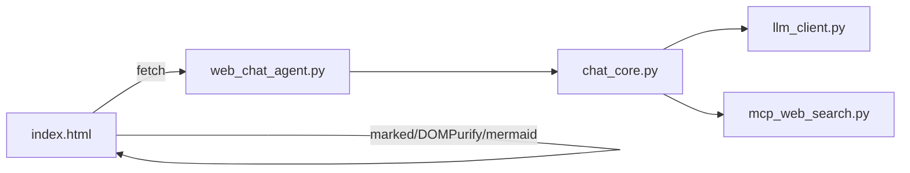

# 前端定制

<cite>
**本文引用的文件**
- [README.md](file://README.md)
- [CLAUDE.md](file://CLAUDE.md)
- [demo/web_chat_agent.py](file://demo/web_chat_agent.py)
- [demo/chat_core.py](file://demo/chat_core.py)
- [demo/mcp_web_search.py](file://demo/mcp_web_search.py)
- [demo/static/index.html](file://demo/static/index.html)
- [docs/OpenAI兼容-Chat 接口文档.md](file://docs/OpenAI兼容-Chat 接口文档.md)
- [docs/兼容 OpenAI 格式的 Responses API-获取响应.md](file://docs/兼容 OpenAI 格式的 Responses API-获取响应.md)
- [docs/ROADMAP-智能体感知与生成式UI演化.md](file://docs/ROADMAP-智能体感知与生成式UI演化.md)
</cite>

## 目录
1. [简介](#简介)
2. [项目结构](#项目结构)
3. [核心组件](#核心组件)
4. [架构总览](#架构总览)
5. [详细组件分析](#详细组件分析)
6. [上下文感知UI模式](#上下文感知ui模式)
7. [依赖分析](#依赖分析)
8. [性能考虑](#性能考虑)
9. [故障排查指南](#故障排查指南)
10. [结论](#结论)
11. [附录](#附录)

## 简介
本指南面向希望扩展与修改 Web 界面组件的开发者，聚焦于如何在现有前端单页应用中添加新的 UI 组件、注册组件渲染器、绑定事件与数据传递、以及实现工具结果的卡片化渲染。文档同时解释前端与后端的数据交互协议、SSE 事件处理流程、上下文感知UI模式、以及可访问性、响应式设计、性能优化的最佳实践。

## 项目结构
- demo/web_chat_agent.py：FastAPI 路由层，负责请求体校验、SSE 序列化与业务层调用。
- demo/chat_core.py：业务逻辑层，包含 Memory、ReAct 循环、会话持久化、HITL、上下文感知、Static Generative UI 的卡片化渲染契约，以及新增的上下文感知UI模式。
- demo/mcp_web_search.py：MCP 客户端，封装 DashScope WebSearch MCP 服务，提供工具发现与调用。
- demo/static/index.html：前端单页应用，包含样式、组件渲染器、SSE 流消费、HITL 交互、归档预览，以及上下文感知UI模式的实现。
- docs/*：OpenAI 兼容接口文档与 Responses API 文档，辅助理解工具调用与事件契约。

图表来源
- [demo/web_chat_agent.py:127-140](file://demo/web_chat_agent.py#L127-L140)
- [demo/chat_core.py:527-559](file://demo/chat_core.py#L527-L559)
- [demo/mcp_web_search.py:89-164](file://demo/mcp_web_search.py#L89-L164)
- [demo/static/index.html:1166-1246](file://demo/static/index.html#L1166-L1246)

章节来源
- [README.md:44-57](file://README.md#L44-L57)
- [CLAUDE.md:30-52](file://CLAUDE.md#L30-L52)

## 核心组件
- 前端组件注册与渲染
  - COMPONENT_RENDERERS：以 component_type 为键的渲染器映射，用于将工具结果 props 渲染为卡片。
  - component_loading/render_component/component_error：前端在工具执行期间的占位、渲染与错误态处理。
- SSE 事件契约
  - 前端通过 consumeStream 解析 SSE 帧，按事件类型更新 UI（思考面板、工具条、答案正文、卡片等）。
- 工具结果卡片化
  - TOOL_COMPONENT_MAP：工具名到 component_type 的映射。
  - _build_component_props：根据工具名、参数与结果文本构建 props。
- 人类在环（HITL）交互
  - 前端根据 await_user 事件渲染输入/审批气泡，用户操作后通过 /api/resume 恢复 ReAct 循环。
- **上下文感知UI模式**：前端根据 ui_hint 事件应用不同的UI模式（focus、compact、chat）。

章节来源
- [demo/static/index.html:931-946](file://demo/static/index.html#L931-L946)
- [demo/chat_core.py:527-559](file://demo/chat_core.py#L527-L559)
- [demo/static/index.html:1411-1527](file://demo/static/index.html#L1411-L1527)
- [demo/chat_core.py:724-799](file://demo/chat_core.py#L724-L799)
- [demo/chat_core.py:975-977](file://demo/chat_core.py#L975-L977)

## 架构总览
前端与后端通过 SSE 事件契约进行解耦：后端在 chat_core 中产出统一的事件元组，HTTP 层将其序列化为 SSE；前端在 index.html 中消费这些事件并驱动 UI 更新。卡片化渲染遵循 Static Generative UI 的约定，通过 TOOL_COMPONENT_MAP 与 COMPONENT_RENDERERS 实现。新增的上下文感知UI模式通过 ui_hint 事件实现，后端根据前端上报的上下文信息计算推荐的UI模式。

图表来源
- [demo/web_chat_agent.py:127-140](file://demo/web_chat_agent.py#L127-L140)
- [demo/chat_core.py:632-800](file://demo/chat_core.py#L632-L800)
- [demo/mcp_web_search.py:127-164](file://demo/mcp_web_search.py#L127-L164)
- [demo/static/index.html:1557-1584](file://demo/static/index.html#L1557-L1584)
- [demo/static/index.html:1719-1744](file://demo/static/index.html#L1719-L1744)

## 详细组件分析

### 组件注册与事件处理
- 前端注册机制
  - COMPONENT_RENDERERS：以 component_type 为键，值为渲染函数，接收 props 并返回 DOM 节点。
  - component_loading：在工具调用开始时插入占位节点，等待 render_component 或 component_error。
  - render_component：根据 component_type 查找渲染器，将 props 渲染为卡片。
  - component_error：当工具失败或 props 构建失败时，渲染错误态。
- 事件处理流程
  - consumeStream：解析 SSE 帧，按事件类型更新思考面板、工具条、答案正文、卡片槽位等。
  - await_user：渲染 HITL 气泡，等待用户输入或审批，随后通过 /api/resume 恢复。
  - error/done：错误时显示错误文案，done 时收尾（渲染 Mermaid、清理占位）。
  - **ui_hint：应用上下文感知UI模式**。

图表来源
- [demo/static/index.html:1411-1527](file://demo/static/index.html#L1411-L1527)

章节来源
- [demo/static/index.html:931-946](file://demo/static/index.html#L931-L946)
- [demo/static/index.html:1411-1527](file://demo/static/index.html#L1411-L1527)

### 工具结果卡片化渲染机制
- 后端契约
  - TOOL_COMPONENT_MAP：工具名到 component_type 的映射。
  - _build_component_props：根据工具名、参数与结果文本构建 props；若失败返回 None。
  - 事件序列：component_loading → render_component（或 component_error）。
- 前端契约
  - COMPONENT_RENDERERS：按 component_type 渲染卡片。
  - 卡片槽位：component_slots Map 以 tool_call_id 管理占位节点。
- 流程示意

图表来源
- [demo/chat_core.py:527-559](file://demo/chat_core.py#L527-L559)
- [demo/static/index.html:1443-1475](file://demo/static/index.html#L1443-L1475)

章节来源
- [demo/chat_core.py:527-559](file://demo/chat_core.py#L527-L559)
- [demo/static/index.html:931-946](file://demo/static/index.html#L931-L946)

### 添加新 UI 组件的步骤
- 后端步骤
  1) 在 chat_core.TOOL_COMPONENT_MAP 中注册工具名到 component_type 的映射。
  2) 在 chat_core._build_component_props 中添加 if 分支，从 args 与 result_text 构建 props。
  3) 如需错误态，确保失败时返回 None 或在前端 component_error 分支处理。
- 前端步骤
  1) 在 COMPONENT_RENDERERS 中添加同 component_type 的渲染函数，返回 DOM 节点。
  2) 在 consumeStream 中确保 component_loading/render_component/component_error 分支正确处理。
- 测试验证
  - 发起一次会话，触发该工具，观察前端是否先显示 loading，再渲染卡片或错误态。

章节来源
- [CLAUDE.md:202-223](file://CLAUDE.md#L202-L223)
- [demo/chat_core.py:527-559](file://demo/chat_core.py#L527-L559)
- [demo/static/index.html:931-946](file://demo/static/index.html#L931-L946)

### 事件绑定与数据传递
- 事件绑定
  - consumeStream：统一解析事件并更新 UI。
  - consumeResumeStream：在 HITL 恢复时复用同一消费循环。
- 数据传递
  - 前端通过 fetch 发送 {session_id, message, context}，后端在 stream_agent_response 中透传 context。
  - 前端通过 /api/resume 发送 {session_id, tool_call_id, decision, answer}。
- 上下文感知
  - 前端收集 viewport_width、selected_text、session_message_count，后端据此计算 adaptive_fragment 与 ui_hint。

章节来源
- [demo/static/index.html:1557-1584](file://demo/static/index.html#L1557-L1584)
- [demo/static/index.html:1719-1744](file://demo/static/index.html#L1719-L1744)
- [demo/chat_core.py:403-419](file://demo/chat_core.py#L403-L419)

### 样式定制与主题
- CSS 变量与主题
  - :root 定义颜色变量，整体采用浅色/深色对比与品牌色。
- 卡片样式
  - search-results-card、component-loading、component-error 等类名用于卡片渲染与错误态。
- 响应式与可访问性
  - 使用语义化标签与适当的 ARIA 属性；滚动与焦点管理；键盘交互（Enter 发送、Ctrl/Cmd+Enter 提交）。
- **上下文感知UI样式**
  - .focus-hint：焦点模式提示样式。
  - #messages.compact-mode：紧凑模式样式，折叠历史消息。

章节来源
- [demo/static/index.html:13-806](file://demo/static/index.html#L13-L806)
- [demo/static/index.html:795-806](file://demo/static/index.html#L795-L806)

## 上下文感知UI模式

### 模式概述
系统支持三种上下文感知UI模式，根据前端上报的环境上下文动态选择最适合的界面布局：

- **focus 模式**：针对选中文本的问答场景，突出显示焦点提示
- **compact 模式**：长对话场景，折叠历史消息，节省空间
- **chat 模式**：默认模式，不进行特殊处理

### 前端实现
- **collectContext()**：收集上下文信息
  - viewport_width：窗口宽度
  - selected_text：选中文本（最多500字符）
  - session_message_count：用户消息数量
- **applyUiHint()**：应用UI模式
  - 清除之前的模式状态
  - 根据 mode 参数应用相应样式
  - focus模式添加焦点提示，compact模式折叠历史

### 后端实现
- **_compute_adaptive_prompt()**：计算适应性提示
  - 优先检测选中文本，返回 focus 模式
  - 检测会话消息数量，超过10条返回 compact 模式
  - 默认返回 chat 模式
- **ui_hint 事件**：在流开头发送UI模式建议

### 样式实现
- **focus 模式样式**：.focus-hint 类，显示"针对选中文本回答"提示
- **compact 模式样式**：#messages.compact-mode 类，折叠最后6条消息并在顶部显示"历史消息已折叠"提示
- **模式切换逻辑**：applyUiHint 函数根据 mode 参数动态应用样式

图表来源
- [demo/chat_core.py:403-419](file://demo/chat_core.py#L403-L419)
- [demo/static/index.html:1537-1555](file://demo/static/index.html#L1537-L1555)

**章节来源**
- [demo/chat_core.py:403-419](file://demo/chat_core.py#L403-L419)
- [demo/static/index.html:1537-1555](file://demo/static/index.html#L1537-L1555)
- [demo/static/index.html:795-806](file://demo/static/index.html#L795-L806)
- [CLAUDE.md:77-83](file://CLAUDE.md#L77-L83)
- [docs/ROADMAP-智能体感知与生成式UI演化.md:167-198](file://docs/ROADMAP-智能体感知与生成式UI演化.md#L167-L198)

## 依赖分析
- 前端依赖
  - marked：Markdown 解析与渲染。
  - DOMPurify：XSS 清洗。
  - mermaid：图表渲染（惰性加载）。
- 后端依赖
  - FastAPI：路由与 SSE。
  - mcp：MCP 客户端，与 DashScope WebSearch MCP 通信。
- 层间依赖
  - web_chat_agent 仅导入 chat_core 的导出，不直接依赖 llm_client/mcp_web_search。
  - chat_core 仅导入 llm_client 与 mcp_web_search，不依赖 FastAPI。
  - mcp_web_search 与 llm_client 互不导入。

图表来源
- [CLAUDE.md:40-52](file://CLAUDE.md#L40-L52)
- [demo/web_chat_agent.py:29-46](file://demo/web_chat_agent.py#L29-L46)
- [demo/chat_core.py:24-34](file://demo/chat_core.py#L24-L34)

章节来源
- [CLAUDE.md:40-52](file://CLAUDE.md#L40-L52)

## 性能考虑
- SSE 流式渲染
  - 仅在首次内容到达时切换"思考/回答"阶段，减少 DOM 重排。
  - 滚动策略：仅在用户靠近底部时自动跟随，避免频繁滚动打断。
- 卡片渲染
  - component_loading 占位避免空白，render_component 后即时替换。
  - Mermaid 渲染惰性执行，失败时回退为源码块。
- 资源加载
  - mermaid 按需加载，失败重试；组件渲染器集中管理，避免重复定义。
- 会话与锚点
  - IntersectionObserver 精准追踪可见用户消息，减少不必要的计算。
- **上下文感知UI模式性能**
  - 模式切换仅涉及CSS类的添加/移除，开销极小。
  - compact模式通过CSS选择器隐藏元素，避免DOM操作。

章节来源
- [demo/static/index.html:1340-1409](file://demo/static/index.html#L1340-L1409)
- [demo/static/index.html:955-1013](file://demo/static/index.html#L955-L1013)
- [demo/static/index.html:795-806](file://demo/static/index.html#L795-L806)

## 故障排查指南
- 常见问题
  - 会话 ID 无效：后端抛出 InvalidSessionId，HTTP 层转换为 400。
  - 历史不存在：HTTP 层 404，前端显示空对话。
  - HITL 恢复失败：HTTP 层 404/409，前端显示错误并清理占位。
  - MCP 工具调用失败：返回错误字符串，前端渲染 component_error。
  - **UI模式应用失败**：检查 ui_hint 事件是否正确发送，确认 applyUiHint 函数正常执行。
- 前端调试
  - consumeStream 中的 error 事件会显示错误文案并清理未完成的卡片占位。
  - showToast 提供轻量提示，便于定位问题。
  - **检查控制台是否有 applyUiHint 相关错误**。
- 后端日志
  - chat_core 与 mcp_web_search 记录详细日志，包含参数预览与耗时，便于定位问题。
  - **检查 _compute_adaptive_prompt 是否正确计算模式**。

章节来源
- [demo/web_chat_agent.py:133-167](file://demo/web_chat_agent.py#L133-L167)
- [demo/chat_core.py:520-525](file://demo/chat_core.py#L520-L525)
- [demo/mcp_web_search.py:139-164](file://demo/mcp_web_search.py#L139-L164)
- [demo/static/index.html:1486-1524](file://demo/static/index.html#L1486-L1524)

## 结论
本项目通过清晰的三层架构与统一的 SSE 事件契约，实现了前后端解耦与可扩展的 UI 渲染机制。新增的上下文感知UI模式进一步提升了用户体验，能够根据用户的操作环境和对话状态自动调整界面布局。开发者可通过 TOOL_COMPONENT_MAP 与 COMPONENT_RENDERERS 轻松扩展卡片化组件，并借助上下文感知与 HITL 交互提升用户体验。建议在扩展时遵循层间依赖约束与安全边界，确保 XSS 与资源加载的安全与性能。

## 附录
- API 与事件契约
  - SSE 事件类型与含义详见 CLAUDE.md 的"SSE 事件契约"章节。
  - OpenAI 兼容接口与 Responses API 文档用于理解工具调用与流式输出。
- 最佳实践清单
  - 保持层间依赖单向流动。
  - XSS：用户输入仅文本渲染，LLM 输出经 DOMPurify 清洗后再渲染。
  - 响应式：媒体查询与弹性布局适配移动端。
  - 可访问性：语义化标签、键盘可达、焦点管理与 ARIA 描述。
  - 性能：惰性加载、流式渲染、占位与错误态快速反馈。
  - **上下文感知**：合理使用 ui_hint 事件，避免过度频繁的模式切换。

章节来源
- [CLAUDE.md:176-223](file://CLAUDE.md#L176-L223)
- [docs/OpenAI兼容-Chat 接口文档.md:1-100](file://docs/OpenAI兼容-Chat 接口文档.md#L1-L100)
- [docs/兼容 OpenAI 格式的 Responses API-获取响应.md:1-48](file://docs/兼容 OpenAI 格式的 Responses API-获取响应.md#L1-L48)