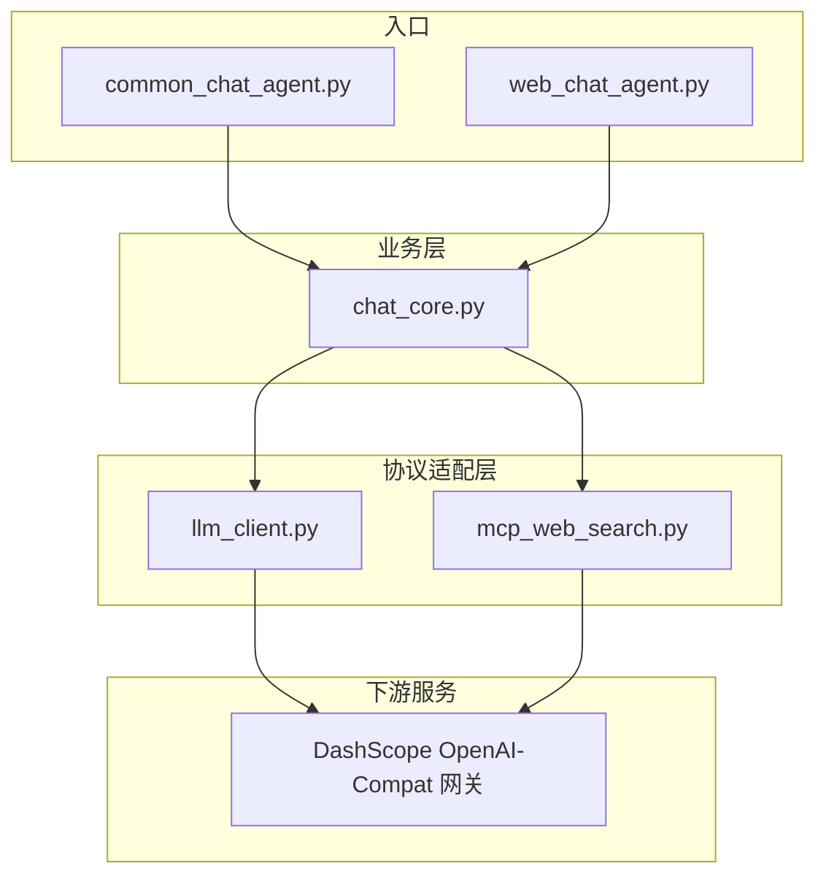
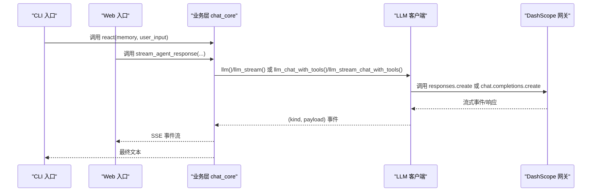
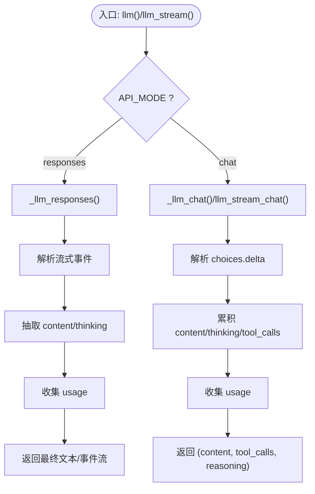
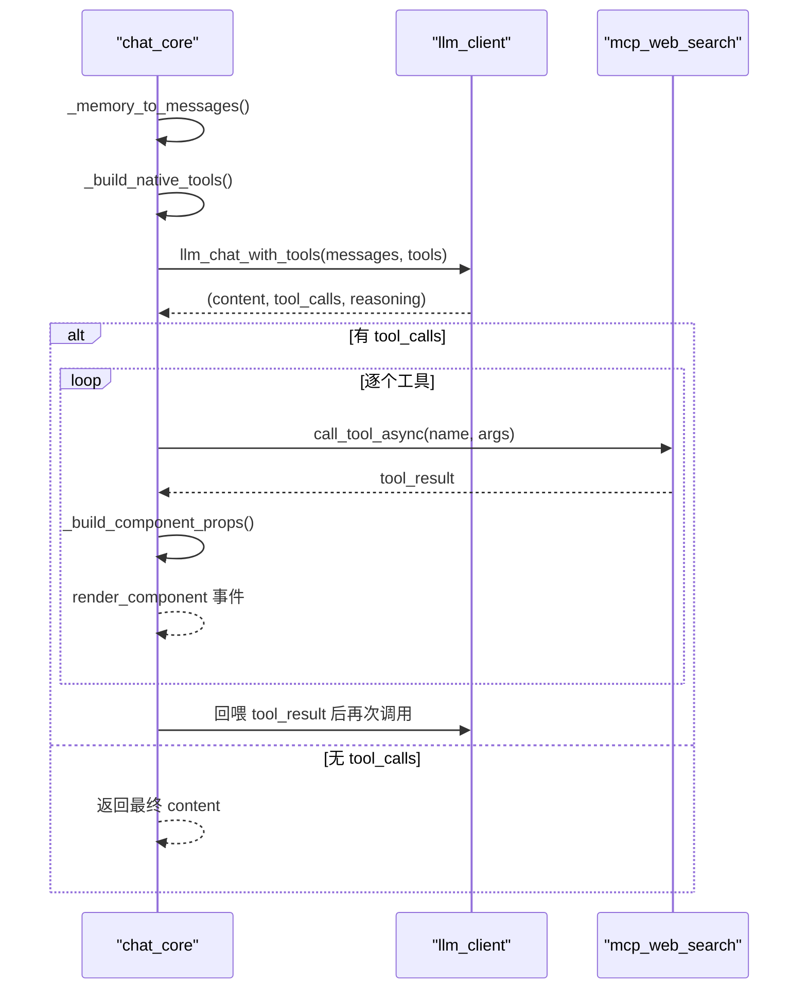
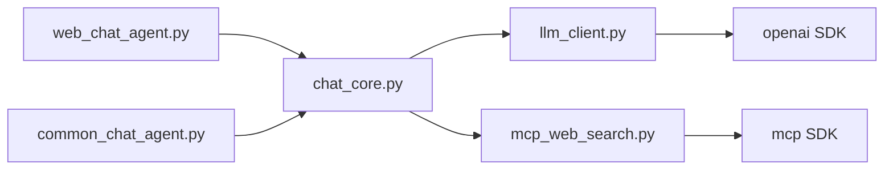

# 协议扩展

<cite>
**本文引用的文件**
- [README.md](file://README.md)
- [requirements.txt](file://requirements.txt)
- [demo/llm_client.py](file://demo/llm_client.py)
- [demo/chat_core.py](file://demo/chat_core.py)
- [demo/web_chat_agent.py](file://demo/web_chat_agent.py)
- [demo/common_chat_agent.py](file://demo/common_chat_agent.py)
- [demo/mcp_web_search.py](file://demo/mcp_web_search.py)
- [docs/OpenAI兼容-Chat 接口文档.md](file://docs/OpenAI兼容-Chat 接口文档.md)
- [docs/兼容 OpenAI 格式的 Responses API-获取响应.md](file://docs/兼容 OpenAI 格式的 Responses API-获取响应.md)
- [docs/单prompt拼接 vs messages数组-对比分析.md](file://docs/单prompt拼接 vs messages数组-对比分析.md)
- [docs/联网搜索说明文档.md](file://docs/联网搜索说明文档.md)
- [docs/联网搜索-mcp-接口文档.md](file://docs/联网搜索-mcp-接口文档.md)
</cite>

## 目录
1. [简介](#简介)
2. [项目结构](#项目结构)
3. [核心组件](#核心组件)
4. [架构总览](#架构总览)
5. [详细组件分析](#详细组件分析)
6. [依赖分析](#依赖分析)
7. [性能考量](#性能考量)
8. [故障排查指南](#故障排查指南)
9. [结论](#结论)
10. [附录](#附录)

## 简介
本指南面向希望在现有 LLM 客户端基础上扩展新协议支持的开发者。项目以最小代码实现 ReAct Agent 的核心流程，后端通过 OpenAI 兼容模式对接通义千问（DashScope OpenAI-Compat 网关），提供 CLI 与 Web 两种入口，共享同一 ReAct 内核。

- 支持两种 API 模式：
  - responses 模式：兼容 OpenAI 格式的 Responses API，内置 web_search 生命周期事件。
  - chat 模式：OpenAI 兼容 Chat Completions + 原生 function calling，联网搜索通过 MCP 工具链实现。
- 协议适配层位于底层 LLM 客户端模块，通过环境变量 API_MODE 切换。
- 本指南将详细说明如何在现有架构上添加新的协议支持，包括 API 模式的切换机制、协议适配层设计、responses API 与 chat API 的区别与适用场景、协议间兼容性、参数映射、错误处理与性能优化、安全与版本管理策略。

## 项目结构
- demo/llm_client.py：底层 LLM 基础层，负责“prompt/messages → 文本/流式 (kind, payload)”抽象，提供 responses 与 chat 两种模式的实现与路由。
- demo/chat_core.py：业务逻辑层，包含 Memory、ReAct 循环、会话管理、工具调用与 UI 组件渲染等。
- demo/web_chat_agent.py：FastAPI + SSE 的 HTTP 入口，将业务层事件序列化为 SSE。
- demo/common_chat_agent.py：CLI 入口，调用 chat_core.react()。
- demo/mcp_web_search.py：MCP 联网搜索客户端，封装 DashScope WebSearch MCP server 的 streamableHttp。
- docs/：协议与功能说明文档，包括 OpenAI 兼容 Chat 接口、Responses API、单 prompt 拼接 vs messages 数组、联网搜索等。

图表来源
- [demo/web_chat_agent.py:127-140](file://demo/web_chat_agent.py#L127-L140)
- [demo/common_chat_agent.py:17-48](file://demo/common_chat_agent.py#L17-L48)
- [demo/chat_core.py:632-800](file://demo/chat_core.py#L632-L800)
- [demo/llm_client.py:113-122](file://demo/llm_client.py#L113-L122)
- [demo/mcp_web_search.py:89-117](file://demo/mcp_web_search.py#L89-L117)

章节来源
- [README.md:44-57](file://README.md#L44-L57)
- [requirements.txt:1-5](file://requirements.txt#L1-L5)

## 核心组件
- 底层 LLM 客户端（llm_client.py）
  - 提供统一的 (kind, payload) 事件协议，屏蔽上游 API 差异。
  - 通过环境变量 API_MODE 切换 responses 与 chat 两种模式。
  - 提供同步/异步流式接口，以及 Chat Completions + tools 的原生 function calling 能力。
- 业务层（chat_core.py）
  - 维护 Memory、ReAct 循环、会话持久化、HITL（Human-in-the-Loop）与工具调用。
  - 在 chat 模式下，支持 native function calling 与 MCP 工具链。
- HTTP/Web 入口（web_chat_agent.py）
  - FastAPI + SSE，将业务层事件序列化为 SSE 流。
- CLI 入口（common_chat_agent.py）
  - 读取 stdin，调用 chat_core.react()，输出到 stderr。
- MCP 工具链（mcp_web_search.py）
  - 封装 DashScope WebSearch MCP server，提供 discover_tool_spec 与 call_tool_async。

章节来源
- [demo/llm_client.py:1-17](file://demo/llm_client.py#L1-L17)
- [demo/chat_core.py:1-13](file://demo/chat_core.py#L1-L13)
- [demo/web_chat_agent.py:1-10](file://demo/web_chat_agent.py#L1-L10)
- [demo/common_chat_agent.py:1-6](file://demo/common_chat_agent.py#L1-L6)
- [demo/mcp_web_search.py:1-8](file://demo/mcp_web_search.py#L1-L8)

## 架构总览
- API 模式切换
  - responses 模式：使用 client.responses.create，支持内置 web_search 生命周期事件，适合需要统一生命周期控制的场景。
  - chat 模式：使用 client.chat.completions.create，支持原生 function calling 与 MCP 工具链，适合需要结构化工具调用与更灵活的消息组织。
- 事件协议
  - 统一的 (kind, payload) 元组，包括 content/thinking/tool_calls/error 等，确保上层业务逻辑与底层协议解耦。
- 适配层职责
  - 将不同上游 API 的响应/流式事件映射为统一的事件协议。
  - 在 chat 模式下，负责将 messages 数组与 tools 列表映射到上游 Chat Completions 协议。

图表来源
- [demo/common_chat_agent.py:44](file://demo/common_chat_agent.py#L44)
- [demo/web_chat_agent.py:127-140](file://demo/web_chat_agent.py#L127-L140)
- [demo/chat_core.py:632-800](file://demo/chat_core.py#L632-L800)
- [demo/llm_client.py:113-122](file://demo/llm_client.py#L113-L122)

## 详细组件分析

### 底层 LLM 客户端（llm_client.py）
- API 模式与路由
  - 通过环境变量 API_MODE 切换 responses 与 chat，非法值在模块加载时抛错。
  - llm()/llm_stream() 根据 API_MODE 路由到 responses 或 chat 实现。
  - llm_chat_with_tools()/llm_stream_chat_with_tools() 专用于 chat 模式下的原生 function calling。
- 事件协议
  - responses 模式：content/thinking/search_status/error。
  - chat 模式：content/thinking/tool_calls/error。
  - 统一的 (kind, payload) 抽象，屏蔽上游差异。
- 错误处理
  - 嵌入式错误检测：对上游返回的错误字段进行识别与抛出。
  - usage 信息：在流式末尾或响应完成时携带 usage 统计。
- 参数映射
  - responses 模式：input=prompt，tools=[{"type":"web_search"}]，enable_thinking。
  - chat 模式：messages=[{"role":"user","content":prompt}]，extra_body.enable_search 或 tools + native function calling。
- 性能优化
  - 流式兜底：当上游未逐字返回 delta 时，从 response.output 抽取文本。
  - usage 收集：在流式末尾或响应完成时收集 usage，减少额外请求。

图表来源
- [demo/llm_client.py:113-122](file://demo/llm_client.py#L113-L122)
- [demo/llm_client.py:124-234](file://demo/llm_client.py#L124-L234)
- [demo/llm_client.py:237-333](file://demo/llm_client.py#L237-L333)
- [demo/llm_client.py:340-355](file://demo/llm_client.py#L340-L355)
- [demo/llm_client.py:357-496](file://demo/llm_client.py#L357-L496)
- [demo/llm_client.py:498-610](file://demo/llm_client.py#L498-L610)
- [demo/llm_client.py:618-795](file://demo/llm_client.py#L618-L795)
- [demo/llm_client.py:798-924](file://demo/llm_client.py#L798-L924)

章节来源
- [demo/llm_client.py:1-17](file://demo/llm_client.py#L1-L17)
- [demo/llm_client.py:34-51](file://demo/llm_client.py#L34-L51)
- [demo/llm_client.py:113-122](file://demo/llm_client.py#L113-L122)
- [demo/llm_client.py:340-355](file://demo/llm_client.py#L340-L355)
- [demo/llm_client.py:618-795](file://demo/llm_client.py#L618-L795)

### 业务层（chat_core.py）
- Memory 与会话管理
  - Memory 类负责对话记忆的序列化/反序列化，支持 Markdown 格式归档。
  - 会话持久化：内存缓存 + 磁盘归档，提供 get_or_load、archive_session、reset_session、delete_session、list_sessions、read_history 等。
- ReAct 协议解析
  - match_tool_action：从 LLM 返回中匹配工具调用。
  - parse_action_input：解析 Action Input 的 JSON。
  - execute_tool：框架预留工具执行入口。
- Chat 模式 native function calling
  - _memory_to_messages：将 Memory 转为 OpenAI Chat Completions messages 数组。
  - _build_native_tools/_build_native_tools_async：发现 MCP 工具规范并合并本地工具。
  - _react_chat_native：CLI 同步 ReAct 循环。
  - _stream_react_rounds：Web 异步 ReAct 流式循环，支持 HITL 与断点续跑。
- 工具结果卡片化
  - TOOL_COMPONENT_MAP：工具名 → 前端组件类型映射。
  - _build_component_props：构建前端组件 props。
- 错误处理
  - 对工具调用失败返回 ERROR_PREFIX 前缀字符串，由上层以 role=tool 喂回模型。
  - 对 MCP schema 发现失败进行异常捕获与回退。

图表来源
- [demo/chat_core.py:479-517](file://demo/chat_core.py#L479-L517)
- [demo/chat_core.py:561-630](file://demo/chat_core.py#L561-L630)
- [demo/chat_core.py:632-800](file://demo/chat_core.py#L632-L800)
- [demo/llm_client.py:618-795](file://demo/llm_client.py#L618-L795)
- [demo/mcp_web_search.py:127-164](file://demo/mcp_web_search.py#L127-L164)

章节来源
- [demo/chat_core.py:138-193](file://demo/chat_core.py#L138-L193)
- [demo/chat_core.py:255-348](file://demo/chat_core.py#L255-L348)
- [demo/chat_core.py:479-517](file://demo/chat_core.py#L479-L517)
- [demo/chat_core.py:561-630](file://demo/chat_core.py#L561-L630)
- [demo/chat_core.py:632-800](file://demo/chat_core.py#L632-L800)

### HTTP/Web 入口（web_chat_agent.py）
- 路由与参数校验
  - /api/chat：接收 session_id、message、context，返回 SSE 流。
  - /api/resume：HITL 恢复，接收 tool_call_id、decision、answer。
  - /api/history、/api/sessions、/api/sessions/{session_id}/raw：会话与历史管理。
- SSE 序列化
  - 将 (event_name, payload) 元组序列化为 SSE 文本帧。
- 错误处理
  - 对无效 session_id、HistoryNotFound、PendingNotFound、PendingMismatch 等进行 HTTP 状态码映射。

章节来源
- [demo/web_chat_agent.py:69-95](file://demo/web_chat_agent.py#L69-L95)
- [demo/web_chat_agent.py:105-111](file://demo/web_chat_agent.py#L105-L111)
- [demo/web_chat_agent.py:127-167](file://demo/web_chat_agent.py#L127-L167)
- [demo/web_chat_agent.py:170-226](file://demo/web_chat_agent.py#L170-L226)

### CLI 入口（common_chat_agent.py）
- 读取 stdin，调用 chat_core.react()，输出到 stderr。
- 提供友好的 API key 缺失提示。

章节来源
- [demo/common_chat_agent.py:17-48](file://demo/common_chat_agent.py#L17-L48)

### MCP 工具链（mcp_web_search.py）
- discover_tool_spec/discover_tool_spec_async：发现 MCP 工具规范并缓存。
- call_tool_async/call_tool_sync：调用 MCP 工具，失败返回 ERROR_PREFIX 前缀字符串。
- _mcp_tool_to_openai_spec：将 MCP 工具规范转换为 OpenAI tools 格式。

章节来源
- [demo/mcp_web_search.py:89-117](file://demo/mcp_web_search.py#L89-L117)
- [demo/mcp_web_search.py:127-164](file://demo/mcp_web_search.py#L127-L164)
- [demo/mcp_web_search.py:52-65](file://demo/mcp_web_search.py#L52-L65)

## 依赖分析
- 依赖关系
  - web_chat_agent.py 与 common_chat_agent.py 依赖 chat_core.py。
  - chat_core.py 依赖 llm_client.py 与 mcp_web_search.py。
  - llm_client.py 依赖 openai SDK。
  - mcp_web_search.py 依赖 mcp SDK。
- 外部依赖
  - requirements.txt 指定 openai、fastapi、uvicorn、mcp。

图表来源
- [requirements.txt:1-5](file://requirements.txt#L1-L5)
- [demo/web_chat_agent.py:29-46](file://demo/web_chat_agent.py#L29-L46)
- [demo/common_chat_agent.py:13-14](file://demo/common_chat_agent.py#L13-L14)
- [demo/chat_core.py:26-34](file://demo/chat_core.py#L26-L34)
- [demo/llm_client.py:25](file://demo/llm_client.py#L25)
- [demo/mcp_web_search.py:16-17](file://demo/mcp_web_search.py#L16-L17)

章节来源
- [requirements.txt:1-5](file://requirements.txt#L1-L5)

## 性能考量
- 流式兜底
  - 当上游未逐字返回 delta 时，从 response.output 抽取文本，避免长时间无输出。
- usage 收集
  - 在流式末尾或响应完成时收集 usage，减少额外请求。
- 前缀缓存
  - 文档建议将 USER_PROMPT 提升为 system role，以获得更好的前缀缓存收益。
- Token 效率
  - 使用 messages 数组替代单字符串拼接，可降低 token 消耗并提升缓存命中率。

章节来源
- [demo/llm_client.py:86-106](file://demo/llm_client.py#L86-L106)
- [demo/llm_client.py:214-234](file://demo/llm_client.py#L214-L234)
- [docs/单prompt拼接 vs messages数组-对比分析.md:112-122](file://docs/单prompt拼接 vs messages数组-对比分析.md#L112-L122)

## 故障排查指南
- API_MODE 非法
  - 模块加载时抛错，检查环境变量 API_MODE 是否为 chat 或 responses。
- DASHSCOPE_API_KEY 未配置
  - llm_client 与 mcp_web_search 在构建客户端或调用 MCP 时会抛出 RuntimeError，检查环境变量。
- responses 模式错误
  - 嵌入式错误检测：当上游返回错误字段时，抛出 RuntimeError。
- chat 模式错误
  - 嵌入式错误检测：对 choices 为空的帧进行错误字段识别。
- MCP 工具调用失败
  - 返回 ERROR_PREFIX 前缀字符串，上层以 role=tool 喂回模型，由模型自行恢复。
- SSE 连接断开
  - Web 入口通过 is_disconnected() 检测，及时终止流式循环。

章节来源
- [demo/llm_client.py:46-51](file://demo/llm_client.py#L46-L51)
- [demo/llm_client.py:62-67](file://demo/llm_client.py#L62-L67)
- [demo/llm_client.py:168-175](file://demo/llm_client.py#L168-L175)
- [demo/llm_client.py:287-295](file://demo/llm_client.py#L287-L295)
- [demo/mcp_web_search.py:43-48](file://demo/mcp_web_search.py#L43-L48)
- [demo/mcp_web_search.py:146-157](file://demo/mcp_web_search.py#L146-L157)
- [demo/web_chat_agent.py:135](file://demo/web_chat_agent.py#L135)

## 结论
本项目通过统一的 (kind, payload) 事件协议与清晰的模块边界，实现了 responses 与 chat 两种 API 模式的无缝切换。开发者可在现有架构上扩展新协议，只需：
- 在 llm_client.py 中新增协议实现与路由。
- 在 chat_core.py 中处理新协议的事件映射与工具调用。
- 在 web_chat_agent.py 中确保 SSE 事件与前端约定一致。
- 严格遵循错误处理与性能优化策略，确保向后兼容与安全性。

## 附录

### responses API 与 chat API 的区别与适用场景
- responses API
  - 适合需要统一生命周期控制（如内置 web_search 生命周期事件）的场景。
  - 入参为 input=prompt，支持 tools=[{"type":"web_search"}]。
- chat API
  - 适合需要原生 function calling 与 MCP 工具链的场景。
  - 入参为 messages 数组，支持 tools 与 native function calling。
- 适用场景
  - responses：教学演示、统一生命周期控制。
  - chat：生产环境、结构化工具调用、灵活的消息组织。

章节来源
- [demo/llm_client.py:124-234](file://demo/llm_client.py#L124-L234)
- [demo/llm_client.py:237-333](file://demo/llm_client.py#L237-L333)
- [docs/OpenAI兼容-Chat 接口文档.md:1-100](file://docs/OpenAI兼容-Chat 接口文档.md#L1-L100)
- [docs/兼容 OpenAI 格式的 Responses API-获取响应.md:1-48](file://docs/兼容 OpenAI 格式的 Responses API-获取响应.md#L1-L48)

### 协议扩展步骤（示例流程）
- 新增协议实现
  - 在 llm_client.py 中新增协议实现函数（如 _llm_my_protocol），遵循统一的 (kind, payload) 协议。
  - 在 llm()/llm_stream() 中新增路由分支，根据 API_MODE 判断调用新实现。
- 事件映射
  - 将上游协议的事件映射为统一的 (kind, payload) 元组。
  - 在 chat_core.py 中处理新事件，必要时扩展工具调用与 UI 组件。
- 错误处理与性能优化
  - 实现嵌入式错误检测与 usage 收集。
  - 实现流式兜底与性能监控。
- 安全与版本管理
  - 严格校验 API_MODE 与环境变量。
  - 保持向后兼容，逐步迁移旧协议。

章节来源
- [demo/llm_client.py:34-51](file://demo/llm_client.py#L34-L51)
- [demo/llm_client.py:113-122](file://demo/llm_client.py#L113-L122)
- [demo/llm_client.py:86-106](file://demo/llm_client.py#L86-L106)