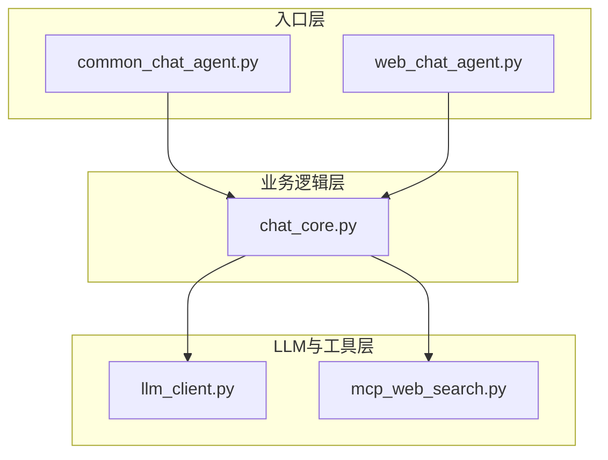
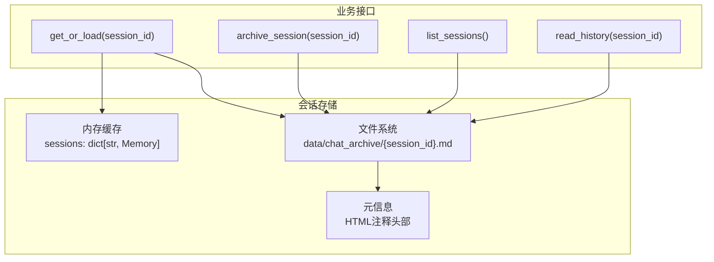
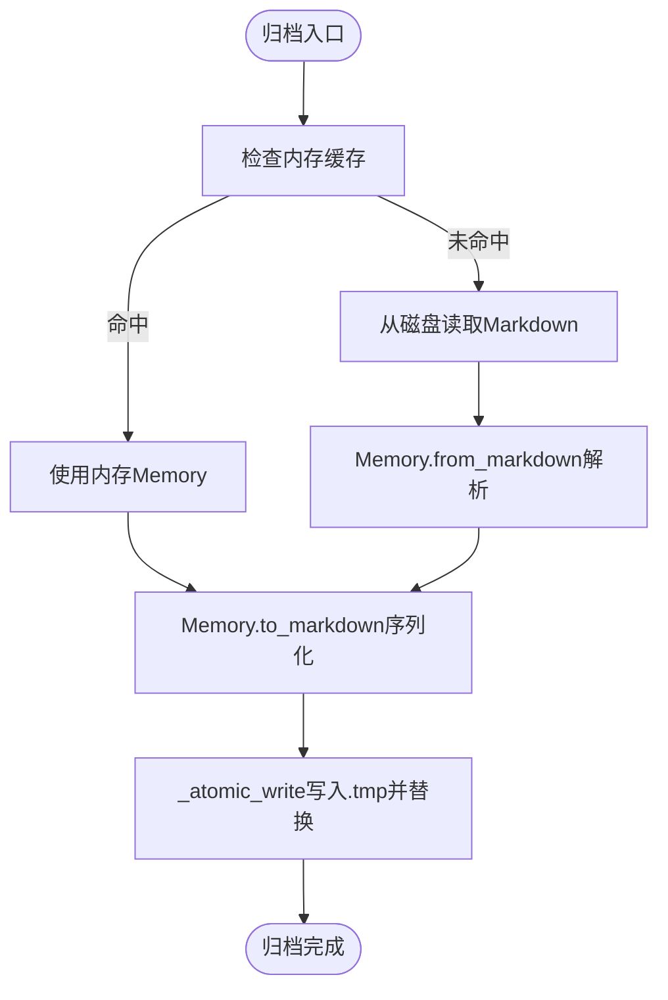
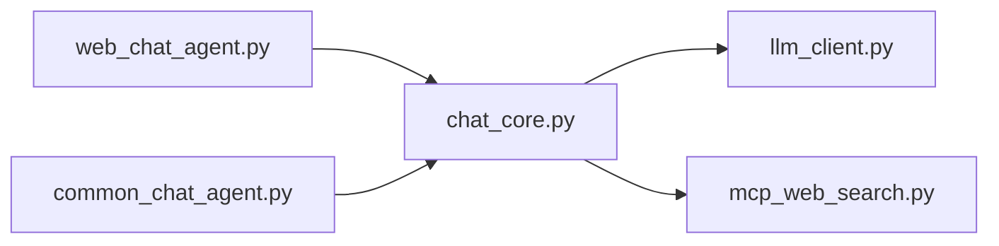

# 存储后端扩展

<cite>
**本文引用的文件**
- [README.md](file://README.md)
- [requirements.txt](file://requirements.txt)
- [CLAUDE.md](file://CLAUDE.md)
- [demo/chat_core.py](file://demo/chat_core.py)
- [demo/web_chat_agent.py](file://demo/web_chat_agent.py)
- [demo/common_chat_agent.py](file://demo/common_chat_agent.py)
- [demo/llm_client.py](file://demo/llm_client.py)
- [demo/mcp_web_search.py](file://demo/mcp_web_search.py)
</cite>

## 目录
1. [简介](#简介)
2. [项目结构](#项目结构)
3. [核心组件](#核心组件)
4. [架构总览](#架构总览)
5. [详细组件分析](#详细组件分析)
6. [依赖分析](#依赖分析)
7. [性能考量](#性能考量)
8. [故障排查指南](#故障排查指南)
9. [结论](#结论)
10. [附录](#附录)

## 简介
本指南面向希望扩展“会话与记忆”存储后端的开发者，目标是在不改变上层业务契约的前提下，将当前基于文件系统的归档机制替换为其他存储介质（如数据库、云存储、分布式KV等）。文档将：
- 深入解析当前文件系统存储的目录结构、文件命名规范与元信息格式
- 说明如何实现新的存储后端接口，包括数据库连接、ORM映射与事务管理
- 提供完整的实现步骤、数据序列化、索引优化与备份策略
- 讨论安全、性能优化与数据迁移方案，并给出内存缓存、持久化策略与并发访问控制的最佳实践

## 项目结构
该项目采用三层模块化结构：
- 入口层（CLI/HTTP）：负责路由、参数校验、SSE序列化与异常翻译
- 业务逻辑层（chat_core）：负责Memory序列化、ReAct循环、会话存储与域异常
- LLM与工具层（llm_client、mcp_web_search）：负责模型调用与MCP工具调用

图表来源
- [demo/web_chat_agent.py:1-233](file://demo/web_chat_agent.py#L1-L233)
- [demo/common_chat_agent.py:1-53](file://demo/common_chat_agent.py#L1-L53)
- [demo/chat_core.py:1-1068](file://demo/chat_core.py#L1-L1068)
- [demo/llm_client.py:1-924](file://demo/llm_client.py#L1-L924)
- [demo/mcp_web_search.py:1-172](file://demo/mcp_web_search.py#L1-L172)

章节来源
- [CLAUDE.md:30-52](file://CLAUDE.md#L30-L52)
- [README.md:44-57](file://README.md#L44-L57)

## 核心组件
- Memory：多轮对话记忆的数据载体，支持markdown序列化/反序列化
- 会话存储：基于文件系统的归档，包含原子写入、元信息读取与列表展示
- 域异常：InvalidSessionId、HistoryNotFound等，用于HTTP层翻译为状态码
- ReAct循环与工具调用：在不同API模式下分别走文本协议或OpenAI原生function calling

章节来源
- [demo/chat_core.py:138-193](file://demo/chat_core.py#L138-L193)
- [demo/chat_core.py:211-226](file://demo/chat_core.py#L211-L226)
- [demo/chat_core.py:255-324](file://demo/chat_core.py#L255-L324)

## 架构总览
当前会话持久化采用“内存缓存 + 文件归档”的混合策略：
- 内存缓存：模块级sessions字典，按需lazy-load
- 文件归档：data/chat_archive/{session_id}.md，头部HTML注释保存元信息
- 原子写入：先写.tmp再os.replace，避免崩溃产生半文件
- 安全校验：session_id正则校验，防止路径穿越

图表来源
- [demo/chat_core.py:208-209](file://demo/chat_core.py#L208-L209)
- [demo/chat_core.py:228-231](file://demo/chat_core.py#L228-L231)
- [demo/chat_core.py:234-238](file://demo/chat_core.py#L234-L238)
- [demo/chat_core.py:241-252](file://demo/chat_core.py#L241-L252)
- [demo/chat_core.py:255-324](file://demo/chat_core.py#L255-L324)

章节来源
- [CLAUDE.md:127-159](file://CLAUDE.md#L127-L159)

## 详细组件分析

### 文件系统存储实现详解
- 归档目录与命名
  - 目录：data/chat_archive
  - 文件名：{session_id}.md
  - session_id正则：^[0-9a-f-]{36}$，确保合法UUID
- 元信息格式
  - 文件头部连续HTML注释行，包含session_id、updated_at、turns、preview
  - 解析：_read_meta按行匹配头部注释，遇到首个空行停止
- 序列化/反序列化
  - Memory.to_markdown：写入头部元信息与按turn分隔的用户/AI消息
  - Memory.from_markdown：按<!-- turn: 用户|AI -->分块解析
- 原子写入
  - _atomic_write：先写.tmp再os.replace，避免崩溃产生半文件
- 列表与读取
  - list_sessions：遍历*.md，只读头部元信息，按updated_at倒序
  - read_history：优先内存，再磁盘lazy-load，不存在抛HistoryNotFound

图表来源
- [demo/chat_core.py:255-284](file://demo/chat_core.py#L255-L284)
- [demo/chat_core.py:234-238](file://demo/chat_core.py#L234-L238)
- [demo/chat_core.py:154-192](file://demo/chat_core.py#L154-L192)

章节来源
- [demo/chat_core.py:199-206](file://demo/chat_core.py#L199-L206)
- [demo/chat_core.py:241-252](file://demo/chat_core.py#L241-L252)
- [demo/chat_core.py:301-324](file://demo/chat_core.py#L301-L324)

### 存储接口实现步骤（数据库/云存储等）
为实现新的存储后端，需在业务层暴露统一的会话存储接口，并在HTTP层保持不变。以下为实现步骤与关键点：

- 步骤1：定义存储接口
  - 会话读取：read_history(session_id) -> Memory
  - 会话归档：archive_session(session_id, memory) -> dict
  - 会话重置：reset_session(session_id) -> None
  - 会话删除：delete_session(session_id) -> None
  - 会话列表：list_sessions() -> list[dict]
  - 路径存在：get_archive_path_if_exists(session_id) -> Path
  - 会话计数：session_count() -> int

- 步骤2：实现数据序列化
  - 使用Memory.to_markdown(session_id)生成Markdown文本
  - 使用Memory.from_markdown(text)从文本恢复Memory
  - 如需自定义序列化，可在Memory类扩展或在存储层转换

- 步骤3：实现原子写入与并发控制
  - 数据库：使用事务包裹写入，失败回滚；或使用乐观锁版本号
  - 云存储：使用上传/替换的原子操作；或先写临时对象再重命名
  - 并发：使用分布式锁或行级锁，避免竞态

- 步骤4：实现索引与查询
  - 元信息索引：将session_id、updated_at、turns、preview写入索引表
  - 查询优化：对updated_at建立倒序索引；对session_id建立唯一索引
  - 分页：按updated_at倒序分页，限制每页数量

- 步骤5：实现备份策略
  - 定时备份：将归档数据导出为压缩包
  - 增量备份：记录上次备份时间戳，仅备份变更
  - 跨区域复制：将数据复制到其他可用区或地域

- 步骤6：安全与合规
  - 输入校验：严格校验session_id，防止路径注入
  - 访问控制：限制对归档文件的读写权限
  - 数据脱敏：对敏感信息进行脱敏处理
  - 审计日志：记录所有归档、删除、重置操作

- 步骤7：性能优化
  - 内存缓存：在模块级维护sessions字典，减少IO
  - 批量写入：批量归档多个会话，降低IO次数
  - 压缩存储：对归档内容进行压缩，节省空间
  - CDN加速：对静态归档文件启用CDN

- 步骤8：数据迁移
  - 导出：从文件系统导出所有会话至目标存储
  - 导入：将目标存储中的会话导入到新存储
  - 校验：校验导入后的数据完整性与一致性
  - 切换：在HTTP层切换存储实现，验证功能正常

章节来源
- [demo/chat_core.py:255-348](file://demo/chat_core.py#L255-L348)
- [demo/web_chat_agent.py:180-214](file://demo/web_chat_agent.py#L180-L214)
- [CLAUDE.md:148-159](file://CLAUDE.md#L148-L159)

### 数据库连接、ORM映射与事务管理
- 数据库连接
  - 使用连接池管理数据库连接，设置最大连接数与超时时间
  - 对于分布式数据库，配置主从复制与高可用
- ORM映射
  - 会话表：包含session_id（主键）、updated_at、turns、preview、content（Markdown文本）
  - 元信息索引：对updated_at建立倒序索引，对session_id建立唯一索引
- 事务管理
  - 归档：开启事务，写入会话表与索引表，提交事务
  - 删除：删除会话表与索引表记录，提交事务
  - 重置：清空会话表记录，提交事务

章节来源
- [demo/chat_core.py:199-206](file://demo/chat_core.py#L199-L206)
- [demo/chat_core.py:272-284](file://demo/chat_core.py#L272-L284)

### 内存缓存、持久化策略与并发访问控制
- 内存缓存
  - 模块级sessions字典，按需lazy-load，命中优先返回
  - 清理策略：定期清理长时间未使用的会话
- 持久化策略
  - 懒加载：首次访问时从存储读取
  - 延迟归档：在合适时机（如用户点击归档或会话结束）写入存储
- 并发访问控制
  - 互斥锁：对同一session_id的读写加锁
  - 乐观锁：使用版本号或时间戳避免写冲突
  - 分布式锁：在集群环境中使用Redis/Zookeeper等

章节来源
- [demo/chat_core.py:208-209](file://demo/chat_core.py#L208-L209)
- [demo/chat_core.py:255-269](file://demo/chat_core.py#L255-L269)

## 依赖分析
- 入口层依赖业务逻辑层提供的会话存储接口
- 业务逻辑层依赖LLM与工具层的调用能力
- 存储实现需满足业务层接口契约，HTTP层无需改动

图表来源
- [demo/web_chat_agent.py:29-46](file://demo/web_chat_agent.py#L29-L46)
- [demo/common_chat_agent.py:13-14](file://demo/common_chat_agent.py#L13-L14)
- [demo/chat_core.py:26-34](file://demo/chat_core.py#L26-L34)

章节来源
- [CLAUDE.md:40-52](file://CLAUDE.md#L40-L52)

## 性能考量
- IO优化
  - 使用原子写入避免半文件，减少磁盘碎片
  - 批量归档降低IO次数
- 内存优化
  - 控制内存中会话数量，避免OOM
  - 对历史会话进行LRU淘汰
- 网络优化
  - 云存储启用CDN加速
  - 数据库连接池复用连接
- 查询优化
  - 对updated_at建立倒序索引
  - 分页查询限制每页数量

## 故障排查指南
- 常见异常
  - InvalidSessionId：session_id不符合UUID格式，HTTP层返回400
  - HistoryNotFound：会话不存在，HTTP层返回404
  - PendingNotFound/PendingMismatch：HITL恢复相关异常，HTTP层返回404/409
- 日志定位
  - 归档失败：查看加载归档失败的日志，确认文件是否存在与权限
  - 元信息读取失败：检查头部注释格式是否正确
  - 原子写入失败：确认.tmp文件写入与替换是否成功
- 修复建议
  - 修复session_id格式，确保符合正则
  - 检查文件权限与磁盘空间
  - 重试归档操作，确认原子写入流程

章节来源
- [demo/chat_core.py:211-226](file://demo/chat_core.py#L211-L226)
- [demo/chat_core.py:261-265](file://demo/chat_core.py#L261-L265)
- [demo/chat_core.py:234-238](file://demo/chat_core.py#L234-L238)

## 结论
通过在业务层抽象统一的会话存储接口，可以在不改变HTTP层与ReAct循环的前提下，灵活替换存储后端。当前文件系统实现提供了清晰的目录结构、严格的元信息格式与原子写入保障。扩展到数据库或云存储时，应重点关注序列化兼容性、索引优化、事务一致性与并发控制，并制定完善的备份与迁移策略。

## 附录
- 环境与依赖
  - 依赖：openai、fastapi、uvicorn、mcp
  - API密钥：DASHSCOPE_API_KEY
  - 可选：QWEN_MODEL、API_MODE
- API端点
  - POST /api/archive：归档当前会话
  - GET /api/history：获取会话历史
  - GET /api/sessions：列出会话
  - DELETE /api/sessions/{session_id}：删除会话
  - GET /api/sessions/{session_id}/raw：获取原始归档文件

章节来源
- [requirements.txt:1-5](file://requirements.txt#L1-L5)
- [demo/web_chat_agent.py:180-226](file://demo/web_chat_agent.py#L180-L226)
- [CLAUDE.md:161-175](file://CLAUDE.md#L161-L175)