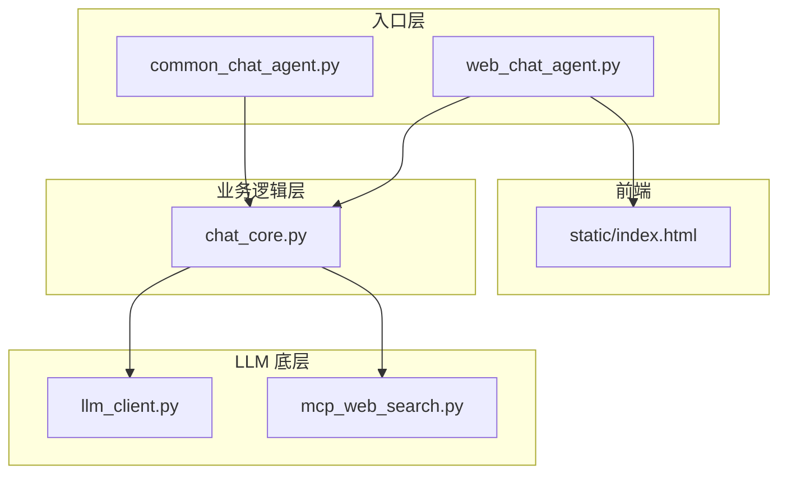
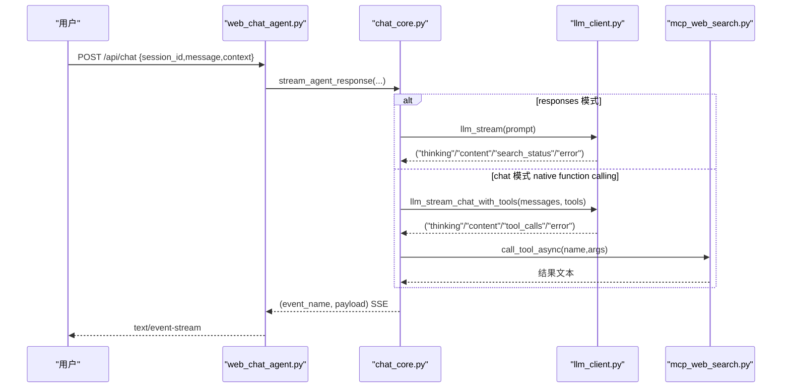
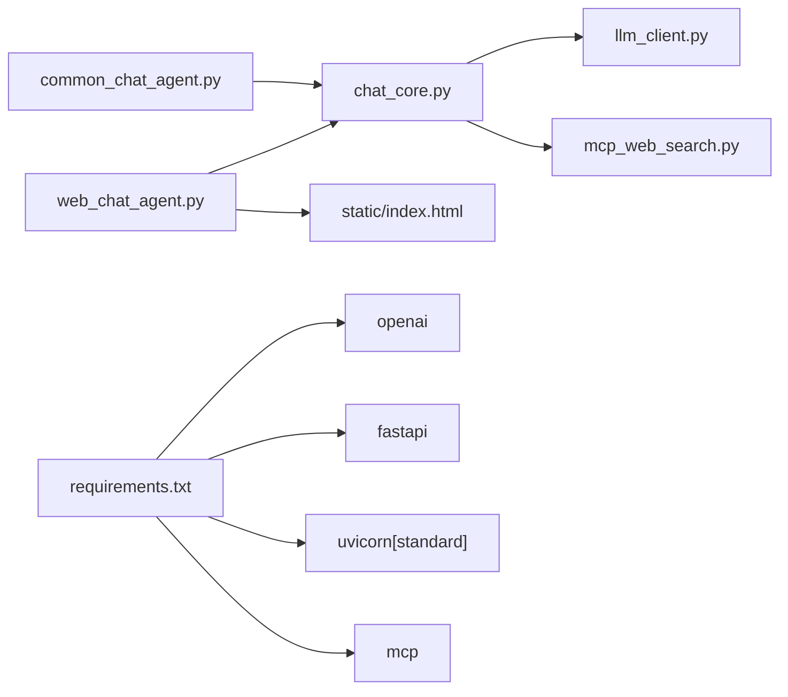

# 扩展与定制

<cite>
**本文引用的文件**
- [README.md](file://README.md)
- [CLAUDE.md](file://CLAUDE.md)
- [requirements.txt](file://requirements.txt)
- [demo/chat_core.py](file://demo/chat_core.py)
- [demo/common_chat_agent.py](file://demo/common_chat_agent.py)
- [demo/web_chat_agent.py](file://demo/web_chat_agent.py)
- [demo/llm_client.py](file://demo/llm_client.py)
- [demo/mcp_web_search.py](file://demo/mcp_web_search.py)
- [demo/static/index.html](file://demo/static/index.html)
- [docs/OpenAI兼容-Chat 接口文档.md](file://docs/OpenAI兼容-Chat 接口文档.md)
- [docs/兼容 OpenAI 格式的 Responses API-获取响应.md](file://docs/兼容 OpenAI 格式的 Responses API-获取响应.md)
- [docs/联网搜索-mcp-接口文档.md](file://docs/联网搜索-mcp-接口文档.md)
</cite>

## 目录
1. [简介](#简介)
2. [项目结构](#项目结构)
3. [核心组件](#核心组件)
4. [架构总览](#架构总览)
5. [详细组件分析](#详细组件分析)
6. [依赖关系分析](#依赖关系分析)
7. [性能考量](#性能考量)
8. [故障排查指南](#故障排查指南)
9. [结论](#结论)
10. [附录](#附录)

## 简介
本指南面向希望扩展与定制本项目的开发者，围绕以下目标提供系统化说明：
- 如何添加新工具到 TOOLS 列表（文本协议与 native function calling 两种路径）
- 如何扩展新的 LLM 协议支持（兼容性与测试策略）
- 前端组件扩展指南（新增 UI 组件与现有组件修改）
- 存储后端的扩展机制与配置选项
- 完整的扩展流程、最佳实践与常见场景实现方案

本项目采用三层分层架构：入口层（CLI/HTTP）、业务逻辑层（ReAct、Memory、Sessions、Tools）、LLM 底层（OpenAI 兼容调用、Responses API、Chat Completions、MCP）。两条 ReAct 路径（文本协议与 native function calling）共享同一事件契约，前端零分支。

章节来源
- [README.md:1-62](file://README.md#L1-L62)
- [CLAUDE.md:28-52](file://CLAUDE.md#L28-L52)

## 项目结构
- demo/
  - common_chat_agent.py：CLI 入口，调用 chat_core.react()
  - web_chat_agent.py：FastAPI + SSE，路由与 SSE 序列化
  - chat_core.py：业务核心（Memory、ReAct、Sessions、Tools、HITL、事件生成）
  - llm_client.py：LLM 底层（Responses API、Chat Completions、native function calling、流式事件）
  - mcp_web_search.py：MCP 联网搜索客户端（streamableHttp 封装）
  - static/index.html：前端单页应用（CSS/JS/Markdown 渲染）
- docs/：OpenAI 兼容接口与 Responses API 文档
- requirements.txt：依赖清单

图表来源
- [CLAUDE.md:34-46](file://CLAUDE.md#L34-L46)
- [demo/web_chat_agent.py:29-46](file://demo/web_chat_agent.py#L29-L46)
- [demo/chat_core.py:25-35](file://demo/chat_core.py#L25-L35)

章节来源
- [CLAUDE.md:30-52](file://CLAUDE.md#L30-L52)
- [demo/web_chat_agent.py:1-233](file://demo/web_chat_agent.py#L1-L233)
- [demo/chat_core.py:1-13](file://demo/chat_core.py#L1-L13)

## 核心组件
- TOOLS 与工具执行
  - TOOLS 列表用于文本协议路径（responses 模式或自定义文本协议工具）
  - execute_tool() 为工具执行预留分支，扩展时在此添加 name→实现的路由
- 本地伪工具（HITL）
  - LOCAL_TOOLS：ask_user、execute_shell_command
  - _LOCAL_TOOL_KIND：input/approval 两类交互
  - _PENDING：HITL 恢复点存储
- 会话持久化
  - Memory：内存 + markdown 序列化
  - sessions：内存缓存
  - 归档目录 data/chat_archive，安全校验 session_id
- LLM 客户端
  - API_MODE：responses（内置 web_search）/ chat（native function calling + MCP）
  - llm()/llm_stream() 与 llm_chat_with_tools()/llm_stream_chat_with_tools() 两套分发
- MCP 客户端
  - discover_tool_spec/_async：从 MCP server 获取工具 schema
  - call_tool_async/sync：调用工具，失败返回错误字符串

章节来源
- [demo/chat_core.py:44-110](file://demo/chat_core.py#L44-L110)
- [demo/chat_core.py:200-350](file://demo/chat_core.py#L200-L350)
- [demo/llm_client.py:44-51](file://demo/llm_client.py#L44-L51)
- [demo/mcp_web_search.py:89-172](file://demo/mcp_web_search.py#L89-L172)

## 架构总览
两条 ReAct 路径共享事件契约，前端零分支：
- 文本协议路径（responses 模式或自定义 TOOLS）
  - chat_core.build_prompt 拼装 prompt
  - llm_client.llm_stream() 产出 ("thinking","content","search_status","error")
  - chat_core.match_tool_action/parse_action_input/execute_tool 完成工具调用
- Native function calling 路径（chat 模式）
  - chat_core._build_native_tools/_async 获取工具集
  - llm_client.llm_stream_chat_with_tools() 产出 ("thinking","content","tool_calls","error")
  - chat_core._stream_react_rounds 派发工具调用，MCP 调用失败返回错误字符串

图表来源
- [CLAUDE.md:85-125](file://CLAUDE.md#L85-L125)
- [demo/web_chat_agent.py:127-141](file://demo/web_chat_agent.py#L127-L141)
- [demo/chat_core.py:632-800](file://demo/chat_core.py#L632-L800)
- [demo/llm_client.py:633-647](file://demo/llm_client.py#L633-L647)
- [demo/mcp_web_search.py:127-164](file://demo/mcp_web_search.py#L127-L164)

章节来源
- [CLAUDE.md:85-125](file://CLAUDE.md#L85-L125)
- [demo/web_chat_agent.py:127-141](file://demo/web_chat_agent.py#L127-L141)
- [demo/chat_core.py:632-800](file://demo/chat_core.py#L632-L800)
- [demo/llm_client.py:633-647](file://demo/llm_client.py#L633-L647)
- [demo/mcp_web_search.py:127-164](file://demo/mcp_web_search.py#L127-L164)

## 详细组件分析

### 添加新工具（文本协议路径）
适用场景：在 responses 模式或自定义文本协议工具路径中添加工具，使用 Action:/Action Input: 文本协议。

实现步骤
1. 在 chat_core.py 的 TOOLS 列表中添加工具规范（OpenAI function schema 风格）
2. 在 chat_core.execute_tool() 中添加 name→实现的分支
3. 确保工具参数 JSON 解析健壮（parse_action_input 使用 JSONDecoder.raw_decode）
4. 在 USER_PROMPT 中明确工具能力与使用约束，避免模型拒绝内置 web_search

集成测试方法
- CLI：通过 common_chat_agent.py 输入消息，观察是否触发 Action/Action Input 行，工具执行后是否回灌 Observation
- Web：发送 /api/chat，观察 SSE 事件中是否有 tool_call/tool_result，最终回答是否正确

最佳实践
- 工具名精确匹配（match_tool_action 要求精确相等）
- Action Input JSON 支持多行与尾随文本（parse_action_input 已内置 robustness）
- 工具失败时返回可被模型恢复的文本（execute_tool 返回 JSON 字符串）

章节来源
- [demo/chat_core.py:44-46](file://demo/chat_core.py#L44-L46)
- [demo/chat_core.py:358-396](file://demo/chat_core.py#L358-L396)
- [demo/chat_core.py:425-466](file://demo/chat_core.py#L425-L466)
- [demo/common_chat_agent.py:17-53](file://demo/common_chat_agent.py#L17-L53)

### 添加新工具（Native function calling 路径）
适用场景：在 chat 模式下通过 OpenAI native function calling 调用工具，工具来自 MCP server 或本地实现。

实现步骤
- MCP 工具：在 mcp_web_search.py 中确保 discover_tool_spec_async 能发现该工具（或新建 sibling 模块），chat_core._build_native_tools/_async 会自动合并 LOCAL_TOOLS
- 本地工具：在 chat_core._build_native_tools/_async 返回值中加入 OpenAI tools 格式 spec，并在 _react_chat_native/_stream_react_rounds 的工具派发表中添加 name→executor 分支
- HITL 工具：在 LOCAL_TOOLS 中添加 OpenAI tools 规范，在 _LOCAL_TOOL_KIND 中标注 kind，在 resume_chat_response/_resume_inner 中构造 tool result

集成测试方法
- Web：发送 /api/chat，观察 SSE 事件中 tool_call/tool_result，以及可能的 await_user（HITL）
- CLI：_react_chat_native 对 HITL 工具会短路返回错误字符串，验证模型能否在循环中恢复

章节来源
- [CLAUDE.md:206-211](file://CLAUDE.md#L206-L211)
- [demo/mcp_web_search.py:89-125](file://demo/mcp_web_search.py#L89-L125)
- [demo/chat_core.py:498-518](file://demo/chat_core.py#L498-L518)
- [demo/chat_core.py:561-630](file://demo/chat_core.py#L561-L630)
- [demo/chat_core.py:632-800](file://demo/chat_core.py#L632-L800)

### 扩展 LLM 协议支持（兼容性与测试策略）
当前支持两种 API_MODE：
- responses：client.responses.create，内置 web_search lifecycle（search_status）
- chat：client.chat.completions.create + native function calling + MCP

兼容性考虑
- 三组实现必须保持同步：_llm_responses/_llm_stream_responses、_llm_chat/_llm_stream_chat、_llm_chat_with_tools/_llm_stream_chat_with_tools
- 新增的 llm_*_chat_with_tools 入口绕开老分发器（签名不兼容）
- reasoning_content 跨轮保留，避免 thinking + 多轮 tool_calls 场景 400

测试策略
- 分别在 responses 与 chat 模式下验证：流式事件、错误处理、usage 日志、tool_calls 汇总
- 验证 responses 模式下的 search_status 与 chat 模式下的 tool_call/tool_result 事件差异
- 验证嵌入式错误 chunk 防御（HTTP 200 但 body 是错误）

章节来源
- [demo/llm_client.py:44-51](file://demo/llm_client.py#L44-L51)
- [demo/llm_client.py:124-234](file://demo/llm_client.py#L124-L234)
- [demo/llm_client.py:237-333](file://demo/llm_client.py#L237-L333)
- [demo/llm_client.py:687-795](file://demo/llm_client.py#L687-L795)
- [CLAUDE.md:85-106](file://CLAUDE.md#L85-L106)

### 前端组件扩展指南
静态生成 UI（Static GenUI）仅在 chat 模式生效，通过 TOOL_COMPONENT_MAP 与 _build_component_props 驱动：
- 注册映射：在 chat_core.TOOL_COMPONENT_MAP 中添加 "tool_name":"component_type"
- 构建 props：在 chat_core._build_component_props 中添加 if 分支，从 args/result_text 构建 props
- 前端渲染：在 index.html 的 COMPONENT_RENDERERS 中添加同 component_type 的渲染函数
- 测试：触发工具后，前端应显示 loading → 卡片（或 error）

现有组件
- search_results 卡片：基于 web_search 工具结果渲染
- thinking 面板、tool-strip、HITL bubble、归档预览模态等

章节来源
- [demo/chat_core.py:532-559](file://demo/chat_core.py#L532-L559)
- [demo/chat_core.py:541-558](file://demo/chat_core.py#L541-L558)
- [demo/static/index.html:759-794](file://demo/static/index.html#L759-L794)

### 存储后端的扩展机制与配置选项
- 会话存储
  - 归档目录 data/chat_archive，git-ignored
  - 安全校验 session_id（UUID 格式）
  - 原子写入（.tmp + replace）避免崩溃产生半文件
- 配置选项
  - DASHSCOPE_API_KEY：必需
  - QWEN_MODEL：可选，默认 qwen3.7-max（Responses API + 内置 web_search 推荐）
  - API_MODE：可选，chat | responses（默认 responses）

扩展机制
- 新增存储后端：在 chat_core.py 中扩展 sessions 缓存与磁盘 I/O（保持与现有接口一致）
- 归档格式：markdown 头部 HTML 注释元信息 + <!-- turn: 用户|AI --> 分隔块
- 安全：所有 disk 操作前校验 session_id，防止路径注入

章节来源
- [demo/chat_core.py:200-350](file://demo/chat_core.py#L200-L350)
- [demo/web_chat_agent.py:53-58](file://demo/web_chat_agent.py#L53-L58)
- [demo/llm_client.py:34-51](file://demo/llm_client.py#L34-L51)

## 依赖关系分析
- 入口层仅导入 chat_core，不直接依赖 llm_client/mcp_web_search
- chat_core 仅依赖 llm_client 与 mcp_web_search（通过 re-export MODEL/API_MODE）
- llm_client 与 mcp_web_search 互不依赖，均不依赖上层框架
- 依赖清单：openai、fastapi、uvicorn、mcp

图表来源
- [demo/web_chat_agent.py:29-46](file://demo/web_chat_agent.py#L29-L46)
- [demo/chat_core.py:25-35](file://demo/chat_core.py#L25-L35)
- [requirements.txt:1-5](file://requirements.txt#L1-L5)

章节来源
- [CLAUDE.md:40-46](file://CLAUDE.md#L40-L46)
- [requirements.txt:1-5](file://requirements.txt#L1-L5)

## 性能考量
- 流式事件聚合：llm_client 对 chunk 类型进行聚合与日志记录，避免 UI 频繁刷新
- reasoning_content 跨轮保留：减少重复思考 token 消耗
- tool_calls 汇总：在流尾一次性 yield，避免碎片化事件
- 原子写入归档：减少磁盘竞争与崩溃风险

[本节为通用指导，不直接分析具体文件]

## 故障排查指南
- API_KEY 未配置
  - 入口层会在启动时检查并打印友好提示
  - llm_client 会在首次构建客户端时报错
- API_MODE 非法
  - llm_client 模块加载时直接抛错
- 会话 ID 无效
  - chat_core 抛出 InvalidSessionId，HTTP 层翻译为 400
- 历史不存在
  - chat_core 抛出 HistoryNotFound，HTTP 层翻译为 404
- HITL 恢复不匹配
  - chat_core 抛出 PendingMismatch，HTTP 层翻译为 409

章节来源
- [demo/web_chat_agent.py:53-58](file://demo/web_chat_agent.py#L53-L58)
- [demo/llm_client.py:61-84](file://demo/llm_client.py#L61-L84)
- [demo/chat_core.py:211-226](file://demo/chat_core.py#L211-L226)

## 结论
本项目提供了清晰的三层架构与两条 ReAct 路径，便于开发者按需扩展：
- 文本协议路径适合快速接入自定义工具
- Native function calling 路径适合与 MCP 服务器集成与更复杂的工具链
- 前端 Static GenUI 机制可轻松扩展新卡片组件
- 存储后端通过安全校验与原子写入保障可靠性
- 通过严格的层间依赖与事件契约，确保扩展的一致性与可测试性

[本节为总结，不直接分析具体文件]

## 附录

### 常见扩展场景与实现方案
- 新增文本协议工具
  - 在 TOOLS 添加规范，execute_tool 添加分支，测试 Action/Action Input 解析
- 新增 MCP 工具
  - 在 mcp_web_search.py 中确保 discover_tool_spec_async 能发现，chat_core 自动合并
- 新增本地 native 工具
  - 在 _build_native_tools/_async 中加入 spec，并在工具派发表中添加分支
- 新增 Static GenUI 卡片
  - 在 TOOL_COMPONENT_MAP 与 _build_component_props 中注册，前端 COMPONENT_RENDERERS 中渲染

章节来源
- [CLAUDE.md:206-217](file://CLAUDE.md#L206-L217)
- [demo/chat_core.py:532-559](file://demo/chat_core.py#L532-L559)
- [demo/mcp_web_search.py:89-125](file://demo/mcp_web_search.py#L89-L125)