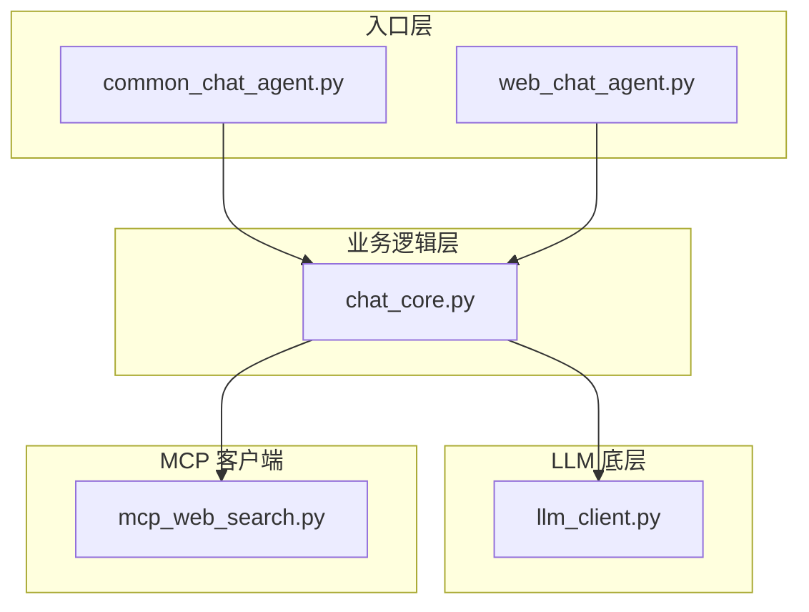
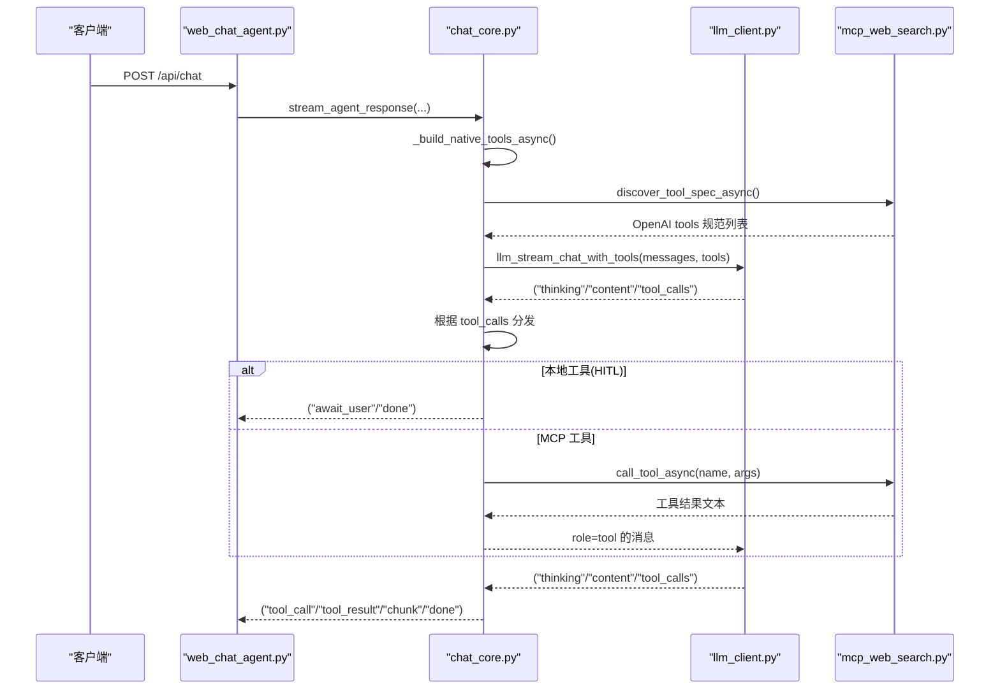
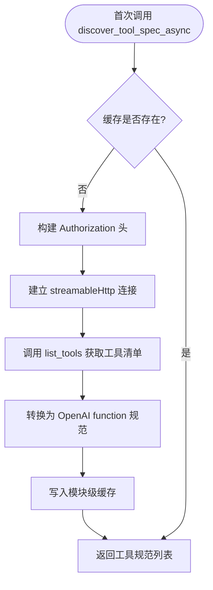
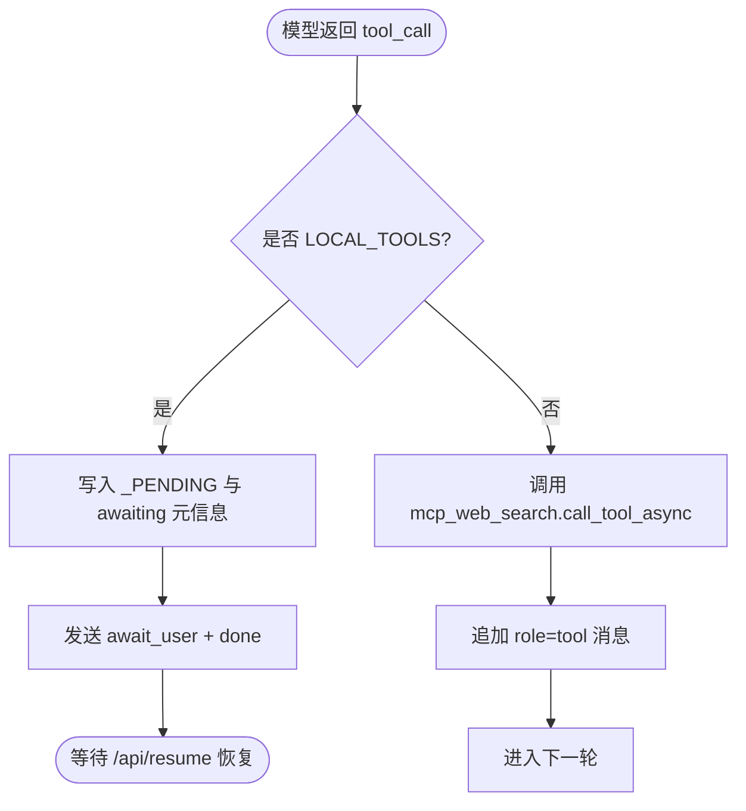
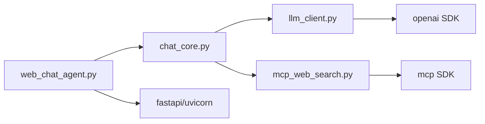

# 添加新工具

<cite>
**本文引用的文件**
- [README.md](file://README.md)
- [CLAUDE.md](file://CLAUDE.md)
- [demo/chat_core.py](file://demo/chat_core.py)
- [demo/mcp_web_search.py](file://demo/mcp_web_search.py)
- [demo/llm_client.py](file://demo/llm_client.py)
- [demo/web_chat_agent.py](file://demo/web_chat_agent.py)
- [demo/common_chat_agent.py](file://demo/common_chat_agent.py)
- [requirements.txt](file://requirements.txt)
- [docs/联网搜索-mcp-接口文档.md](file://docs/联网搜索-mcp-接口文档.md)
- [docs/兼容 OpenAI 格式的 Responses API-获取响应.md](file://docs/兼容 OpenAI 格式的 Responses API-获取响应.md)
</cite>

## 目录
1. [简介](#简介)
2. [项目结构](#项目结构)
3. [核心组件](#核心组件)
4. [架构总览](#架构总览)
5. [详细组件分析](#详细组件分析)
6. [依赖分析](#依赖分析)
7. [性能考虑](#性能考虑)
8. [故障排除指南](#故障排除指南)
9. [结论](#结论)
10. [附录](#附录)

## 简介
本指南面向希望扩展系统工具集的开发者，目标是帮助你在不改变现有架构的前提下，快速、安全地添加新工具。系统支持两类工具：
- MCP 工具：通过 DashScope WebSearch MCP 服务器发现并调用，适用于联网搜索等外部服务。
- 本地工具（HITL 伪工具）：不走 MCP，直接由模型以原生 function calling 方式调用，主要用于需要人类干预的工具（如 ask_user、execute_shell_command）。

系统在 chat 模式下采用 OpenAI 兼容的 native function calling 协议，结合 MCP schema 发现，将 MCP 工具与本地工具统一暴露给模型。你只需在正确的位置注册工具规范，即可完成扩展。

章节来源
- [README.md:11](file://README.md#L11)
- [CLAUDE.md:7](file://CLAUDE.md#L7)

## 项目结构
项目采用三层分层架构，职责清晰：
- 入口层（CLI/HTTP）：负责路由、参数校验、SSE 序列化与异常翻译。
- 业务逻辑层（chat_core）：负责 Memory、Prompt 模板、ReAct 循环、会话持久化、HITL、工具注册与调度。
- LLM 底层（llm_client）：负责与 DashScope OpenAI 兼容网关通信，封装 Responses API 与 Chat Completions API。
- MCP 客户端（mcp_web_search）：封装 DashScope WebSearch MCP 服务，提供 schema 发现与工具调用。

图表来源
- [CLAUDE.md:34-46](file://CLAUDE.md#L34-L46)

章节来源
- [CLAUDE.md:30-53](file://CLAUDE.md#L30-L53)

## 核心组件
- 工具注册位置
  - MCP 工具：通过 mcp_web_search.discover_tool_spec 从 MCP 服务器拉取工具规范，自动合并到工具列表。
  - 本地工具（HITL）：在 chat_core.LOCAL_TOOLS 中注册，用于需要人类交互的工具。
- 工具规范结构
  - OpenAI function calling 规范：type/function/name/description/parameters（JSON Schema）。
  - 本地工具还需在 _LOCAL_TOOL_KIND 中声明交互类型（input/approval）。
- 工具执行路径
  - chat 模式 native function calling：模型返回 tool_calls，业务层按 name 分发到 MCP 或本地工具，执行后以 role=tool 的消息回喂模型。
  - CLI 文本协议路径：通过字符串解析 Action/Action Input/Observation，需要在 TOOLS 中注册并在 execute_tool 中实现。

章节来源
- [demo/chat_core.py:44](file://demo/chat_core.py#L44)
- [demo/chat_core.py:63-110](file://demo/chat_core.py#L63-L110)
- [demo/mcp_web_search.py:52-65](file://demo/mcp_web_search.py#L52-L65)
- [demo/llm_client.py:618-795](file://demo/llm_client.py#L618-L795)

## 架构总览
chat 模式下，业务层在首次调用时通过 mcp_web_search.discover_tool_spec 获取 MCP 工具的 OpenAI 规范，再与 LOCAL_TOOLS 合并，形成最终的 tools 列表。模型以 native function calling 方式调用工具，业务层根据工具名分发执行，并将结果以 role=tool 的消息追加到 messages，继续下一轮推理。

图表来源
- [demo/web_chat_agent.py:127-141](file://demo/web_chat_agent.py#L127-L141)
- [demo/chat_core.py:511-517](file://demo/chat_core.py#L511-L517)
- [demo/mcp_web_search.py:89-117](file://demo/mcp_web_search.py#L89-L117)
- [demo/llm_client.py:798-923](file://demo/llm_client.py#L798-L923)

章节来源
- [CLAUDE.md:85-126](file://CLAUDE.md#L85-L126)

## 详细组件分析

### MCP 工具（通过 mcp_web_search 调用）
- 工具发现与缓存
  - 首次调用 discover_tool_spec_async 时，通过 streamableHttp 客户端连接 MCP endpoint，调用 list_tools 获取工具清单，转换为 OpenAI function calling 规范并缓存。
  - 后续调用直接返回缓存，避免重复网络开销。
- 工具调用
  - call_tool_async 以短连接方式调用指定工具，失败时返回统一前缀的错误字符串，业务层将其作为 role=tool 的消息回喂模型。
- schema 转换
  - 将 MCP tool 的 inputSchema 直接映射为 OpenAI function.parameters。

图表来源
- [demo/mcp_web_search.py:89-117](file://demo/mcp_web_search.py#L89-L117)
- [demo/mcp_web_search.py:52-65](file://demo/mcp_web_search.py#L52-L65)

章节来源
- [demo/mcp_web_search.py:34-36](file://demo/mcp_web_search.py#L34-L36)
- [demo/mcp_web_search.py:89-117](file://demo/mcp_web_search.py#L89-L117)
- [demo/mcp_web_search.py:127-164](file://demo/mcp_web_search.py#L127-L164)
- [docs/联网搜索-mcp-接口文档.md:22-28](file://docs/联网搜索-mcp-接口文档.md#L22-L28)

### 本地工具（LOCAL_TOOLS）
- 用途
  - 用于需要人类干预的工具，如 ask_user（输入类）与 execute_shell_command（审批类）。
- 规范
  - 以 OpenAI function calling 规范定义，parameters 使用 JSON Schema。
  - 在 _LOCAL_TOOL_KIND 中声明交互类型（input/approval）。
- 执行流程
  - 在 chat 模式下，遇到 LOCAL_TOOLS 中的工具时，业务层不会实际执行，而是将剩余待消费的 tool_calls 与 awaiting 元信息写入 _PENDING，发送 await_user 事件并关闭当前流；前端弹出 HITL bubble，用户操作后 POST /api/resume，业务层恢复 ReAct 循环。
- CLI 短路
  - CLI 模式下遇到 LOCAL_TOOLS 会直接返回固定错误字符串，提示用户以文本方式说明或寻求其他途径。

图表来源
- [demo/chat_core.py:738-764](file://demo/chat_core.py#L738-L764)
- [demo/chat_core.py:613-629](file://demo/chat_core.py#L613-L629)

章节来源
- [demo/chat_core.py:63-110](file://demo/chat_core.py#L63-L110)
- [demo/chat_core.py:738-764](file://demo/chat_core.py#L738-L764)
- [demo/chat_core.py:613-629](file://demo/chat_core.py#L613-L629)

### 工具注册与实现步骤
- 步骤概览
  - 选择工具类型：MCP 工具或本地工具。
  - 定义工具规范：OpenAI function calling 规范（name/description/parameters）。
  - 注册工具：
    - MCP 工具：确保 MCP 服务器已提供该工具，业务层通过 discover_tool_spec 自动发现并合并。
    - 本地工具：在 LOCAL_TOOLS 中注册，并在 _LOCAL_TOOL_KIND 中声明交互类型。
  - 实现工具执行：
    - MCP 工具：无需实现，由 mcp_web_search 调用。
    - 本地工具：在 HITL 恢复流程中按 name 构造 tool result（如将用户输入或审批结果转为文本）。
  - 可选：静态生成 UI（Static GenUI）
    - 在 TOOL_COMPONENT_MAP 中注册工具名与组件类型。
    - 在 _build_component_props 中为该工具构建 props。
    - 前端 COMPONENT_RENDERERS 中实现渲染器。
- 参考实现位置
  - MCP 工具发现与合并：_build_native_tools/_build_native_tools_async
  - 本地工具注册：LOCAL_TOOLS、_LOCAL_TOOL_KIND
  - 工具调用分发：_stream_react_rounds 中按 name 分发
  - 静态生成 UI：TOOL_COMPONENT_MAP、_build_component_props

章节来源
- [CLAUDE.md:205-217](file://CLAUDE.md#L205-L217)
- [demo/chat_core.py:498-517](file://demo/chat_core.py#L498-L517)
- [demo/chat_core.py:532-559](file://demo/chat_core.py#L532-L559)

### 参数验证与错误处理
- 参数验证
  - 本地工具的参数遵循 JSON Schema，在调用前由模型保证参数结构正确。
  - 对于 MCP 工具，参数由 MCP 服务器的 inputSchema 验证。
- 错误处理
  - MCP 工具调用失败时返回统一前缀的错误字符串，业务层将其作为 role=tool 的消息回喂模型，由模型自行恢复。
  - 业务层在解析 tool_calls.arguments 时对 JSON 解析失败进行兜底（空对象）。
  - 本地工具在 CLI 模式下短路并返回固定错误字符串，避免真实执行风险。

章节来源
- [demo/mcp_web_search.py:146-157](file://demo/mcp_web_search.py#L146-L157)
- [demo/chat_core.py:607-610](file://demo/chat_core.py#L607-L610)
- [demo/chat_core.py:613-629](file://demo/chat_core.py#L613-L629)

### 生命周期管理、缓存机制与性能优化
- 生命周期
  - 会话持久化：每个会话以 markdown 文件形式归档，包含元信息与对话轮次分隔。
  - 内存缓存：会话内存 sessions 字典按需 lazy-load，避免重复磁盘 I/O。
- 缓存机制
  - MCP 工具规范缓存：模块级 _tool_spec_cache，首次发现后缓存，后续直接返回。
  - native tools 缓存：模块级 _NATIVE_TOOLS_CACHE，首次构建后缓存。
  - 工具结果截断：tool_result 事件对结果进行截断，避免前端过度渲染。
- 性能优化
  - 短连接调用 MCP 工具，避免长连接开销。
  - 首次调用时批量发现 MCP 工具，减少后续调用延迟。
  - 本地工具在 CLI 模式下短路，避免不必要的网络调用。

章节来源
- [demo/mcp_web_search.py:34-36](file://demo/mcp_web_search.py#L34-L36)
- [demo/chat_core.py:504-508](file://demo/chat_core.py#L504-L508)
- [demo/chat_core.py:520-525](file://demo/chat_core.py#L520-L525)
- [demo/chat_core.py:775-777](file://demo/chat_core.py#L775-L777)

## 依赖分析
- 外部依赖
  - openai：与 DashScope OpenAI 兼容网关通信。
  - fastapi/uvicorn：Web 服务与 SSE。
  - mcp：DashScope WebSearch MCP 客户端。
- 内部依赖
  - chat_core 依赖 llm_client 与 mcp_web_search。
  - llm_client 仅依赖 openai SDK。
  - web_chat_agent 仅依赖 chat_core 与 fastapi。

图表来源
- [requirements.txt:1-5](file://requirements.txt#L1-L5)
- [demo/web_chat_agent.py:29-46](file://demo/web_chat_agent.py#L29-L46)
- [demo/llm_client.py:25](file://demo/llm_client.py#L25)
- [demo/mcp_web_search.py:16-17](file://demo/mcp_web_search.py#L16-L17)

章节来源
- [requirements.txt:1-5](file://requirements.txt#L1-L5)

## 性能考虑
- 工具调用延迟
  - MCP 工具采用短连接，适合低频调用；高频调用可考虑本地工具或自建缓存。
- 流式响应
  - Responses API 与 Chat Completions API 均支持流式，前端可逐步渲染。
- 会话归档
  - 归档采用原子写入（.tmp + replace），避免崩溃导致半文件。
- 日志与监控
  - 关键路径均记录耗时与字符数，便于定位性能瓶颈。

## 故障排除指南
- 环境变量缺失
  - DASHSCOPE_API_KEY 未配置会导致启动失败或调用异常。请在启动前设置。
- API_MODE 配置错误
  - API_MODE 必须为 responses 或 chat，大小写不敏感。非法值在模块加载时抛错。
- MCP 工具不可用
  - 确认 MCP endpoint 可达且 Authorization 头有效；检查工具名是否与 MCP 服务器一致。
- 本地工具未生效
  - 确认 LOCAL_TOOLS 与 _LOCAL_TOOL_KIND 注册正确；确认工具名与模型返回的 name 一致。
- HITL 中断
  - 确认 /api/resume 的 tool_call_id 与 _PENDING 中 awaiting.tool_call_id 匹配；否则会返回 409。

章节来源
- [demo/web_chat_agent.py:53-58](file://demo/web_chat_agent.py#L53-L58)
- [demo/llm_client.py:46-51](file://demo/llm_client.py#L46-L51)
- [demo/mcp_web_search.py:42-49](file://demo/mcp_web_search.py#L42-L49)
- [demo/web_chat_agent.py:158-162](file://demo/web_chat_agent.py#L158-L162)

## 结论
通过本指南，你可以安全地扩展系统工具集：对于需要联网搜索等外部能力的工具，优先采用 MCP 工具并通过 discover_tool_spec 自动发现；对于需要人类干预的工具，使用 LOCAL_TOOLS 并在 _LOCAL_TOOL_KIND 中声明交互类型。遵循本文的注册、验证与错误处理流程，即可在不破坏现有架构的前提下，快速集成新的工具能力。

## 附录
- 常见工具类型实现模式
  - 简单查询类：MCP 工具（如联网搜索），无需本地实现。
  - 交互类：本地工具（ask_user），通过 HITL bubble 与用户交互。
  - 审批类：本地工具（execute_shell_command），前端展示同意/拒绝按钮。
- 最佳实践
  - 工具名应简洁明确，避免歧义。
  - 参数使用 JSON Schema 精确描述，减少调用失败。
  - 对于可能产生大量文本的工具，注意截断策略与前端渲染。
  - 本地工具在 CLI 模式下会短路，需在模型层面引导用户以文本方式说明。