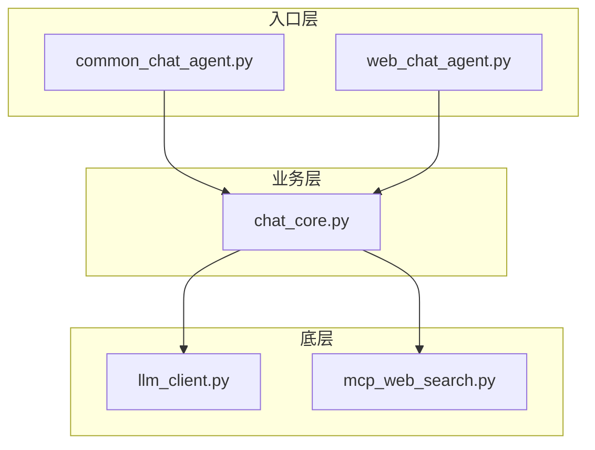
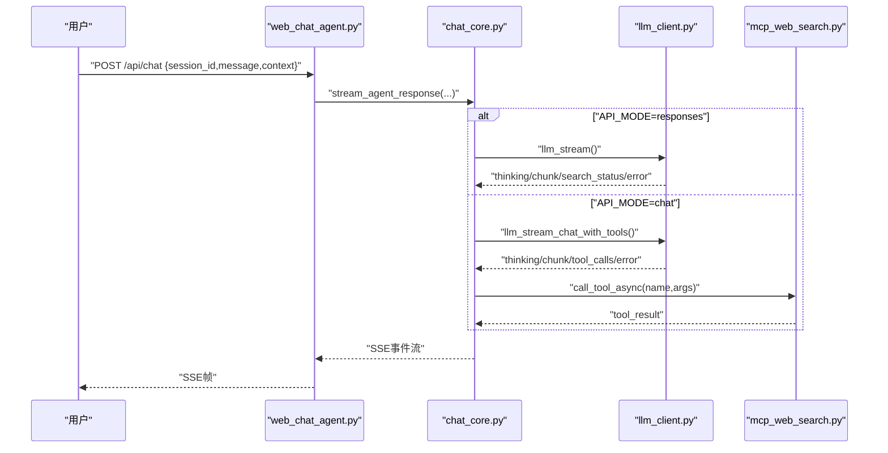
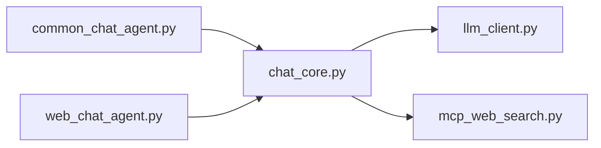

# 故障排除

<cite>
**本文引用的文件**
- [README.md](file://README.md)
- [requirements.txt](file://requirements.txt)
- [CLAUDE.md](file://CLAUDE.md)
- [demo/chat_core.py](file://demo/chat_core.py)
- [demo/common_chat_agent.py](file://demo/common_chat_agent.py)
- [demo/web_chat_agent.py](file://demo/web_chat_agent.py)
- [demo/llm_client.py](file://demo/llm_client.py)
- [demo/mcp_web_search.py](file://demo/mcp_web_search.py)
- [demo/static/index.html](file://demo/static/index.html)
- [scripts/debug_responses.py](file://scripts/debug_responses.py)
</cite>

## 目录
1. [简介](#简介)
2. [项目结构](#项目结构)
3. [核心组件](#核心组件)
4. [架构总览](#架构总览)
5. [详细组件分析](#详细组件分析)
6. [依赖关系分析](#依赖关系分析)
7. [性能考虑](#性能考虑)
8. [故障排除指南](#故障排除指南)
9. [结论](#结论)
10. [附录](#附录)

## 简介
本指南面向使用本项目的开发者与运维人员，聚焦“常见运行问题与配置错误”的快速定位与修复，涵盖：
- 日志配置与调试技巧
- 常见问题的诊断流程
- 性能优化建议（缓存、连接池、内存管理）
- 错误信息解读与解决方案
- 错误码参考与日志分析方法
- 生产环境部署的监控与维护建议

## 项目结构
项目采用三层分层架构，入口模块（CLI/Web）仅负责路由与SSE封装，业务逻辑集中在chat_core，底层LLM调用在llm_client，联网搜索在mcp_web_search。

图表来源
- [CLAUDE.md:34-52](file://CLAUDE.md#L34-L52)
- [demo/common_chat_agent.py:13-14](file://demo/common_chat_agent.py#L13-L14)
- [demo/web_chat_agent.py:29-46](file://demo/web_chat_agent.py#L29-L46)
- [demo/chat_core.py:24-34](file://demo/chat_core.py#L24-L34)
- [demo/llm_client.py:19-25](file://demo/llm_client.py#L19-L25)
- [demo/mcp_web_search.py:16-17](file://demo/mcp_web_search.py#L16-L17)

章节来源
- [CLAUDE.md:28-52](file://CLAUDE.md#L28-L52)
- [README.md:44-57](file://README.md#L44-L57)

## 核心组件
- 入口层（CLI/Web）：负责参数校验、SSE序列化、HTTP路由与异常翻译。
- 业务层（chat_core）：ReAct循环、Memory持久化、会话管理、HITL（人机协作）、工具发现与派发。
- 底层（llm_client）：OpenAI兼容SDK封装，支持Responses API与Chat Completions两种模式，含错误兜底与事件日志。
- MCP客户端（mcp_web_search）：DashScope WebSearch MCP封装，提供工具发现与调用。

章节来源
- [CLAUDE.md:40-46](file://CLAUDE.md#L40-L46)
- [demo/chat_core.py:138-193](file://demo/chat_core.py#L138-L193)
- [demo/llm_client.py:19-27](file://demo/llm_client.py#L19-L27)
- [demo/mcp_web_search.py:16-19](file://demo/mcp_web_search.py#L16-L19)

## 架构总览
两条LLM调用路径汇聚到同一SSE事件契约，前端零分支：
- Responses API路径：内置web_search生命周期事件，适合文本协议工具与自定义工具。
- Chat Completions + native tools路径：通过MCP WebSearch，事件为tool_call/tool_result/await_user，适合HITL与工具卡片化。

图表来源
- [CLAUDE.md:85-106](file://CLAUDE.md#L85-L106)
- [demo/web_chat_agent.py:127-140](file://demo/web_chat_agent.py#L127-L140)
- [demo/chat_core.py:632-800](file://demo/chat_core.py#L632-L800)
- [demo/llm_client.py:336-511](file://demo/llm_client.py#L336-L511)
- [demo/mcp_web_search.py:127-164](file://demo/mcp_web_search.py#L127-L164)

## 详细组件分析

### 入口层（CLI/Web）
- CLI：读取环境变量API密钥，从stdin读取用户输入，调用chat_core.react()，将AI回复写回stderr。
- Web：FastAPI路由，SSE序列化，HTTP异常翻译为400/404/409等。

章节来源
- [demo/common_chat_agent.py:17-50](file://demo/common_chat_agent.py#L17-L50)
- [demo/web_chat_agent.py:122-214](file://demo/web_chat_agent.py#L122-L214)

### 业务层（chat_core）
- Memory：对话记忆的序列化/反序列化，支持markdown头部元信息与turn分隔。
- 会话管理：归档/重置/删除/列表/读取，支持内存缓存与磁盘lazy-load。
- ReAct循环：文本协议与native tools两种路径，支持HITL（ask_user/execute_shell_command）。
- 工具组件映射：将工具结果渲染为前端组件（如web_search）。

章节来源
- [demo/chat_core.py:138-193](file://demo/chat_core.py#L138-L193)
- [demo/chat_core.py:255-349](file://demo/chat_core.py#L255-L349)
- [demo/chat_core.py:358-396](file://demo/chat_core.py#L358-L396)
- [demo/chat_core.py:520-559](file://demo/chat_core.py#L520-L559)

### 底层（llm_client）
- 客户端单例：延迟初始化，首次调用时校验API密钥。
- API模式切换：responses（内置web_search）与chat（native tools + MCP）。
- 错误兜底：嵌入式错误chunk检测与usage日志，异常路径统一抛出。
- 事件协议：(kind, payload) tuple，包括thinking/content/search_status/tool_calls/error。

章节来源
- [demo/llm_client.py:61-84](file://demo/llm_client.py#L61-L84)
- [demo/llm_client.py:34-51](file://demo/llm_client.py#L34-L51)
- [demo/llm_client.py:124-234](file://demo/llm_client.py#L124-L234)
- [demo/llm_client.py:357-496](file://demo/llm_client.py#L357-L496)

### MCP客户端（mcp_web_search）
- 工具发现：list_tools，缓存为OpenAI tools格式spec。
- 工具调用：短连接调用，失败返回“工具调用失败”字符串，不抛异常。
- 错误前缀：ERROR_PREFIX统一用于上层识别工具执行失败。

章节来源
- [demo/mcp_web_search.py:89-124](file://demo/mcp_web_search.py#L89-L124)
- [demo/mcp_web_search.py:127-164](file://demo/mcp_web_search.py#L127-L164)

## 依赖关系分析
- 入口层仅导入chat_core，不直接依赖底层SDK。
- chat_core依赖llm_client与mcp_web_search，但不反向依赖入口层。
- llm_client与mcp_web_search彼此独立，均不依赖入口层。

图表来源
- [CLAUDE.md:40-46](file://CLAUDE.md#L40-L46)
- [demo/web_chat_agent.py:29-46](file://demo/web_chat_agent.py#L29-L46)
- [demo/chat_core.py:24-34](file://demo/chat_core.py#L24-L34)

章节来源
- [CLAUDE.md:40-52](file://CLAUDE.md#L40-L52)

## 性能考虑
- 模型与工具缓存
  - llm_client：模块级client单例，避免重复初始化。
  - mcp_web_search：工具schema缓存，首次发现后复用。
  - chat_core：会话内存sessions字典缓存，减少磁盘IO。
- 连接与并发
  - llm_client：responses路径在executor中运行阻塞迭代器，避免阻塞事件循环。
  - chat路径：异步流式调用，按轮次消费tool_calls，避免并发冲突。
- 内存管理
  - Memory仅保存最终content，reasoning_content跨轮透传但不写入Memory，降低持久化负担。
  - tool_result事件截断（500字符），避免前端预览过大导致内存压力。
- I/O与磁盘
  - 归档采用原子写（.tmp + replace），避免崩溃产生半文件。
  - 会话列表仅读取文件头元信息，避免全量解析。

章节来源
- [demo/llm_client.py:74-84](file://demo/llm_client.py#L74-L84)
- [demo/mcp_web_search.py:35](file://demo/mcp_web_search.py#L35)
- [demo/chat_core.py:208](file://demo/chat_core.py#L208)
- [demo/chat_core.py:520-525](file://demo/chat_core.py#L520-L525)
- [demo/chat_core.py:234-239](file://demo/chat_core.py#L234-L239)
- [demo/chat_core.py:302-324](file://demo/chat_core.py#L302-L324)

## 故障排除指南

### 一、环境与配置错误
- 未设置API密钥
  - 现象：CLI/Web启动时报“未配置环境变量 DASHSCOPE_API_KEY”，随后退出。
  - 处理：确保导出DASHSCOPE_API_KEY，并重启应用。
  - 参考：入口层在启动时检查该变量。
  
  章节来源
  - [demo/common_chat_agent.py:23-29](file://demo/common_chat_agent.py#L23-L29)
  - [demo/web_chat_agent.py:53-58](file://demo/web_chat_agent.py#L53-L58)
  - [demo/llm_client.py:61-67](file://demo/llm_client.py#L61-L67)

- API模式非法
  - 现象：模块加载时抛出“非法的 API_MODE=...”错误。
  - 处理：设置API_MODE为chat或responses（大小写不敏感）。
  
  率章节来源
  - [demo/llm_client.py:44-51](file://demo/llm_client.py#L44-L51)

- 模型不兼容
  - 现象：Responses API + 内置web_search需要特定模型（例如qwen3.7-max），使用不兼容模型会导致功能异常。
  - 处理：设置QWEN_MODEL为兼容模型。
  
  章节来源
  - [CLAUDE.md:18](file://CLAUDE.md#L18)
  - [demo/llm_client.py:34](file://demo/llm_client.py#L34)

### 二、日志配置与调试技巧
- 日志级别
  - 默认INFO级别，输出时间戳、级别、模块名与消息。
  - 建议：开发期可临时提升至DEBUG，生产环境维持INFO以平衡可观测性与性能。
  
  章节来源
  - [demo/common_chat_agent.py:18-21](file://demo/common_chat_agent.py#L18-L21)
  - [demo/web_chat_agent.py:23-27](file://demo/web_chat_agent.py#L23-L27)

- 关键日志点
  - LLM调用：请求参数、首次chunk类型、web_search生命周期、usage统计、兜底文本抽取。
  - MCP工具：discover_tool_spec开始/完成、call_tool开始/完成/异常、错误前缀。
  - chat_core：ReAct轮次开始、tool_call派发、await_user/HITL中断、done/error事件。
  
  章节来源
  - [demo/llm_client.py:141-234](file://demo/llm_client.py#L141-L234)
  - [demo/llm_client.py:376-496](file://demo/llm_client.py#L376-L496)
  - [demo/mcp_web_search.py:98-117](file://demo/mcp_web_search.py#L98-L117)
  - [demo/mcp_web_search.py:137-164](file://demo/mcp_web_search.py#L137-L164)
  - [demo/chat_core.py:661-708](file://demo/chat_core.py#L661-L708)
  - [demo/chat_core.py:736-764](file://demo/chat_core.py#L736-L764)

- 临时排查脚本
  - scripts/debug_responses.py：直接打印responses.create的每个chunk类型，定位空响应根因。
  
  章节来源
  - [scripts/debug_responses.py:1-43](file://scripts/debug_responses.py#L1-L43)

### 三、常见问题与诊断流程

#### 1) 空响应或无输出
- 症状：SSE流无content，或最终content为空。
- 诊断步骤：
  - 检查LLM调用日志，确认是否存在“首次出现chunk type”与“response.completed”。
  - 若无delta，查看是否触发“兜底文本抽取”。
  - 确认API_MODE与模型是否匹配（Responses API需要兼容模型）。
- 处理建议：
  - 使用debug_responses.py验证上游Responses API是否返回有效chunk。
  - 如为Chat Completions路径，检查enable_search与tool_calls是否正确传递。
  
  章节来源
  - [demo/llm_client.py:157-234](file://demo/llm_client.py#L157-L234)
  - [demo/llm_client.py:404-496](file://demo/llm_client.py#L404-L496)
  - [scripts/debug_responses.py:20-42](file://scripts/debug_responses.py#L20-L42)

#### 2) API密钥配置错误
- 症状：上游API返回嵌入式错误chunk（如“API key未绑定workspace”）。
- 诊断步骤：
  - 查看LLM日志中“上游API错误 code/message/request_id”。
  - 确认DASHSCOPE_API_KEY是否正确，且已绑定工作空间。
- 处理建议：
  - 重新配置API密钥并确保绑定工作空间。
  
  章节来源
  - [demo/llm_client.py:168-175](file://demo/llm_client.py#L168-L175)
  - [demo/llm_client.py:440-449](file://demo/llm_client.py#L440-L449)

#### 3) 网络连接问题
- 症状：MCP工具调用失败，返回“工具调用失败: ...”。
- 诊断步骤：
  - 查看mcp_web_search日志，确认list_tools/call_tool是否抛异常。
  - 检查网络连通性与代理设置。
- 处理建议：
  - 重试调用；如持续失败，检查防火墙与DNS；必要时更换网络环境。
  
  章节来源
  - [demo/mcp_web_search.py:140-149](file://demo/mcp_web_search.py#L140-L149)

#### 4) 工具调用失败
- 症状：tool_result事件携带“工具调用失败”前缀。
- 诊断步骤：
  - 检查工具参数args是否合法；查看工具返回的错误文本。
  - 确认工具是否在MCP server上注册。
- 处理建议：
  - 修正参数；如为第三方工具，检查其可用性与权限。
  
  章节来源
  - [demo/mcp_web_search.py:151-157](file://demo/mcp_web_search.py#L151-L157)

#### 5) HITL（人机协作）中断
- 症状：出现await_user事件后流关闭，需POST /api/resume恢复。
- 诊断步骤：
  - 确认LOCAL_TOOLS中工具是否触发（ask_user/approve）。
  - 检查tool_call_id与pending是否匹配（409）。
- 处理建议：
  - 前端按kind渲染bubble，提交answer/approve/reject；后端按决策构造tool result并恢复流。
  
  章节来源
  - [demo/web_chat_agent.py:143-167](file://demo/web_chat_agent.py#L143-L167)
  - [demo/chat_core.py:738-764](file://demo/chat_core.py#L738-L764)

#### 6) 会话ID无效或历史不存在
- 症状：InvalidSessionId（400）、HistoryNotFound（404）。
- 诊断步骤：
  - 检查session_id格式（UUID）与磁盘归档文件是否存在。
- 处理建议：
  - 生成新的session_id；或恢复已有归档。
  
  章节来源
  - [demo/chat_core.py:211-226](file://demo/chat_core.py#L211-L226)
  - [demo/web_chat_agent.py:133-135](file://demo/web_chat_agent.py#L133-L135)
  - [demo/web_chat_agent.py:196-198](file://demo/web_chat_agent.py#L196-L198)

#### 7) ReAct轮次超限
- 症状：超过最大轮次（MAX_ROUNDS=5）后中断。
- 诊断步骤：
  - 查看每轮日志中tool_calls数量与reasoning_content是否跨轮保留。
- 处理建议：
  - 优化Prompt与工具链，减少不必要的工具调用；必要时提高MAX_ROUNDS。
  
  章节来源
  - [demo/chat_core.py:47-47](file://demo/chat_core.py#L47-L47)
  - [demo/chat_core.py:628-629](file://demo/chat_core.py#L628-L629)

### 四、错误码参考与日志分析方法
- 常见错误类型
  - 嵌入式错误chunk：code/message/request_id，典型如“API key未绑定workspace”。
  - HTTP 4xx/5xx：Chat Completions路径常见，由SDK直接抛出。
  - 工具调用失败：返回“工具调用失败: ...”字符串。
- 日志分析方法
  - 使用“首次出现chunk type”定位上游响应结构。
  - 关注“response.completed status”与usage字段，确认计费与用量。
  - MCP路径关注“discover_tool_spec”与“call_tool”耗时与错误前缀。
  
  章节来源
  - [demo/llm_client.py:168-175](file://demo/llm_client.py#L168-L175)
  - [demo/llm_client.py:440-449](file://demo/llm_client.py#L440-L449)
  - [demo/mcp_web_search.py:146-149](file://demo/mcp_web_search.py#L146-L149)

### 五、生产环境部署建议
- 监控与告警
  - 关键指标：LLM调用成功率、平均响应时间、tool_calls数量、MCP调用耗时、SSE连接数。
  - 告警阈值：上游错误率>1%、平均响应时间>5s、MCP失败率>5%。
- 日志与审计
  - 保留至少7天的INFO级别日志；敏感字段脱敏（如API密钥）。
  - 对异常事件（4xx/5xx、HITL中断、轮次超限）进行结构化记录。
- 容灾与弹性
  - LLM客户端单例复用，避免频繁重建。
  - MCP工具调用短连接，失败重试与熔断策略（指数退避）。
- 安全加固
  - 会话ID安全校验（UUID正则），防止路径穿越。
  - 前端渲染严格使用DOMPurify与marked，避免XSS。
  
  章节来源
  - [demo/chat_core.py:203-203](file://demo/chat_core.py#L203-L203)
  - [demo/static/index.html:1-200](file://demo/static/index.html#L1-L200)

## 结论
本指南提供了从环境配置、日志调试、性能优化到生产部署的完整排障路径。遵循分层架构与事件契约，结合本文提供的诊断流程与最佳实践，可快速定位并解决大多数运行问题。

## 附录

### A. SSE事件契约（参考）
- status：轮次边界（thinking/answering）
- thinking：推理摘要增量
- chunk：最终回答增量
- search_status：内置web_search生命周期（仅responses模式）
- tool_call/tool_result：工具调用与结果（chat模式）
- await_user：HITL中断
- ui_hint：上下文感知UI模式
- done/error：流结束/错误

章节来源
- [CLAUDE.md:176-195](file://CLAUDE.md#L176-L195)

### B. 依赖与安装
- 依赖：openai、fastapi、uvicorn、mcp
- 安装：虚拟环境 + pip install -r requirements.txt

章节来源
- [requirements.txt:1-5](file://requirements.txt#L1-L5)
- [README.md:13-19](file://README.md#L13-L19)