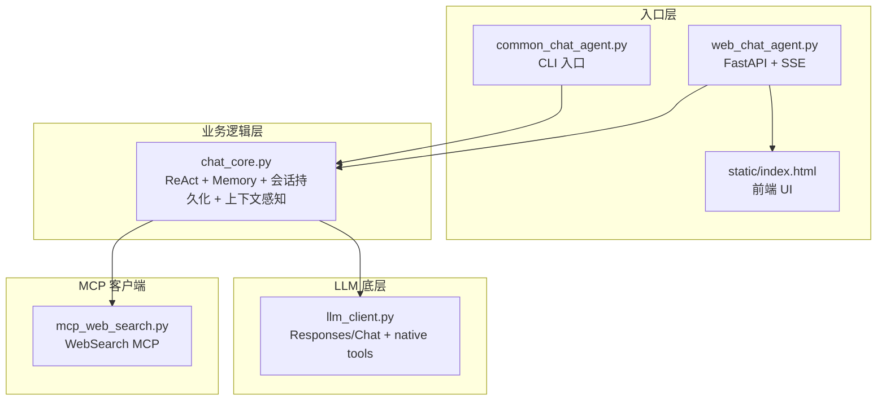
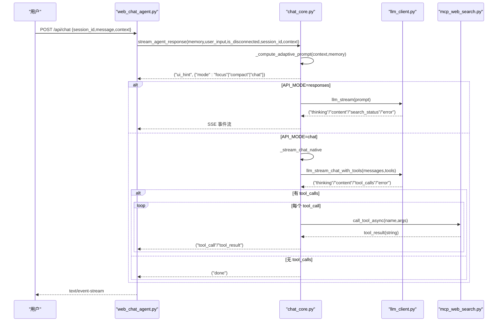
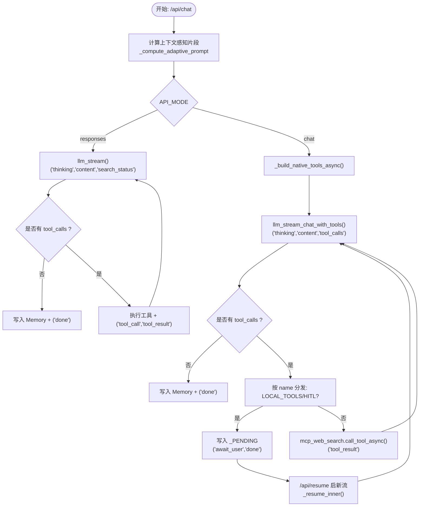
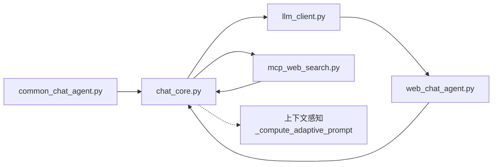

# ReAct 循环设计

<cite>
**本文引用的文件**
- [README.md](file://README.md)
- [CLAUDE.md](file://CLAUDE.md)
- [demo/chat_core.py](file://demo/chat_core.py)
- [demo/common_chat_agent.py](file://demo/common_chat_agent.py)
- [demo/web_chat_agent.py](file://demo/web_chat_agent.py)
- [demo/llm_client.py](file://demo/llm_client.py)
- [demo/mcp_web_search.py](file://demo/mcp_web_search.py)
- [demo/static/index.html](file://demo/static/index.html)
</cite>

## 更新摘要
**变更内容**
- 新增上下文感知能力章节，详细介绍 `_compute_adaptive_prompt()` 函数的实现原理
- 更新 ReAct 循环控制机制，增加流式响应中的自适应提示计算
- 新增 UI 提示机制说明，包括 `ui_hint` 事件的前端处理
- 更新循环执行流程图，反映上下文感知在两条路径中的应用

## 目录
1. [引言](#引言)
2. [项目结构](#项目结构)
3. [核心组件](#核心组件)
4. [架构总览](#架构总览)
5. [详细组件分析](#详细组件分析)
6. [上下文感知能力](#上下文感知能力)
7. [依赖分析](#依赖分析)
8. [性能考虑](#性能考虑)
9. [故障排除指南](#故障排除指南)
10. [结论](#结论)

## 引言
本设计文档聚焦 simple_chat_agent_demo 的 ReAct（思维-行动-观察）循环实现，系统阐述以下要点：
- ReAct 三个核心阶段：思维（Thought）、行动（Action）、观察（Observation）的实现原理
- 循环控制机制与最大轮次限制（MAX_ROUNDS=5）的设计考量
- 两种 ReAct 路径：文本协议路径（responses 模式）与原生函数调用路径（chat 模式）的区别与联系
- **新增**：上下文感知能力，包括 `_compute_adaptive_prompt()` 函数、UI 提示机制和流式响应中的自适应提示计算
- 循环执行流程图与状态转换说明

该 Demo 通过最小化代码讲清楚 ReAct 内核，CLI 与 Web 共享同一业务核心，确保两条路径在行为与约束上保持一致。

## 项目结构
项目采用三层分层架构，严格向下导入，职责清晰：
- 入口层（CLI/HTTP）：负责交互与 SSE 序列化，不触碰业务逻辑
- 业务逻辑层（chat_core）：ReAct 循环、Prompt 模板、Memory、会话持久化、HITL 基础设施、**上下文感知**
- LLM 底层（llm_client）：统一的 LLM 调用与流式事件抽象，支持 responses 与 chat 两套路径
- MCP 客户端（mcp_web_search）：DashScope WebSearch MCP 的封装，仅在 chat 模式启用

**图表来源**
- [CLAUDE.md:30-52](file://CLAUDE.md#L30-L52)
- [demo/chat_core.py:1-13](file://demo/chat_core.py#L1-L13)

**章节来源**
- [README.md:44-57](file://README.md#L44-L57)
- [CLAUDE.md:30-52](file://CLAUDE.md#L30-L52)

## 核心组件
- ReAct 循环控制
  - MAX_ROUNDS=5：CLI 与 Web 共用上限，防止模型反复输出 Action 导致 token 消耗失控
  - 两条路径共用同一轮次上限，确保行为一致性
- **新增**：上下文感知系统
  - `_compute_adaptive_prompt()`：基于前端上下文动态计算自适应提示片段和 UI 模式
  - `ui_hint` 事件：向前端推送 UI 模式建议（`focus`、`compact`、`chat`）
  - 流式响应集成：在 `stream_agent_response()` 中实时计算并应用上下文感知
- Prompt 模板与上下文感知
  - build_prompt/build_prompt_chat：分别面向 responses 与 chat 模式
  - `_compute_adaptive_prompt`：基于前端上下文动态注入 system 片段与 UI hint
- 工具与工具调用
  - 文本协议路径：match_tool_action/parse_action_input/execute_tool
  - 原生函数调用路径：llm_chat_with_tools/llm_stream_chat_with_tools + mcp_web_search
- Memory 与会话持久化
  - Memory：扁平字符串存储，支持序列化/反序列化
  - 会话归档：原子写入，路径安全校验
- HITL（人机协同）
  - LOCAL_TOOLS：ask_user / execute_shell_command
  - _PENDING：HITL 恢复点，支持 /api/resume 继续

**章节来源**
- [demo/chat_core.py:46-47](file://demo/chat_core.py#L46-L47)
- [demo/chat_core.py:403-419](file://demo/chat_core.py#L403-L419)
- [demo/chat_core.py:425-466](file://demo/chat_core.py#L425-L466)
- [demo/chat_core.py:358-396](file://demo/chat_core.py#L358-L396)
- [demo/chat_core.py:498-518](file://demo/chat_core.py#L498-L518)
- [demo/chat_core.py:63-111](file://demo/chat_core.py#L63-L111)
- [demo/chat_core.py:255-349](file://demo/chat_core.py#L255-L349)

## 架构总览
ReAct 循环在两条路径上并行存在，但最终汇聚到统一的 SSE 事件契约，前端零分支：
- 文本协议路径（responses 模式）
  - 入口：chat_core.stream_agent_response → llm_client.llm_stream
  - 工具调用：字符串解析 Action/Action Input → execute_tool
  - 联网搜索：Responses API 内置 web_search，通过 search_status 生命周期事件反馈
  - **新增**：上下文感知：在流开始时计算并推送 `ui_hint` 事件
- 原生函数调用路径（chat 模式）
  - 入口：chat_core.stream_agent_response → _stream_chat_native → _stream_react_rounds → llm_client.llm_stream_chat_with_tools
  - 工具调用：OpenAI native tools + tool_calls，MCP WebSearch
  - 联网搜索：通过 tool_call/tool_result 事件承载生命周期
  - **新增**：上下文感知：在流开始时计算并推送 `ui_hint` 事件

**图表来源**
- [CLAUDE.md:85-106](file://CLAUDE.md#L85-L106)
- [demo/chat_core.py:958-979](file://demo/chat_core.py#L958-L979)
- [demo/llm_client.py:633-647](file://demo/llm_client.py#L633-L647)
- [demo/mcp_web_search.py:127-164](file://demo/mcp_web_search.py#L127-L164)

**章节来源**
- [CLAUDE.md:85-106](file://CLAUDE.md#L85-L106)
- [demo/chat_core.py:958-979](file://demo/chat_core.py#L958-L979)

## 详细组件分析

### ReAct 三个阶段的实现原理
- 思维（Thought）
  - responses 路径：llm_client.llm_stream 输出 "thinking" 事件，前端展示思考摘要
  - chat 路径：llm_stream_chat_with_tools 输出 "thinking" 增量，同时在 assistant 消息中保留 reasoning_content 跨轮回传
- 行动（Action）
  - 文本协议路径：match_tool_action 精确匹配 Action 行，parse_action_input 解析 Action Input JSON
  - 原生函数调用路径：llm_stream_chat_with_tools 返回 "tool_calls" 结构化列表，按 name 分发执行
- 观察（Observation）
  - 文本协议路径：execute_tool 返回字符串，拼接到 latest_input 的 Observation
  - chat 路径：MCP 调用结果以 role=tool 追加到 messages，模型随后继续推理

**章节来源**
- [demo/llm_client.py:467-496](file://demo/llm_client.py#L467-L496)
- [demo/llm_client.py:618-795](file://demo/llm_client.py#L618-L795)
- [demo/chat_core.py:358-396](file://demo/chat_core.py#L358-L396)
- [demo/chat_core.py:632-800](file://demo/chat_core.py#L632-L800)

### 循环控制机制与 MAX_ROUNDS 设计
- MAX_ROUNDS=5：CLI 与 Web 共用上限，防止无限 Action 循环
- 控制点
  - CLI：react() 循环 for round in range(MAX_ROUNDS)
  - Web：stream_agent_response() 与 _stream_react_rounds() 同步轮次控制
- 设计考量
  - Token 保护：避免模型反复输出 Action 导致 token 消耗
  - 行为一致性：两条路径共享同一上限，确保不同入口的行为等价
  - 可扩展性：如需更长工具链，可提升上限

**章节来源**
- [demo/chat_core.py:46-47](file://demo/chat_core.py#L46-L47)
- [demo/chat_core.py:929](file://demo/chat_core.py#L929)
- [demo/chat_core.py:1003](file://demo/chat_core.py#L1003)
- [CLAUDE.md:217](file://CLAUDE.md#L217)

### 两种 ReAct 路径的区别与联系
- 区别
  - 文本协议路径（responses 模式）
    - Prompt 为字符串，工具调用通过 Action/Action Input 行解析
    - 联网搜索由 Responses API 内置，通过 search_status 生命周期事件反馈
  - 原生函数调用路径（chat 模式）
    - Messages 为结构化数组，工具调用通过 tools/tool_calls 协议
    - 联网搜索改为 MCP WebSearch，生命周期通过 tool_call/tool_result 事件承载
- 联系
  - 两条路径最终汇聚到统一的 SSE 事件契约，前端零分支
  - MAX_ROUNDS、Memory、HITL 基础设施在两条路径上保持一致
  - **新增**：上下文感知（adaptive_fragment/ui_hint）在两条路径均生效

**章节来源**
- [CLAUDE.md:89-106](file://CLAUDE.md#L89-L106)
- [demo/chat_core.py:425-466](file://demo/chat_core.py#L425-L466)
- [demo/chat_core.py:498-518](file://demo/chat_core.py#L498-L518)

### 循环执行流程图与状态转换
以下流程图展示了 Web 端 chat 模式下的 ReAct 循环状态转换，涵盖思考、行动、观察与 HITL 中断/恢复。

**图表来源**
- [demo/chat_core.py:958-1067](file://demo/chat_core.py#L958-L1067)
- [demo/chat_core.py:632-800](file://demo/chat_core.py#L632-L800)
- [demo/llm_client.py:633-924](file://demo/llm_client.py#L633-L924)
- [demo/mcp_web_search.py:127-164](file://demo/mcp_web_search.py#L127-L164)

**章节来源**
- [demo/chat_core.py:958-1067](file://demo/chat_core.py#L958-L1067)
- [demo/chat_core.py:632-800](file://demo/chat_core.py#L632-L800)

### CLI 与 Web 的入口与控制流
- CLI
  - common_chat_agent.main() 逐行读取用户输入，调用 chat_core.react()
  - react() 为同步循环，受 MAX_ROUNDS 保护
- Web
  - web_chat_agent.py 提供 /api/chat 与 /api/resume
  - stream_agent_response() 为异步流式循环，支持断连检测与 HITL 恢复
  - index.html 负责 UI 呈现与 SSE 事件消费

**章节来源**
- [demo/common_chat_agent.py:17-50](file://demo/common_chat_agent.py#L17-L50)
- [demo/web_chat_agent.py:127-167](file://demo/web_chat_agent.py#L127-L167)
- [demo/chat_core.py:958-979](file://demo/chat_core.py#L958-L979)

## 上下文感知能力

### _compute_adaptive_prompt 函数实现
`_compute_adaptive_prompt()` 是上下文感知系统的核心函数，负责基于前端上报的上下文信息动态计算自适应提示片段和 UI 模式：

- 输入参数
  - `context`: 前端上报的环境上下文字典，包含：
    - `session_message_count`: 会话消息数量
    - `selected_text`: 用户选中文本
    - `viewport_width`: 视口宽度
  - `memory`: 当前会话的 Memory 对象

- 输出
  - 返回元组 `(adaptive_fragment, ui_mode)`：
    - `adaptive_fragment`: 自适应的 system prompt 片段
    - `ui_mode`: UI 模式（`focus`、`compact`、`chat`）

- 判定逻辑
  - 优先级：选中文本 > 长对话 > 默认
  - 选中文本：返回聚焦提示和 `focus` 模式
  - 长对话（>10 条消息）：返回简洁提示和 `compact` 模式  
  - 默认：返回空片段和 `chat` 模式

**章节来源**
- [demo/chat_core.py:403-419](file://demo/chat_core.py#L403-L419)
- [CLAUDE.md:77-83](file://CLAUDE.md#L77-L83)

### UI 提示机制
前端通过 `ui_hint` 事件接收后端推送的 UI 模式建议，并据此调整界面布局：

- 事件格式：`("ui_hint", {"mode": "focus"|"compact"|"chat"})`
- 处理逻辑：
  - `compact`：折叠历史消息，只显示最近几轮对话
  - `focus`：高亮选中文本相关的上下文区域
  - `chat`：默认模式，不做特殊处理

**章节来源**
- [demo/chat_core.py:975-977](file://demo/chat_core.py#L975-L977)
- [demo/static/index.html:1477-1479](file://demo/static/index.html#L1477-L1479)
- [demo/static/index.html:1537-1555](file://demo/static/index.html#L1537-L1555)

### 流式响应中的自适应提示计算
在 `stream_agent_response()` 中，上下文感知能力被集成到流式响应过程中：

1. **计算阶段**：调用 `_compute_adaptive_prompt(context, memory)` 获取 `adaptive_fragment` 和 `ui_mode`
2. **UI 提示**：立即推送 `("ui_hint", {"mode": ui_mode})` 事件
3. **Prompt 注入**：将 `adaptive_fragment` 注入到后续的 Prompt 构建中
4. **持续应用**：在两条路径中都应用相同的上下文感知逻辑

**章节来源**
- [demo/chat_core.py:989-991](file://demo/chat_core.py#L989-L991)
- [demo/chat_core.py:1004-1005](file://demo/chat_core.py#L1004-L1005)

## 依赖分析
- 模块间依赖
  - common_chat_agent/web_chat_agent → chat_core（仅导入 MODEL/API_MODE 重导出）
  - chat_core → llm_client（llm()/llm_stream/llm_chat_with_tools 等）
  - chat_core → mcp_web_search（chat 模式 native tools）
  - llm_client 与 mcp_web_search 互不直接依赖
- 抽象边界
  - llm_client：(kind, payload) 元组协议
  - chat_core：(event_name, payload_dict) 元组协议
  - web_chat_agent：SSE 文本帧序列化
  - **新增**：上下文感知：前端上下文 → 后端计算 → UI 提示

**图表来源**
- [CLAUDE.md:40-52](file://CLAUDE.md#L40-L52)
- [demo/chat_core.py:26-34](file://demo/chat_core.py#L26-L34)

**章节来源**
- [CLAUDE.md:40-52](file://CLAUDE.md#L40-L52)

## 性能考虑
- 流式处理
  - llm_stream/llm_stream_chat_with_tools 采用流式增量输出，降低前端等待时间
  - responses 模式下 search_status 生命周期事件仅在必要时触发，避免冗余
  - **新增**：上下文感知计算在流开始时一次性完成，避免重复计算
- 工具调用
  - chat 模式 native tools 采用短连接调用 MCP，避免长连接开销
  - 工具结果截断（TOOL_RESULT_PREVIEW_CHARS=500）减少前端传输与渲染压力
- 内存与持久化
  - Memory 采用扁平字符串存储，序列化/反序列化成本低
  - 会话归档采用原子写入（.tmp + replace），避免崩溃产生半文件
- **新增**：上下文感知性能
  - 简单的一维判定逻辑，计算开销极小
  - UI 提示事件仅在流开始时发送一次

## 故障排除指南
- API_MODE 配置错误
  - 现象：模块加载时报错，非法值
  - 处理：设置 API_MODE=responses 或 API_MODE=chat（大小写不敏感）
- API_KEY 未配置
  - 现象：CLI/HTTP 启动时报错，拒绝继续
  - 处理：设置 DASHSCOPE_API_KEY
- 会话 ID 非法
  - 现象：HistoryNotFound/InvalidSessionId
  - 处理：确认 session_id 符合 UUID 格式（36 字符，含连字符）
- HITL 恢复失败
  - 现象：/api/resume 返回 404/409
  - 处理：确认 pending 是否存在、tool_call_id 是否匹配
- **新增**：上下文感知问题
  - 现象：UI 未按预期变化
  - 处理：检查前端是否正确发送 `context` 字段，确认后端日志中是否输出上下文信息

**章节来源**
- [demo/web_chat_agent.py:53-58](file://demo/web_chat_agent.py#L53-L58)
- [demo/chat_core.py:211-226](file://demo/chat_core.py#L211-L226)
- [demo/web_chat_agent.py:149-167](file://demo/web_chat_agent.py#L149-L167)

## 结论
simple_chat_agent_demo 通过清晰的三层架构与两条 ReAct 路径并行设计，在保持教学可读性的同时，实现了：
- ReAct 三阶段的完整闭环：思维、行动、观察
- 统一的循环控制与轮次保护（MAX_ROUNDS=5）
- 文本协议与原生函数调用两种工具范式的对照与共存
- 人机协同（HITL）与会话持久化的教学演示
- **新增**：上下文感知能力，通过 `_compute_adaptive_prompt()` 实现自适应提示计算，通过 `ui_hint` 事件实现动态 UI 切换

该设计为扩展工具、优化性能与增强 UI 提供了明确的边界与路径。上下文感知系统的引入进一步提升了用户体验，使智能体能够根据用户的实际使用场景提供更加个性化的服务。