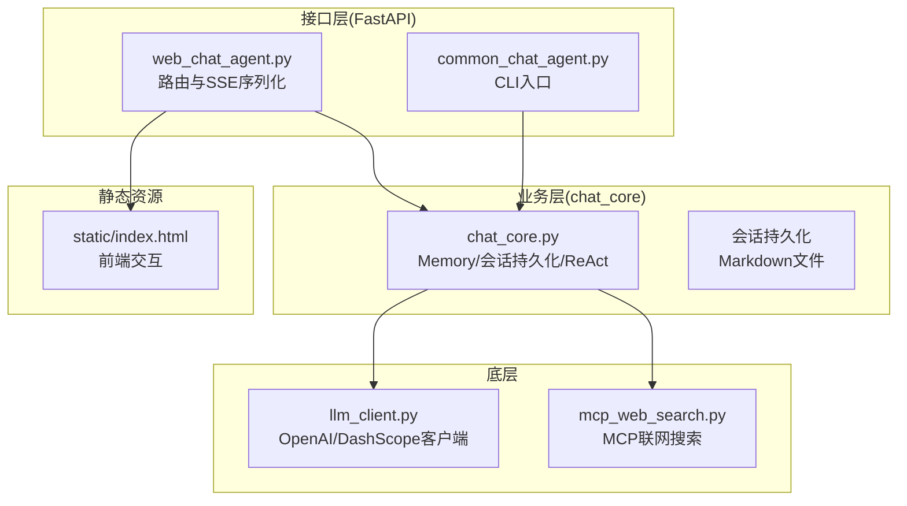
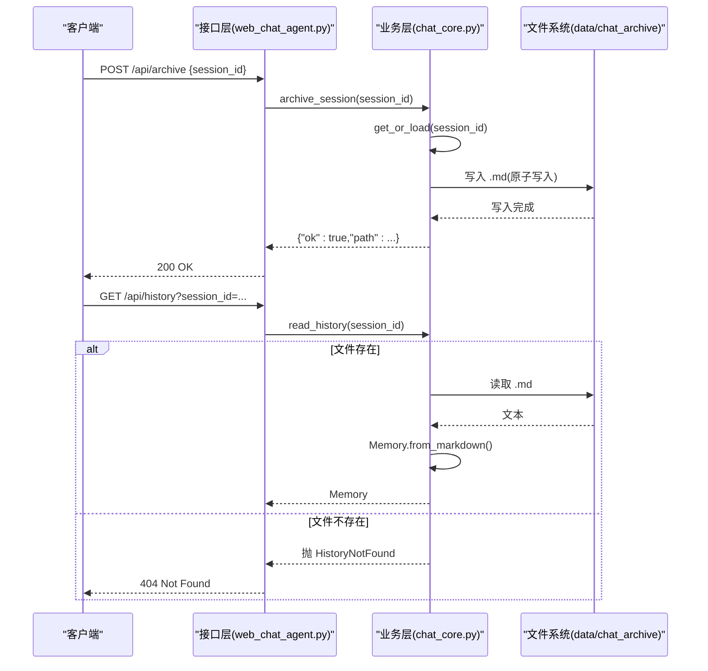
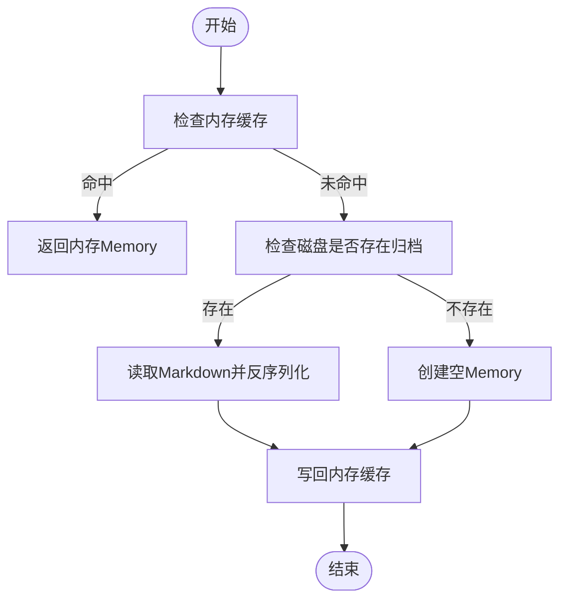
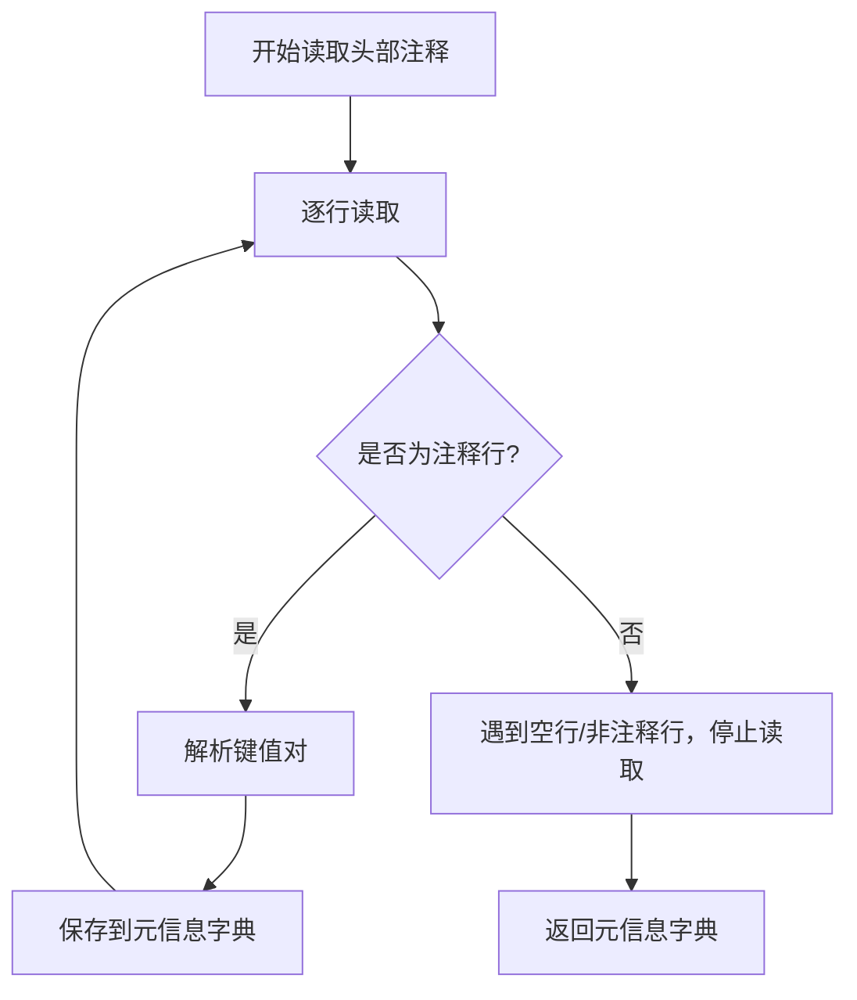
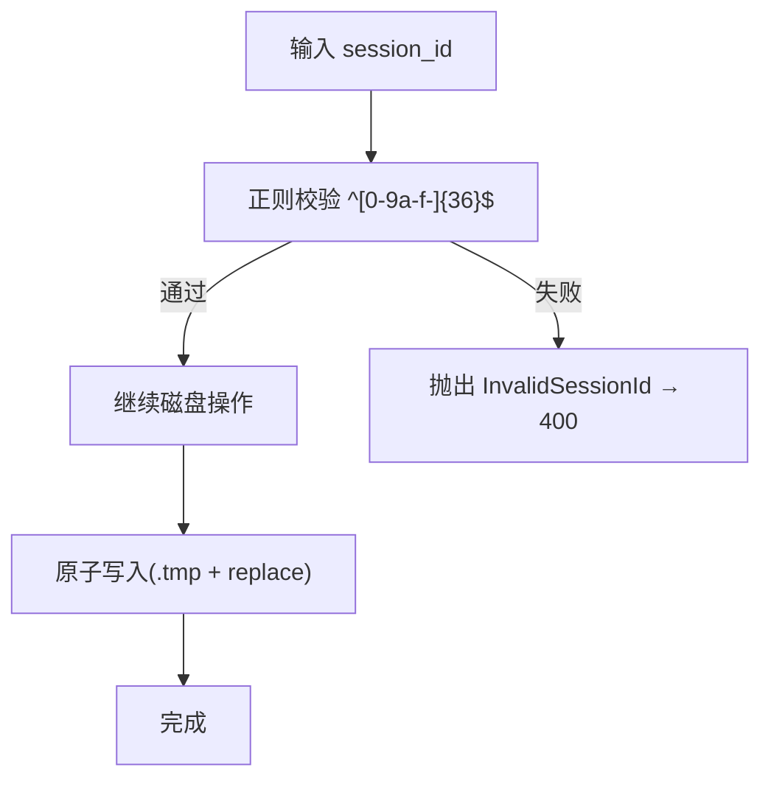
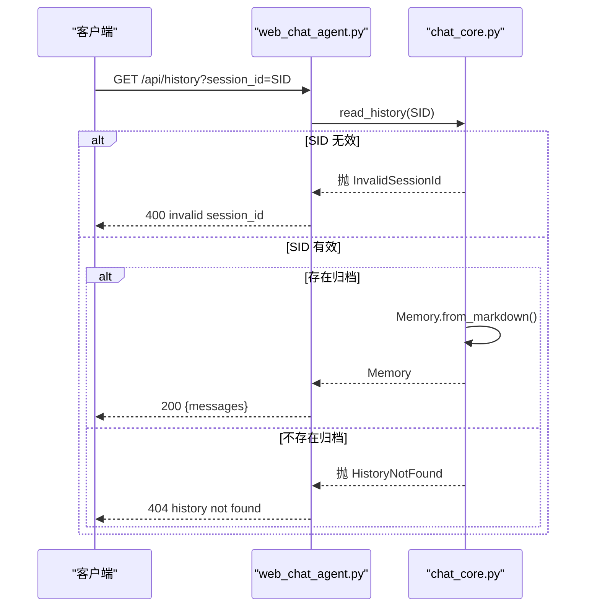
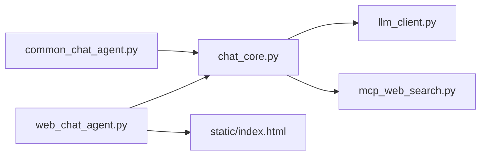

# 会话持久化设计

<cite>
**本文引用的文件**
- [README.md](file://README.md)
- [chat_core.py](file://demo/chat_core.py)
- [web_chat_agent.py](file://demo/web_chat_agent.py)
- [common_chat_agent.py](file://demo/common_chat_agent.py)
- [llm_client.py](file://demo/llm_client.py)
- [mcp_web_search.py](file://demo/mcp_web_search.py)
- [index.html](file://demo/static/index.html)
- [CLAUDE.md](file://CLAUDE.md)
</cite>

## 目录
1. [简介](#简介)
2. [项目结构](#项目结构)
3. [核心组件](#核心组件)
4. [架构总览](#架构总览)
5. [详细组件分析](#详细组件分析)
6. [依赖关系分析](#依赖关系分析)
7. [性能考量](#性能考量)
8. [故障排查指南](#故障排查指南)
9. [结论](#结论)
10. [附录](#附录)

## 简介
本设计文档聚焦 simple_chat_agent_demo 的会话持久化体系，系统性阐述会话生命周期管理（创建、加载、归档、重置、删除）、Markdown 文件存储格式（HTML 注释元数据头、消息分隔标记、预览文本机制）、会话 ID 验证与安全防护（路径遍历攻击防护）、会话操作 API 的行为与错误处理策略。文档面向不同技术背景读者，提供从高层到代码级的渐进式理解，并辅以可视化图示帮助快速把握要点。

## 项目结构
该项目采用“接口层（FastAPI）+ 业务层（chat_core）+ 底层 LLM/MCP”三层架构：
- 接口层：提供 HTTP/SSE API，负责参数校验、异常翻译与事件序列化。
- 业务层：实现会话内存、ReAct 循环、Markdown 序列化/反序列化、原子写入、会话列表与历史读取等。
- 底层：封装 LLM 客户端与 MCP 联网搜索，提供同步/异步调用与流式事件。

图表来源
- [web_chat_agent.py:117-226](file://demo/web_chat_agent.py#L117-L226)
- [common_chat_agent.py:17-50](file://demo/common_chat_agent.py#L17-L50)
- [chat_core.py:138-350](file://demo/chat_core.py#L138-L350)
- [llm_client.py:1-120](file://demo/llm_client.py#L1-L120)
- [mcp_web_search.py:1-60](file://demo/mcp_web_search.py#L1-L60)
- [index.html:1-200](file://demo/static/index.html#L1-L200)

章节来源
- [README.md:44-57](file://README.md#L44-L57)
- [web_chat_agent.py:117-226](file://demo/web_chat_agent.py#L117-L226)
- [chat_core.py:138-350](file://demo/chat_core.py#L138-L350)

## 核心组件
- Memory：多轮对话记忆的数据结构与 Markdown 序列化/反序列化。
- 会话持久化：基于 Markdown 文件的归档、读取、列表与原子写入。
- 会话操作 API：归档、重置、删除、历史读取、会话列表、原始归档下载。
- 安全与验证：会话 ID 正则校验、原子写入、路径遍历防护、异常翻译为 HTTP 状态码。

章节来源
- [chat_core.py:138-350](file://demo/chat_core.py#L138-L350)
- [web_chat_agent.py:170-226](file://demo/web_chat_agent.py#L170-L226)

## 架构总览
会话持久化贯穿接口层与业务层：
- 接口层负责接收请求、参数校验与异常翻译（InvalidSessionId → 400；HistoryNotFound → 404；PendingNotFound → 404；PendingMismatch → 409）。
- 业务层负责会话内存缓存、磁盘归档、原子写入、元信息解析与列表排序。

图表来源
- [web_chat_agent.py:180-198](file://demo/web_chat_agent.py#L180-L198)
- [chat_core.py:272-336](file://demo/chat_core.py#L272-L336)

## 详细组件分析

### 会话生命周期管理
- 创建与加载
  - get_or_load：命中内存直接返回；否则从磁盘按 session_id 加载；不存在则回退空 Memory；最终写回 sessions 缓存。
  - read_history：优先内存，再磁盘懒加载；均无则抛 HistoryNotFound。
- 归档
  - archive_session：覆盖式写入当前 Memory 到 Markdown；空 Memory 跳过。
  - 原子写入：先写临时文件，再替换，避免崩溃产生半文件。
- 重置
  - reset_session：清内存 + 删除磁盘归档文件，保留 session_id。
- 删除
  - delete_session：删除磁盘归档 + 移除内存缓存。
- 列表
  - list_sessions：扫描目录，只读头部元信息，按 updated_at 倒序返回。

图表来源
- [chat_core.py:255-269](file://demo/chat_core.py#L255-L269)

章节来源
- [chat_core.py:255-350](file://demo/chat_core.py#L255-L350)
- [web_chat_agent.py:170-226](file://demo/web_chat_agent.py#L170-L226)

### Markdown 文件存储格式设计
- 元数据头：使用连续的 HTML 注释行，包含 session_id、updated_at、turns、preview。
- 消息分隔：使用独立行的 HTML 注释标记 turn: 用户/AI，正文紧随其后，以空行分隔。
- 预览文本：preview 来自第一条用户消息的首行文本，限制长度，便于列表展示。
- 元信息解析：_read_meta 仅读取头部连续注释，遇到首个空行停止，避免误读正文。

图表来源
- [chat_core.py:241-252](file://demo/chat_core.py#L241-L252)

章节来源
- [chat_core.py:154-193](file://demo/chat_core.py#L154-L193)
- [chat_core.py:241-252](file://demo/chat_core.py#L241-L252)

### 会话 ID 验证机制与安全防护
- 会话 ID 校验：所有磁盘操作前使用正则 ^[0-9a-f-]{36}$ 校验 session_id，确保为标准 UUID 形态。
- 路径遍历防护：正则拒绝路径分隔符与编码形式；结合 FastAPI 路由参数校验，进一步降低风险。
- 原子写入：写入临时文件后替换，避免崩溃导致半文件。
- 异常翻译：InvalidSessionId → 400；HistoryNotFound → 404；PendingNotFound → 404；PendingMismatch → 409。

图表来源
- [chat_core.py:228-239](file://demo/chat_core.py#L228-L239)
- [web_chat_agent.py:180-186](file://demo/web_chat_agent.py#L180-L186)

章节来源
- [chat_core.py:203-239](file://demo/chat_core.py#L203-L239)
- [web_chat_agent.py:133-134](file://demo/web_chat_agent.py#L133-L134)
- [web_chat_agent.py:149-162](file://demo/web_chat_agent.py#L149-L162)

### 会话操作 API 详解与错误处理
- POST /api/archive
  - 功能：覆盖式归档当前会话 Memory 到 Markdown；空 Memory 跳过。
  - 错误：InvalidSessionId → 400。
- POST /api/reset
  - 功能：原地重置（清内存 + 删除归档文件）。
  - 错误：InvalidSessionId → 400。
- DELETE /api/sessions/{session_id}
  - 功能：删除会话（磁盘归档 + 内存同步移除）。
  - 错误：InvalidSessionId → 400。
- GET /api/history
  - 功能：返回会话历史；优先内存，再磁盘懒加载；均无 → 404。
  - 错误：InvalidSessionId → 400；HistoryNotFound → 404。
- GET /api/sessions
  - 功能：列出所有归档会话，只读头部元信息，按 updated_at 倒序。
- GET /api/sessions/{session_id}/raw
  - 功能：返回归档 Markdown 原始文本；无归档 → 404。
  - 错误：InvalidSessionId → 400；HistoryNotFound → 404。

图表来源
- [web_chat_agent.py:189-198](file://demo/web_chat_agent.py#L189-L198)
- [chat_core.py:327-336](file://demo/chat_core.py#L327-L336)

章节来源
- [web_chat_agent.py:170-226](file://demo/web_chat_agent.py#L170-L226)
- [chat_core.py:272-336](file://demo/chat_core.py#L272-L336)

### 会话 ID 验证与路径遍历防护
- 正则约束：session_id 必须为 36 位标准 UUID（含连字符），拒绝路径分隔符与编码形式。
- 路径合成：_archive_path 基于固定目录与 session_id 合成文件路径，配合正则校验。
- 前端交互：前端通过 /api/archive 与 /api/reset 等接口驱动后端校验与操作，避免直接构造路径。

章节来源
- [chat_core.py:203-239](file://demo/chat_core.py#L203-L239)
- [web_chat_agent.py:180-186](file://demo/web_chat_agent.py#L180-L186)
- [CLAUDE.md:148-159](file://CLAUDE.md#L148-L159)

## 依赖关系分析
- 接口层依赖业务层提供的会话操作函数与异常类型，负责参数校验与状态码翻译。
- 业务层依赖底层 LLM/MCP 模块进行推理与工具调用，但不感知接口层。
- 前端通过静态页面与接口层交互，不直接访问磁盘。

图表来源
- [web_chat_agent.py:29-46](file://demo/web_chat_agent.py#L29-L46)
- [common_chat_agent.py:13-14](file://demo/common_chat_agent.py#L13-L14)
- [chat_core.py:26-34](file://demo/chat_core.py#L26-L34)
- [llm_client.py:1-20](file://demo/llm_client.py#L1-L20)
- [mcp_web_search.py:1-20](file://demo/mcp_web_search.py#L1-L20)
- [index.html:1-200](file://demo/static/index.html#L1-L200)

章节来源
- [web_chat_agent.py:29-46](file://demo/web_chat_agent.py#L29-L46)
- [chat_core.py:26-34](file://demo/chat_core.py#L26-L34)

## 性能考量
- 内存缓存：sessions 字典缓存当前会话 Memory，减少磁盘 IO。
- 原子写入：归档采用 .tmp + replace，避免崩溃导致半文件，提升可靠性。
- 元信息只读：list_sessions 仅读取头部注释，避免大文件解析成本。
- 流式事件：Web 端通过 SSE 逐步推送事件，降低前端渲染压力。

章节来源
- [chat_core.py:208-209](file://demo/chat_core.py#L208-L209)
- [chat_core.py:234-239](file://demo/chat_core.py#L234-L239)
- [chat_core.py:301-324](file://demo/chat_core.py#L301-L324)

## 故障排查指南
- 400 invalid session_id
  - 可能原因：session_id 非标准 UUID（含非法字符或长度不符）。
  - 处理建议：确认前端生成的 session_id 符合 UUID 格式；检查接口参数。
- 404 history not found
  - 可能原因：磁盘不存在归档文件；或归档文件损坏/元信息缺失。
  - 处理建议：调用 /api/archive 确认归档；检查 ARCHIVE_DIR 权限；查看服务器日志。
- 404 no pending HITL for session
  - 可能原因：当前会话无待处理的人机协作（HITL）。
  - 处理建议：确认是否触发了 ask_user 或 execute_shell_command；检查 /api/chat 的 await_user 事件。
- 409 tool_call_id mismatch
  - 可能原因：/api/resume 提交的 tool_call_id 与等待中的不一致。
  - 处理建议：刷新页面后重试；确保使用最新前端弹窗的 tool_call_id。

章节来源
- [web_chat_agent.py:133-134](file://demo/web_chat_agent.py#L133-L134)
- [web_chat_agent.py:149-162](file://demo/web_chat_agent.py#L149-L162)
- [chat_core.py:211-226](file://demo/chat_core.py#L211-L226)

## 结论
本设计以最小实现达成可靠的会话持久化：通过 Memory 的 Markdown 序列化与原子写入，结合严格的 session_id 校验与路径遍历防护，实现了会话的创建、加载、归档、重置与删除的完整生命周期管理。接口层将业务异常翻译为明确的 HTTP 状态码，前端通过 SSE 逐步消费事件，整体架构清晰、可维护性强，适合教学与演示场景。

## 附录
- 会话 ID 格式：标准 UUID（36 位，含连字符）。
- 归档目录：data/chat_archive（相对路径）。
- 原子写入：先写 .tmp，再 replace，避免半文件。
- 元信息字段：session_id、updated_at、turns、preview。

章节来源
- [chat_core.py:200-206](file://demo/chat_core.py#L200-L206)
- [chat_core.py:228-239](file://demo/chat_core.py#L228-L239)
- [chat_core.py:154-174](file://demo/chat_core.py#L154-L174)