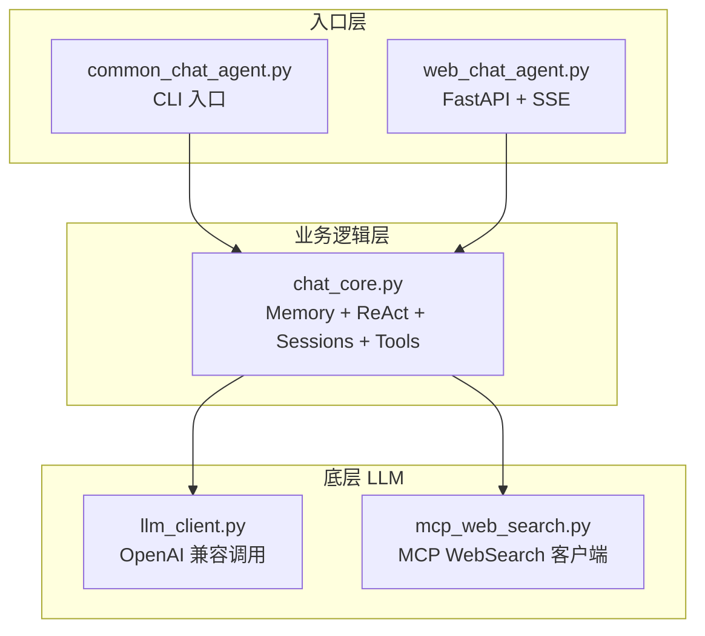
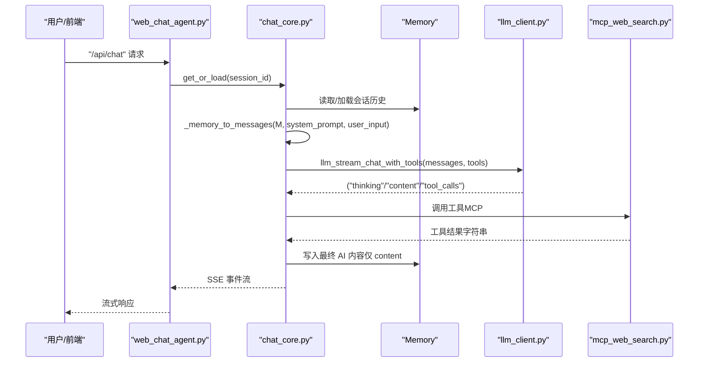
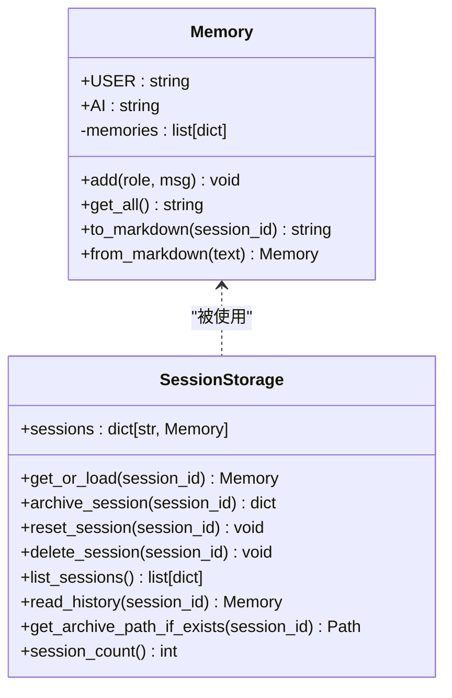
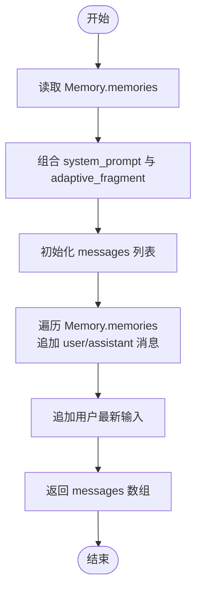
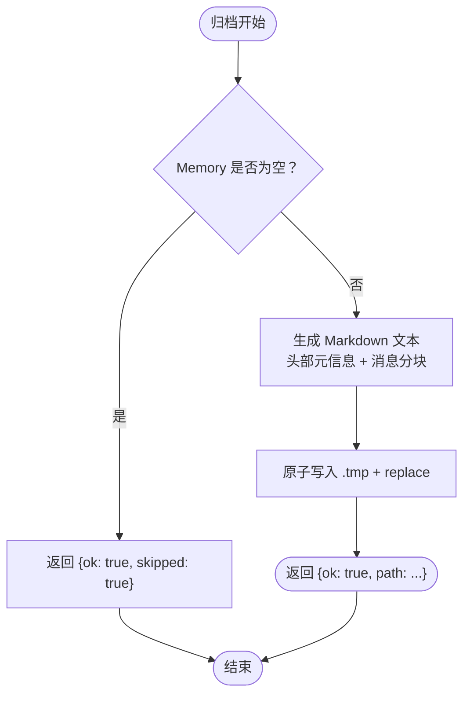
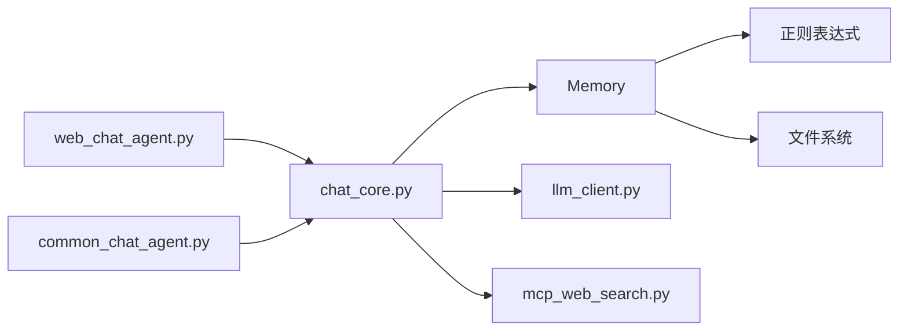

# 内存管理机制

<cite>
**本文引用的文件**
- [chat_core.py](file://demo/chat_core.py)
- [CLAUDE.md](file://CLAUDE.md)
- [web_chat_agent.py](file://demo/web_chat_agent.py)
- [common_chat_agent.py](file://demo/common_chat_agent.py)
- [llm_client.py](file://demo/llm_client.py)
- [mcp_web_search.py](file://demo/mcp_web_search.py)
- [index.html](file://demo/static/index.html)
</cite>

## 目录
1. [简介](#简介)
2. [项目结构](#项目结构)
3. [核心组件](#核心组件)
4. [架构总览](#架构总览)
5. [详细组件分析](#详细组件分析)
6. [依赖关系分析](#依赖关系分析)
7. [性能考量](#性能考量)
8. [故障排查指南](#故障排查指南)
9. [结论](#结论)

## 简介
本文件面向 simple_chat_agent_demo 的内存管理机制，聚焦 Memory 类的设计与实现，涵盖：
- 对话记忆的存储格式与序列化/反序列化
- flat-string 存储格式的设计理念与优势
- 与 OpenAI messages 数组格式的转换过程
- 内存持久化（Markdown 文件格式、HTML 注释元数据结构、消息分割标记）
- 不同模式（responses 与 chat）下的行为差异

## 项目结构
该项目采用三层模块化设计，Memory 位于业务逻辑层，负责多轮对话记忆的存储、序列化与会话持久化；上层入口（CLI/HTTP）通过业务层提供的接口完成会话生命周期管理。

图表来源
- [chat_core.py:1-1068](file://demo/chat_core.py#L1-L1068)
- [web_chat_agent.py:1-233](file://demo/web_chat_agent.py#L1-L233)
- [common_chat_agent.py:1-53](file://demo/common_chat_agent.py#L1-L53)
- [llm_client.py:1-924](file://demo/llm_client.py#L1-L924)
- [mcp_web_search.py:1-172](file://demo/mcp_web_search.py#L1-L172)

章节来源
- [chat_core.py:1-1068](file://demo/chat_core.py#L1-L1068)
- [CLAUDE.md:28-52](file://CLAUDE.md#L28-L52)

## 核心组件
- Memory 类：负责对话记忆的增删改查、flat-string 序列化与反序列化、会话持久化与加载。
- 会话存储：基于内存 sessions 字典与磁盘归档（Markdown 文件）的两级缓存。
- 模式适配：在 responses 与 chat 两种 API 模式下，Memory 的存储格式保持 flat-string，但在调用 LLM 时通过转换函数将 flat-string 转为 OpenAI messages 数组。

章节来源
- [chat_core.py:138-193](file://demo/chat_core.py#L138-L193)
- [chat_core.py:255-291](file://demo/chat_core.py#L255-L291)
- [chat_core.py:479-495](file://demo/chat_core.py#L479-L495)

## 架构总览
Memory 的职责边界清晰：仅负责“记忆”与“持久化”，不参与 LLM 调用细节。在 chat 模式下，Memory 的 flat-string 存储格式通过转换函数在调用 LLM 时临时转为 OpenAI messages 数组，调用结束后仅将最终 AI 内容写回 Memory，不保留 tool_calls 与 tool_call_id。

图表来源
- [chat_core.py:479-495](file://demo/chat_core.py#L479-L495)
- [chat_core.py:803-830](file://demo/chat_core.py#L803-L830)
- [llm_client.py:633-646](file://demo/llm_client.py#L633-L646)
- [mcp_web_search.py:127-164](file://demo/mcp_web_search.py#L127-L164)

章节来源
- [chat_core.py:479-495](file://demo/chat_core.py#L479-L495)
- [chat_core.py:803-830](file://demo/chat_core.py#L803-L830)
- [llm_client.py:633-646](file://demo/llm_client.py#L633-L646)
- [mcp_web_search.py:127-164](file://demo/mcp_web_search.py#L127-L164)

## 详细组件分析

### Memory 类设计与实现
- 存储结构：内部以 flat-string 的二元组列表存储，元素包含 role 与 msg。
- 增删改查：add(role, msg) 追加一条记忆；get_all() 将所有记忆拼接为单个字符串，用于 responses 模式下的 prompt 组装。
- 序列化：to_markdown(session_id) 生成 Markdown 文本，头部以 HTML 注释存储元信息（session_id、updated_at、turns、preview），正文按“turn: 用户/AI”定界符分块。
- 反序列化：from_markdown(text) 通过正则匹配“turn: 用户/AI”定界符，提取每段消息内容并重建 Memory。
- 会话持久化：archive_session(session_id) 将当前 Memory 写入 data/chat_archive/{session_id}.md；reset_session(session_id) 删除磁盘归档并清空内存缓存；list_sessions() 仅读取文件头元信息以避免全量解析。

图表来源
- [chat_core.py:138-193](file://demo/chat_core.py#L138-L193)
- [chat_core.py:255-348](file://demo/chat_core.py#L255-L348)

章节来源
- [chat_core.py:138-193](file://demo/chat_core.py#L138-L193)
- [chat_core.py:255-348](file://demo/chat_core.py#L255-L348)

### flat-string 存储格式的设计理念与优势
- 设计理念：Memory 的 flat-string 存储是教学 demo 的刻意设计，强调“prompt 可见”，便于理解与调试。该设计贯穿 prompt 组装与日志输出，使历史对话与系统指令一目了然。
- 优势：
  - 可读性强：日志中直接打印完整 prompt，便于教学与排障。
  - 结构简单：仅需 role/msg 二元组，序列化/反序列化成本低。
  - 兼容性好：responses 模式下直接拼接到 prompt；chat 模式下通过转换函数临时转为 messages 数组。
- 与 OpenAI messages 数组的关系：Memory 的 flat-string 存储不改变，仅在调用 LLM 时进行一次性的格式转换，调用结束后仅写入最终 AI 内容，tool_calls 与 tool_call_id 不进入 Memory。

章节来源
- [CLAUDE.md:196-200](file://CLAUDE.md#L196-L200)
- [chat_core.py:479-495](file://demo/chat_core.py#L479-L495)

### 与 OpenAI messages 数组的转换过程
- 转换函数：_memory_to_messages(memory, system_prompt, user_input, adaptive_fragment) 将 Memory.memories 转换为 OpenAI Chat Completions 的 messages 数组，角色映射为 user/assistant，系统消息由 system_prompt 与 adaptive_fragment 组合而成。
- 调用时机：仅在 chat 模式 native function calling 的每轮用户输入入口调用一次，随后将 tool_calls 与 tool_call_id 保留在本轮 messages 中，调用结束后仅把 final assistant content 写回 Memory。
- 与 responses 模式的差异：responses 模式始终使用 flat-string prompt，不进行 messages 数组转换。

图表来源
- [chat_core.py:479-495](file://demo/chat_core.py#L479-L495)

章节来源
- [chat_core.py:479-495](file://demo/chat_core.py#L479-L495)

### 内存持久化实现
- 文件格式：Markdown 文本，头部以 HTML 注释存储元信息，正文以“turn: 用户/AI”定界符分块。
- 元信息结构：
  - session_id：会话标识
  - updated_at：更新时间（ISO 8601）
  - turns：消息轮次数
  - preview：第一条用户消息的前 20 字符预览
- 消息分割标记：每轮消息以“<!-- turn: 用户 -->”或“<!-- turn: AI -->”作为定界符，正文为该轮消息内容。
- 写入策略：使用原子写入（先写 .tmp 再替换），避免崩溃导致半文件。
- 读取策略：list_sessions() 仅读取头部元信息，避免全量解析；read_history() 与 get_or_load() 按需从磁盘加载。

图表来源
- [chat_core.py:272-284](file://demo/chat_core.py#L272-L284)
- [chat_core.py:234-239](file://demo/chat_core.py#L234-L239)

章节来源
- [chat_core.py:272-284](file://demo/chat_core.py#L272-L284)
- [chat_core.py:234-239](file://demo/chat_core.py#L234-L239)
- [CLAUDE.md:127-160](file://CLAUDE.md#L127-L160)

### 不同模式下的行为差异
- responses 模式：
  - Memory 存储格式：flat-string（role/msg 二元组）
  - prompt 组装：build_prompt 将 Memory.get_all() 拼接到整体 prompt
  - LLM 调用：llm_stream 调用 Responses API，不发送 search_status（由 UI banner 承载）
- chat 模式：
  - Memory 存储格式：仍为 flat-string
  - 调用适配：_memory_to_messages 将 Memory 转为 messages 数组，传递给 llm_stream_chat_with_tools
  - 工具调用：通过 native function calling 与 MCP WebSearch 交互，工具结果以 role=tool 追加至 messages
  - 写回策略：仅 final assistant content 写回 Memory，tool_calls 与 tool_call_id 仅存在于本轮 messages

章节来源
- [chat_core.py:425-466](file://demo/chat_core.py#L425-L466)
- [chat_core.py:479-495](file://demo/chat_core.py#L479-L495)
- [llm_client.py:340-355](file://demo/llm_client.py#L340-L355)
- [llm_client.py:633-646](file://demo/llm_client.py#L633-L646)
- [CLAUDE.md:85-125](file://CLAUDE.md#L85-L125)

## 依赖关系分析
- Memory 依赖正则表达式进行 Markdown 解析与定界符匹配。
- 会话存储依赖 Path 与文件系统进行归档与读取。
- chat_core 与 llm_client 通过抽象事件契约（kind, payload）解耦，前者负责业务逻辑，后者负责底层调用。
- chat 模式下，chat_core 依赖 mcp_web_search 获取工具规范与执行工具调用。

图表来源
- [chat_core.py:138-193](file://demo/chat_core.py#L138-L193)
- [chat_core.py:255-348](file://demo/chat_core.py#L255-L348)
- [llm_client.py:1-924](file://demo/llm_client.py#L1-L924)
- [mcp_web_search.py:1-172](file://demo/mcp_web_search.py#L1-L172)
- [web_chat_agent.py:1-233](file://demo/web_chat_agent.py#L1-L233)
- [common_chat_agent.py:1-53](file://demo/common_chat_agent.py#L1-L53)

章节来源
- [chat_core.py:138-193](file://demo/chat_core.py#L138-L193)
- [chat_core.py:255-348](file://demo/chat_core.py#L255-L348)
- [llm_client.py:1-924](file://demo/llm_client.py#L1-L924)
- [mcp_web_search.py:1-172](file://demo/mcp_web_search.py#L1-L172)
- [web_chat_agent.py:1-233](file://demo/web_chat_agent.py#L1-L233)
- [common_chat_agent.py:1-53](file://demo/common_chat_agent.py#L1-L53)

## 性能考量
- 序列化/反序列化复杂度：to_markdown 与 from_markdown 均为线性复杂度，与消息数量成正比；Markdown 头部元信息读取仅扫描到首个空行，避免全量解析。
- 原子写入：归档采用 .tmp + replace，降低崩溃风险，提升可靠性。
- 模式切换：chat 模式在每轮用户输入时进行一次 flat-string 到 messages 的转换，转换成本与消息数量线性相关，但仅限于单轮调用期间。
- 前端解析：前端 index.html 中的 parseArchiveMarkdown 采用正则匹配与片段切片，复杂度与文件大小线性相关，但仅在预览/查看归档时触发。

章节来源
- [chat_core.py:234-239](file://demo/chat_core.py#L234-L239)
- [chat_core.py:241-252](file://demo/chat_core.py#L241-L252)
- [index.html:1819-1845](file://demo/static/index.html#L1819-L1845)

## 故障排查指南
- 归档失败：archive_session 在读取/写入异常时会记录日志并返回空 Memory；检查磁盘权限与 session_id 格式。
- 会话加载失败：get_or_load 在磁盘读取异常时会记录日志并返回空 Memory；确认文件是否存在且格式正确。
- 无效 session_id：所有磁盘操作前均进行正则校验，非法 ID 将抛出 InvalidSessionId；检查前端传入的 session_id。
- 前端解析异常：index.html 的 parseArchiveMarkdown 通过正则匹配“turn: 用户/AI”，若消息内容恰好包含该定界符文本，可能导致误分割（低概率可接受）。

章节来源
- [chat_core.py:261-266](file://demo/chat_core.py#L261-L266)
- [chat_core.py:228-231](file://demo/chat_core.py#L228-L231)
- [index.html:1819-1845](file://demo/static/index.html#L1819-L1845)

## 结论
simple_chat_agent_demo 的内存管理机制以 Memory 为核心，采用 flat-string 存储与 Markdown 持久化，兼顾教学可读性与工程实用性。在 responses 模式下，Memory 的 flat-string 直接参与 prompt 组装；在 chat 模式下，通过转换函数将 Memory 临时转为 OpenAI messages 数组，调用结束后仅写回最终 AI 内容，确保 Memory 的教学价值与模式切换的兼容性。该设计在保持代码简洁的同时，提供了清晰的持久化与会话管理能力。