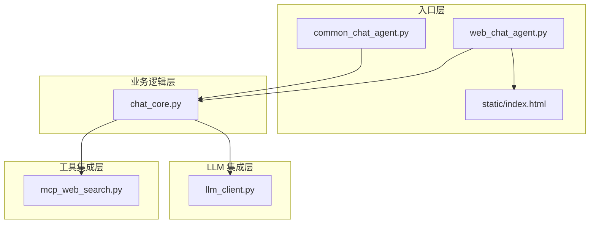
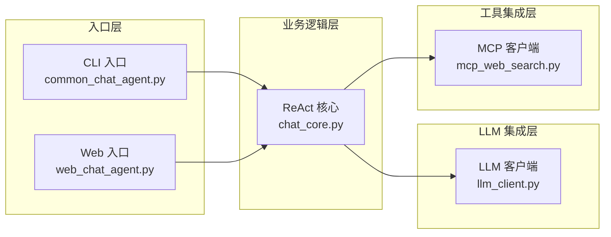
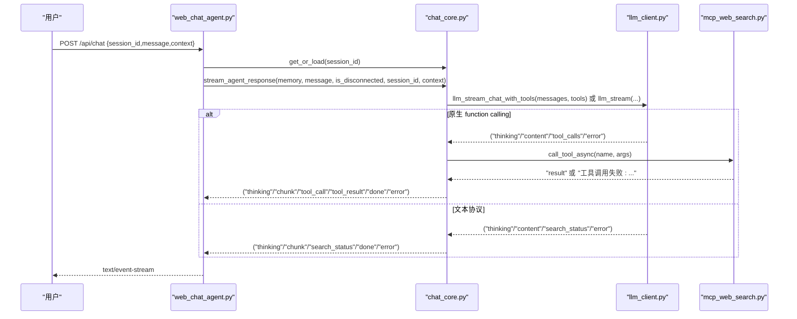
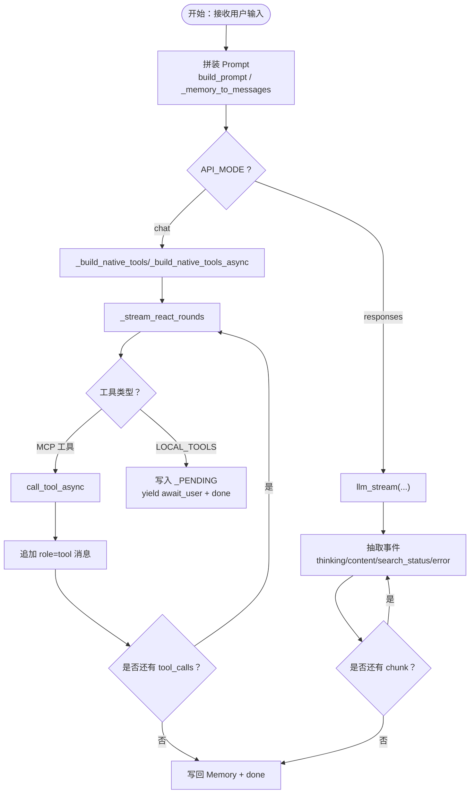
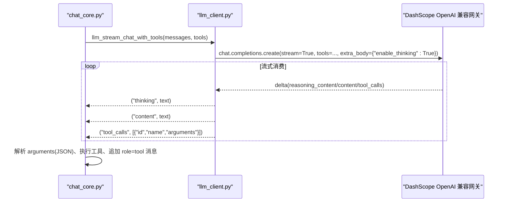
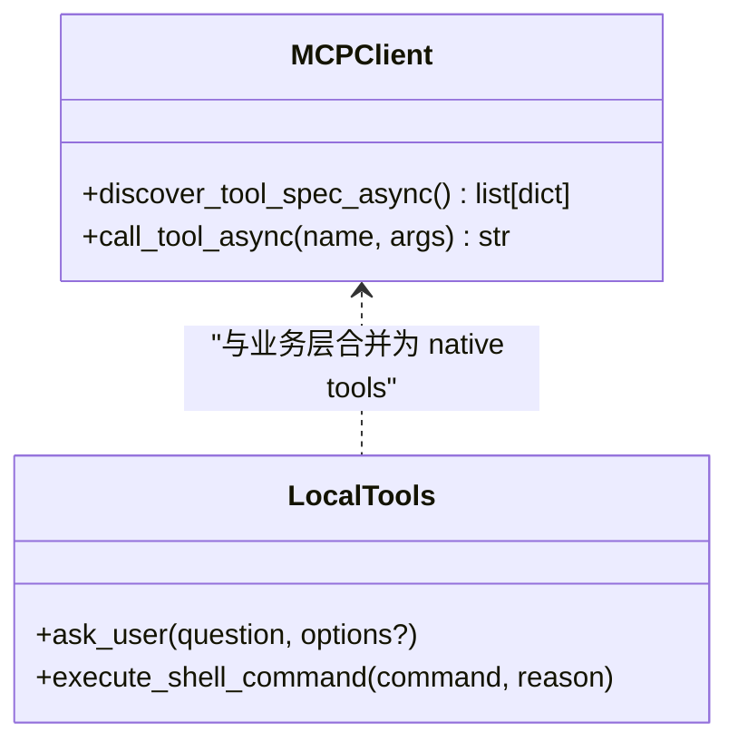
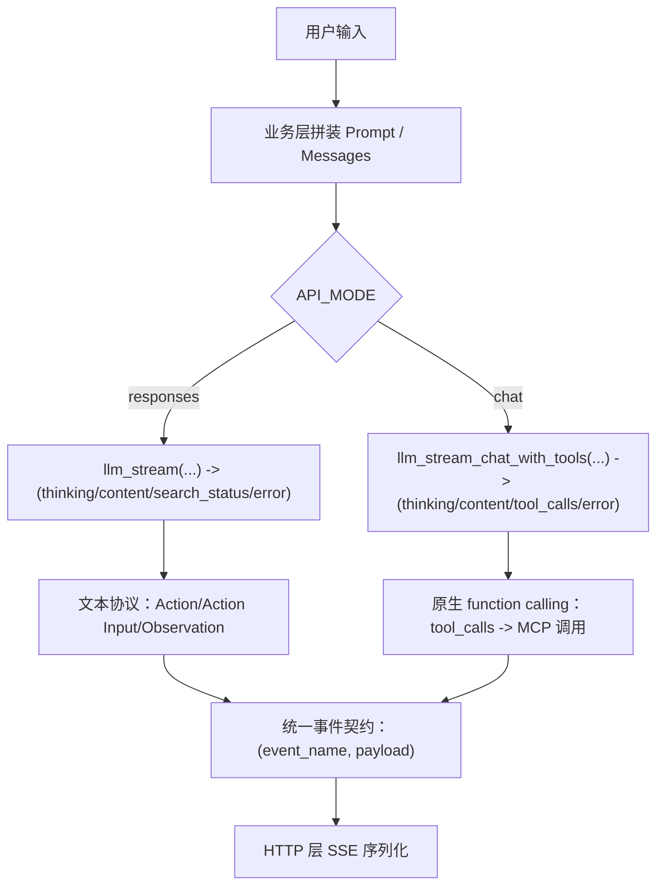
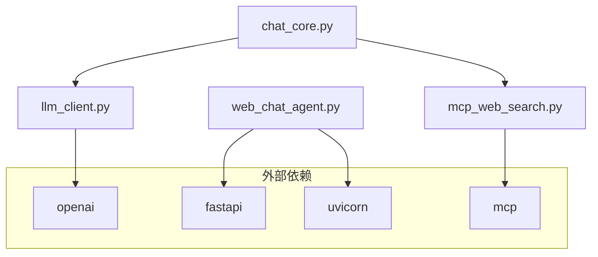

# 分层架构设计

<cite>
**本文引用的文件**
- [README.md](file://README.md)
- [CLAUDE.md](file://CLAUDE.md)
- [requirements.txt](file://requirements.txt)
- [demo/common_chat_agent.py](file://demo/common_chat_agent.py)
- [demo/web_chat_agent.py](file://demo/web_chat_agent.py)
- [demo/chat_core.py](file://demo/chat_core.py)
- [demo/llm_client.py](file://demo/llm_client.py)
- [demo/mcp_web_search.py](file://demo/mcp_web_search.py)
- [demo/static/index.html](file://demo/static/index.html)
</cite>

## 目录
1. [简介](#简介)
2. [项目结构](#项目结构)
3. [核心组件](#核心组件)
4. [架构总览](#架构总览)
5. [详细组件分析](#详细组件分析)
6. [依赖分析](#依赖分析)
7. [性能考虑](#性能考虑)
8. [故障排查指南](#故障排查指南)
9. [结论](#结论)
10. [附录](#附录)

## 简介
本项目是一个教学型 ReAct（思考-行动-观察）聊天 Agent 的最小实现，强调“三层架构”与“严格向下依赖”的设计原则。入口层提供 CLI 与 Web 两种交互方式，业务逻辑层实现 ReAct 循环、记忆与会话持久化，并抽象出统一的事件契约；LLM 集成层负责与 DashScope OpenAI 兼容网关通信；工具集成层通过 MCP 客户端对接联网搜索等外部能力。两条工具调用路径（文本协议与原生 function calling）并行存在，面向不同模式与教学目标。

## 项目结构
项目采用“入口层-业务逻辑层-底层集成层”的分层组织，文件分布与职责如下：
- demo/common_chat_agent.py：CLI 入口，读取 stdin，调用业务层同步 ReAct 循环。
- demo/web_chat_agent.py：FastAPI HTTP 入口，SSE 流式输出，路由与参数校验。
- demo/chat_core.py：业务逻辑层，包含 Memory、Prompt 模板、ReAct 解析与循环、会话持久化、HITL、上下文感知、事件契约等。
- demo/llm_client.py：LLM 底层，封装 OpenAI SDK，提供 responses/chat 两种模式的流式调用与事件抽取。
- demo/mcp_web_search.py：MCP 工具客户端，封装 DashScope WebSearch MCP，提供工具发现与调用。
- demo/static/index.html：Web 前端单页应用，负责渲染、SSE 事件消费与 UI 交互。
- requirements.txt：依赖声明（OpenAI SDK、FastAPI、Uvicorn、MCP）。

图表来源
- [demo/common_chat_agent.py:1-53](file://demo/common_chat_agent.py#L1-L53)
- [demo/web_chat_agent.py:1-233](file://demo/web_chat_agent.py#L1-L233)
- [demo/chat_core.py:1-1068](file://demo/chat_core.py#L1-L1068)
- [demo/llm_client.py:1-924](file://demo/llm_client.py#L1-L924)
- [demo/mcp_web_search.py:1-172](file://demo/mcp_web_search.py#L1-L172)
- [demo/static/index.html:1-1978](file://demo/static/index.html#L1-L1978)

章节来源
- [README.md:44-57](file://README.md#L44-L57)
- [CLAUDE.md:30-52](file://CLAUDE.md#L30-L52)

## 核心组件
- 入口层（CLI/Web）
  - CLI：读取用户输入，调用业务层同步 ReAct，将结果写回 Memory。
  - Web：FastAPI 路由，SSE 序列化，参数校验与异常翻译。
- 业务逻辑层（ReAct 核心）
  - Memory：对话记忆与持久化（markdown 序列化/反序列化）。
  - Prompt 模板与构建：根据工具列表与上下文动态拼装。
  - ReAct 解析与循环：文本协议（Action/Action Input/Observation）与原生 function calling 两套路径。
  - 会话管理：懒加载、归档、重置、删除、列表与历史读取。
  - HITL：本地伪工具触发中断，保存恢复点，支持 resume。
  - 事件契约：统一的 (event_name, payload) 元组，供 HTTP 层序列化为 SSE。
- LLM 集成层
  - API_MODE 切换：responses（内置 web_search）与 chat（原生 function calling + MCP）。
  - 事件抽取：将流式 chunk 转换为 (kind, payload) 元组，分别对应 thinking/content/search_status/tool_calls/error。
  - 错误防御：嵌入式错误 chunk 检测与兜底。
- 工具集成层
  - MCP WebSearch：工具发现（schema 发现）与调用（短连接），失败返回错误字符串。
  - 本地伪工具：ask_user、execute_shell_command，用于 HITL。

章节来源
- [demo/common_chat_agent.py:1-53](file://demo/common_chat_agent.py#L1-L53)
- [demo/web_chat_agent.py:1-233](file://demo/web_chat_agent.py#L1-L233)
- [demo/chat_core.py:1-1068](file://demo/chat_core.py#L1-L1068)
- [demo/llm_client.py:1-924](file://demo/llm_client.py#L1-L924)
- [demo/mcp_web_search.py:1-172](file://demo/mcp_web_search.py#L1-L172)

## 架构总览
三层架构严格向下依赖，抽象边界清晰：
- LLM 集成层与业务逻辑层之间的抽象边界：(kind, payload) 元组协议。
- 业务逻辑层与入口层之间的抽象边界：(event_name, payload_dict) 元组协议。
- 业务逻辑层与工具集成层之间的抽象边界：工具规范（OpenAI tools 格式）与调用结果字符串。

图表来源
- [CLAUDE.md:47-52](file://CLAUDE.md#L47-L52)
- [demo/chat_core.py:1-1068](file://demo/chat_core.py#L1-L1068)
- [demo/llm_client.py:1-924](file://demo/llm_client.py#L1-L924)
- [demo/mcp_web_search.py:1-172](file://demo/mcp_web_search.py#L1-L172)

## 详细组件分析

### 入口层（CLI/Web）
- CLI 入口
  - 读取 stdin，调用 chat_core.react(memory, user_input)，将用户输入与 AI 输出追加到 Memory。
  - 仅依赖 chat_core.Memory 与 react。
- Web 入口
  - FastAPI 路由：/api/chat（SSE）、/api/resume（HITL 恢复）、/api/reset、/api/archive、/api/history、/api/sessions 等。
  - 参数校验：Pydantic 模型 ChatRequest、ResetRequest、ArchiveRequest、ResumeRequest。
  - SSE 序列化：将 (event_name, payload) 元组序列化为 SSE 文本帧。
  - 异常翻译：将业务层异常（InvalidSessionId、HistoryNotFound、PendingNotFound、PendingMismatch）翻译为 HTTP 400/404/409。

图表来源
- [demo/web_chat_agent.py:127-167](file://demo/web_chat_agent.py#L127-L167)
- [demo/chat_core.py:632-800](file://demo/chat_core.py#L632-L800)
- [demo/llm_client.py:633-646](file://demo/llm_client.py#L633-L646)
- [demo/mcp_web_search.py:127-164](file://demo/mcp_web_search.py#L127-L164)

章节来源
- [demo/common_chat_agent.py:17-49](file://demo/common_chat_agent.py#L17-L49)
- [demo/web_chat_agent.py:70-95](file://demo/web_chat_agent.py#L70-L95)
- [demo/web_chat_agent.py:127-167](file://demo/web_chat_agent.py#L127-L167)

### 业务逻辑层（ReAct 核心）
- Memory
  - 存储 [{role, msg}, ...]，支持 to_markdown/from_markdown，持久化为 markdown 文件。
  - 会话 ID 校验与安全路径处理。
- Prompt 模板与构建
  - build_prompt：根据工具列表与上下文拼装 Prompt。
  - _memory_to_messages：将 Memory 转为 OpenAI messages 数组（chat 模式 native function calling）。
- ReAct 解析与循环
  - 文本协议：match_tool_action、parse_action_input、execute_tool。
  - 原生 function calling：_react_chat_native、_stream_react_rounds、_build_native_tools/_build_native_tools_async。
- 会话持久化
  - get_or_load、archive_session、reset_session、delete_session、list_sessions、read_history、get_archive_path_if_exists、session_count。
- HITL
  - LOCAL_TOOLS（ask_user、execute_shell_command）、_LOCAL_TOOL_KIND、_PENDING、resume_chat_response。
- 上下文感知
  - _compute_adaptive_prompt：根据前端 context 计算 adaptive_fragment 与 ui_hint mode。
- 事件契约
  - stream_agent_response：统一产出 (event_name, payload) 元组，供 Web 层序列化为 SSE。

图表来源
- [demo/chat_core.py:425-466](file://demo/chat_core.py#L425-L466)
- [demo/chat_core.py:561-630](file://demo/chat_core.py#L561-L630)
- [demo/chat_core.py:632-800](file://demo/chat_core.py#L632-L800)
- [demo/llm_client.py:340-496](file://demo/llm_client.py#L340-L496)
- [demo/llm_client.py:798-924](file://demo/llm_client.py#L798-L924)

章节来源
- [demo/chat_core.py:138-193](file://demo/chat_core.py#L138-L193)
- [demo/chat_core.py:255-349](file://demo/chat_core.py#L255-L349)
- [demo/chat_core.py:425-466](file://demo/chat_core.py#L425-L466)
- [demo/chat_core.py:561-630](file://demo/chat_core.py#L561-L630)
- [demo/chat_core.py:632-800](file://demo/chat_core.py#L632-L800)

### LLM 集成层
- API_MODE 切换
  - responses：client.responses.create，启用 enable_thinking，内置 web_search 生命周期事件。
  - chat：client.chat.completions.create，启用 enable_thinking，不启用 enable_search，改用 native function calling + MCP。
- 事件抽取
  - llm_stream / llm_stream_chat_with_tools：将流式 chunk 转换为 (kind, payload) 元组。
  - _llm_stream_chat_with_tools：累积 tool_calls，流尾一次性产出 ("tool_calls", list[dict])。
- 错误防御
  - 嵌入式错误 chunk 检测（HTTP 200 但 body 是错误），统一抛出或转换为错误事件。
- 兼容性
  - 三种实现（responses/chat/chat-with-tools）必须保持一致的事件语义与错误处理。

图表来源
- [demo/llm_client.py:633-646](file://demo/llm_client.py#L633-L646)
- [demo/llm_client.py:798-924](file://demo/llm_client.py#L798-L924)

章节来源
- [demo/llm_client.py:340-496](file://demo/llm_client.py#L340-L496)
- [demo/llm_client.py:618-795](file://demo/llm_client.py#L618-L795)

### 工具集成层
- MCP WebSearch
  - discover_tool_spec/discover_tool_spec_async：schema 发现并缓存为 OpenAI tools 格式。
  - call_tool_async/call_tool_sync：短连接调用工具，失败返回错误字符串。
- 本地伪工具
  - ask_user：向用户提问，参数包含 question 与可选 options。
  - execute_shell_command：请求执行命令，参数包含 command 与 reason，支持同意/拒绝。

图表来源
- [demo/mcp_web_search.py:89-172](file://demo/mcp_web_search.py#L89-L172)
- [demo/chat_core.py:63-110](file://demo/chat_core.py#L63-L110)

章节来源
- [demo/mcp_web_search.py:89-172](file://demo/mcp_web_search.py#L89-L172)
- [demo/chat_core.py:63-110](file://demo/chat_core.py#L63-L110)

### 概念性总览
以下为概念性流程图，展示两条工具调用路径的收敛与差异。

（本图为概念性说明，不直接映射具体源码文件）

## 依赖分析
- 依赖方向
  - 入口层 → 业务逻辑层（仅通过导出的 MODEL/API_MODE 与业务函数）
  - 业务逻辑层 → LLM 集成层（通过 llm/llm_stream 与 llm_chat_with_tools 等）
  - 业务逻辑层 → 工具集成层（通过 _build_native_tools 与 mcp_web_search）
- 抽象边界
  - llm_client 与 chat_core 之间：(kind, payload) 元组协议。
  - chat_core 与 web_chat_agent 之间：(event_name, payload_dict) 元组协议。
- 外部依赖
  - OpenAI SDK、FastAPI、Uvicorn、MCP SDK。

图表来源
- [requirements.txt:1-5](file://requirements.txt#L1-L5)
- [demo/llm_client.py:25](file://demo/llm_client.py#L25)
- [demo/web_chat_agent.py:19-21](file://demo/web_chat_agent.py#L19-L21)
- [demo/mcp_web_search.py:16-17](file://demo/mcp_web_search.py#L16-L17)

章节来源
- [requirements.txt:1-5](file://requirements.txt#L1-L5)
- [CLAUDE.md:47-52](file://CLAUDE.md#L47-L52)

## 性能考虑
- 流式处理：LLM 与工具调用均采用流式，减少等待时间，提升用户体验。
- 事件聚合：原生 function calling 的 tool_calls 在流尾一次性产出，降低事件碎片化。
- 截断策略：tool_result 事件对结果进行截断，避免前端过度渲染；完整文本保留在服务端日志。
- 会话懒加载：get_or_load 与 read_history 仅在需要时读取磁盘，避免不必要的 IO。
- 会话原子写：归档采用 .tmp + replace，避免崩溃导致半文件。

（本节为通用指导，不直接分析具体文件）

## 故障排查指南
- API_KEY 未配置
  - 入口层在启动时检查 DASHSCOPE_API_KEY，缺失时直接退出并打印提示。
- API_MODE 非法
  - llm_client 在模块加载时校验 API_MODE，非法值抛出错误。
- 会话 ID 非法
  - 会话相关操作对 session_id 进行正则校验，非法 ID 抛出 InvalidSessionId，HTTP 层翻译为 400。
- 历史不存在
  - read_history 不存在时抛 HistoryNotFound，HTTP 层翻译为 404。
- HITL 恢复不匹配
  - resume 时 tool_call_id 与 _PENDING 中不一致，抛 PendingMismatch，HTTP 层翻译为 409。
- MCP 工具调用失败
  - 返回 "工具调用失败: ..." 字符串，业务层将其作为 role=tool 的 content 回喂模型，由模型自行恢复。

章节来源
- [demo/web_chat_agent.py:53-58](file://demo/web_chat_agent.py#L53-L58)
- [demo/llm_client.py:46-51](file://demo/llm_client.py#L46-L51)
- [demo/chat_core.py:211-226](file://demo/chat_core.py#L211-L226)
- [demo/mcp_web_search.py:146-148](file://demo/mcp_web_search.py#L146-L148)

## 结论
本项目通过严格的三层架构与抽象边界，实现了 ReAct Agent 的教学演示与工程化落地：
- 入口层专注于交互与路由，不触碰业务细节。
- 业务逻辑层集中表达 ReAct、记忆、会话与事件契约，确保两条工具调用路径在上层收敛。
- LLM 集成层与工具集成层分别承担模型调用与外部能力接入，保持低耦合与高内聚。
- 通过 API_MODE 切换与两条工具调用路径并存，既满足教学对比，又保证前端零分支。

（本节为总结性内容，不直接分析具体文件）

## 附录
- 环境变量
  - DASHSCOPE_API_KEY：必填，用于 DashScope OpenAI 兼容网关认证。
  - QWEN_MODEL：可选，默认 qwen3.7-max（Responses API + 内置 web_search 推荐）。
  - API_MODE：可选，responses（默认）或 chat，大小写不敏感。
- 运行方式
  - CLI：export DASHSCOPE_API_KEY=sk-xxx && python demo/common_chat_agent.py
  - Web：export DASHSCOPE_API_KEY=sk-xxx && python demo/web_chat_agent.py，浏览器打开 http://127.0.0.1:8000

章节来源
- [README.md:23-42](file://README.md#L23-L42)
- [CLAUDE.md:13-22](file://CLAUDE.md#L13-L22)