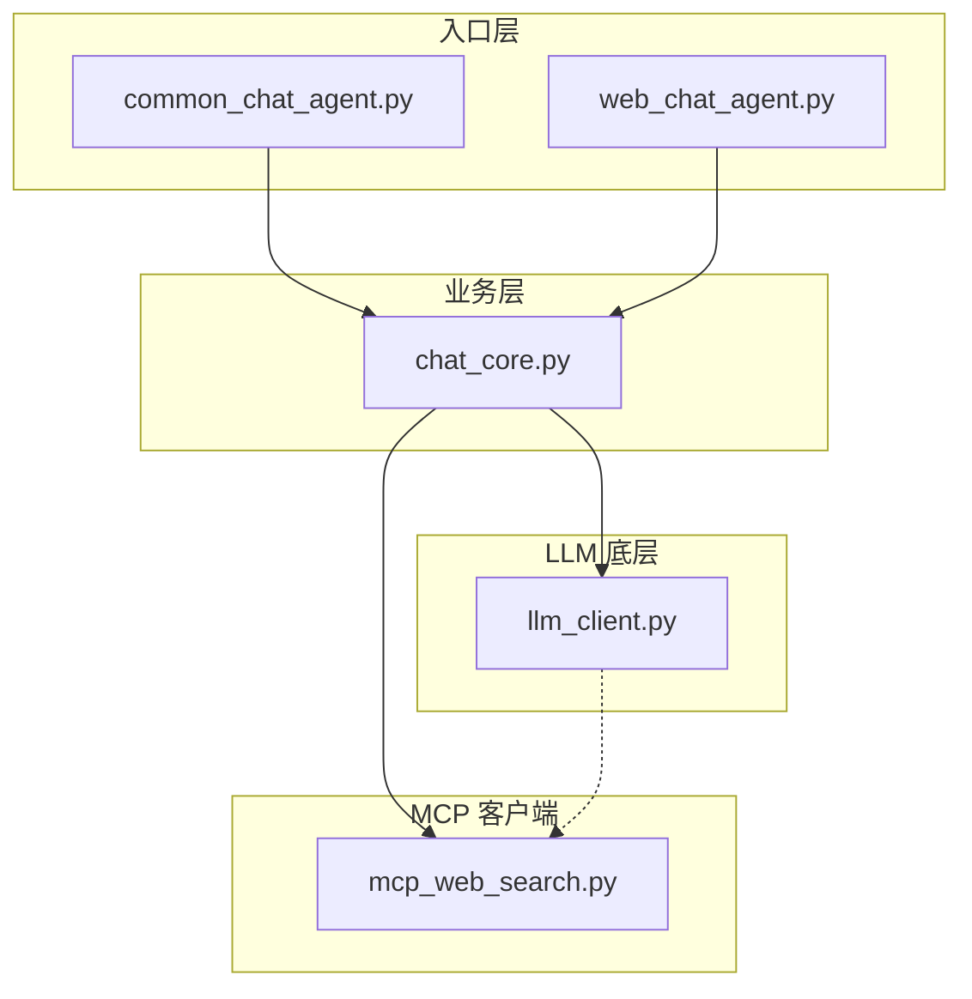
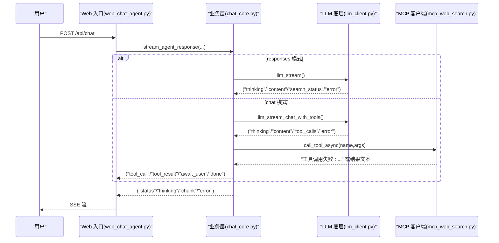
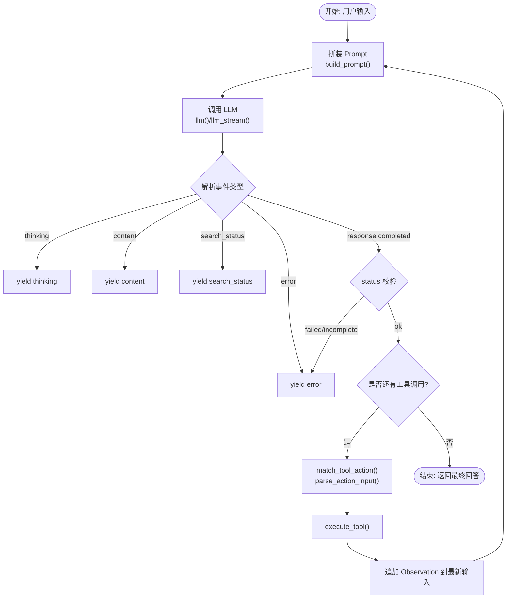
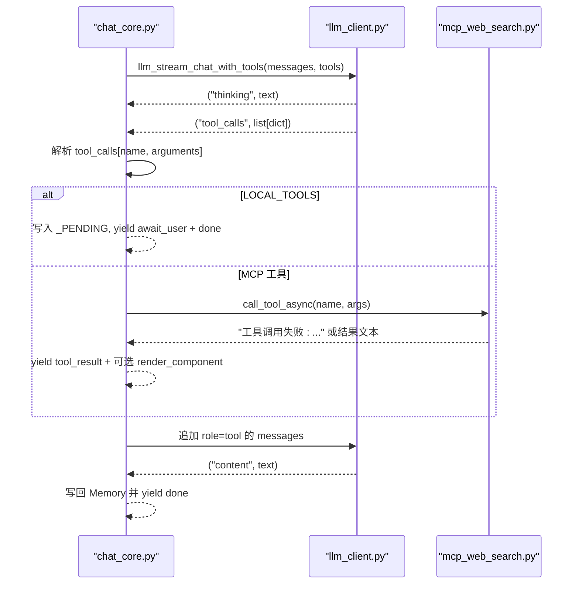
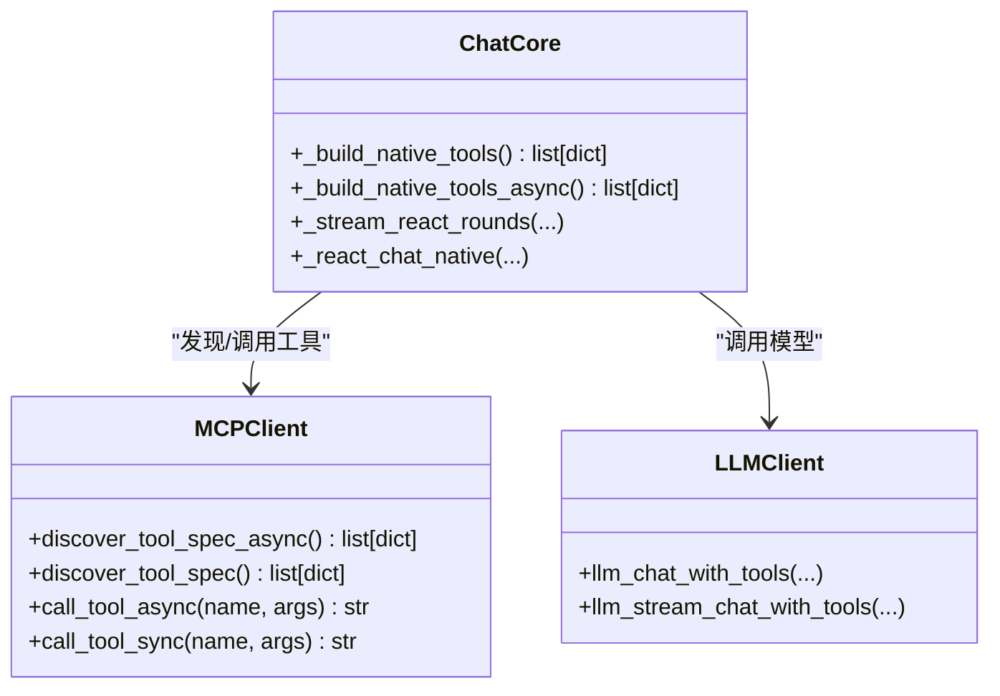
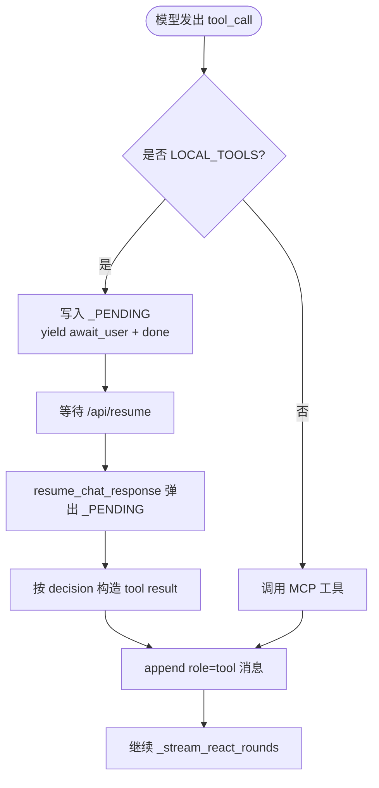
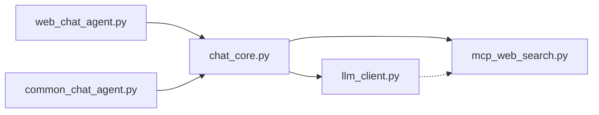

# 工具集成模式

<cite>
**本文引用的文件**
- [README.md](file://README.md)
- [CLAUDE.md](file://CLAUDE.md)
- [demo/chat_core.py](file://demo/chat_core.py)
- [demo/common_chat_agent.py](file://demo/common_chat_agent.py)
- [demo/web_chat_agent.py](file://demo/web_chat_agent.py)
- [demo/llm_client.py](file://demo/llm_client.py)
- [demo/mcp_web_search.py](file://demo/mcp_web_search.py)
- [docs/兼容 OpenAI 格式的 Responses API-获取响应.md](file://docs/兼容 OpenAI 格式的 Responses API-获取响应.md)
- [docs/联网搜索-mcp-接口文档.md](file://docs/联网搜索-mcp-接口文档.md)
- [docs/联网搜索说明文档.md](file://docs/联网搜索说明文档.md)
</cite>

## 目录
1. [简介](#简介)
2. [项目结构](#项目结构)
3. [核心组件](#核心组件)
4. [架构总览](#架构总览)
5. [详细组件分析](#详细组件分析)
6. [依赖关系分析](#依赖关系分析)
7. [性能考量](#性能考量)
8. [故障排查指南](#故障排查指南)
9. [结论](#结论)
10. [附录](#附录)

## 简介
本文件面向 simple_chat_agent_demo 的工具集成模式，系统阐述两类工具调用范式：
- 文本协议工具（responses 模式）：基于字符串 prompt 的 Action/Observation 协议，配合内置 web_search 生命周期事件。
- 原生函数调用工具（chat 模式）：基于 OpenAI Chat Completions 的 native function calling，通过 MCP 协议对接 DashScope WebSearch 工具。

文档重点覆盖：
- 工具注册机制与执行流程
- 错误处理策略
- MCP 协议集成与 DashScope WebSearch 工具实现
- 本地工具（HITL 工具）设计与安全机制
- 工具扩展最佳实践与注意事项

## 项目结构
项目采用三层分层架构，入口模块共享同一业务核心：
- 入口层：CLI 与 Web（FastAPI + SSE）
- 业务层：ReAct 循环、Memory、会话持久化、工具调度
- LLM 底层：OpenAI 兼容调用、Responses API 与 Chat Completions 分支、流式事件解析
- MCP 客户端：DashScope WebSearch MCP server 的 streamableHttp 封装

图表来源
- [CLAUDE.md:30-53](file://CLAUDE.md#L30-L53)
- [demo/common_chat_agent.py:1-53](file://demo/common_chat_agent.py#L1-L53)
- [demo/web_chat_agent.py:1-233](file://demo/web_chat_agent.py#L1-L233)
- [demo/chat_core.py:1-1068](file://demo/chat_core.py#L1-L1068)
- [demo/llm_client.py:1-924](file://demo/llm_client.py#L1-L924)
- [demo/mcp_web_search.py:1-172](file://demo/mcp_web_search.py#L1-L172)

章节来源
- [CLAUDE.md:28-53](file://CLAUDE.md#L28-L53)
- [README.md:44-62](file://README.md#L44-L62)

## 核心组件
- 工具注册与执行
  - 文本协议工具：通过 TOOLS 列表注册，execute_tool 作为预留路由；build_prompt 动态拼装工具说明与 ReAct 格式。
  - 原生函数调用工具：通过 _build_native_tools/_build_native_tools_async 合并 MCP 工具与 LOCAL_TOOLS，llm_chat_with_tools/llm_stream_chat_with_tools 返回 tool_calls 列表。
- 工具执行流程
  - responses 模式：llm() 调用 Responses API，业务层解析 Action/Action Input/Observation，循环回灌 Memory。
  - chat 模式：llm_stream_chat_with_tools 流式产出 thinking/content/tool_calls，业务层按 name 分发到 MCP 或 LOCAL_TOOLS。
- 错误处理
  - LLM 层：嵌入式错误检测（HTTP 200 但 body 错误）、usage 日志、异常转换为 error 事件。
  - MCP 层：调用失败返回 ERROR_PREFIX 前缀字符串，业务层将其作为 role=tool 的 content 回喂模型。
  - 会话与 HITL：InvalidSessionId/HistroyNotFound/PendingNotFound/PendingMismatch 等域异常映射为 HTTP 状态码。
- MCP 集成与 DashScope WebSearch
  - discover_tool_spec/discover_tool_spec_async：一次性列出 MCP 工具并缓存为 OpenAI tools 格式。
  - call_tool_async/call_tool_sync：短连接调用，失败返回错误字符串。
- 本地工具（HITL 工具）
  - ask_user：参数 question/options，前端渲染输入框。
  - execute_shell_command：参数 command/reason，前端渲染同意/拒绝按钮。
  - 仅在 chat 模式生效，触发 await_user 事件并写入 _PENDING，等待 /api/resume 恢复。

章节来源
- [demo/chat_core.py:43-104](file://demo/chat_core.py#L43-L104)
- [demo/chat_core.py:358-396](file://demo/chat_core.py#L358-L396)
- [demo/chat_core.py:425-466](file://demo/chat_core.py#L425-L466)
- [demo/chat_core.py:498-518](file://demo/chat_core.py#L498-L518)
- [demo/chat_core.py:618-795](file://demo/chat_core.py#L618-L795)
- [demo/chat_core.py:632-800](file://demo/chat_core.py#L632-L800)
- [demo/llm_client.py:37-52](file://demo/llm_client.py#L37-L52)
- [demo/llm_client.py:124-234](file://demo/llm_client.py#L124-L234)
- [demo/llm_client.py:357-496](file://demo/llm_client.py#L357-L496)
- [demo/llm_client.py:618-795](file://demo/llm_client.py#L618-L795)
- [demo/llm_client.py:798-924](file://demo/llm_client.py#L798-L924)
- [demo/mcp_web_search.py:89-172](file://demo/mcp_web_search.py#L89-L172)

## 架构总览
两类工具调用路径在业务层汇聚到统一的 SSE 事件契约，前端零分支。

图表来源
- [CLAUDE.md:85-106](file://CLAUDE.md#L85-L106)
- [demo/web_chat_agent.py:127-141](file://demo/web_chat_agent.py#L127-L141)
- [demo/chat_core.py:958-1067](file://demo/chat_core.py#L958-L1067)
- [demo/llm_client.py:357-496](file://demo/llm_client.py#L357-L496)
- [demo/llm_client.py:798-924](file://demo/llm_client.py#L798-L924)
- [demo/mcp_web_search.py:127-172](file://demo/mcp_web_search.py#L127-L172)

## 详细组件分析

### 文本协议工具（responses 模式）实现
- Prompt 拼装
  - build_prompt 在 TOOLS 非空时插入工具列表与 ReAct 格式说明；TOOLS 为空时仅角色设定+历史+最新输入，避免“无工具”措辞干扰内置 web_search。
- 工具解析与执行
  - match_tool_action 精确匹配 Action 行中的工具名；parse_action_input 使用 JSONDecoder.raw_decode 处理多行 JSON 与尾随文本。
  - execute_tool 为预留路由，当前工具列表为空，返回错误字符串。
- LLM 调用与事件
  - llm()/llm_stream() 调用 Responses API，启用 enable_thinking；监听 response.output_text.delta、response.reasoning_summary_text.delta、web_search lifecycle 事件；错误通过 response.completed 的 status 校验与 usage 日志。
- 流式循环
  - stream_agent_response 将上述事件序列化为 SSE，前端渲染思考面板与搜索生命周期。

图表来源
- [demo/chat_core.py:425-466](file://demo/chat_core.py#L425-L466)
- [demo/chat_core.py:358-396](file://demo/chat_core.py#L358-L396)
- [demo/llm_client.py:124-234](file://demo/llm_client.py#L124-L234)
- [demo/llm_client.py:357-496](file://demo/llm_client.py#L357-L496)

章节来源
- [demo/chat_core.py:425-466](file://demo/chat_core.py#L425-L466)
- [demo/chat_core.py:358-396](file://demo/chat_core.py#L358-L396)
- [demo/llm_client.py:124-234](file://demo/llm_client.py#L124-L234)
- [demo/llm_client.py:357-496](file://demo/llm_client.py#L357-L496)

### 原生函数调用工具（chat 模式）实现
- 工具发现与合并
  - _build_native_tools/_build_native_tools_async 首次调用 discover_tool_spec/discover_tool_spec_async，将 MCP 工具与 LOCAL_TOOLS 合并并缓存。
- ReAct 循环
  - _react_chat_native（CLI）与 _stream_react_rounds（Web）在每轮先调 llm_chat_with_tools/llm_stream_chat_with_tools，接收 content/tool_calls/reasoning_content。
  - tool_calls 按顺序执行：LOCAL_TOOLS（HITL）触发 await_user + done；MCP 工具通过 call_tool_async 执行，结果以 role=tool 追加回 messages。
- thinking 模式跨轮保留
  - reasoning_content 在 assistant 消息中透传，确保 thinking + 多轮 tool_calls 场景兼容。
- SSE 事件
  - tool_call/tool_result/await_user/render_component/component_loading/component_error 等事件统一由业务层产生，前端按事件类型渲染。

图表来源
- [demo/chat_core.py:561-630](file://demo/chat_core.py#L561-L630)
- [demo/chat_core.py:632-800](file://demo/chat_core.py#L632-L800)
- [demo/llm_client.py:633-795](file://demo/llm_client.py#L633-L795)
- [demo/llm_client.py:798-924](file://demo/llm_client.py#L798-L924)
- [demo/mcp_web_search.py:127-172](file://demo/mcp_web_search.py#L127-L172)

章节来源
- [demo/chat_core.py:498-518](file://demo/chat_core.py#L498-L518)
- [demo/chat_core.py:561-630](file://demo/chat_core.py#L561-L630)
- [demo/chat_core.py:632-800](file://demo/chat_core.py#L632-L800)
- [demo/llm_client.py:633-795](file://demo/llm_client.py#L633-L795)
- [demo/llm_client.py:798-924](file://demo/llm_client.py#L798-L924)
- [demo/mcp_web_search.py:89-172](file://demo/mcp_web_search.py#L89-L172)

### MCP 协议集成与 DashScope WebSearch 工具
- 工具发现
  - discover_tool_spec_async：通过 streamableHttp 客户端 list_tools，将 MCP 工具 schema 转换为 OpenAI tools 格式并缓存。
- 工具调用
  - call_tool_async：短连接调用 session.call_tool，失败返回 ERROR_PREFIX 前缀字符串；成功时将 CallToolResult.content 展平为文本。
- 集成点
  - chat_core._build_native_tools/_build_native_tools_async 调用 discover_tool_spec/discover_tool_spec_async。
  - chat_core._stream_react_rounds/_react_chat_native 调用 call_tool_async/call_tool_sync。

图表来源
- [demo/mcp_web_search.py:89-172](file://demo/mcp_web_search.py#L89-L172)
- [demo/chat_core.py:498-518](file://demo/chat_core.py#L498-L518)
- [demo/chat_core.py:632-800](file://demo/chat_core.py#L632-L800)
- [demo/llm_client.py:618-795](file://demo/llm_client.py#L618-L795)
- [demo/llm_client.py:798-924](file://demo/llm_client.py#L798-L924)

章节来源
- [demo/mcp_web_search.py:89-172](file://demo/mcp_web_search.py#L89-L172)
- [demo/chat_core.py:498-518](file://demo/chat_core.py#L498-L518)
- [demo/chat_core.py:632-800](file://demo/chat_core.py#L632-L800)
- [demo/llm_client.py:618-795](file://demo/llm_client.py#L618-L795)
- [demo/llm_client.py:798-924](file://demo/llm_client.py#L798-L924)

### 本地工具（HITL 工具）设计与安全机制
- 设计
  - ask_user：参数 question/options，前端渲染输入框。
  - execute_shell_command：参数 command/reason，前端渲染同意/拒绝按钮。
  - 通过 LOCAL_TOOLS 注册为 OpenAI tools 格式，与 MCP 工具合并后发给模型。
- 安全
  - CLI 短路：_react_chat_native 遇到 LOCAL_TOOLS 直接返回错误字符串，引导模型改用文本提问或放弃危险操作。
  - Web 中断：_stream_react_rounds 遇到 LOCAL_TOOLS 写入 _PENDING，yield await_user + done，前端渲染 HITL bubble，POST /api/resume 恢复。
  - 仅 approval 类工具可构造“执行”结果，demo 不真执行 shell，避免真实 RCE 风险。
- 交互类型
  - _LOCAL_TOOL_KIND 标记 input/approval，await_user 事件携带 kind 字段供前端分支渲染。

图表来源
- [demo/chat_core.py:738-765](file://demo/chat_core.py#L738-L765)
- [demo/chat_core.py:740-765](file://demo/chat_core.py#L740-L765)
- [demo/chat_core.py:803-863](file://demo/chat_core.py#L803-L863)

章节来源
- [demo/chat_core.py:60-111](file://demo/chat_core.py#L60-L111)
- [demo/chat_core.py:738-765](file://demo/chat_core.py#L738-L765)
- [demo/chat_core.py:803-863](file://demo/chat_core.py#L803-L863)

### 工具扩展最佳实践与注意事项
- 增加文本协议工具（responses 模式或自定义文本协议）
  - 在 TOOLS 列表添加 OpenAI tools 格式条目；在 execute_tool 中添加 name→实现分支。
  - prompt 模板自动格式化 TOOLS，Action 行精确匹配工具名。
- 增加 chat 模式 native function calling 工具
  - 若来自 MCP：扩 mcp_web_search.py（endpoint 抽参或新建同级模块），_build_native_tools/_build_native_tools_async 会自动发现并合并。
  - 若为本地/第三方 HTTP：在 _build_native_tools/_build_native_tools_async 返回值中加入 OpenAI tools 格式 spec，并在 _react_chat_native/_stream_react_rounds 的 tool 派发表上按 name 分发到新执行器。
  - HITL 工具：在 LOCAL_TOOLS 注册 OpenAI tools 格式 spec，在 _LOCAL_TOOL_KIND 标记 kind，在 resume_chat_response 中按 name 构造 tool result。
- 让工具结果卡片化（Static GenUI）
  - 在 TOOL_COMPONENT_MAP 注册 tool_name→component_type；在 _build_component_props 中按 tool_name 构建 props；前端 COMPONENT_RENDERERS 中渲染。
- 其他注意事项
  - 不将 chat 模式 native tools 接入 llm()/llm_stream() 老分发器（签名不兼容）。
  - MAX_ROUNDS（5）对两条路径共用，长链路工具可适当上调。
  - tool_result 事件在 SSE 中截断（500 字），模型侧 messages 中保留完整文本。

章节来源
- [CLAUDE.md:202-224](file://CLAUDE.md#L202-L224)

## 依赖关系分析
- 层间依赖
  - 入口层仅导入业务层导出的 MODEL/API_MODE，不直接依赖 LLM/MCP。
  - 业务层仅依赖 LLM/MCP，不直接依赖 FastAPI。
  - LLM/MCP 互不依赖，仅在业务层耦合。
- 关键依赖链
  - chat_core._build_native_tools → mcp_web_search.discover_tool_spec
  - chat_core._stream_react_rounds → llm_client.llm_stream_chat_with_tools → mcp_web_search.call_tool_async
  - responses 路径：chat_core.stream_agent_response → llm_client.llm_stream → llm_client.llm()

图表来源
- [CLAUDE.md:40-53](file://CLAUDE.md#L40-L53)
- [demo/web_chat_agent.py:29-46](file://demo/web_chat_agent.py#L29-L46)
- [demo/common_chat_agent.py:13-14](file://demo/common_chat_agent.py#L13-L14)
- [demo/chat_core.py:26-34](file://demo/chat_core.py#L26-L34)
- [demo/llm_client.py:25-26](file://demo/llm_client.py#L25-L26)
- [demo/mcp_web_search.py:16-17](file://demo/mcp_web_search.py#L16-L17)

章节来源
- [CLAUDE.md:40-53](file://CLAUDE.md#L40-L53)

## 性能考量
- LLM 调用
  - responses 模式：Responses API 流式事件丰富，但仅在特定 chunk 类型上解析；兜底路径_extract_output_text 保障无 delta 场景。
  - chat 模式：Chat Completions + native tools，tool_calls 仅在流尾一次性汇总，避免碎片化事件。
- MCP 调用
  - 每次调用短连接，代价仅一次 TCP/TLS + initialize；失败返回字符串，避免异常传播。
- 会话与持久化
  - Memory 序列化为 markdown，头部注释元信息；原子写入避免崩溃半文件；正则解析 turn 边界，低概率误切可接受。

章节来源
- [demo/llm_client.py:124-234](file://demo/llm_client.py#L124-L234)
- [demo/llm_client.py:357-496](file://demo/llm_client.py#L357-L496)
- [demo/llm_client.py:686-795](file://demo/llm_client.py#L686-L795)
- [demo/mcp_web_search.py:127-172](file://demo/mcp_web_search.py#L127-L172)
- [demo/chat_core.py:228-349](file://demo/chat_core.py#L228-L349)

## 故障排查指南
- API_MODE 配置
  - API_MODE 必须为 chat 或 responses（大小写不敏感），非法值在模块加载时抛错。
- LLM 错误
  - responses 模式：response.completed.status 为 failed/incomplete 时抛错；嵌入式错误 chunk（HTTP 200 但 body 错误）通过 code/message 检测。
  - chat 模式：finish_reason 非 stop/tool_calls 时警告；tool_calls arguments 拼接异常时丢弃无 name 的槽位并告警。
- MCP 错误
  - call_tool_async/call_tool_sync 失败返回 ERROR_PREFIX 前缀字符串；业务层将其作为 role=tool 的 content 回喂模型。
- 会话与 HITL
  - InvalidSessionId → 400；HistoryNotFound → 404；PendingNotFound → 404；PendingMismatch → 409。
  - /api/resume 参数校验失败或 tool_call_id 不匹配时抛异常，HTTP 层翻译为 409。

章节来源
- [demo/llm_client.py:46-51](file://demo/llm_client.py#L46-L51)
- [demo/llm_client.py:170-206](file://demo/llm_client.py#L170-L206)
- [demo/llm_client.py:288-296](file://demo/llm_client.py#L288-L296)
- [demo/llm_client.py:782-784](file://demo/llm_client.py#L782-L784)
- [demo/mcp_web_search.py:146-158](file://demo/mcp_web_search.py#L146-L158)
- [demo/web_chat_agent.py:158-163](file://demo/web_chat_agent.py#L158-L163)

## 结论
simple_chat_agent_demo 通过明确的三层分层与两条工具调用路径，提供了教学友好的 ReAct Agent 实现：
- responses 模式强调文本协议与内置 web_search 生命周期事件，适合入门与对比。
- chat 模式强调原生函数调用与 MCP 工具链，展示现代工具集成范式。
两条路径在业务层汇聚到统一的 SSE 事件契约，前端零分支；HITL 工具在安全前提下提供交互体验；MCP 集成与 DashScope WebSearch 工具实现清晰可扩展。

## 附录
- 环境变量
  - DASHSCOPE_API_KEY：必需；QWEN_MODEL：可选，默认 qwen3.7-max；API_MODE：可选 responses/chat，默认 responses。
- 文档参考
  - Responses API 与 Chat Completions 对比、Responses API 响应获取、MCP 接口文档、联网搜索说明文档。

章节来源
- [CLAUDE.md:13-27](file://CLAUDE.md#L13-L27)
- [docs/兼容 OpenAI 格式的 Responses API-获取响应.md:1-48](file://docs/兼容 OpenAI 格式的 Responses API-获取响应.md#L1-L48)
- [docs/联网搜索-mcp-接口文档.md:1-28](file://docs/联网搜索-mcp-接口文档.md#L1-L28)
- [docs/联网搜索说明文档.md:1-800](file://docs/联网搜索说明文档.md#L1-L800)