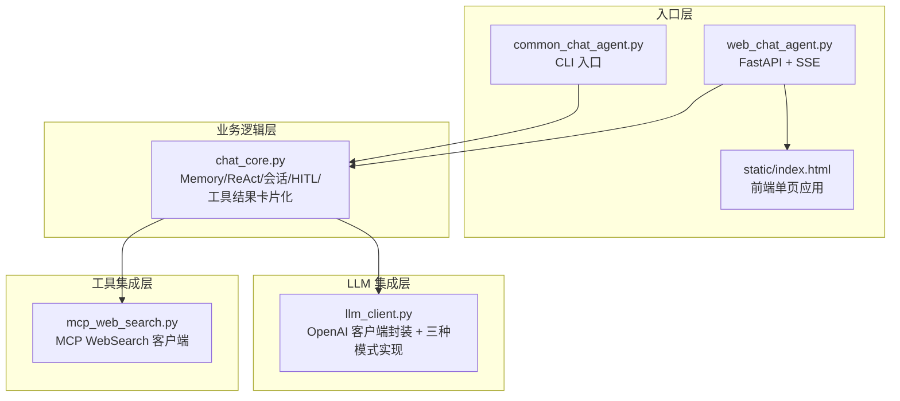
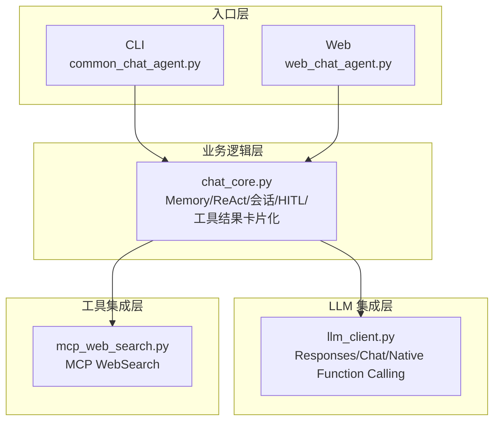
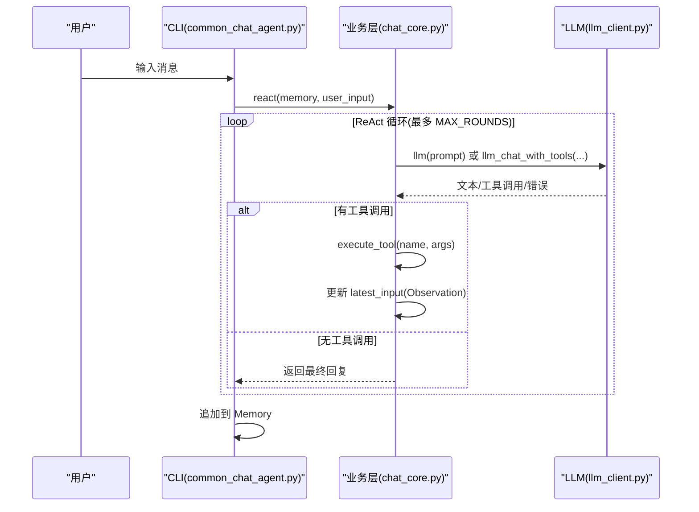
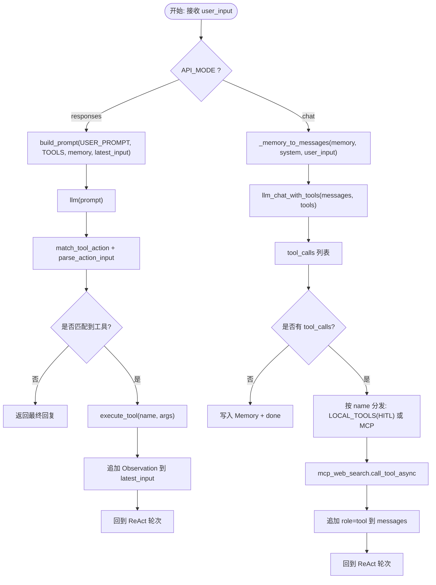
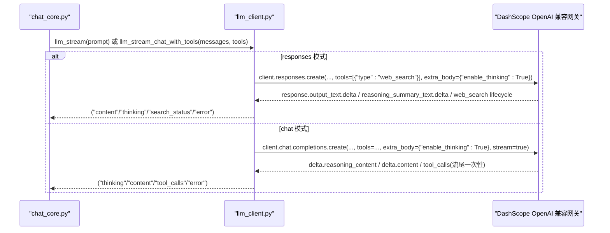
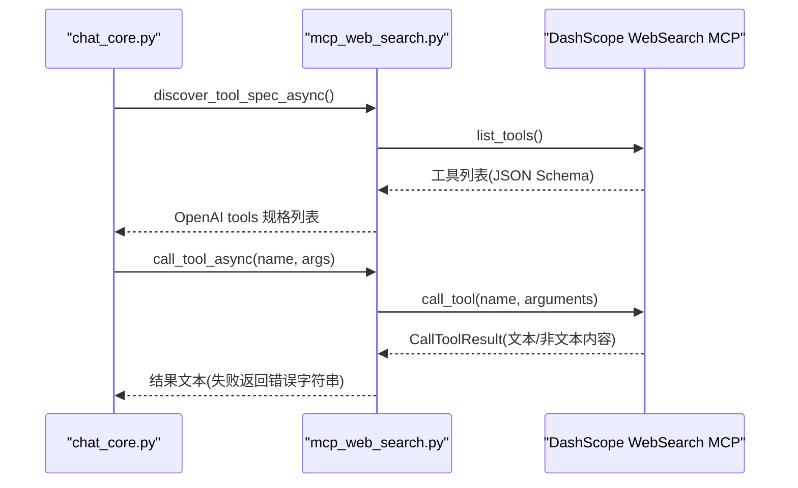
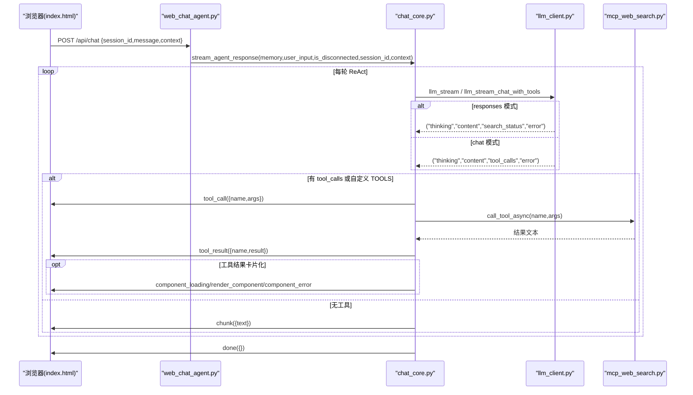
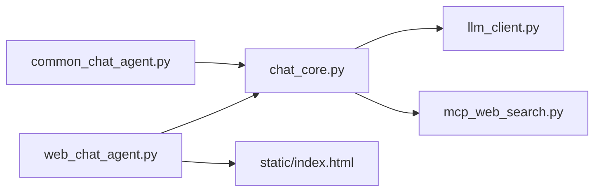

# 架构设计

<cite>
**本文引用的文件**
- [README.md](file://README.md)
- [CLAUDE.md](file://CLAUDE.md)
- [requirements.txt](file://requirements.txt)
- [demo/chat_core.py](file://demo/chat_core.py)
- [demo/common_chat_agent.py](file://demo/common_chat_agent.py)
- [demo/web_chat_agent.py](file://demo/web_chat_agent.py)
- [demo/llm_client.py](file://demo/llm_client.py)
- [demo/mcp_web_search.py](file://demo/mcp_web_search.py)
- [demo/static/index.html](file://demo/static/index.html)
</cite>

## 目录
1. [简介](#简介)
2. [项目结构](#项目结构)
3. [核心组件](#核心组件)
4. [架构总览](#架构总览)
5. [详细组件分析](#详细组件分析)
6. [依赖关系分析](#依赖关系分析)
7. [性能考虑](#性能考虑)
8. [故障排查指南](#故障排查指南)
9. [结论](#结论)
10. [附录](#附录)

## 简介
本项目是一个教学型 ReAct（Thought-Action-Observation）聊天 Agent 的最小实现，采用分层架构设计，包含入口层（CLI/Web）、业务逻辑层（ReAct 核心）、LLM 集成层与工具集成层。其目标是用最少代码讲清楚 ReAct 循环、流式 LLM 调用、HITL（人机协同）与会话持久化，并提供 CLI 与 Web 两个入口共享同一 ReAct 内核。

- 入口层：CLI（stdin/stdout）与 Web（FastAPI + SSE）分别面向终端与浏览器。
- 业务逻辑层：Memory、Prompt 模板、ReAct 循环、会话存储、HITL 基础设施、工具结果卡片化（Static GenUI）。
- LLM 集成层：OpenAI 兼容客户端封装，支持 Responses API 与 Chat Completions + Native Function Calling 两种模式。
- 工具集成层：MCP WebSearch 客户端，提供联网搜索工具发现与调用。

项目强调“两条 ReAct 路径并存”：文本协议（responses 模式 + 自定义 TOOLS）与结构化协议（chat 模式 + native function calling + MCP），二者汇聚到同一 SSE 事件契约，前端零分支。

**章节来源**
- [README.md:1-62](file://README.md#L1-L62)
- [CLAUDE.md:28-52](file://CLAUDE.md#L28-L52)

## 项目结构
项目采用“三层分层 + 两入口”的组织方式，严格限制向下导入，确保职责清晰与边界明确。

**图表来源**
- [CLAUDE.md:30-52](file://CLAUDE.md#L30-L52)
- [demo/common_chat_agent.py:1-53](file://demo/common_chat_agent.py#L1-L53)
- [demo/web_chat_agent.py:1-233](file://demo/web_chat_agent.py#L1-L233)
- [demo/chat_core.py:1-13](file://demo/chat_core.py#L1-L13)
- [demo/llm_client.py:1-17](file://demo/llm_client.py#L1-L17)
- [demo/mcp_web_search.py:1-9](file://demo/mcp_web_search.py#L1-L9)

**章节来源**
- [CLAUDE.md:30-52](file://CLAUDE.md#L30-L52)
- [demo/common_chat_agent.py:1-53](file://demo/common_chat_agent.py#L1-L53)
- [demo/web_chat_agent.py:1-233](file://demo/web_chat_agent.py#L1-L233)
- [demo/chat_core.py:1-13](file://demo/chat_core.py#L1-L13)
- [demo/llm_client.py:1-17](file://demo/llm_client.py#L1-L17)
- [demo/mcp_web_search.py:1-9](file://demo/mcp_web_search.py#L1-L9)

## 核心组件
- Memory：多轮对话记忆容器，支持序列化/反序列化为 Markdown，头部元信息用于快速枚举会话列表。
- Prompt 模板与拼装：USER_PROMPT + 工具列表 + ReAct 格式说明 + 对话记录 + 最新输入；在 chat 模式下转换为 messages 数组。
- ReAct 循环：CLI 同步循环（react）与 Web 异步流式循环（stream_agent_response），受 MAX_ROUNDS 保护。
- 会话存储：模块级 sessions 缓存 + data/chat_archive 目录持久化，原子写入，安全校验 session_id。
- HITL 基础设施：LOCAL_TOOLS（ask_user、execute_shell_command）、_PENDING 暂存、await_user 事件、/api/resume 恢复。
- 工具结果卡片化：TOOL_COMPONENT_MAP + _build_component_props + 前端 COMPONENT_RENDERERS。
- LLM 客户端：API_MODE 切换（responses / chat），三种实现对齐（_llm_responses/_llm_stream_responses、_llm_chat/_llm_stream_chat、_llm_chat_with_tools/_llm_stream_chat_with_tools）。

**章节来源**
- [demo/chat_core.py:138-193](file://demo/chat_core.py#L138-L193)
- [demo/chat_core.py:255-350](file://demo/chat_core.py#L255-L350)
- [demo/chat_core.py:425-466](file://demo/chat_core.py#L425-L466)
- [demo/chat_core.py:561-630](file://demo/chat_core.py#L561-L630)
- [demo/chat_core.py:632-800](file://demo/chat_core.py#L632-L800)
- [demo/chat_core.py:803-830](file://demo/chat_core.py#L803-L830)
- [demo/chat_core.py:836-914](file://demo/chat_core.py#L836-L914)
- [demo/chat_core.py:920-1069](file://demo/chat_core.py#L920-L1069)
- [demo/llm_client.py:34-51](file://demo/llm_client.py#L34-L51)
- [demo/llm_client.py:618-795](file://demo/llm_client.py#L618-L795)
- [demo/llm_client.py:798-924](file://demo/llm_client.py#L798-L924)

## 架构总览
系统采用“入口层 → 业务逻辑层 → LLM 集成层/工具集成层”的单向依赖，两条 ReAct 路径在业务层汇聚为统一的事件契约，前端零分支。

**图表来源**
- [CLAUDE.md:40-52](file://CLAUDE.md#L40-L52)
- [demo/chat_core.py:1-13](file://demo/chat_core.py#L1-L13)
- [demo/llm_client.py:1-17](file://demo/llm_client.py#L1-L17)
- [demo/mcp_web_search.py:1-9](file://demo/mcp_web_search.py#L1-L9)

## 详细组件分析

### 入口层（CLI/Web）
- CLI：从 stdin 读取用户输入，调用 chat_core.react(memory, user_input)，将结果写回 stderr，并追加到 Memory。
- Web：FastAPI 路由 + SSE，将 chat_core.stream_agent_response 的抽象事件序列化为 SSE；提供 /api/chat、/api/resume、/api/reset、/api/archive、/api/history、/api/sessions 等端点。

**图表来源**
- [demo/common_chat_agent.py:17-50](file://demo/common_chat_agent.py#L17-L50)
- [demo/chat_core.py:920-951](file://demo/chat_core.py#L920-L951)
- [demo/llm_client.py:113-122](file://demo/llm_client.py#L113-L122)

**章节来源**
- [demo/common_chat_agent.py:1-53](file://demo/common_chat_agent.py#L1-L53)
- [demo/web_chat_agent.py:127-167](file://demo/web_chat_agent.py#L127-L167)
- [demo/chat_core.py:920-1069](file://demo/chat_core.py#L920-L1069)

### 业务逻辑层（ReAct 核心）
- Memory：add/get_all/to_markdown/from_markdown，支持 Markdown 序列化与解析。
- Prompt 拼装：build_prompt（responses 模式）与 _memory_to_messages（chat 模式）。
- ReAct 循环：
  - CLI：react()，受 MAX_ROUNDS 保护，文本协议解析 Action/Action Input/Observation。
  - Web：stream_agent_response()，异步流式，按 kind/yield 事件，缓冲非工具回合文本，遇工具时延迟转发。
- 会话存储：get_or_load/archive_session/reset_session/delete_session/list_sessions/read_history/session_count，原子写入与安全校验。
- HITL：LOCAL_TOOLS（ask_user、execute_shell_command）、_PENDING、await_user 事件、/api/resume 恢复。
- 工具结果卡片化：TOOL_COMPONENT_MAP + _build_component_props + 前端 COMPONENT_RENDERERS。

**图表来源**
- [demo/chat_core.py:425-466](file://demo/chat_core.py#L425-L466)
- [demo/chat_core.py:479-517](file://demo/chat_core.py#L479-L517)
- [demo/chat_core.py:561-630](file://demo/chat_core.py#L561-L630)
- [demo/chat_core.py:632-800](file://demo/chat_core.py#L632-L800)
- [demo/chat_core.py:920-1069](file://demo/chat_core.py#L920-L1069)

**章节来源**
- [demo/chat_core.py:138-193](file://demo/chat_core.py#L138-L193)
- [demo/chat_core.py:255-350](file://demo/chat_core.py#L255-L350)
- [demo/chat_core.py:425-466](file://demo/chat_core.py#L425-L466)
- [demo/chat_core.py:479-517](file://demo/chat_core.py#L479-L517)
- [demo/chat_core.py:561-630](file://demo/chat_core.py#L561-L630)
- [demo/chat_core.py:632-800](file://demo/chat_core.py#L632-L800)
- [demo/chat_core.py:920-1069](file://demo/chat_core.py#L920-L1069)

### LLM 集成层
- API_MODE：responses（Responses API + 内置 web_search 生命周期事件）与 chat（Chat Completions + native function calling + MCP）。
- 三组实现对齐：_llm_responses/_llm_stream_responses、_llm_chat/_llm_stream_chat、_llm_chat_with_tools/_llm_stream_chat_with_tools。
- 错误处理：嵌入式错误 chunk 检测、usage 日志、兜底抽取输出文本。
- 思考模式：enable_thinking，responses 模式为“摘要”，chat 模式为“reasoning_content”。

**图表来源**
- [demo/llm_client.py:34-51](file://demo/llm_client.py#L34-L51)
- [demo/llm_client.py:340-355](file://demo/llm_client.py#L340-L355)
- [demo/llm_client.py:633-646](file://demo/llm_client.py#L633-L646)
- [demo/llm_client.py:798-924](file://demo/llm_client.py#L798-L924)

**章节来源**
- [demo/llm_client.py:34-51](file://demo/llm_client.py#L34-L51)
- [demo/llm_client.py:113-234](file://demo/llm_client.py#L113-L234)
- [demo/llm_client.py:340-496](file://demo/llm_client.py#L340-L496)
- [demo/llm_client.py:618-795](file://demo/llm_client.py#L618-L795)
- [demo/llm_client.py:798-924](file://demo/llm_client.py#L798-L924)

### 工具集成层（MCP WebSearch）
- schema 发现：discover_tool_spec/discover_tool_spec_async，缓存 OpenAI tools 规格。
- 工具调用：call_tool_async/call_tool_sync，失败返回错误字符串，不抛异常。
- 安全与性能：短连接、无状态、失败兜底、参数/结果预览长度控制。

**图表来源**
- [demo/mcp_web_search.py:89-117](file://demo/mcp_web_search.py#L89-L117)
- [demo/mcp_web_search.py:127-164](file://demo/mcp_web_search.py#L127-L164)

**章节来源**
- [demo/mcp_web_search.py:89-117](file://demo/mcp_web_search.py#L89-L117)
- [demo/mcp_web_search.py:127-164](file://demo/mcp_web_search.py#L127-L164)

### Web 交互与 SSE 事件契约
- SSE 事件：status/thinking/chunk/search_status/tool_call/tool_result/await_user/ui_hint/done/error/component_loading/render_component/component_error。
- /api/chat：首次流式 ReAct；/api/resume：HITL 恢复，开启新流继续。
- 前端 index.html：单页应用，包含侧边栏、主聊天区、锚点面板、归档预览模态、HITL 气泡与卡片渲染。

**图表来源**
- [demo/web_chat_agent.py:127-167](file://demo/web_chat_agent.py#L127-L167)
- [demo/chat_core.py:958-1069](file://demo/chat_core.py#L958-L1069)
- [demo/llm_client.py:340-496](file://demo/llm_client.py#L340-L496)
- [demo/llm_client.py:798-924](file://demo/llm_client.py#L798-L924)
- [demo/mcp_web_search.py:127-164](file://demo/mcp_web_search.py#L127-L164)
- [demo/static/index.html:1-800](file://demo/static/index.html#L1-L800)

**章节来源**
- [demo/web_chat_agent.py:127-227](file://demo/web_chat_agent.py#L127-L227)
- [demo/chat_core.py:958-1069](file://demo/chat_core.py#L958-L1069)
- [demo/llm_client.py:340-496](file://demo/llm_client.py#L340-L496)
- [demo/llm_client.py:798-924](file://demo/llm_client.py#L798-L924)
- [demo/mcp_web_search.py:127-164](file://demo/mcp_web_search.py#L127-L164)
- [demo/static/index.html:1-800](file://demo/static/index.html#L1-L800)

## 依赖关系分析
- 导入方向：入口层 → 业务逻辑层 → LLM 集成层/工具集成层；严禁反向导入。
- 抽象边界：
  - llm_client.llm_stream() 产出 (kind, text) 元组，供 chat_core.stream_agent_response 使用。
  - llm_client.llm_stream_chat_with_tools() 产出 (kind, payload) 元组，payload 为结构化对象，供 chat_core._stream_chat_native 使用。
  - chat_core.stream_agent_response() 产出 (event_name, payload_dict) 元组，供 web_chat_agent._sse_stream 序列化为 SSE。
- 事件契约统一：两条 ReAct 路径汇聚到同一 SSE 事件集合，前端零分支。

**图表来源**
- [CLAUDE.md:47-52](file://CLAUDE.md#L47-L52)
- [demo/chat_core.py:1-13](file://demo/chat_core.py#L1-L13)
- [demo/llm_client.py:1-17](file://demo/llm_client.py#L1-L17)
- [demo/mcp_web_search.py:1-9](file://demo/mcp_web_search.py#L1-L9)

**章节来源**
- [CLAUDE.md:47-52](file://CLAUDE.md#L47-L52)
- [demo/chat_core.py:1-13](file://demo/chat_core.py#L1-L13)
- [demo/llm_client.py:1-17](file://demo/llm_client.py#L1-L17)
- [demo/mcp_web_search.py:1-9](file://demo/mcp_web_search.py#L1-L9)

## 性能考虑
- 流式处理：LLM 与工具调用均采用流式，前端即时渲染，降低首屏延迟。
- 原子写入：归档采用 .tmp + replace，避免崩溃产生半文件，提升可靠性。
- 会话懒加载：get_or_load 仅在需要时从磁盘读取，减少 IO。
- 事件裁剪：tool_result 预览截断（500 字），避免前端过度渲染；完整文本保留在 server log。
- 思考模式：responses 模式为“摘要”，chat 模式为“reasoning_content”，前者更轻量。
- 错误兜底：嵌入式错误 chunk 检测与 usage 日志，便于定位问题。

[本节为通用性能讨论，不直接分析具体文件]

## 故障排查指南
- API_KEY 未配置：入口模块在启动时检查 DASHSCOPE_API_KEY，缺失则直接退出，避免 traceback。
- 会话 ID 校验：所有磁盘操作前校验 session_id，非法 ID 抛 InvalidSessionId，HTTP 层翻译为 400。
- 历史不存在：read_history 不存在时抛 HistoryNotFound，HTTP 层翻译为 404。
- HITL 恢复：/api/resume 404（无 pending）、409（tool_call_id 不匹配），异常在路由层翻译。
- LLM 错误：responses/chat/chat-with-tools 三组实现均保留嵌入式错误兜底，错误通过 ("error", {"message"}) 事件返回。
- MCP 失败：call_tool_async 失败返回错误字符串，不抛异常，由模型自行恢复。

**章节来源**
- [demo/web_chat_agent.py:53-58](file://demo/web_chat_agent.py#L53-L58)
- [demo/chat_core.py:211-226](file://demo/chat_core.py#L211-L226)
- [demo/chat_core.py:327-336](file://demo/chat_core.py#L327-L336)
- [demo/web_chat_agent.py:143-167](file://demo/web_chat_agent.py#L143-L167)
- [demo/llm_client.py:168-176](file://demo/llm_client.py#L168-L176)
- [demo/mcp_web_search.py:140-164](file://demo/mcp_web_search.py#L140-L164)

## 结论
本项目通过严格的分层与抽象边界，实现了两条 ReAct 路径的并存与统一事件契约，兼顾教学性与可扩展性。入口层与业务层解耦，LLM 与工具层通过统一协议对接，既满足 CLI 与 Web 的不同需求，又为后续扩展工具与功能提供了清晰的架构基线。

[本节为总结性内容，不直接分析具体文件]

## 附录
- 环境变量与安装：requirements.txt 指定依赖；API_KEY、模型、API_MODE 等环境变量控制行为。
- SSE 事件契约与端点：详见 CLAUDE.md 的 SSE event contract 与 HTTP endpoints。
- 上下文感知：前端上报 context，业务层计算 adaptive_fragment 与 ui_hint，影响模型行为与 UI 模式。

**章节来源**
- [requirements.txt:1-5](file://requirements.txt#L1-L5)
- [CLAUDE.md:161-175](file://CLAUDE.md#L161-L175)
- [CLAUDE.md:176-195](file://CLAUDE.md#L176-L195)
- [CLAUDE.md:77-84](file://CLAUDE.md#L77-L84)