# 智能体感知与生成式UI演化路线图

<cite>
**本文档引用的文件**
- [README.md](file://README.md)
- [ROADMAP-智能体感知与生成式UI演化.md](file://docs/ROADMAP-智能体感知与生成式UI演化.md)
- [chat_core.py](file://demo/chat_core.py)
- [web_chat_agent.py](file://demo/web_chat_agent.py)
- [common_chat_agent.py](file://demo/common_chat_agent.py)
- [llm_client.py](file://demo/llm_client.py)
- [mcp_web_search.py](file://demo/mcp_web_search.py)
- [index.html](file://demo/static/index.html)
- [requirements.txt](file://requirements.txt)
- [OpenAI兼容-Chat 接口文档.md](file://docs/OpenAI兼容-Chat 接口文档.md)
- [兼容 OpenAI 格式的 Responses API-获取响应.md](file://docs/兼容 OpenAI 格式的 Responses API-获取响应.md)
- [debug_responses.py](file://scripts/debug_responses.py)
</cite>

## 目录
1. [简介](#简介)
2. [项目结构](#项目结构)
3. [核心组件](#核心组件)
4. [架构概览](#架构概览)
5. [详细组件分析](#详细组件分析)
6. [依赖分析](#依赖分析)
7. [性能考虑](#性能考虑)
8. [故障排除指南](#故障排除指南)
9. [结论](#结论)
10. [附录](#附录)

## 简介

这是一个基于ReAct（Thought-Action-Observation）协议的智能体演示项目，专注于展示从传统文本聊天到生成式UI的渐进式演化过程。该项目通过四个阶段展示了智能体感知与UI生成的技术演进路线，从静态生成式UI到上下文感知，再到声明式生成式UI，最终实现协作式任务规划。

项目采用最少代码设计原则，提供了CLI和Web两种入口，共享同一ReAct内核，确保学习者能够专注于理解智能体的工作原理和UI演化的关键技术点。

## 项目结构

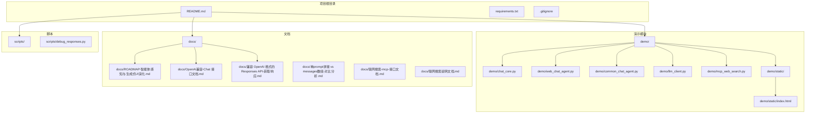

**图表来源**
- [README.md:44-57](file://README.md#L44-L57)
- [requirements.txt:1-5](file://requirements.txt#L1-L5)

**章节来源**
- [README.md:1-62](file://README.md#L1-L62)
- [requirements.txt:1-5](file://requirements.txt#L1-L5)

## 核心组件

### ReAct循环引擎

项目的核心是ReAct（思维-行动-观察）循环，它实现了智能体的决策过程。该引擎支持两种模式：

1. **Responses API模式**：使用内置的web_search工具，适合简单的问答场景
2. **Chat Completions模式**：通过MCP（Model Context Protocol）实现原生函数调用，支持更复杂的工具集成

### 会话管理系统

系统提供了完整的会话管理功能，包括：
- 内存会话存储和持久化
- 会话历史记录管理
- 会话状态恢复机制
- 会话归档和清理功能

### 工具系统

工具系统支持两类工具：
- **本地工具**：需要人工干预的工具，如ask_user和execute_shell_command
- **MCP工具**：通过DashScope MCP服务器执行的外部工具，如web_search

**章节来源**
- [chat_core.py:39-111](file://demo/chat_core.py#L39-L111)
- [chat_core.py:425-466](file://demo/chat_core.py#L425-L466)
- [chat_core.py:528-559](file://demo/chat_core.py#L528-L559)

## 架构概览

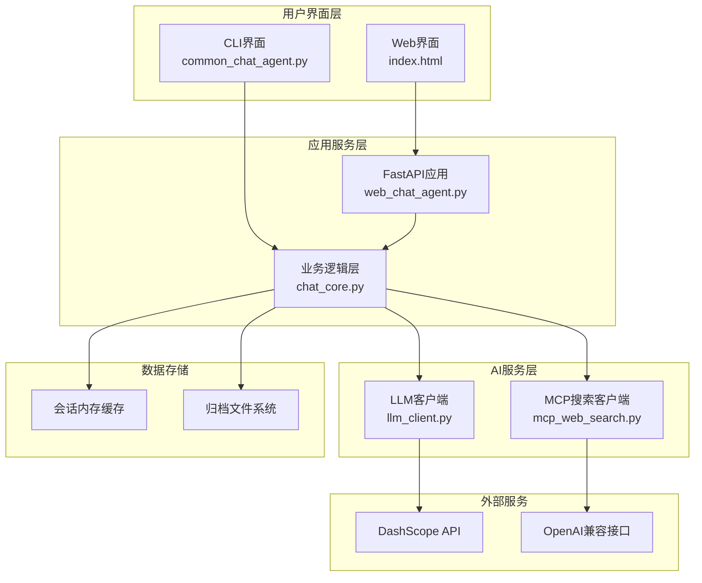

**图表来源**
- [web_chat_agent.py:63-46](file://demo/web_chat_agent.py#L63-L46)
- [chat_core.py:138-349](file://demo/chat_core.py#L138-L349)
- [llm_client.py:61-84](file://demo/llm_client.py#L61-L84)
- [mcp_web_search.py:26-35](file://demo/mcp_web_search.py#L26-L35)

## 详细组件分析

### 阶段1：静态生成式UI（工具结果卡片化）

#### 核心概念
静态生成式UI的核心是将工具调用结果转换为结构化数据，然后通过预定义的组件模板进行渲染。控制权完全在前端，模型无法发明新的组件，只能触发已注册的组件并填充数据槽。

#### SSE事件设计

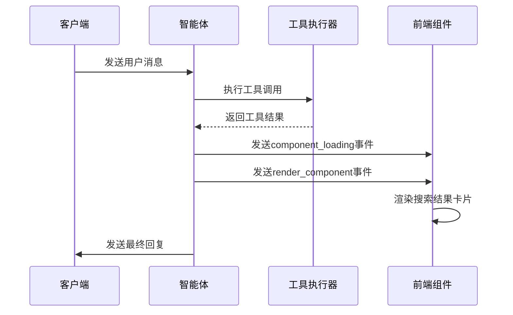

**图表来源**
- [chat_core.py:767-792](file://demo/chat_core.py#L767-L792)
- [index.html:733-794](file://demo/static/index.html#L733-L794)

#### 组件类型清单

| 工具名 | component_type | 组件形态 |
|--------|---------------|----------|
| `web_search` | `search_results` | 搜索结果卡片列表（标题链接 + 摘要 + 来源badge） |
| `ask_user` | `user_input_form` | 结构化表单（问题 + 快捷选项pill + 输入框） |
| `execute_shell_command` | `shell_panel` | 命令面板（等宽命令 + 原因 + 审批按钮 + 输出折叠区） |

#### MCP搜索结果解析

系统实现了专门的解析器来处理DashScope WebSearch MCP返回的文本格式：

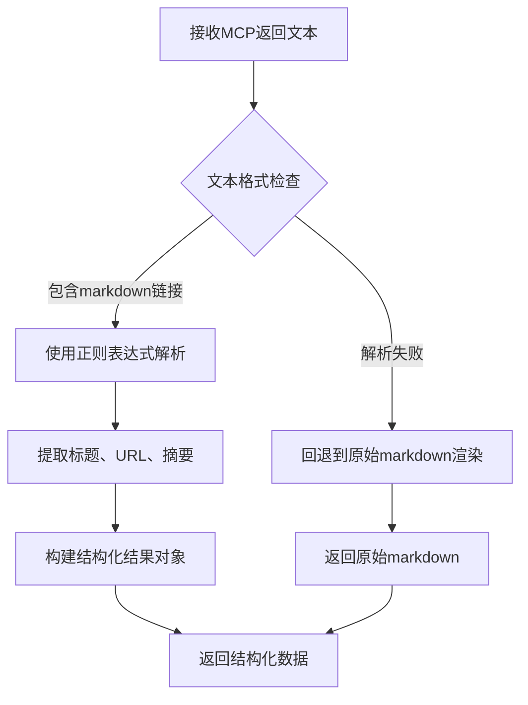

**图表来源**
- [chat_core.py:541-558](file://demo/chat_core.py#L541-L558)

**章节来源**
- [ROADMAP-智能体感知与生成式UI演化.md:32-158](file://docs/ROADMAP-智能体感知与生成式UI演化.md#L32-L158)
- [chat_core.py:528-559](file://demo/chat_core.py#L528-L559)

### 阶段2：上下文感知Agent（环境感知 + 自适应）

#### 核心概念
上下文感知Agent通过前端上报的环境信息来调整其行为和UI表现。这种"感知→自适应"的数据链路展示了智能体如何根据用户环境动态调整响应策略。

#### 前端上下文采集

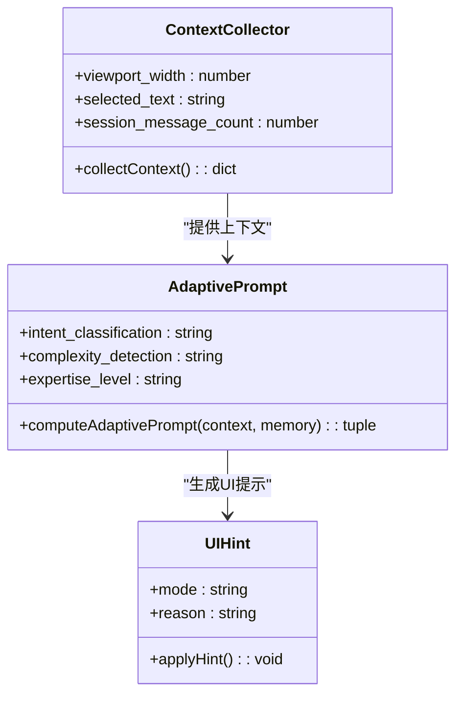

**图表来源**
- [ROADMAP-智能体感知与生成式UI演化.md:187-239](file://docs/ROADMAP-智能体感知与生成式UI演化.md#L187-L239)

#### 上下文感知实现

系统实现了简化的感知函数，基于三个维度的上下文信息：

1. **视口宽度**：影响响应的详细程度和布局
2. **选中文本**：优先围绕用户选中的内容进行回答
3. **会话消息数量**：对话深度超过阈值时保持简洁

**章节来源**
- [ROADMAP-智能体感知与生成式UI演化.md:161-240](file://docs/ROADMAP-智能体感知与生成式UI演化.md#L161-L240)
- [chat_core.py:403-418](file://demo/chat_core.py#L403-L418)

### 阶段3：声明式生成式UI（模型输出UI JSON）

#### 核心概念
声明式生成式UI允许模型通过tool_call输出UI结构JSON，前端根据组件目录递归渲染组件树。这是最安全的UI生成方式，因为模型输出的是结构描述而非代码。

#### 组件目录系统

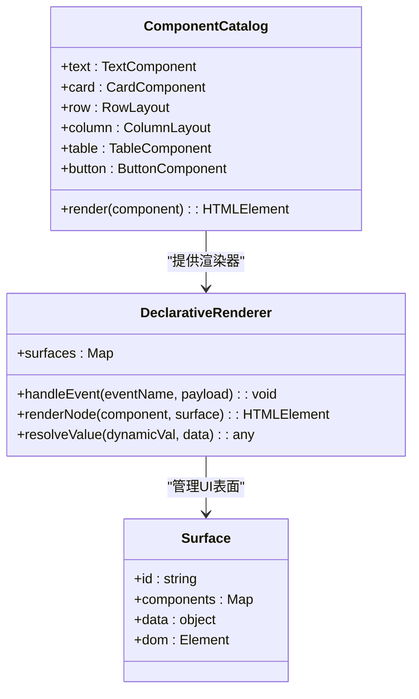

**图表来源**
- [ROADMAP-智能体感知与生成式UI演化.md:255-381](file://docs/ROADMAP-智能体感知与生成式UI演化.md#L255-L381)

#### render_ui工具定义

系统定义了一个特殊的render_ui工具，允许模型直接生成UI结构：

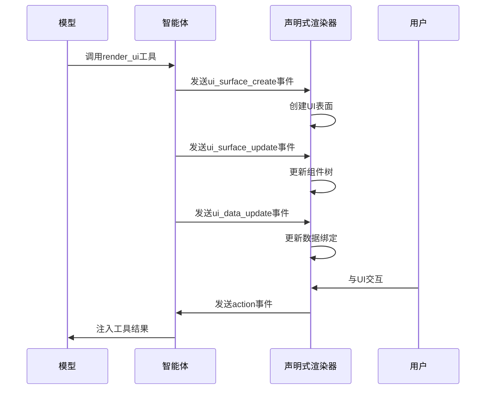

**图表来源**
- [ROADMAP-智能体感知与生成式UI演化.md:268-343](file://docs/ROADMAP-智能体感知与生成式UI演化.md#L268-L343)

#### 数据绑定机制

系统实现了基于JSON Pointer的数据绑定机制：

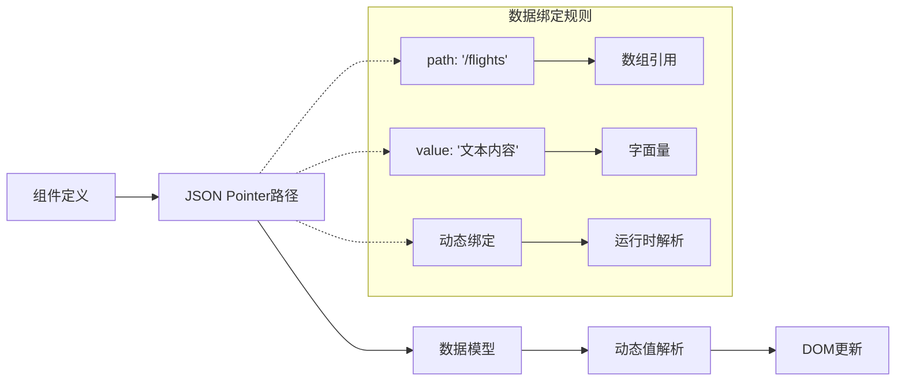

**图表来源**
- [ROADMAP-智能体感知与生成式UI演化.md:440-449](file://docs/ROADMAP-智能体感知与生成式UI演化.md#L440-L449)

**章节来源**
- [ROADMAP-智能体感知与生成式UI演化.md:243-451](file://docs/ROADMAP-智能体感知与生成式UI演化.md#L243-L451)

### 阶段4：协作式任务规划（Plan-and-Execute）

#### 核心概念
协作式任务规划实现了"Agent提议 + 人类决策 + 双方协作执行"的混合主动性交互模式。这是人机协作的核心模式。

#### 执行计划数据结构

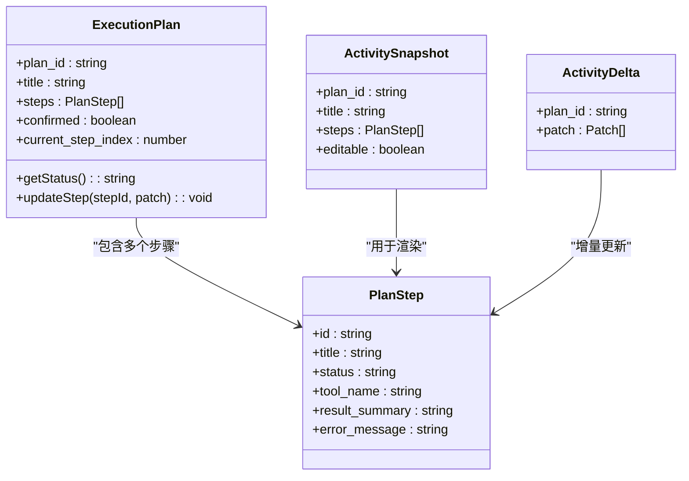

**图表来源**
- [ROADMAP-智能体感知与生成式UI演化.md:504-520](file://docs/ROADMAP-智能体感知与生成式UI演化.md#L504-L520)

#### 协作交互流程

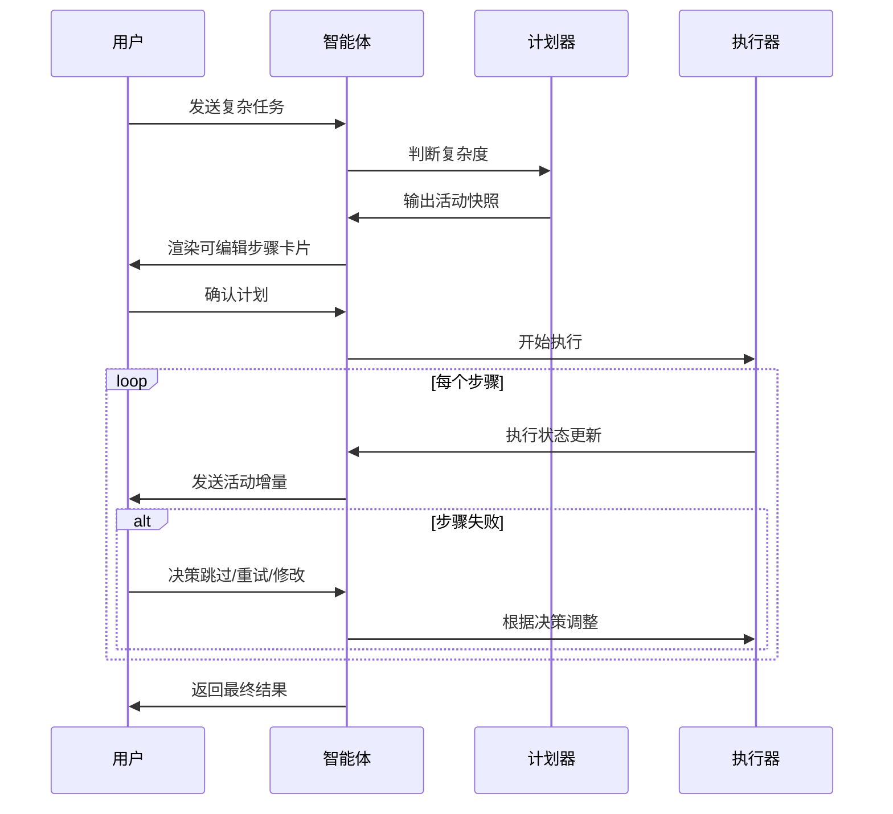

**图表来源**
- [ROADMAP-智能体感知与生成式UI演化.md:463-499](file://docs/ROADMAP-智能体感知与生成式UI演化.md#L463-L499)

**章节来源**
- [ROADMAP-智能体感知与生成式UI演化.md:453-560](file://docs/ROADMAP-智能体感知与生成式UI演化.md#L453-L560)

## 依赖分析

### 外部依赖关系

```mermaid
graph TB
subgraph "核心依赖"
A[openai~=2.38]
B[fastapi~=0.136]
C[mcp>=1.10]
D[uvicorn[standard]~=0.47]
end
subgraph "项目模块"
E[llm_client.py]
F[web_chat_agent.py]
G[chat_core.py]
H[mcp_web_search.py]
end
subgraph "DashScope集成"
I[DashScope API]
J[WebSearch MCP]
K[Responses API]
L[Chat Completions API]
end
A --> E
B --> F
C --> H
D --> F
E --> I
F --> G
G --> H
H --> J
E --> K
E --> L
```

**图表来源**
- [requirements.txt:1-5](file://requirements.txt#L1-L5)
- [llm_client.py:25-26](file://demo/llm_client.py#L25-L26)
- [web_chat_agent.py:19-21](file://demo/web_chat_agent.py#L19-L21)
- [mcp_web_search.py:16-17](file://demo/mcp_web_search.py#L16-L17)

### 内部模块依赖

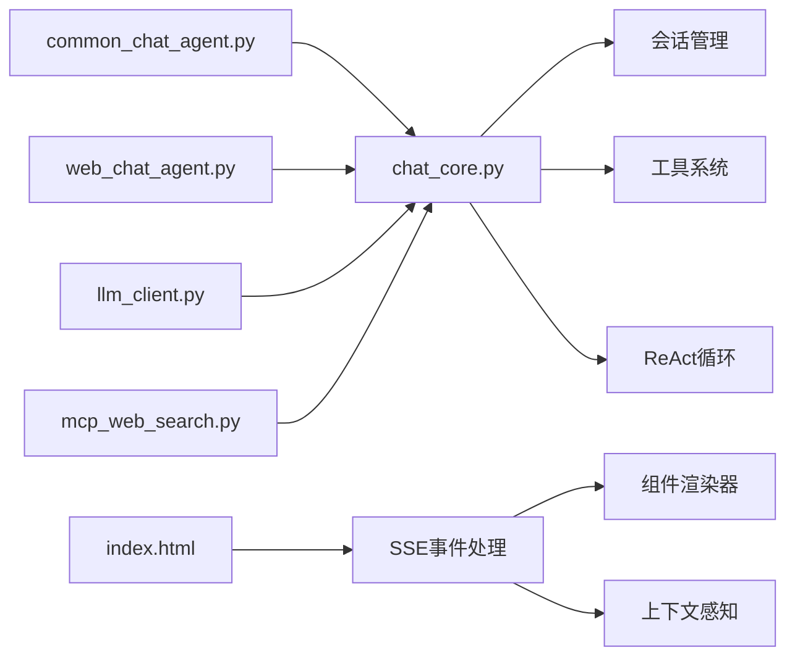

**图表来源**
- [common_chat_agent.py:13-14](file://demo/common_chat_agent.py#L13-L14)
- [web_chat_agent.py:29-46](file://demo/web_chat_agent.py#L29-L46)
- [chat_core.py:24-34](file://demo/chat_core.py#L24-L34)

**章节来源**
- [requirements.txt:1-5](file://requirements.txt#L1-L5)
- [chat_core.py:1-36](file://demo/chat_core.py#L1-L36)

## 性能考虑

### 流式处理优化

系统采用了多层流式处理机制来优化性能：

1. **LLM流式响应**：支持实时的思维过程和回复增量
2. **工具调用流式**：工具执行结果的实时传输
3. **SSE事件流**：前端事件的实时推送

### 内存管理

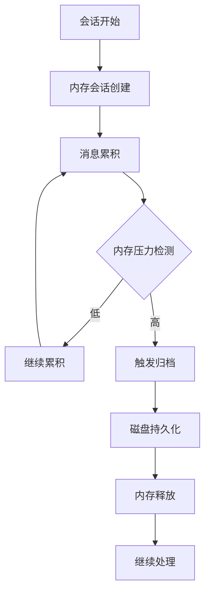

**图表来源**
- [chat_core.py:255-269](file://demo/chat_core.py#L255-L269)

### 缓存策略

系统实现了多层次的缓存机制：

1. **MCP工具规范缓存**：避免重复的工具发现调用
2. **会话内存缓存**：快速访问活跃会话
3. **组件渲染缓存**：减少重复的DOM操作

**章节来源**
- [chat_core.py:511-517](file://demo/chat_core.py#L511-L517)
- [mcp_web_search.py:34-35](file://demo/mcp_web_search.py#L34-L35)

## 故障排除指南

### 常见问题诊断

#### API密钥配置问题

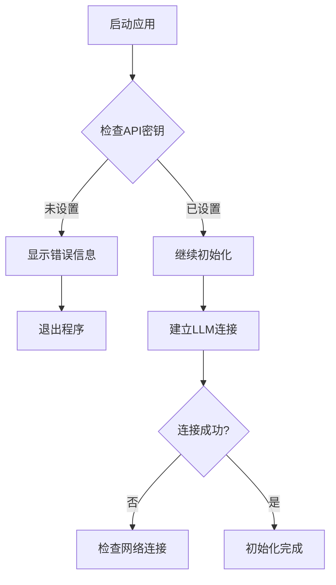

**图表来源**
- [web_chat_agent.py:53-58](file://demo/web_chat_agent.py#L53-L58)
- [llm_client.py:62-67](file://demo/llm_client.py#L62-L67)

#### 工具调用失败处理

系统提供了完善的工具调用失败处理机制：

1. **错误前缀识别**：通过统一的错误前缀识别工具调用失败
2. **降级处理**：失败时返回可解析的错误信息而非抛出异常
3. **错误传播**：将错误信息作为工具结果回传给模型

**章节来源**
- [mcp_web_search.py:28-29](file://demo/mcp_web_search.py#L28-L29)
- [mcp_web_search.py:147-157](file://demo/mcp_web_search.py#L147-L157)

### 调试工具

项目提供了专门的调试脚本来帮助定位问题：

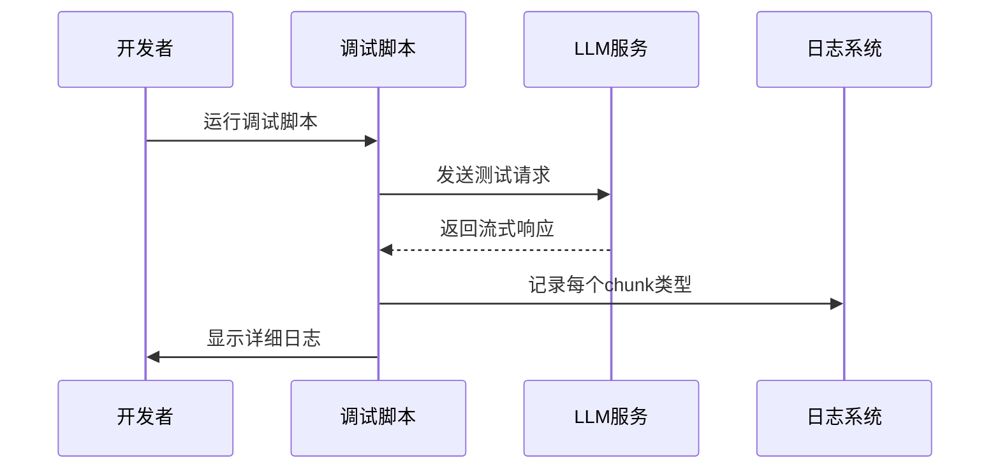

**图表来源**
- [debug_responses.py:20-42](file://scripts/debug_responses.py#L20-L42)

**章节来源**
- [debug_responses.py:1-43](file://scripts/debug_responses.py#L1-L43)

## 结论

这个智能体感知与生成式UI演化项目展示了从传统文本聊天到高级生成式UI的完整技术演进路径。通过四个精心设计的阶段，学习者可以逐步理解：

1. **静态生成式UI**：理解前端组件化渲染的基本原理
2. **上下文感知**：掌握环境信息如何影响AI行为
3. **声明式UI**：体验模型直接生成界面的能力
4. **协作式规划**：实现人机协作的任务执行模式

项目的架构设计体现了"渐进控制权转移"的原则，从后端完全控制UI到模型获得UI生成能力，再到人机协作规划，每个阶段都有明确的学习目标和可独立运行的代码。

这种教学导向的设计使得复杂的技术概念变得易于理解和实践，为开发者的进一步探索奠定了坚实的基础。

## 附录

### 阶段依赖关系

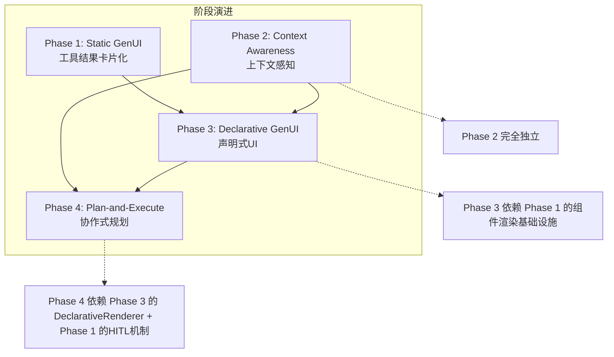

**图表来源**
- [ROADMAP-智能体感知与生成式UI演化.md:562-577](file://docs/ROADMAP-智能体感知与生成式UI演化.md#L562-L577)

### 技术选型决策

| 决策点 | 选择 | 理由 |
|--------|------|------|
| 前端框架 | 保持原生JS | 教学清晰，无构建依赖 |
| 组件系统 | 纯DOM操作 + class-based renderer | 学生能看到每个节点怎么创建的 |
| 声明式协议 | 自定义轻量JSON DSL（A2UI子集） | A2UI完整版过重，只取邻接表 + data binding |
| Agent-User协议 | 保持现有SSE事件名 | 教学阶段不增加协议抽象层 |
| 状态同步 | 前端Map + JSON Pointer | 够用，无需引入jsonpatch库 |

**章节来源**
- [ROADMAP-智能体感知与生成式UI演化.md:592-601](file://docs/ROADMAP-智能体感知与生成式UI演化.md#L592-L601)