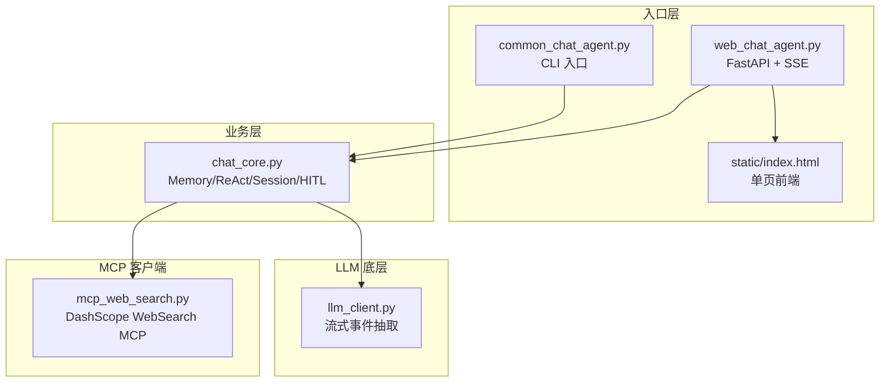
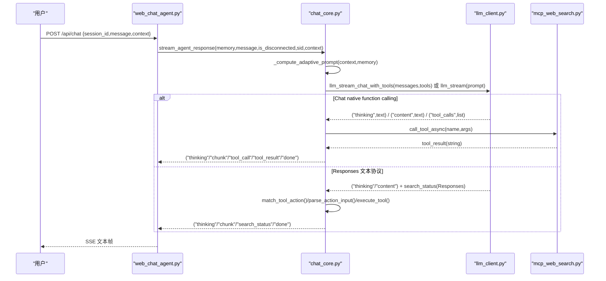
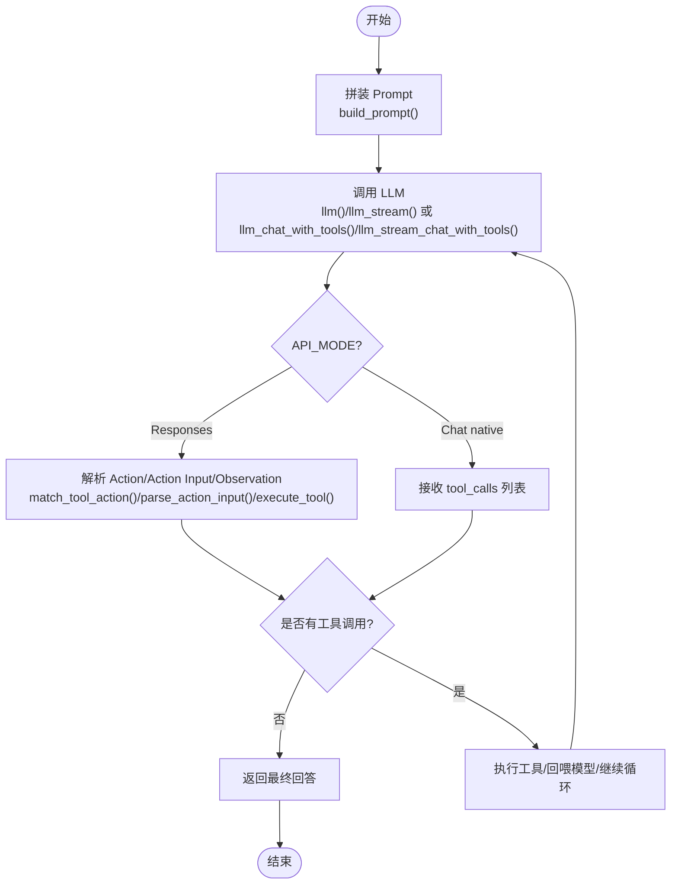
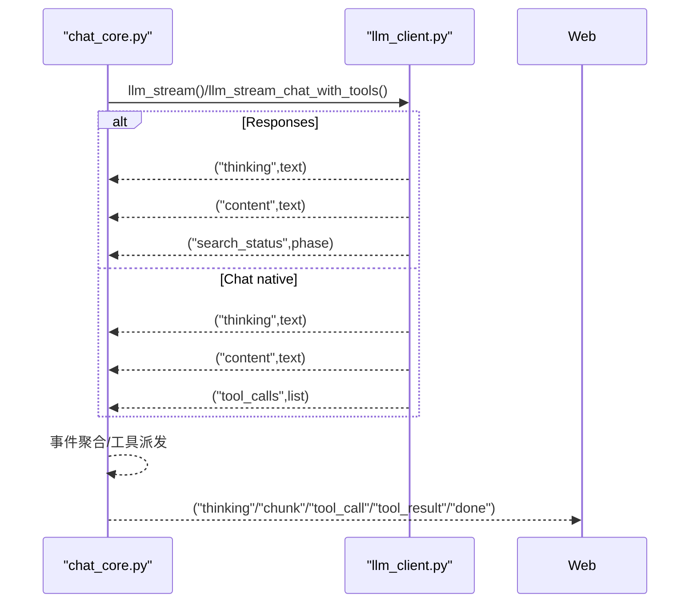
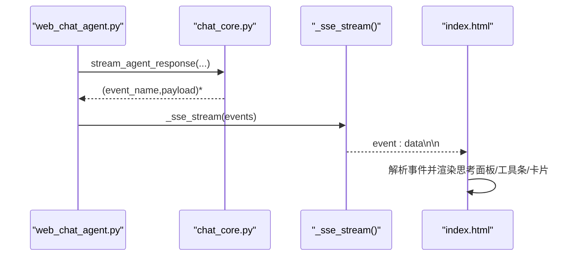
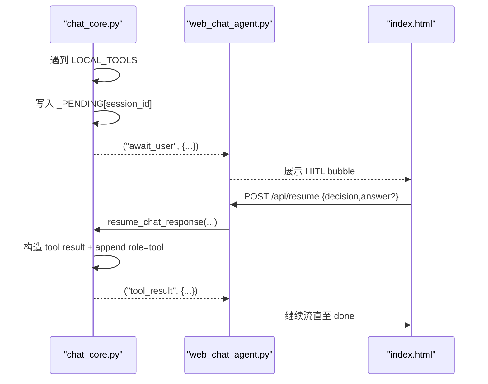
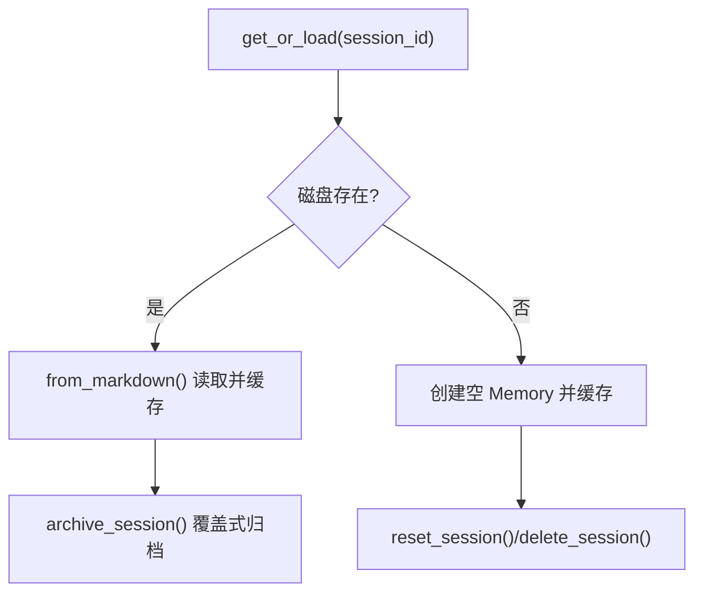
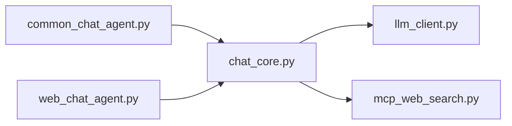

# 项目概述

<cite>
**本文引用的文件**
- [README.md](file://README.md)
- [CLAUDE.md](file://CLAUDE.md)
- [requirements.txt](file://requirements.txt)
- [demo/chat_core.py](file://demo/chat_core.py)
- [demo/common_chat_agent.py](file://demo/common_chat_agent.py)
- [demo/web_chat_agent.py](file://demo/web_chat_agent.py)
- [demo/llm_client.py](file://demo/llm_client.py)
- [demo/mcp_web_search.py](file://demo/mcp_web_search.py)
- [demo/static/index.html](file://demo/static/index.html)
</cite>

## 目录
1. [简介](#简介)
2. [项目结构](#项目结构)
3. [核心组件](#核心组件)
4. [架构总览](#架构总览)
5. [详细组件分析](#详细组件分析)
6. [依赖分析](#依赖分析)
7. [性能考虑](#性能考虑)
8. [故障排查指南](#故障排查指南)
9. [结论](#结论)
10. [附录](#附录)

## 简介
simple_chat_agent_demo 是一个用“最少代码”讲清楚 ReAct（Thought-Action-Observation）聊天 Agent 的教学演示项目。它通过纯 Python 实现 ReAct 循环、流式 LLM 调用、SSE 思考面板与 HITL（人机协同）流程，同时提供 CLI 与 Web 两个入口，共享同一业务内核。项目强调“手写 ReAct 循环 + 流式事件契约”，不依赖任何 Agent 框架，适合初学者快速理解 ReAct 的核心思想与工程落地方式。

- 教学目标
  - 手写 ReAct 循环：Prompt 模板、Action 行解析、Action Input JSON 解析、Observation 回灌、最大轮次保护。
  - 流式 LLM 调用：区分“思考摘要增量”与“正文增量”，支持 Responses API 与 Chat Completions 两种模式。
  - Web UI：SSE + `
` 思考面板，工具调用与最终回答分区呈现；HITL（ask_user / execute_shell_command）两段式中断与恢复。
  - 工具扩展脚手架：TOOLS 留空，明确“加一个工具需要改哪两处”。

- 项目入口
  - CLI：标准输入输出，适合快速体验与教学演示。
  - Web：FastAPI + SSE，提供极简前端页面与会话持久化。

- 技术栈概览
  - 后端：Python（OpenAI SDK、FastAPI、Uvicorn、MCP SDK）
  - 前端：单页 HTML/CSS/JS（内联样式与脚本，约 1790 行）

- 设计理念
  - 分层清晰：入口层（CLI/HTTP）、业务层（ReAct/Memory/Session）、LLM 底层（流式事件抽取）、MCP 客户端（联网搜索）
  - 事件契约统一：llm_client 与 chat_core 之间以 (kind, payload) 或 (event_name, payload) 为抽象边界
  - 两条 ReAct 路径并存：Responses 文本协议 + Chat native function calling，前端零分支

**章节来源**
- [README.md:1-62](file://README.md#L1-L62)
- [CLAUDE.md:5-27](file://CLAUDE.md#L5-L27)

## 项目结构
项目采用“三层”分层设计，严格向下导入，职责边界清晰：
- 入口层（CLI/HTTP）
  - CLI：demo/common_chat_agent.py
  - Web：demo/web_chat_agent.py + demo/static/index.html
- 业务层（ReAct/Memory/Session）
  - demo/chat_core.py
- LLM 底层（流式事件抽取）
  - demo/llm_client.py
- MCP 客户端（联网搜索）
  - demo/mcp_web_search.py

**图表来源**
- [CLAUDE.md:30-52](file://CLAUDE.md#L30-L52)
- [demo/web_chat_agent.py:117-233](file://demo/web_chat_agent.py#L117-L233)
- [demo/common_chat_agent.py:17-53](file://demo/common_chat_agent.py#L17-L53)

**章节来源**
- [CLAUDE.md:30-52](file://CLAUDE.md#L30-L52)
- [demo/web_chat_agent.py:117-233](file://demo/web_chat_agent.py#L117-L233)
- [demo/common_chat_agent.py:17-53](file://demo/common_chat_agent.py#L17-L53)

## 核心组件
- Memory：多轮对话记忆，支持 Markdown 序列化/反序列化，包含 turn 定界符与元信息头部。
- ReAct 协议：Action/Action Input/Observation 解析与回灌，最大轮次保护。
- 会话存储：内存 + 磁盘归档，UUID 校验与原子写入，支持列表、读取、归档、重置、删除。
- LLM 客户端：统一的 (kind, payload) 事件契约，分别对接 Responses API 与 Chat Completions。
- MCP 客户端：MCP WebSearch 工具发现与调用，失败返回统一错误字符串。
- Web SSE：将业务层事件转换为 SSE 文本帧，前端按事件类型渲染思考面板、工具条、卡片等。

**章节来源**
- [demo/chat_core.py:138-193](file://demo/chat_core.py#L138-L193)
- [demo/chat_core.py:255-349](file://demo/chat_core.py#L255-L349)
- [demo/llm_client.py:113-334](file://demo/llm_client.py#L113-L334)
- [demo/mcp_web_search.py:89-172](file://demo/mcp_web_search.py#L89-L172)
- [demo/web_chat_agent.py:101-167](file://demo/web_chat_agent.py#L101-L167)

## 架构总览
ReAct 循环在两条路径上并行：
- Responses 文本协议路径：build_prompt 拼装 Prompt，llm() 仅收集正文增量，ReAct 解析在业务层完成。
- Chat native function calling 路径：messages 数组 + tools 列表，llm_stream_chat_with_tools 流式产出 thinking/content/tool_calls，业务层按轮次执行工具并回喂。

两条路径汇聚到统一的 SSE 事件契约，前端零分支。

**图表来源**
- [demo/web_chat_agent.py:127-141](file://demo/web_chat_agent.py#L127-L141)
- [demo/chat_core.py:425-466](file://demo/chat_core.py#L425-L466)
- [demo/llm_client.py:633-647](file://demo/llm_client.py#L633-L647)
- [demo/mcp_web_search.py:127-172](file://demo/mcp_web_search.py#L127-L172)

**章节来源**
- [CLAUDE.md:85-126](file://CLAUDE.md#L85-L126)
- [demo/web_chat_agent.py:127-141](file://demo/web_chat_agent.py#L127-L141)
- [demo/chat_core.py:425-466](file://demo/chat_core.py#L425-L466)
- [demo/llm_client.py:633-647](file://demo/llm_client.py#L633-L647)

## 详细组件分析

### ReAct 循环与 Prompt 模板
- Memory：维护 flat-string 的 memories，支持 to_markdown/from_markdown，turn 定界符与元信息头部。
- Prompt 拼装：build_prompt 根据 TOOLS 是否为空决定是否输出 ReAct 格式说明，避免“无工具”措辞反压内置 web_search。
- 文本协议解析：match_tool_action 与 parse_action_input 从 LLM 输出中提取 Action 与 Action Input，execute_tool 为框架预留。
- Chat native function calling：_memory_to_messages 将 Memory 转 messages；_build_native_tools 合并 MCP 工具与 LOCAL_TOOLS；_react_chat_native 与 _stream_react_rounds 实现 ReAct 循环。

**图表来源**
- [demo/chat_core.py:425-466](file://demo/chat_core.py#L425-L466)
- [demo/chat_core.py:358-396](file://demo/chat_core.py#L358-L396)
- [demo/llm_client.py:618-796](file://demo/llm_client.py#L618-L796)

**章节来源**
- [demo/chat_core.py:138-193](file://demo/chat_core.py#L138-L193)
- [demo/chat_core.py:425-466](file://demo/chat_core.py#L425-L466)
- [demo/chat_core.py:358-396](file://demo/chat_core.py#L358-L396)
- [demo/llm_client.py:618-796](file://demo/llm_client.py#L618-L796)

### 流式 LLM 调用与事件契约
- Responses 路径：llm_stream() 产出 ("thinking", text) 与 ("content", text)，以及 ("search_status", phase)；错误通过 ("error", message) 传递。
- Chat native 路径：llm_stream_chat_with_tools() 产出 ("thinking", text)、("content", text)、("tool_calls", list[dict])，错误通过 ("error", message) 传递。
- 事件契约统一：chat_core.stream_agent_response() 与 _stream_react_rounds() 将两条路径的增量事件转换为 SSE 文本帧，前端零分支。

**图表来源**
- [demo/llm_client.py:340-496](file://demo/llm_client.py#L340-L496)
- [demo/llm_client.py:798-923](file://demo/llm_client.py#L798-L923)
- [demo/chat_core.py:632-800](file://demo/chat_core.py#L632-L800)

**章节来源**
- [demo/llm_client.py:340-496](file://demo/llm_client.py#L340-L496)
- [demo/llm_client.py:798-923](file://demo/llm_client.py#L798-L923)
- [demo/chat_core.py:632-800](file://demo/chat_core.py#L632-L800)

### Web SSE 与思考面板
- SSE 序列化：_sse_stream() 将 (event_name, payload) 元组转换为 SSE 文本帧；web_chat_agent.py 的路由负责参数校验与异常翻译。
- 思考面板：前端使用 
 展示 reasoning 摘要；tool_strip 展示工具调用与结果；search_status banner 展示 Responses 模式内置搜索生命周期。
- Static GenUI：注册 web_search 工具卡片渲染器，按 component_loading/render_component/component_error 事件替换占位。

**图表来源**
- [demo/web_chat_agent.py:105-111](file://demo/web_chat_agent.py#L105-L111)
- [demo/web_chat_agent.py:127-141](file://demo/web_chat_agent.py#L127-L141)
- [demo/static/index.html:1412-1527](file://demo/static/index.html#L1412-L1527)

**章节来源**
- [demo/web_chat_agent.py:105-111](file://demo/web_chat_agent.py#L105-L111)
- [demo/web_chat_agent.py:127-141](file://demo/web_chat_agent.py#L127-L141)
- [demo/static/index.html:1412-1527](file://demo/static/index.html#L1412-L1527)

### HITL（人机协同）与两段式中断
- LOCAL_TOOLS：ask_user（输入型）与 execute_shell_command（审批型），通过 _LOCAL_TOOL_KIND 标记交互类型。
- 中断写入：_stream_react_rounds 遇到 LOCAL_TOOLS 时，将“剩余 tool_calls + awaiting 元信息”写入 _PENDING[session_id]，yield ("await_user", ...) + ("done", {}) 关流。
- 恢复流程：/api/resume 接收用户决策，resume_chat_response 弹出 _PENDING，构造 tool result，append role=tool，委派 _stream_react_rounds 继续。

**图表来源**
- [demo/chat_core.py:738-765](file://demo/chat_core.py#L738-L765)
- [demo/web_chat_agent.py:143-167](file://demo/web_chat_agent.py#L143-L167)
- [demo/static/index.html:1584-1742](file://demo/static/index.html#L1584-L1742)

**章节来源**
- [demo/chat_core.py:738-765](file://demo/chat_core.py#L738-L765)
- [demo/web_chat_agent.py:143-167](file://demo/web_chat_agent.py#L143-L167)
- [demo/static/index.html:1584-1742](file://demo/static/index.html#L1584-L1742)

### 会话持久化与安全
- 归档目录：data/chat_archive/{session_id}.md，头部 HTML 注释保存元信息，turn 块以定界符分隔。
- 安全校验：session_id 严格校验 UUID 格式，防止路径注入；原子写入（.tmp + replace）避免崩溃半文件。
- API：/api/history、/api/sessions、/api/sessions/{id}/raw、/api/archive、/api/reset、/api/sessions/{id}（DELETE）。

**图表来源**
- [demo/chat_core.py:255-349](file://demo/chat_core.py#L255-L349)

**章节来源**
- [demo/chat_core.py:255-349](file://demo/chat_core.py#L255-L349)

## 依赖分析
- 入口层依赖业务层，业务层依赖 LLM 底层与 MCP 客户端，严格禁止反向依赖。
- LLM 底层与 MCP 客户端互不依赖，均面向业务层暴露稳定的事件契约。
- 依赖清单（requirements.txt）：OpenAI SDK、FastAPI、Uvicorn、MCP SDK。

**图表来源**
- [CLAUDE.md:40-52](file://CLAUDE.md#L40-L52)
- [requirements.txt:1-5](file://requirements.txt#L1-L5)

**章节来源**
- [CLAUDE.md:40-52](file://CLAUDE.md#L40-L52)
- [requirements.txt:1-5](file://requirements.txt#L1-L5)

## 性能考虑
- 流式消费：llm_stream()/llm_stream_chat_with_tools() 以增量事件驱动，避免一次性缓冲大量文本。
- 最大轮次保护：MAX_ROUNDS=5 防止模型反复输出 Action 导致 token 消耗过大。
- 思考摘要与正文分离：前端可即时展示思考摘要，提升感知速度。
- MCP 工具缓存：_NATIVE_TOOLS_CACHE 首次发现后缓存，减少 schema 查询开销。
- 原子归档：.tmp + replace 避免崩溃导致的半文件，提高可靠性。

[本节为通用指导，不直接分析具体文件]

## 故障排查指南
- API_KEY 未配置：CLI 与 Web 入口均会在启动时检查 DASHSCOPE_API_KEY，缺失则直接退出并提示。
- API_MODE 非法：llm_client.py 在模块加载时校验，非法值直接抛错。
- 会话 ID 校验失败：InvalidSessionId → HTTP 400；HistoryNotFound → HTTP 404；PendingNotFound → HTTP 404；PendingMismatch → HTTP 409。
- LLM 错误：Responses/Chat/Chat-with-tools 三组实现均保留嵌入式错误检测，错误通过 ("error", message) 事件传递。
- MCP 工具失败：返回统一错误字符串，上层以 role=tool 回喂模型，由模型自行恢复。

**章节来源**
- [demo/web_chat_agent.py:53-58](file://demo/web_chat_agent.py#L53-L58)
- [demo/llm_client.py:44-51](file://demo/llm_client.py#L44-L51)
- [demo/web_chat_agent.py:133-162](file://demo/web_chat_agent.py#L133-L162)
- [demo/llm_client.py:168-176](file://demo/llm_client.py#L168-L176)
- [demo/mcp_web_search.py:146-158](file://demo/mcp_web_search.py#L146-L158)

## 结论
simple_chat_agent_demo 通过“最少代码”实现了 ReAct Agent 的核心能力：手写 ReAct 循环、流式 LLM 调用、SSE 思考面板与 HITL 两段式流程，并提供 CLI 与 Web 两个入口共享同一业务内核。其分层清晰、事件契约统一、工具扩展脚手架明确，既适合教学演示，也为实际工程提供了可演进的最小可行骨架。

[本节为总结性内容，不直接分析具体文件]

## 附录
- 环境变量
  - DASHSCOPE_API_KEY：必填
  - QWEN_MODEL：可选，默认 qwen-plus
  - API_MODE：可选，responses 或 chat，默认 responses
- 运行方式
  - CLI：python demo/common_chat_agent.py
  - Web：python demo/web_chat_agent.py，浏览器访问 http://127.0.0.1:8000

**章节来源**
- [README.md:23-42](file://README.md#L23-L42)
- [CLAUDE.md:13-26](file://CLAUDE.md#L13-L26)